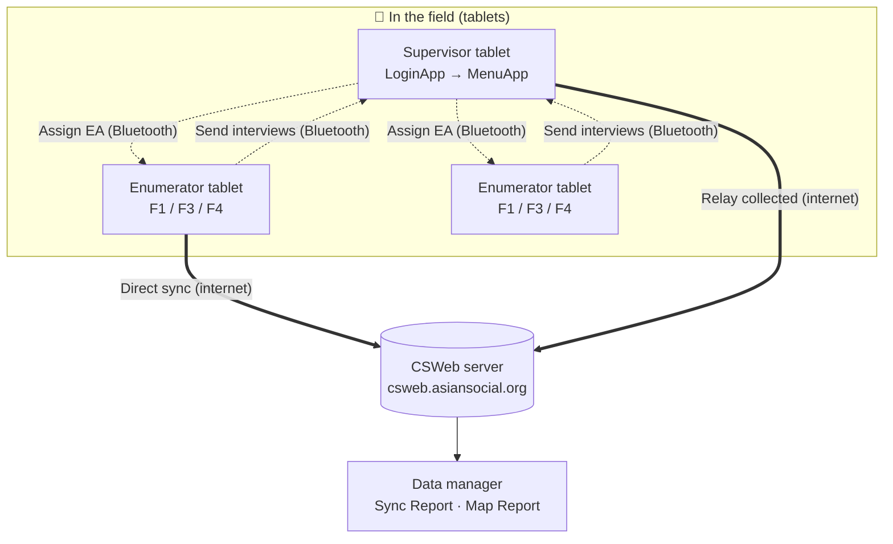
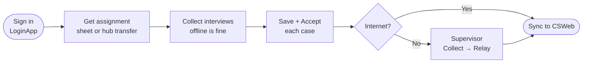
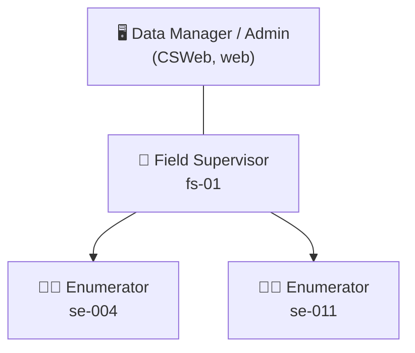
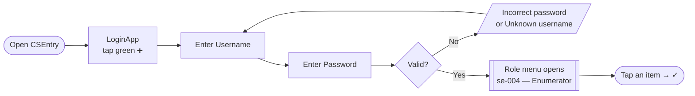
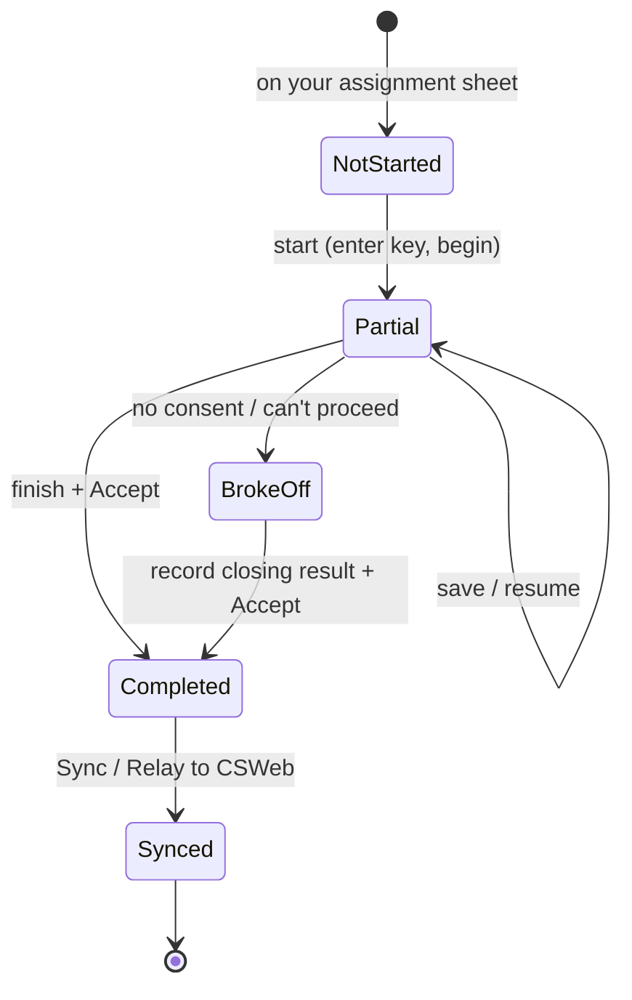
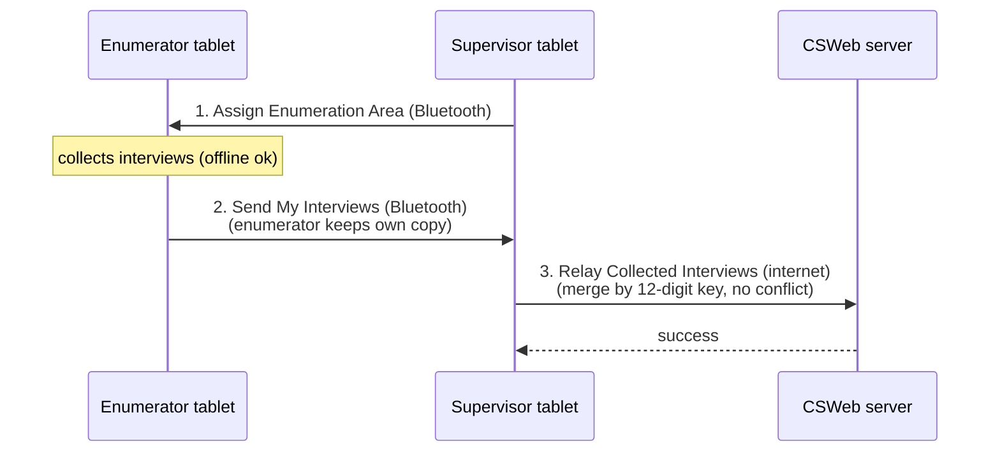
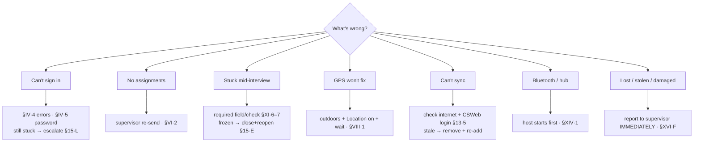

# I. Introduction

## A. Purpose of the CAPI Manual

This manual explains how to use the **CAPI system** for the DOH Universal Health Care (UHC) Survey Year 2 — the tablets and applications that replace paper for data collection. It covers signing in, getting assignments, conducting and completing interviews, syncing data to the server, supervisor tasks, troubleshooting, and keeping devices and data secure.

It is a **how-to-use-the-app** manual. It does **not** teach the questionnaire content — the wording, probes, and meaning of each question live in the **Enumerator's Manual** and the questionnaires themselves.

## B. Intended users

| User | Uses this manual to… |
|---|---|
| **Enumerator** | Sign in, collect interviews on F1/F3/F4, save and sync. |
| **Field supervisor** | Assign areas, collect and relay the team's interviews, review coverage. |
| **Data manager / administrator** | Understand how cases reach CSWeb and how to monitor them. |
| **CAPI / IT support** | Resolve device, login, and sync problems escalated from the field. |

## C. Relationship to the other manuals

The survey documentation is a **set of manuals**, each with a job. This CAPI Manual is one of them:

- **Survey Operations Manual** — overall study design, governance, schedule.
- **Field Enumerator's Manual** — interviewing technique, field procedures, question-by-question guidance.
- **Field Supervisor's Manual** — team logistics, monitoring, quality control.
- **CAPI Manual** *(this document)* — the tablet and application.
- **Training Manual** — how the team is trained.

When this manual says *"follow the rules in your Enumerator's Manual"* (e.g. eligibility, result codes), it means that companion document.

## D. CAPI support contacts

For credentials, access, device problems, or anything this manual doesn't cover, contact your **survey coordinator / team supervisor**, who escalates to **CAPI / IT support** as needed. Keep the contact list from the **Support Contacts annex** (**§XVII·H**) with you in the field.

## E. Basic rules for device and data security

Five rules that protect the survey and the respondents (full detail in **§XVI**):

1. **Keep your login private** — never share your username/password; every case is tagged to the account that made it.
2. **Lock the tablet** when it's not in use.
3. **Don't copy, export, or photograph** survey data off the device.
4. **Sync regularly** so data isn't stranded on one tablet.
5. **Report a lost or stolen tablet immediately** to your supervisor.

---

**Related sections:** §III *CAPI System Overview* · §IV *Logging into CAPI* · §XVI *Data Security & Confidentiality* · Annex *CAPI Support Contact List*.


# II. Tablet / Device Overview

The tablet is **survey equipment**, not a personal device. Look after it, keep it charged and connected when you can, and use it only for the survey.

## A. Device components

Know where these are on your tablet: **power button**, **volume buttons**, **charging port**, **front camera** (for verification photos), and the **screen lock**. Familiarise yourself before fieldwork so you're not learning the device in front of a respondent.

> 📷 **Screenshot 2.A** *(optional, add at kit prep)* — a labelled front/back photo of the **issued tablet model**. This is the one image best taken with a camera while preparing the field kit; drop it in here before printing so trainees recognise their exact device.

## B. Charging and battery management

- **Start each field day fully charged**; carry a power bank where sites have no power.
- Close the survey app cleanly before the battery dies (your work is saved, but a clean exit is safer).
- Charge overnight; don't let the tablet sit fully drained for long.

## C. Internet connectivity

- **Collecting works offline** — you do not need internet to sign in or run interviews.
- **You need internet to sync** (upload/download). Use mobile data or Wi-Fi where available, typically back at base.
- If unsure whether you're online, open a web page to check.

## D. Date, time, and location settings

- Keep the tablet's **date and time correct and automatic** — interviews are timestamped.
- Keep **Location (GPS) ON** — the survey **captures GPS** during interviews (**§VIII**). If Location is off, cases save with no location.

> ⚠️ A wrong clock or a disabled Location setting quietly corrupts your data. Check both at the start of the day.

## E. Device care and storage

- Keep the tablet **dry, shaded, and cushioned**; use the case/screen protector provided.
- Store it **securely** (not on display) when travelling and overnight.
- Don't lend it to anyone outside the survey team.

## F. Prohibited uses of survey devices

The tablet is for the survey only. **Do not**: install personal apps, browse or use social media, take personal photos, share the device, or remove/replace survey apps except as instructed (**§IV·7**). Misuse risks the data and the device.

---

**Related sections:** §IV *Logging into CAPI* · §VIII *Mapping & Location Capture* · §XIII *Uploading & Syncing* · §XVI *Data Security & Confidentiality*.


# III. CAPI System Overview

## A. The CAPI workflow at a glance

The system has three moving parts — the **tablet apps** (CSEntry: LoginApp + F1/F3/F4), the **hub** (the role menu that moves assignments and interviews between tablets over Bluetooth), and the **server** (**CSWeb**, where data lands and the team monitors it).



A normal day:



## B. User roles and access levels

Your **login decides what you can do** — the role menu only shows your allowed tasks.

| Role | Sees / can do |
|---|---|
| **Enumerator** | The survey tools (F1/F3/F4); receive an assignment, collect, send to supervisor, sync, view own coverage. |
| **Supervisor** | All of the above **plus** assign EAs, collect from the team, relay to CSWeb, and review team coverage (**§XIV**). |
| **Data manager / administrator** | Works on **CSWeb** (web): monitors synced cases, the Sync Report, and the Map Report; manages accounts. |

Each enumerator reports to a supervisor, and supervisors relay to the server the data manager monitors:



## C. Environments

- **Live / production** — the real survey runs on the production **CSWeb** (`csweb.asiansocial.org`); the apps you install come from there. **This is the only server.**
- **Training** — there is **no separate training server**. Practice is done with **practice cases** (clearly marked, never real respondents) on the same apps, so trainees learn without affecting real data. Your trainer gives you practice case keys; delete or ignore them once training ends.

> ⚠️ **Never enter a real interview as "practice," or a practice case as real.** Use the case keys your supervisor assigns for real fieldwork.

## D. Sync and data-transfer logic (how data moves safely)

Two facts make the system robust:

- **Everything is local first.** Cases are saved on the tablet as you go; nothing depends on a live connection.
- **Cases merge by their 12-digit case key.** When data reaches the server — whether an enumerator **syncs directly** or a supervisor **collects over Bluetooth and relays** — matching cases **update in place** and never conflict. Sending and collecting are **non-destructive** (the enumerator keeps their own copy).

This is why there are **two paths to the server**:

| Path | Who | When |
|---|---|---|
| **Direct sync** (CSEntry → CSWeb) | Enumerator or supervisor | When the tablet itself has internet (**§XIII**). |
| **Collect → Relay** (Bluetooth → CSWeb) | Supervisor gathers the team, then relays | When enumerators can't reach the server — the offline safety net (**§XIV**). |

Either way, the goal is the same: **no completed interview is left stranded on a tablet** at the end of the day.

---

**Related sections:** §IV *Logging into CAPI* · §XIII *Uploading & Syncing* · §XIV *Supervisor-Only Features*.


# IV. Logging into CAPI

You reach the survey tools through one sign-in. Open **LoginApp**, enter your username and password, and a **menu for your role** opens — enumerators see the survey tools; supervisors see the supervisor features as well. You sign in **once** per session; you do not log in separately to each questionnaire.

> 🔑 **Before you start:** your username and password are issued by your coordinator. **Keep them private and never share a login** — every case you save is tagged to the account that created it.

**The sign-in flow at a glance:**



---

## 4.1 Opening the application

> **Task:** Open CAPI and reach the sign-in screen
> **User:** Enumerator · Supervisor
> **When:** At the start of each field day, or any time you need to sign in.

**Steps**

1. On the tablet, open **CSEntry**.
2. In the application list, tap **LoginApp**.
3. Tap the green **➕** to start.

**Expected result:** the **sign-in** screen opens and asks for your username.


> *CSEntry opens into **LoginApp** ("LoginApp – 0 Cases"). Tap the green **➕** (bottom-right) to begin signing in.*

**Common problem:** LoginApp is not in the list, or it looks out of date.
**What to do:** install or update it — see **§4.7** below and **§I·D / §1, Installing and updating CAPI**.

---

## 4.2 Entering your username and password

> **Task:** Sign in with your credentials
> **User:** Enumerator · Supervisor
> **When:** Right after opening LoginApp.

**Steps**

1. **Enter** your **username** (for example, `se-004`). Advance to the next field.
2. **Enter** your **password**. Advance.
3. Advance once more to submit.

**Expected result:** your **role menu** opens, with your **username and role across the top** — for example, `se-004 — Enumerator` or `fs-01 — Supervisor`.


> *Enter your **Username** (e.g. `se-004`), advance with the **›** arrow, then your **Password**, and advance again to sign in.*

> ⚠️ **Check the banner before you work.** Confirm the username and role at the top are **yours**. If they are not, log out (**§4.6**) and sign in again.

**Common problem:** the password won't go through.
**What to do:** re-type it carefully (passwords are case-sensitive). If it still fails, see **Login errors** below.

---

## 4.3 Your role menu (what opens after sign-in)

> **Task:** Get oriented on the menu for your role
> **User:** Enumerator · Supervisor
> **When:** Immediately after a successful sign-in.

The menu is **grouped by task** and lists only what your role is allowed to do:

- **Enumerator** (`se-004 — Enumerator`) — **ASSIGNMENT** (Receive Assigned Data) · **INTERVIEWS** (Conduct F1 – Facility Head / F3 – Patient / F4 – Household; Send My Interviews to Supervisor) · **REPORTS** (View EA on Map; View my report) · **SESSION** (Log out). The F2 Healthcare Worker survey is a separate web form, not launched here.
- **Supervisor** (`fs-01 — Supervisor`) — adds **ASSIGNMENTS** (Assign Enumeration Area), **COLLECT & RELAY**, and review/open functions. These are covered in **§XIV, Supervisor-Only Features**.

**To run an item:** tap it (it highlights), then tap the **✓** at the bottom of the menu. An instrument launches its questionnaire; when you finish or exit, you are returned to **this menu** (not signed out) — see **§IX, Starting a Questionnaire**.


> *The **enumerator** role menu (headed `se-004 — Enumerator`). Groups: **ASSIGNMENT** (Receive Assigned Data) · **INTERVIEWS** (Conduct F1 / F3 / F4; Send My Interviews to Supervisor) · **REPORTS** (View EA on Map; View my report) · **SESSION** (Log out). Tap an item, then the **✓** to run it.*

**Common problem:** the menu shows the wrong tools, or far fewer/more than expected.
**What to do:** your account role may be set differently than your assignment — log out and sign in again; if it persists, contact your coordinator.

---

## 4.4 Login errors

> **Task:** Recognise and clear a failed sign-in
> **User:** Enumerator · Supervisor
> **When:** When the app rejects your sign-in.

CAPI shows a plain message for each cause. Match it to the table and act:

| Message on screen | What it means | What to do |
|---|---|---|
| **"Incorrect password."** | Username is known; password didn't match. | Re-type carefully (case-sensitive). If it persists, ask your coordinator to check your account. |
| **"Unknown username."** | The app doesn't have your account. | Your tablet's build may be out of date, or you're not in it yet. **Update LoginApp** (**§4.7**), then try again; if still missing, contact your coordinator. |
| **"No role found from login…"** | The menu was opened **without** signing in through LoginApp. | Close it and sign in **through LoginApp** — do not open the menu app on its own. |


*A sign-in error — here **"Unknown username."** Tap **OK**, re-check the username (case-sensitive), and if it's correct, update or re-add LoginApp (**§4.7**) or contact your coordinator.*

---

## 4.5 Forgotten or reset password

> **Task:** Recover access when you can't sign in
> **User:** Enumerator · Supervisor
> **When:** You've forgotten your password or it has stopped working.

**There is no self-service password reset on the tablet.** Credentials are issued and managed by your coordinator.

**What to do:** contact your **coordinator / CAPI support** (see the **Support Contacts** annex). They will confirm your username and re-issue a password. Do not borrow another person's login to keep working — it mis-tags the data.

---

## 4.6 Logging out / switching user

> **Task:** End your session or hand the tablet to another fieldworker
> **User:** Enumerator · Supervisor
> **When:** At the end of the field day, or before a different person uses the tablet.

**Steps**

1. From your role menu, **exit** back to the LoginApp sign-in screen.
2. To switch user, **sign in again** with the other person's credentials (**§4.2**).

**Expected result:** you're back at the sign-in screen; the next person's session starts clean under **their** account.

> ⚠️ **Always log out before handing over the tablet.** Cases created while signed in as you are tagged to you. Sharing a session mixes up who collected what.

**Common problem:** you're not sure whether anything is still unsaved.
**What to do:** finish or save the open interview first (**§XI·H, Saving progress**) before logging out.

---

## 4.7 Working offline · installing / updating LoginApp

> **Task:** Sign in without internet, and keep LoginApp current
> **User:** Enumerator · Supervisor
> **When:** In the field with no signal; or when a new build is released.

- **Signing in works offline.** Your login is checked **on the tablet**, so you can sign in and collect data with no internet. Internet is only needed to **Sync** (upload/download cases) — see **§XIII, Uploading & Syncing**.
- **Installing / updating:** in CSEntry, find **LoginApp** and tap **Install** — or **Update** if it shows *"New version available."* This installs both the sign-in and the menu.
- **If the app looks stale after an update** (old screens, or your username gives *"Unknown username."*), **remove LoginApp and add it again** from CSWeb, then sign in.


*The CSEntry **Entry Applications** list. To install or refresh a tool, use **Add Application → from CSWeb**; if a tool looks stale, **remove it and add it again** to pull the latest build.*

---

## Troubleshooting — Sign-in

| Symptom | Likely cause | Fix |
|---|---|---|
| "Incorrect password." | Wrong/case-mismatched password | Re-type carefully; if it persists, coordinator checks the account. |
| "Unknown username." | Build out of date, or account not added | Update LoginApp (**§4.7**); if still missing, contact coordinator. |
| "No role found from login…" | Opened the menu without LoginApp | Sign in **through LoginApp**, not the menu app alone. |
| Menu shows the wrong tools | Role set differently than expected | Log out, sign in again; persists → coordinator. |
| Can't sign in at all / forgot password | No self-service reset | Coordinator re-issues credentials (**§4.5**). |
| Wrong name/role on the banner | Someone else's session, or wrong login | Log out (**§4.6**) and sign in as yourself. |

---

**Related sections:** §I·E *Basic rules for device and data security* · §IX *Starting a Questionnaire* · §XIII *Uploading & Syncing* · §XIV *Supervisor-Only Features* · Annex *CAPI Login Quick Guide* · Annex *CAPI Support Contact List*.


# V. The CAPI Dashboard (your role menu)

In this system your **dashboard is the role menu** that opens after you sign in (**§IV**), together with the **case list** inside each survey tool. There isn't a separate dashboard screen — the menu plus the case lists give you everything you need: which tools you can use, what's still to do, and what's done.

---

## 5.1 Reading the role menu

> **Task:** Get your bearings after signing in
> **User:** Enumerator · Supervisor
> **When:** Every time you sign in.

The menu shows:

- your **username and role** across the top (e.g. `se-004 — Enumerator`);
- the **survey tools** you may use — **F1 / F3 / F4** for enumerators, plus the **supervisor features** for supervisors (**§XIV**).


> *Your "dashboard" is the role menu — grouped into ASSIGNMENT · INTERVIEWS · REPORTS · SESSION, headed with your username and role.*

**Common problem:** the menu lists the wrong tools.
**What to do:** log out and sign in again; if it persists, contact your supervisor (**§IV·3**).

---

## 5.2 Viewing your cases (pending vs completed)

> **Task:** See what's still to do and what's finished
> **User:** Enumerator
> **When:** Through the field day.

Open a tool (e.g. **F3**) to see its **case list**. Each case shows a **status**:

- **Partial** — started, not yet finished (resume it, **§XII·6**);
- **Complete** — finished and accepted, waiting to sync (**§XIII**);
- new cases you haven't started yet come from your **assignment** (**§VI–VII**).

> 💡 Use the case list to check, at a glance, that yesterday's completed cases have **synced** before you start today's.

**View my report** gives a live coverage count for your device:


> *"View my report" → **MY INTERVIEW COVERAGE** — counts of F1/F3/F4 cases stored on this tablet, plus your assignment target.*

---

## 5.3 Checking sync status

> **Task:** Know whether your work is uploaded
> **User:** Enumerator · Supervisor
> **When:** Before and after fieldwork.

Sync is run from inside the survey tool (**§XIII**). After a sync, the **success message** confirms upload; completed cases remain in your list for reference. Make syncing the **last thing you do** each day there's a connection.

---

## 5.4 Updates and notifications

> **Task:** Stay on the current build
> **User:** Enumerator · Supervisor
> **When:** Periodically, and whenever told a new build is out.

There is no in-app notification feed. Updates reach you two ways:

- **LoginApp** shows **"New version available"** when a new sign-in/menu build is published — update it (**§IV·7**).
- Each survey tool can be **updated from CSWeb** the same way; if anything looks stale, **remove and re-add** the app.

**Common problem:** you're unsure whether you're on the latest build.
**What to do:** check **LoginApp** for an update prompt; when in doubt, remove + re-add and sync (**§XIII·5**).

---

## Troubleshooting — Dashboard / menu

| Symptom | Likely cause | Fix |
|---|---|---|
| Wrong tools on the menu | Role/login mismatch | Log out, sign in again (**§IV·3**). |
| A case isn't in the list | Not yet started, or synced away to another device | Check your assignment (**§VI–VII**); ask supervisor if expected. |
| Not sure if work uploaded | — | Run **Sync**; trust the success message (**§XIII**). |

---

**Related sections:** §IV *Logging into CAPI* · §VI *Downloading Assignments* · §VII *Assignment Listing* · §XIII *Uploading & Syncing*.


# VI. Getting Your Assignments

Before you can collect, two things must be on your tablet: the **survey tools** (installed from the server) and your **assignments** (which facilities/cases you are responsible for). In this system assignments come from your **supervisor** — on an **assignment sheet** of case keys and/or transferred to your tablet via the **hub** — not from a self-service "download" button.

---

## 6.1 Installing or updating the survey tools

> **Task:** Get the F1/F3/F4 tools onto the tablet
> **User:** Enumerator · Supervisor
> **When:** Before fieldwork, and whenever a new build is released.

**Steps**

1. In **CSEntry**, choose **Add Application**.
2. Select **from CSWeb** (`csweb.asiansocial.org`).
3. Find and **install** **LoginApp** and the survey tools you need.
4. If a tool is already installed, tap **Update** when it shows a new version.

**Expected result:** **LoginApp** and the tools appear in your CSEntry list and open.

> 💡 If a tool looks stale or won't update, **remove it and add it again** from CSWeb — that reliably pulls the latest (**§XIII·5**).

---

## 6.2 Receiving your case assignments

> **Task:** Know which facilities/cases are yours
> **User:** Enumerator
> **When:** At the start of fieldwork, and when reassigned.

Your supervisor gives you your assignments in one (or both) of these ways:

- **Assignment sheet** — a list of the **12-digit case keys** (with real PSGC codes) for your facilities/cases. You **enter the case key** when you start each case (**§IX·4**).
- **Hub transfer (Bluetooth)** — your supervisor can send your assignment list straight to your tablet **device-to-device** using the **Supervisor & Enumerator hub**, with no internet needed.

> ⚠️ **Use only the assignments your supervisor gives you.** Don't invent or guess case keys — a wrong PSGC prefix is rejected at the start of the case anyway (**§IX·4**).


*The hub transfer (supervisor side): the supervisor taps **Assign Enumeration Area** to start the Bluetooth host, then you run **Receive Assigned Data** from your menu to pull your assignment — no internet needed (**§XIV·1**).*

---

## 6.3 Confirming what you received

> **Task:** Check your assignments are complete before you go
> **User:** Enumerator
> **When:** Right after receiving them.

**Steps**

1. Count the assignments against your supervisor's list.
2. Confirm each has a **complete 12-digit case key** and a clear facility/site.
3. Raise anything **missing or unclear** with your supervisor **before** leaving for the field.

**Expected result:** every case you're expected to do has a key and a known location.

---

## 6.4 Pulling server data (sync)

> **Task:** Bring down anything the server holds for you
> **User:** Enumerator · Supervisor
> **When:** When you have a connection.

Running a **Sync** (**§XIII**) not only uploads your work — it also **brings down** any updates the server has (e.g. the latest build, or shared reference data). Sync once before fieldwork starts if you can.

---

## Troubleshooting — Assignments

| Symptom | Likely cause | Fix |
|---|---|---|
| A tool isn't installed | Not added from CSWeb yet | Add Application → from CSWeb (**§6.1**). |
| Assignments missing | Not yet distributed, or a transfer didn't complete | Ask your supervisor to re-send (sheet or hub transfer). |
| Unsure a case is yours | Assignment unclear | Confirm with your supervisor before collecting (**§6.3**). |
| Tool won't update | In-app update missed it | Remove + re-add from CSWeb (**§6.1**, **§XIII·5**). |

---

**Related sections:** §IV·7 *Installing / updating LoginApp* · §VII *Assignment Listing* · §IX *Starting a Questionnaire* · §XIII *Uploading & Syncing* · §XIV *Supervisor-Only Features*.


# VII. Your Assignment Listing

Your working list of cases lives in **two places**: the **assignment sheet** your supervisor gave you (the cases to do, by case key) and the **case list inside each survey tool** (the cases you've started or finished). Together these tell you what's left and what's done. Supervisors get a fuller team view in the **supervisor features** (**§XIV**).

---

## 7.1 The case list inside a tool

> **Task:** See your cases and their status
> **User:** Enumerator
> **When:** Throughout fieldwork.

Open a tool (F1/F3/F4) to see its **case list**. Each entry shows the **case key** and a **status**:

| Status | Meaning | Next step |
|---|---|---|
| (on your sheet, not yet in the list) | Not started | Start it (**§IX**). |
| **Partial** | Started, unfinished | Resume it (**§XII·6**). |
| **Complete** | Finished + accepted | Sync it (**§XIII**). |


> *A survey tool's case list ("PatientSurvey – 1 Case"). Each row is a case by its 12-digit key; the **coloured bar** shows status (red = partial). The toolbar **⟳** runs a sync; the green **➕** starts a new case.*

**Common problem:** a case you finished isn't showing as complete.
**What to do:** open it to confirm it was **accepted** (**§XII·4**); if it was only saved, finish and accept it.

---

## 7.2 Finding a case

> **Task:** Locate a specific case in the list
> **User:** Enumerator
> **When:** When the list is long.

Cases are listed by **case key**. Match the key from your **assignment sheet** to the list. Keep your sheet ordered the same way you plan to visit the sites so they're easy to find.

---

## 7.3 What this build does and doesn't have

> **Task:** Set the right expectations
> **User:** Enumerator · Supervisor

So you're not looking for features that aren't here:

- **There is** a per-tool case list with statuses, and (for supervisors) a team roster in the hub (**§XIV**).
- **There is not** an in-app "assignment grid" with radius search, operation-info pop-ups, or per-case alert callouts. Your assignment **sheet** + the case list are the listing.
- Reassigning and team-level views are **supervisor** functions (**§XIV**), not on the enumerator menu.

---

## Troubleshooting — Listing

| Symptom | Likely cause | Fix |
|---|---|---|
| Case not in the list | Not started yet, or synced to another device | Start from your sheet (**§IX**); ask supervisor if it should be here. |
| Finished case shows Partial | Saved but not accepted | Reopen, finish, **accept** (**§XII·4**). |
| Duplicate-looking cases | Same key started twice | Don't create a second case for one key; resume the existing one — ask supervisor if unsure. |

---

**Related sections:** §V *The CAPI Dashboard* · §VI *Getting Your Assignments* · §IX *Starting a Questionnaire* · §XIV *Supervisor-Only Features*.


# VIII. Mapping and Location Capture

Location matters two ways in this survey: the tablet **captures GPS** at the interview (so each case has a verified location), and the team sees those locations on the **CSWeb Map Report** (a web view, for supervisors and the data manager). This build does **not** include in-app turn-by-turn navigation — for directions to a site, use the tablet's own maps app and your assignment details.

---

## 8.1 GPS capture during the interview

> **Task:** Capture the case location
> **User:** Enumerator
> **When:** The tool prompts for GPS, during the case (and at the verification step).

**Steps**

1. When the tool prompts for **GPS**, make sure **Location** is **on** (**§II·D**) and you're **outdoors / near a window** with a clear sky view.
2. Let it **capture** — wait for it to get a fix before advancing.

**Expected result:** coordinates are stored with the case and sync to the server.

> ⚠️ **Wait for a real fix.** If you advance too fast or Location is off, the case can save **0 satellites / no location**, which shows as "unreported" on the map. Give it a few seconds with a clear sky view.


*GPS is captured **automatically** when you reach the facility / patient-home location section — there is no button to press. The captured coordinates appear in the case tree. If **Accuracy** is poor or **Satellites** shows 0, step outdoors with **Location** on and the section re-reads.*

**Common problem:** GPS won't get a fix indoors.
**What to do:** step outside or to a window; turn Location on; wait. Note it in a comment if a fix is truly impossible.

---

## 8.2 Verifying you're at the right site

> **Task:** Confirm the location matches the assignment
> **User:** Enumerator
> **When:** On arrival and at the cover/verification screens.

- The **facility name and address auto-fill** from the case key (**§IX·5**) — confirm they match where you are.
- If the auto-filled site **doesn't match**, **stop** — the case key may be wrong (**§IX·4**); don't collect against the wrong key.

---

## 8.3 The CSWeb Map Report (supervisors / data manager)

> **Task:** See collected cases on a map
> **User:** Supervisor · Data manager (web)
> **When:** Monitoring fieldwork progress.

The **Map Report** on **CSWeb** plots synced cases by their captured GPS — useful for checking **coverage** and spotting sites with missing or odd locations. It is a **web** view (opened in a browser on CSWeb), not a tablet screen.

> 💡 A case only appears once it has **synced** *and* carries a valid GPS fix; "unreported" usually means **0 satellites** were captured (**§8.1**), not that the case is lost.

---

## 8.4 Getting to a site (directions)

> **Task:** Navigate to an assigned facility/household
> **User:** Enumerator
> **When:** Travelling to a site.

This build has **no in-app directions, radius search, or best-route** feature. To find a site:

- use your **assignment details** (facility name/address) and local knowledge / your supervisor's guidance;
- if needed, use the **tablet's own maps app** for directions, then return to CAPI to collect.

---

## Troubleshooting — Mapping / GPS

| Symptom | Likely cause | Fix |
|---|---|---|
| GPS won't fix | Indoors / Location off | Go outside or to a window; turn Location on; wait (**§8.1**). |
| Case shows "unreported" on the map | 0 satellites captured | Recapture with a clear sky view next time; note if impossible. |
| Auto-filled site is wrong | Wrong case key | Stop; verify the key (**§IX·4**) before collecting. |
| Looking for in-app directions | Not in this build | Use the tablet's maps app (**§8.4**). |

---

**Related sections:** §II·D *Date, Time, and Location Settings* · §IX *Starting a Questionnaire* · §XIII *Uploading & Syncing* · §XIV *Supervisor-Only Features (map-all)*.


# IX. Starting a Questionnaire

After you sign in (**§IV**) your **role menu** lists the survey tools. Starting an interview is always the same shape: **pick the right tool → confirm the respondent is eligible → read and record consent → enter the case key → begin.** Getting the tool and the case key right at the start is what keeps each interview attached to the correct facility and respondent.

> ⚠️ **One respondent, one tool.** F1 is for the **facility head**, F3 for a **patient**, F4 for a **household** respondent. Confirm who is in front of you *before* you open a tool. If the wrong tool opens, exit and start the correct one.

---

## 9.1 Selecting the correct survey tool

> **Task:** Open the right questionnaire for this respondent
> **User:** Enumerator · Supervisor
> **When:** At the start of each interview.

**Steps**

1. On your **role menu**, identify the tool for this respondent:
   - **F1 — Facility Head**
   - **F3 — Patient**
   - **F4 — Household**
2. **Tap** the tool. (The **F2 Healthcare Worker** survey is a **separate web form**, not launched here — see your supervisor.)

**Expected result:** the tool opens to its case list.


> *Pick the tool under **INTERVIEWS**: Conduct F1 – Facility Head / F3 – Patient / F4 – Household.*

**Common problem:** the tool you need isn't on the menu.
**What to do:** your role may not include it — confirm with your supervisor; do not borrow another login.

---

## 9.2 Confirming respondent eligibility

> **Task:** Check the person qualifies for this tool before interviewing
> **User:** Enumerator
> **When:** Before recording consent.

Confirm against the rules in your **Enumerator's Manual** for the tool — for example, F1 is answered by the **facility head or their delegate**, F3 by a **sampled patient**, F4 by a **knowledgeable household member**. If the person is not eligible, do **not** start a case; follow the replacement/substitution rules in the field protocol.

**Common problem:** the intended respondent is unavailable.
**What to do:** record the visit outcome (**§XII, result codes**) rather than interviewing an ineligible person.

---

## 9.3 Reading and recording consent

> **Task:** Obtain and record informed consent
> **User:** Enumerator
> **When:** Immediately before the first question, every interview.

**Steps**

1. **Read the consent text on screen aloud, verbatim** — it mirrors the approved Informed Consent Form. Do not paraphrase.
2. Answer the respondent's questions; mention the **token** where applicable (F3/F4).
3. **Record the response** on the consent screen — **consent given** or **not given**.

**Expected result:**
- **Consent given →** the interview proceeds.
- **Consent not given / refused →** the tool routes you to the **closing result screen** to record the outcome (**§XII**); it does **not** ask the survey questions.

> ⚠️ **Never enter survey answers without a recorded consent.** Consent is the gate to the questionnaire.


*The opening consent / eligibility gate. Record the respondent's answer truthfully — **"No"** routes to the relationship and same-household questions before the interview proceeds.*

---

## 9.4 Entering the case key

> **Task:** Enter the 12-digit case key correctly
> **User:** Enumerator
> **When:** When the tool asks for the case identifier (case key), at the very start.

The **case key** is a **12-digit number** built from the location and case: **Region (2) · Province (2) · City/Municipality (3) · Facility (2) · Case (3)**. It must use **real PSGC codes** for the site.

**Steps**

1. **Enter** the 12-digit case key for this assignment, digit by digit.
2. Advance.

**Expected result:** the geographic prefix is accepted and you move to **Field Control / Geographic ID**.

> ⚠️ **The case key is validated against the official PSGC at the first field.** A made-up or test key (wrong region/province/city prefix) is **blocked at the start** with an error — you cannot proceed. Use the **real PSGC numbers** for your assigned site (your supervisor provides them).


> *The case-key prompt: **Questionnaire Number (12-digit: RR-PP-MMM-FF-CCC)** — Region · Province · Municipality · Facility · Case. Enter the real PSGC-coded key for your assignment.*

**Common problem:** "your key is rejected at the first field."
**What to do:** check each segment against your assignment sheet; a single wrong digit in the region/province/city prefix blocks the key. Re-enter the correct PSGC code.

---

## 9.5 Beginning the interview

> **Task:** Move from the cover/control block into the questions
> **User:** Enumerator
> **When:** After the case key is accepted.

**Steps**

1. Complete the **Field Control / Geographic ID** cover fields (date, visit, geographic identifiers). Where the facility is known, its **name and address auto-fill** from the case key.
2. Allow the tool to **capture GPS** where prompted (**§VIII**).
3. Proceed into **Section A** and the survey body.

**Expected result:** you're on the first survey question, with the case cover saved.

> 💡 **You can stop and resume.** If the interview is interrupted, your progress is saved and you can return to this case later (**§XI·H** and **§XII·F**).

---

## Troubleshooting — Starting a case

| Symptom | Likely cause | Fix |
|---|---|---|
| Case key rejected at field 1 | Wrong PSGC prefix (region/province/city) or a typo | Re-enter the correct PSGC codes from your assignment sheet. |
| Wrong tool opened | Tapped the wrong menu item | Exit and open the correct tool (**§9.1**). |
| Survey won't ask questions | Consent recorded as **not given** | Correct only if consent was actually given; otherwise record the visit outcome (**§XII**). |
| Facility name doesn't auto-fill | Case key facility segment wrong, or lookup not loaded | Verify the facility segment; if still blank, note it and inform your supervisor. |

---

**Related sections:** §IV *Logging into CAPI* · §VIII *Mapping & Navigation (GPS)* · §X *Navigating a Questionnaire* · §XII *Completing a Questionnaire* · Annex *Final Result Codes*.


# X. Navigating Through a Questionnaire

CAPI moves through the questionnaire **one field at a time**, in the order the survey requires. You answer the question on screen, then advance; the tool decides what comes next, applying skips and checks automatically. You do **not** decide which question follows — that keeps every interview consistent.

---

## 10.1 Moving between screens

> **Task:** Move forward and back through the questions
> **User:** Enumerator
> **When:** Throughout the interview.

**Steps**

1. **Answer** the question on screen.
2. **Advance** to the next question (tap the forward control / **Next**).
3. To revisit an earlier answer, use **back** to step to the previous field.

A **section navigation panel** on the left shows where you are (e.g. *Case Key · Field Control · Geographic ID · Facility GPS · A. … · B. …*). Use it to see your position; the tool still requires you to complete fields in order.


*A typical question screen. Tap an answer, then the forward **>** control (or the keyboard's **Next**) to continue; **<** goes back. The **☰** menu opens the section tree.*


*The **section tree** (open the **☰** menu) shows where you are and what's been answered, and lets you jump between sections.*

> 💡 **Text and number fields:** type the value, then use the **forward control** to advance — pressing Enter alone does not always move you on.

**Common problem:** you can't move forward.
**What to do:** the field is required or failed a check — see **§10.2** and **§XI·F**.

---

## 10.2 Required questions

> **Task:** Recognise a question you must answer
> **User:** Enumerator
> **When:** When the tool won't let you advance.

Most questions are **required** — the tool will not move on until a valid answer is entered. If you genuinely cannot get an answer, use the response the question provides for that case (e.g. **Don't know / Refused**, where offered) rather than leaving it blank — see **§XI·D**.

---

## 10.3 Types of questions

> **Task:** Answer each question type correctly
> **User:** Enumerator
> **When:** Throughout the interview.

| Type | Looks like | How to answer |
|---|---|---|
| **Single response** | radio buttons / a drop-down | **Select one** option. Long lists (e.g. location) use a **drop-down**. |
| **Multiple response** | **check boxes** | **Tick all that apply.** Some lists have an exclusive option (e.g. *None* / *Don't know*) that cannot be combined with others — the tool will warn you. |
| **Numeric** | a number pad | **Enter** the number; ranges are checked (**§XI·F**). |
| **Text** | a text box | **Type** the response; advance with the forward control. |
| **Date / time** | a date picker | **Enter** the date in the format shown. |
| **Roster** | a repeating grid | One **row per item/person**; complete each row. The tool adds/keeps rows based on earlier answers. |


*Multiple response (**tick all that apply**) — tap each box that applies. Some lists have an exclusive option (e.g. *"Did not seek other forms of care"*) that should be the only one ticked; the tool warns if you combine it with others.*


*A **select-from-list** (single response) question — scroll and tap the one correct option.*

> ⚠️ **Multiple-response = tick all.** Don't stop at the first applicable answer — read every option and tick each that applies.

---

## 10.4 Skip patterns and validation

> **Task:** Understand why questions appear or are blocked
> **User:** Enumerator
> **When:** When a question is skipped, or your entry is challenged.

- **Skip patterns are automatic.** Based on earlier answers, the tool shows only the questions that apply and **skips the rest** — this is correct, not an error. Do not try to force a skipped question.
- **Validation checks** run as you go:
  - a **hard check** stops you and asks you to **re-enter** (the value is out of range or impossible);
  - a **soft check** warns you but lets you **confirm** and continue if the unusual value is true.
  See **§XI·F–G** for handling each.

**Common problem:** a question you expected didn't appear.
**What to do:** it was correctly skipped by an earlier answer. If you believe an earlier answer was wrong, go **back** and correct it (**§10.1**); the skips will recompute.

---

## 10.5 Help, comments, and verification

> **Task:** Use the on-screen aids
> **User:** Enumerator
> **When:** As needed during a question.

- **Help / question instructions** — where a question has an instruction or definition, it is shown with the question; read it to the respondent where required.
- **Comments / field notes** — record anything that explains an answer or the interview conditions; these travel with the case.
- **Facility / address verification** — the facility name and address shown are **auto-filled from the case key**; confirm they match where you are. GPS is captured automatically (**§VIII**).

**Common problem:** the auto-filled facility doesn't match the site.
**What to do:** stop — the case key may be wrong (**§9.4**); verify before continuing.

---

## 10.6 Returning to the menu

> **Task:** Leave the questionnaire
> **User:** Enumerator
> **When:** When you finish, or need to stop.

Completing the case (**§XII**) returns you to the tool's case list and then your **role menu** — you stay **signed in**. To stop mid-interview, save first (**§XI·H**) before exiting.

---

## Troubleshooting — Navigation

| Symptom | Likely cause | Fix |
|---|---|---|
| Can't advance | Required field, or a hard check failed | Enter a valid answer / re-enter in range (**§XI·F**). |
| Expected question missing | Correctly skipped by an earlier answer | Go back and check the earlier answer if you think it's wrong. |
| Only one option selectable on a tick-all | Treating a multiple-response as single | It **is** tick-all — keep tapping each option that applies. |
| Text field won't advance on Enter | Enter doesn't always advance | Use the **forward control**. |

---

**Related sections:** §IX *Starting a Questionnaire* · §XI *Entering & Reviewing Data* · §VIII *Mapping & Navigation* · §XII *Completing a Questionnaire*.


# XI. Entering and Reviewing Data

The quality of the survey depends on what you type here. Enter exactly what the respondent says, use the options the question provides for "don't know" or "refused," and respond to the tool's checks rather than working around them. The tool catches many mistakes as you go — treat each message as a chance to fix the answer before it's saved.

---

## 11.1 Entering responses correctly

> **Task:** Capture each answer accurately
> **User:** Enumerator
> **When:** Every question.

- Record the respondent's **actual** answer — don't round, assume, or "tidy."
- For amounts, enter the **figure given** (the tool handles the formatting and totals).
- For coded lists, select the option that matches; use **Other, specify** only when nothing fits (**§11.3**).

> ⚠️ **Don't guess to get past a question.** A wrong value can trigger checks later and corrupt totals. If unsure, ask the respondent to clarify.

---

## 11.2 Editing a response during the interview

> **Task:** Correct an answer you've already entered
> **User:** Enumerator
> **When:** The respondent corrects themselves, or you mis-keyed.

**Steps**

1. Use **back** to return to the field (**§10.1**).
2. **Re-enter** the correct answer and advance.

**Expected result:** the answer updates; any skips that depend on it recompute automatically.

> 💡 Changing an earlier answer can **open or close** later questions. After a correction, page forward and check that the right questions now appear.

---

## 11.3 "Other, specify" responses

> **Task:** Record an answer not in the option list
> **User:** Enumerator
> **When:** The respondent's answer doesn't match any listed option.

**Steps**

1. Select **Other (specify)**.
2. A **text box opens** — **type** the answer in the respondent's words.

**Expected result:** the specify text is saved with the "Other" code.

> ⚠️ Choose **Other** only when no listed option fits. If a listed option matches, use it — "Other" answers are harder to analyse.

**Common problem:** the specify box doesn't open.
**What to do:** confirm **Other** is actually selected (not a neighbouring option); the box is gated on the Other code.

---

## 11.4 "Don't know," "Refused," and missing answers

> **Task:** Record a non-answer properly
> **User:** Enumerator
> **When:** The respondent can't or won't answer.

- Where a question **offers** **Don't know** or **Refused**, **select that option** — don't invent a number or leave it blank.
- For amount/numeric questions, **follow the on-screen instruction** for unknown values (some accept a specific entry; do not type a guess).
- Probe once, politely, before accepting *Don't know* — but never pressure the respondent.

> 💡 **Don't know / Refused** appear as ordinary selectable options on the questions where they apply (for example *"I don't know"* on several scale questions) — select them the same way as any other answer, like the question screens shown in **§X**. Never leave a question blank to mean "don't know"; pick the option the question provides.

---

## 11.5 Interviewer comments

> **Task:** Note anything that explains an answer
> **User:** Enumerator
> **When:** When context matters (an unusual answer, an interruption, a respondent remark).

Use the **comment / field-note** aid to record the context. Comments travel with the case and help the data manager interpret the response. Keep them brief and factual.

---

## 11.6 Responding to error messages (hard checks)

> **Task:** Clear a value the tool rejects
> **User:** Enumerator
> **When:** A message blocks you with **re-enter**.

A **hard check** means the value is out of range or impossible (e.g. an age of 200, or a total that can't be right). The tool **stops** and asks you to re-enter.


*A check message in the tool. This one is a **soft check** (a consistency warning) — read it, tap **OK**, and either correct the earlier answer or, if the unusual value is genuinely true, confirm and continue (**§11.7**). Hard checks instead make you **re-enter** before you can move on.*

**Steps**

1. **Read the message** — it states what's wrong.
2. **Tap OK** to dismiss it.
3. **Re-enter** a valid value (confirm the real answer with the respondent if needed).

> 💡 On a tablet, **tap the OK button** to clear an error box — don't just press Enter.

---

## 11.7 Responding to consistency checks (soft checks)

> **Task:** Confirm or correct an unusual-but-possible answer
> **User:** Enumerator
> **When:** A message **warns** but allows you to continue.

A **soft check** flags an answer that's unusual or inconsistent with another answer, but could be true (e.g. a very high amount, or a date that seems early). The tool lets you **confirm and continue** *or* go back and fix it.

**Steps**

1. Read the warning — it names the two answers in tension.
2. If the value is **correct**, **confirm** and continue (optionally add a comment, **§11.5**).
3. If it's **wrong**, go **back** and correct the relevant answer.

---

## 11.8 Saving progress

> **Task:** Keep your work safe and resume later
> **User:** Enumerator
> **When:** An interview is interrupted, or you must stop.

- The tool **saves your progress** so an interrupted interview is **not lost**. You can exit and **resume the same case** later (**§XII·F–G**).
- Save before handing over or switching the tablet off.

> ⚠️ **Don't delete a partly-done case to "start clean"** unless your supervisor tells you to — resume it instead, so the work isn't lost.

**Common problem:** on reopening, a case reports it "could not be found."
**What to do:** that usually means the case was already removed or synced away, not a data loss — see **§XII·G** and inform your supervisor.

---

## Troubleshooting — Data entry

| Symptom | Likely cause | Fix |
|---|---|---|
| Can't advance after a value | Hard check (out of range) | Read message, **OK**, re-enter a valid value (**§11.6**). |
| Warning but it lets you continue | Soft/consistency check | Confirm if true, or go back and fix (**§11.7**). |
| Specify box won't open | "Other" not actually selected | Select the **Other** code (**§11.3**). |
| Error box won't clear | Pressing Enter instead of OK | **Tap OK** on the box. |
| Don't-know value won't take | Typed a guess into an amount | Use the question's Don't know / Refused option, or the on-screen instruction (**§11.4**). |

---

**Related sections:** §X *Navigating a Questionnaire* · §XII *Completing a Questionnaire* · §XIII *Uploading & Syncing* · Annex *Common Error Messages and Solutions*.


# XII. Completing a Questionnaire

Finishing a case is more than answering the last question. You record **how the visit ended** (the result), capture any required **verification**, and then **accept** the case so it is stored and ready to sync. A case is only "done" once it has a result and has been accepted.

**The life of a case:**



---

## 12.1 Reviewing before completion

> **Task:** Check the interview before you close it
> **User:** Enumerator
> **When:** After the last survey question, before accepting.

**Steps**

1. Confirm you reached the **closing block** (the tool routes you there once the body is complete).
2. Resolve any **outstanding checks** (no unanswered required fields, no unconfirmed warnings).
3. Add a final **comment** if anything needs explaining (**§XI·5**).

> 💡 If you realise an earlier answer is wrong, go **back** and fix it now (**§11.2**) — it's easier than reopening the case later.

---

## 12.2 Recording the result of the visit

> **Task:** Record how the visit ended
> **User:** Enumerator
> **When:** At the closing screen, every case — completed or not.

Every case gets a **Result of Visit / final result code**, whether or not the interview happened. Choose the one that matches what occurred — for example **Completed**, **Refused**, **Respondent not available**, **Partially completed / broke off**. Your **Enumerator's Manual** and the **Final Result Codes** annex define each code.

**Expected result:** the result is stored with the case; for a non-interview outcome the tool **skips the survey questions** and takes you straight to closing.


*The closing **Interview status / Result of Visit** uses this radio control. Leave it on **Continue interview** during a normal interview; choose another option only to end early (this routes straight to the closing and skips the remaining questions). The full **Result of Visit** codes — which differ by tool — are in **Annex C**.*

---

## 12.3 Verification photo and closing items

> **Task:** Capture required end-of-interview items
> **User:** Enumerator
> **When:** At the closing block, where the tool prompts.

Where required, the tool prompts for a **verification photo** and any final closing fields. Take the photo as instructed; it is stored with the case and syncs to the server.

> 💡 For a **non-interview** outcome (e.g. refused, nobody home), the tool will **not** ask for the verification photo — closing is shorter.

---

## 12.4 Accepting and saving the completed case

> **Task:** Store the finished case
> **User:** Enumerator
> **When:** After the result and closing items.

**Steps**

1. At the end, the tool asks **"Accept this case?"**
2. **Accept** to save it.

**Expected result:** the case is saved to the tablet and listed as **complete**; you return to the case list / role menu.

> ⚠️ **Accepting saves; it does not upload.** The case is on the tablet until you **Sync** (**§XIII**).

---

## 12.5 Partial or interrupted interviews

> **Task:** Handle an interview that couldn't finish in one sitting
> **User:** Enumerator
> **When:** The interview is interrupted or must be continued later.

- Your progress is **saved** (**§XI·8**); the case stays in the list as **partial**.
- If the interview is broken off at the **start** (no consent / can't proceed), the tool routes you to record a **break-off result** and a short closing — you don't have to page through the whole questionnaire.

**Common problem:** you need to leave mid-interview.
**What to do:** make sure progress is saved, note the reason (comment), and resume the **same case** later (**§12.6**).

---

## 12.6 Reopening a case

> **Task:** Return to a saved case to continue or review
> **User:** Enumerator (Supervisor, where allowed)
> **When:** To finish a partial case, or correct one before sync.

**Steps**

1. In the tool's **case list**, find the case.
2. Open it to continue from where it was saved.

**Common problem:** opening a case reports **"the case could not be found."**
**What to do:** this is a **data-state** message — usually the case was already **deleted or synced away** from this device, not lost data. Don't repeatedly retry; check the case list, and if it's genuinely needed, ask your supervisor (a clean reinstall + a fresh case clears a stuck device state).

---

## 12.7 Submitting completed interviews

Completing a case **saves it locally**. Getting it to the server is a separate step — **Sync** (**§XIII**). Make a habit of syncing completed cases each day there is a connection.

---

## Troubleshooting — Completing a case

| Symptom | Likely cause | Fix |
|---|---|---|
| Can't reach the closing screen | An outstanding required field or check earlier | Page back, resolve it (**§XI·F–G**). |
| No verification-photo prompt | Non-interview result selected | Correct only if the interview actually happened; otherwise this is expected (**§12.3**). |
| "Accept this case?" not appearing | Interview not complete / still in body | Finish the remaining questions and closing items. |
| "Case could not be found" on reopen | Case already deleted/synced (lifecycle) | Not a bug; check the list, ask supervisor if needed (**§12.6**). |
| Completed case not on the server | Saved but not synced | Run **Sync** (**§XIII**). |

---

**Related sections:** §XI *Entering & Reviewing Data* · §XIII *Uploading & Syncing* · Annex *Final Result Codes* · §XV *Troubleshooting*.


# XIII. Uploading and Syncing Data

Collecting works **offline** — but the data only reaches the team when you **Sync**. Syncing **uploads** your completed and partial cases to the server and **downloads** any updates. Sync whenever you have a connection, and always at the end of the field day.

> 🔁 **Sync is on-demand.** Cases stay on your tablet until you run a sync — they do not upload by themselves. Build the habit: **finish the day → find signal → Sync.**

---

## 13.1 When to sync

> **Task:** Know when to upload
> **User:** Enumerator · Supervisor
> **When:** Throughout fieldwork.

Sync when you:

- **finish the field day** (always);
- **complete a batch** of cases and have a connection;
- are **asked by your supervisor**;
- need the **latest build or assignments** pulled down.

> ⚠️ Don't let cases pile up unsynced for days. The longer they sit only on the tablet, the bigger the loss if the device is damaged.

---

## 13.2 Running a sync (manual)

> **Task:** Upload your cases to the server
> **User:** Enumerator · Supervisor
> **When:** When you have internet.

**Steps**

1. Make sure the tablet has a **working internet connection** (**§II·C**).
2. In the survey tool, open **Synchronize**.
3. Confirm the server is **CSWeb** (`csweb.asiansocial.org`).
4. If prompted, **sign in with your CSWeb credentials** (issued by your coordinator — these may differ from your LoginApp sign-in).
5. Start the sync and **wait** for it to finish.

**Expected result:** a **success** confirmation; your completed cases are now on the server and any updates have come down. Cases **merge** by case key — syncing doesn't overwrite other enumerators' work.


*Open **Synchronize** from the survey tool's toolbar — the **⟳** icon, top-right of the case list.*


*If prompted, sign in with your **CSWeb** credentials (these may differ from your LoginApp sign-in), then tap **OK**.*


*The **"Successfully synced"** confirmation — your cases are now on the server (merged by case key). This message is your proof of upload; trust it even if the monitoring dashboard lags (**§13.3**).*

---

## 13.3 Checking and confirming the upload

> **Task:** Confirm your cases reached the server
> **User:** Enumerator · Supervisor
> **When:** After a sync.

- The **success message** at the end of sync is your immediate confirmation.
- Your supervisor / data manager can see synced cases in **CSWeb**.

> 💡 **The monitoring dashboards can lag.** A case may take a short while to appear in the **Sync Report / dashboard** even though it uploaded successfully — that's a reporting delay, **not** lost data. Trust the sync success message.

---

## 13.4 No internet in the field

> **Task:** Keep working without a connection
> **User:** Enumerator
> **When:** In areas with no signal.

- **Keep collecting** — everything is saved locally and works fully offline. Signing in (**§IV**) also works offline.
- **Sync later**, once you reach a connection (often back at the team base).

**Common problem:** you're far from signal for several cases.
**What to do:** that's fine — complete and accept each case, then sync as a batch when you have a connection.

---

## 13.5 Sync errors

> **Task:** Clear a failed sync
> **User:** Enumerator · Supervisor
> **When:** Sync stops or reports an error.

**Steps**

1. Check the **internet connection** (open a web page to confirm).
2. Re-check the **server address** (CSWeb) and your **CSWeb sign-in**.
3. **Try the sync again** once the connection is stable.
4. If it keeps failing, **report it** with the exact message (**§13.6**).

> 💡 **A new build not showing / "no update":** the in-app update can miss a server change. If sync or the app looks stale, **remove the app and add it again from CSWeb**, then sync — this reliably pulls the latest.

---

## 13.6 Reporting sync problems

> **Task:** Escalate a sync issue you can't clear
> **User:** Enumerator · Supervisor
> **When:** After retrying with a good connection.

Report to your **supervisor / CAPI support** (Support Contacts annex) with: the **tool** (F1/F3/F4), the **exact error message**, what you were doing, and how many cases are waiting. Keep the cases on the tablet — do **not** delete them — until the upload is confirmed.

---

## Troubleshooting — Sync

| Symptom | Likely cause | Fix |
|---|---|---|
| Sync fails to start | No/weak internet | Confirm connection (open a web page), retry (**§13.5**). |
| Asked to sign in and it's rejected | Wrong CSWeb credentials | Use your **CSWeb** sign-in (may differ from LoginApp); coordinator can verify. |
| Sync "succeeds" but cases not on dashboard | Reporting/dashboard lag | Normal delay — trust the success message (**§13.3**). |
| App/build looks stale, "no update" | In-app update missed a change | **Remove + re-add** the app from CSWeb, then sync (**§13.5**). |
| Unsure if cases uploaded | — | Re-run sync; merge-by-key means a repeat sync is safe. |

---

**Related sections:** §II·C *Internet Connectivity* · §IV·7 *Working offline* · §XII *Completing a Questionnaire* · §XIV *Supervisor-Only Features* · §XV *Troubleshooting*.


# XIV. Supervisor-Only Features

Signing in as a **supervisor** (e.g. `fs-01 — Supervisor`) opens a fuller menu. From it you **hand out enumeration areas**, **collect** finished interviews from your team over Bluetooth, **relay** them to the server, and **review coverage** — all from the one hub. The Bluetooth steps need **no internet**, which makes the supervisor the team's **offline safety net**.

> 🔁 **How work moves:** Supervisor **assigns** an EA → enumerator collects → supervisor **collects** the finished interviews → supervisor **relays** to CSWeb. Sending and collecting are **non-destructive** — the enumerator keeps their own copies; the server merges by case key, so nothing is overwritten.


> *The **supervisor** role menu (`fs-01 — Supervisor`): **ASSIGNMENTS** (Assign Enumeration Area) · **COLLECT & RELAY** (Collect Interviews from Enumerators; Relay Collected Interviews to CSWeb) · **REVIEW & REPORTS** (Survey Interview – view report; View EA on Map; Open F1/F3/F4 review) · **SESSION** (Log out).*

**The supervisor's data path:**



---

## 14.1 Assigning an enumeration area (EA)

> **Task:** Hand an enumerator their assignment over Bluetooth
> **User:** Supervisor
> **When:** At the start of fieldwork, or when reassigning.

**Steps**

1. Make sure **Bluetooth is on** for both tablets.
2. Supervisor: tap **Assign Enumeration Area** and **keep the screen open** (your tablet is now the Bluetooth host).
3. Enumerator: on their menu, tap **Receive Assigned Data** and **choose your tablet** when asked.
4. The enumerator sees their **EA, instrument, and target count**. Re-tap **Assign Enumeration Area** for the next enumerator.

**Expected result:** each enumerator has their EA and target on their tablet.


*Starting **Assign Enumeration Area** — the supervisor's tablet becomes the Bluetooth host. Tap **OK** and allow the tablet to be visible.*


*The host then shows **"Waiting for connections…"** — keep it open while each enumerator runs **Receive Assigned Data** to pull their assignment. It serves **one enumerator per connection**; re-select **Assign Enumeration Area** for the next one.*

**Common problem:** the enumerator's Bluetooth connect fails — message **"Couldn't connect over Bluetooth. Check: (1) Bluetooth is ON on BOTH tablets, and (2) the supervisor has started 'Assign Enumeration Area' — then retry."**
**What to do:** confirm **Bluetooth is on for both tablets**, and that you (the host) started **Assign Enumeration Area** *first*; then the enumerator retries.

---

## 14.2 Collecting finished interviews from the team

> **Task:** Gather completed interviews from each enumerator
> **User:** Supervisor
> **When:** End of day / when the team regroups.

**Steps**

1. Supervisor: tap **Collect Interviews from Enumerators** and keep the screen open (host).
2. Enumerator: tap **Send My Interviews to Supervisor** and choose your tablet. Their finished interviews **copy across**; **their own copies stay** on their tablet.
3. Re-tap **Collect Interviews from Enumerators** for the next enumerator.

**Expected result:** the team's interviews are gathered onto your tablet, ready to relay.

> 💡 Because collection is **non-destructive**, you can collect again later without harm.

---

## 14.3 Relaying collected interviews to CSWeb

> **Task:** Upload the collected interviews to the server
> **User:** Supervisor
> **When:** Whenever you have internet after collecting.

**Steps**

1. With a connection, tap **Relay Collected Interviews to CSWeb**.
2. Wait for it to finish.

**Expected result:** the collected F1/F3/F4 interviews are on the server. Each case carries its **12-digit key**, so the relay **never conflicts** — matching cases update in place.

> ⚠️ **The relay is the no-signal safety net.** Enumerators with a connection can sync directly (**§XIII**); the **Collect → Relay** path makes sure work from tablets that *can't* reach the server still gets in. Nothing should be stranded on a tablet at the end of a field day.

---

## 14.4 Reviewing coverage and cases

> **Task:** Check progress and spot-check quality
> **User:** Supervisor
> **When:** Daily, and before closing a site.

- **Survey Interview — view report** — a live **count of F1/F3/F4 interviews on this tablet**. For a supervisor that's what's been **collected into the hub**; for an enumerator it's their **own** interviews (and their EA target).
- **Open F1 / F3 / F4 (review)** — open a survey to **spot-check** an interview.
- **CSWeb** (web) gives the team-wide picture: the **Sync Report** (counts/coverage) and the **Map Report** (cases plotted by GPS) once interviews have relayed/synced.


> *"Survey Interview – view report" → live F1/F3/F4 counts for what's on the tablet, against the EA target.*

---

## 14.5 Maps for your area

> **Task:** See your assigned area
> **User:** Supervisor · Enumerator
> **When:** Planning/monitoring fieldwork.

- On the tablet, **View EA on Map** shows the assigned area and **works offline**.
- For the **whole team's** collected locations, use the **CSWeb Map Report** in a browser (**§VIII·3**). In-app turn-by-turn navigation / radius / best-route is **not** part of this build.

---

## 14.6 Returning cases, and closing a site

> **Task:** Handle corrections and end-of-site wrap-up
> **User:** Supervisor
> **When:** When a case needs fixing, or a site is finished.

- **Returning a case for correction:** this build has **no automated "send back"** — review the case (**§14.4**), then have the **enumerator reopen and correct it** on their own tablet (**§XII·6**) and re-send/sync.
- **Closing a site / batch:** there is no formal "close site" button. Finish a site by confirming the **coverage report** shows the expected counts, then running **Collect → Relay** (or direct sync) so everything is on the server.

> 💡 Confirm a site is truly done by checking the count in **Survey Interview — view report** (and CSWeb) against the **target** before you move the team on.

---

## Troubleshooting — Supervisor

| Symptom | Likely cause | Fix |
|---|---|---|
| "Couldn't connect over Bluetooth…" | Bluetooth off on a tablet, or host didn't start Assign/Collect first | Turn **Bluetooth on for both tablets**; host taps the item first; enumerator retries (**§14.1**). |
| Bluetooth won't connect | One side not hosting, or Bluetooth off | Confirm one tablet is the host and Bluetooth is on, on both. |
| Collected work not on server | Relay not run / no signal | Run **Relay Collected Interviews to CSWeb** with internet (**§14.3**). |
| Counts look low after relay | Reporting/dashboard lag | Normal delay on CSWeb; trust the relay/sync success (**§XIII·3**). |
| Need to fix an enumerator's case | No automated return-for-correction | Have the enumerator reopen + correct + re-send (**§14.6**). |

---

**Related sections:** §IV *Logging into CAPI* · §VI *Getting Your Assignments* · §VIII *Mapping & Navigation* · §XIII *Uploading & Syncing* · Annex *Supervisor CAPI Checklist*.


# XV. Troubleshooting

Most field problems fall into a handful of patterns. Find your symptom below, try the fix, and if it doesn't clear, **escalate** (**§15.L**). Each row links to the section with the full procedure.

**Start here:**



## A–K. Common problems and fixes

| # | Symptom | Likely cause | Fix |
|---|---|---|---|
| **A** | **Can't log in** — "Incorrect password." | Wrong/case-mismatched password | Re-type carefully; coordinator checks account (**§IV·4**). |
| **B** | **Forgotten password** | No self-service reset | Coordinator re-issues credentials (**§IV·5**). |
| | "Unknown username." | Build out of date / not added | Update or remove + re-add LoginApp (**§IV·7**); then coordinator (**§IV·4**). |
| | "No role found from login…" | Opened menu without LoginApp | Sign in **through LoginApp** (**§IV·4**). |
| **C** | **Missing assignments** | Not distributed / transfer incomplete | Supervisor re-sends (sheet or hub Bluetooth) (**§VI·2**). |
| **D** | **Duplicate-looking cases** | Same key started twice | Resume the existing case, don't make a second; ask supervisor (**§VII·3**). |
| **E** | **Frozen / unresponsive app** | App or device hung | Wait a moment; if still stuck, close and reopen the app — your saved work remains (**§XI·8**). If it persists, restart the tablet. |
| **F** | **Wrong date / time** | Clock not automatic | Set date/time to **automatic** (**§II·D**); interviews are timestamped. |
| **G** | **GPS won't fix / "unreported"** | Indoors / Location off / advanced too fast | Go outside, Location on, wait for a fix (**§VIII·1**). |
| **H** | **Sync failure** | No/weak internet, wrong CSWeb sign-in | Confirm connection, retry; remove + re-add if stale (**§XIII·5**). |
| **I** | **Incomplete upload** | Sync interrupted | Re-run sync (merge-by-key makes a repeat safe); keep cases on the tablet until confirmed (**§XIII**). |
| **J** | **Battery / charging** | Drained / no power at site | Start charged; carry a power bank; charge overnight (**§II·B**). |
| **K** | **Damaged or lost device** | — | Report to your supervisor **immediately** (**§15.L**, **§XVI·F**). |

## Hub / supervisor (Bluetooth) problems

| Symptom | Cause | Fix |
|---|---|---|
| "No supervisor host found" | Host didn't start Assign/Collect first | Host taps the item first, Bluetooth on; connecting side retries (**§XIV·1**). |
| Bluetooth won't connect | One side not hosting / Bluetooth off | One tablet hosts; Bluetooth on, both sides. |
| Collected work not on server | Relay not run | Supervisor runs **Relay to CSWeb** with internet (**§XIV·3**). |

## L. Escalation to CAPI / IT support

If a fix here doesn't clear the problem:

1. Note the **tool** (F1/F3/F4 / LoginApp), the **exact message**, what you were doing, and how many cases are affected.
2. **Keep affected cases on the tablet** — never delete them to "fix" a problem.
3. Contact your **supervisor / CAPI support** (**§XVII·H**). A screenshot of the message helps.

> ⚠️ **Lost or stolen tablet = report immediately**, before anything else, so access can be protected (**§XVI·F**).

---

**Related sections:** §IV *Logging in* · §XIII *Uploading & Syncing* · §XIV *Supervisor-Only Features* · §XVI *Data Security* · Annex *Troubleshooting Decision Tree*, *Support Contacts*.


# XVI. Data Security and Confidentiality in CAPI

The tablets hold **personal information about real people**, collected under informed consent and protected by the **Data Privacy Act**. Treating that data carefully is part of the job, not an extra. The rules below are simple and non-negotiable.

## A. Password protection

- Your **username and password are yours alone** — keep them private.
- Every case you create is **tagged to your account**; sharing a login makes the data untraceable and breaks accountability.
- Don't write your password where others can see it.

## B. Device locking

- **Lock the tablet** whenever you step away or aren't actively interviewing.
- Use the screen lock provided; don't disable it.

## C. Secure storage of tablets

- Store the tablet **out of sight and secured** when travelling and overnight.
- Don't leave it unattended in public, in a vehicle, or at a site.

## D. No account sharing

- **Never** hand your signed-in tablet to another fieldworker to collect under your login. If someone else must use the tablet, **log out** and have them sign in as themselves (**§IV·6**).

## E. No copying or exporting data

- **Do not** copy, export, screenshot, photograph, message, or email survey data off the device.
- The only legitimate way data leaves the tablet is **sync / relay to CSWeb** (**§XIII**, **§XIV**).

## F. Handling lost or stolen devices

- **Report a lost or stolen tablet to your supervisor immediately** — this is the first thing you do, so access can be protected.
- Report **before** trying to recover it yourself.

## G. Confidentiality of electronic records

- Don't discuss or show a respondent's answers to anyone outside the survey team.
- Respondents' identities and answers are **confidential**; the CAPI record is no different from a confidential paper form — only more easily copied, which is exactly why the rules above matter.

> ⚠️ **When in doubt, don't.** If an action would move respondent data anywhere other than CSWeb via the app, don't do it — ask your supervisor first.

---

**Related sections:** §I·E *Basic rules for device and data security* · §II *Tablet / Device Overview* · §IV·6 *Logging out / switching user* · §XIII *Uploading & Syncing*.


# XVII. Annexes

Quick-reference cards to print or keep on the tablet. The code lists below are taken **directly from the deployed F1/F3/F4 instruments** (their result-of-visit, interview-status, and disposition value sets, and the apps' own error messages).

---

## A. CAPI Login Quick Guide

1. Open **CSEntry** → tap **LoginApp** → green **➕**.
2. Enter **username**, advance; enter **password**, advance.
3. **Check the role banner** is yours (e.g. `se-004 — Enumerator`).
4. Tap your tool (**F1 / F3 / F4**) to start.
5. To switch user / end the day: **exit back to LoginApp**.
*Errors:* "Incorrect password." → re-type · "Unknown username." → update LoginApp · "No role found…" → sign in via LoginApp. (**§IV**)

---

## B. Case / Assignment Status Codes

Two things describe a case's status: what you **see in the CSEntry case list**, and the app's **automatic disposition code** (`CASE_DISPOSITION`, stored with every case and visible on the server).

**What you see in the case list:**

| Status | Meaning | Next step |
|---|---|---|
| Not started | On your sheet, key not yet entered | Start it (**§IX**) |
| Partial (in progress) | Started, not yet accepted — saved | Resume + finish (**§XII·6**) |
| Complete | Finished and **Accepted** | Sync / hand to supervisor (**§XIII**) |
| Synced | Reached the server (merged by key) | Keep on tablet until confirmed |

**Automatic disposition code (`CASE_DISPOSITION`, set by the app):**

| Code | Disposition |
|---|---|
| **0** | In progress |
| **1** | Completed |
| **2** | Partial / not completed |

---

## C. Final Result Codes

These are the exact **Result of Visit** codes built into each tool (recorded at the closing screen for the first and, where used, the final visit). **They differ by instrument** — use the row set for the tool you are in.

**F1 — Facility Head**

| Code | Result of visit |
|---|---|
| **1** | Completed |
| **2** | Postponed |
| **3** | Refused |
| **4** | Incomplete |

**F3 — Patient**

| Code | Result of visit |
|---|---|
| **1** | Completed |
| **2** | Completed at the Hospital |
| **3** | Postponed |
| **4** | Incomplete |
| **5** | Completed at Home |
| **6** | Withdraw Participation / Consent |

**F4 — Household**

| Code | Result of visit |
|---|---|
| **1** | Completed |
| **2** | Postponed |
| **3** | Incomplete |
| **4** | Withdraw Participation / Consent |

**Interview status (`BREAKOFF`) — same in all three tools.** Leave on **Continue** unless you must end early; choosing 2–4 routes you straight to the closing result and skips the remaining questions.

| Code | Interview status |
|---|---|
| **1** | Continue interview |
| **2** | Respondent withdrew |
| **3** | Postponed / reschedule |
| **4** | Stop — other (incomplete) |

---

## D. Common Error Messages and Solutions

Grouped by type, with **real examples from the F1/F3/F4 tools**. Wording varies by question; the *kind* of message tells you what to do.

**Sign-in (LoginApp)**

| Message | Means | Do |
|---|---|---|
| "Incorrect password." | Password didn't match | Re-type (case-sensitive) (**§IV·4**) |
| "Unknown username." | Account not in this build | Update / re-add LoginApp (**§IV·7**) |
| "No role found from login…" | Opened a tool without LoginApp | Sign in via LoginApp (**§IV·4**) |

**Out-of-range (a value is outside what's allowed)** — re-enter a valid value.

| Example message | Do |
|---|---|
| "Age must be 0–120." / "Age (NN) is below 18 — a facility head must be an adult. Please re-enter." | Correct the entry (**§XI·6**) |
| "Household size must be 1–30." / "Birth month must be 1–12." / "Birth year must be between 1900 and …" | Enter a value in range |
| "Amount cannot be negative." | Enter 0 or a positive amount |

**Consistency / cross-check (two answers disagree)** — fix whichever is wrong.

| Example message | Do |
|---|---|
| "Final-visit date cannot be earlier than the first-visit date." | Correct the date (**§XI·7**) |
| "Children (NN) cannot exceed household size (NN)." | Reconcile the two counts |
| "NN day(s) of stay but 0 nights — nights cannot be 0 …" | Correct days/nights |

**Multi-select / "Other"** — answer the prompt before moving on.

| Example message | Do |
|---|---|
| "Tick at least one payment source before continuing." | Select ≥1 option (**§XI·3**) |
| "'Other' was ticked — please specify." | Type the "Other" text |
| "Please enter an amount greater than 0 — you selected this as a paid source." | Enter the amount, or untick the source |

**Case / sync / hub**

| Message | Means | Do |
|---|---|---|
| "Case could not be found" | Case already removed/synced (lifecycle) | Not data loss; check list, ask supervisor (**§XII·6**) |
| "No supervisor host found" | Bluetooth host not started | Host taps Assign/Collect first (**§XIV·1**) |

---

## E. Daily Sync Checklist (enumerator)

- [ ] All today's interviews **completed and accepted** (**§XII·4**).
- [ ] Tablet has a **working connection** (or plan to use the supervisor **Collect → Relay**).
- [ ] Run **Sync** in each tool used (**§XIII·2**).
- [ ] Saw the **success** message for each.
- [ ] Nothing left **unsynced** on the tablet overnight.
- [ ] Tablet **charging** for tomorrow.

---

## F. Supervisor CAPI Checklist

- [ ] Each enumerator has their **EA + target** (Assign Enumeration Area) (**§XIV·1**).
- [ ] Bluetooth on for assign/collect handoffs.
- [ ] **Collect Interviews from Enumerators** at day's end (**§XIV·2**).
- [ ] **Relay Collected Interviews to CSWeb** with internet (**§XIV·3**).
- [ ] **Coverage report** (and CSWeb) checked against targets (**§XIV·4**).
- [ ] Any case needing correction sent back to the enumerator to fix + re-send (**§XIV·6**).
- [ ] Nothing stranded on a tablet.

---

## G. Troubleshooting Decision Tree

```
Problem?
├─ Can't sign in? ─────────→ §IV·4 (errors) / §IV·5 (password) → still stuck → escalate §XV·L
├─ No assignments? ────────→ supervisor re-send §VI·2
├─ Stuck mid-interview? ───→ required field / check §XI·6–7 ; frozen → close+reopen (work saved) §XV·E
├─ GPS won't fix? ─────────→ outdoors + Location on + wait §VIII·1
├─ Can't sync? ────────────→ check internet + CSWeb login §XIII·5 ; stale → remove+re-add
├─ Bluetooth (hub)? ───────→ host starts first §XIV·1
└─ Lost/stolen/damaged? ──→ report to supervisor IMMEDIATELY §XVI·F
```

---

## H. CAPI Support Contact List

> 📝 **This is the only field left for ASPSI to fill at release** — the names and numbers depend on the round's roster. Print this page and complete it during training; everything else in this manual is final.

| Role | Name | Contact (call / text / Viber) | For |
|---|---|---|---|
| Team supervisor | ______________________ | ______________________ | Day-to-day field issues, credentials, reassignment |
| CAPI / IT support | ______________________ | ______________________ | App won't open, sync/Bluetooth failures, device escalations |
| Data manager | ______________________ | ______________________ | CSWeb / data questions, missing synced cases |
| Survey coordinator (ASPSI) | ______________________ | ______________________ | Protocol questions, schedule, escalation of last resort |

*Tip: save these four numbers in the tablet's contacts before fieldwork, and keep this card in the field bag.*

---

**Related sections:** all — these annexes summarise the procedures in §I–XVI.


