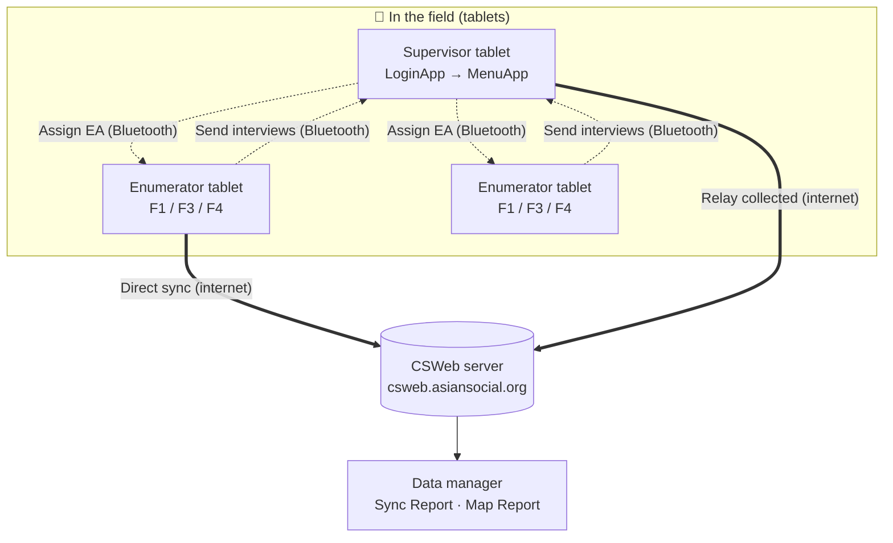
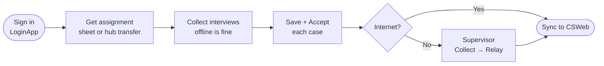
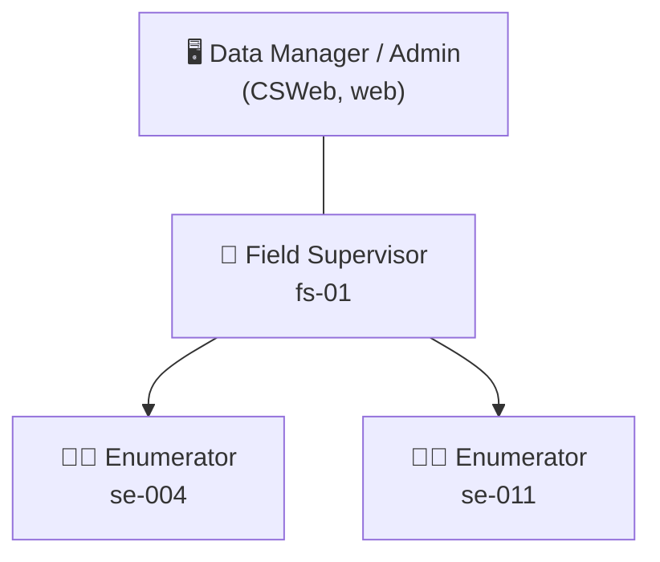

<!--
CAPI Manual — Section III. CAPI System Overview
Workflow, roles, environments, sync/transfer logic — grounded in CSEntry + hub + CSWeb (merge-by-key, relay). Environments settled: one production CSWeb (csweb.asiansocial.org); training is done with practice cases on the same apps — no separate training server is provisioned in this build. Narrative + diagrams.
-->

# III. CAPI System Overview

## A. The CAPI workflow at a glance

The system has three moving parts — the **tablet apps** (CSEntry: LoginApp + F1/F3/F4), the **hub** (the role menu that moves assignments and interviews between tablets over Bluetooth), and the **server** (**CSWeb**, where data lands and the team monitors it).

A normal day:

## B. User roles and access levels

Your **login decides what you can do** — the role menu only shows your allowed tasks.

| Role | Sees / can do |
|---|---|
| **Enumerator** | The survey tools (F1/F3/F4); receive an assignment, collect, send to supervisor, sync, view own coverage. |
| **Supervisor** | All of the above **plus** assign EAs, collect from the team, relay to CSWeb, and review team coverage (**§XIV**). |
| **Data manager / administrator** | Works on **CSWeb** (web): monitors synced cases, the Sync Report, and the Map Report; manages accounts. |

Each enumerator reports to a supervisor, and supervisors relay to the server the data manager monitors:

## C. Environments

- **Live / production** — the real survey runs on the production **CSWeb** (`csweb.asiansocial.org`); the apps you install come from there. **This is the only server.**
- **Training** — there is **no separate training server**. Practice is done with **practice cases** (clearly marked, never real respondents) on the same apps, so trainees learn without affecting real data. Your trainer gives you practice case keys; delete or ignore them once training ends.

> ⚠️ **Never enter a real interview as "practice," or a practice case as real.** Use the case keys your supervisor assigns for real fieldwork.

## D. Sync and data-transfer logic (how data moves safely)

Two facts make the system robust:

- **Everything is local first.** Cases are saved on the tablet as you go; nothing depends on a live connection.
- **Cases merge by their 12-digit case key.** When data reaches the server — whether an enumerator **syncs directly** or a supervisor **collects over Bluetooth and relays** — matching cases **update in place** and never conflict. Sending and collecting are **non-destructive** (the enumerator keeps their own copy).

This is why there are **two paths to the server**:

| Path | Who | When |
|---|---|---|
| **Direct sync** (CSEntry → CSWeb) | Enumerator or supervisor | When the tablet itself has internet (**§XIII**). |
| **Collect → Relay** (Bluetooth → CSWeb) | Supervisor gathers the team, then relays | When enumerators can't reach the server — the offline safety net (**§XIV**). |

Either way, the goal is the same: **no completed interview is left stranded on a tablet** at the end of the day.

---

**Related sections:** §IV *Logging into CAPI* · §XIII *Uploading & Syncing* · §XIV *Supervisor-Only Features*.
