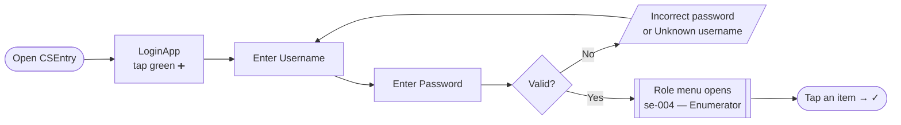
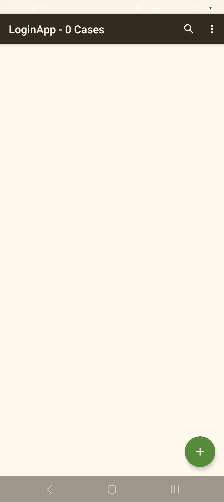
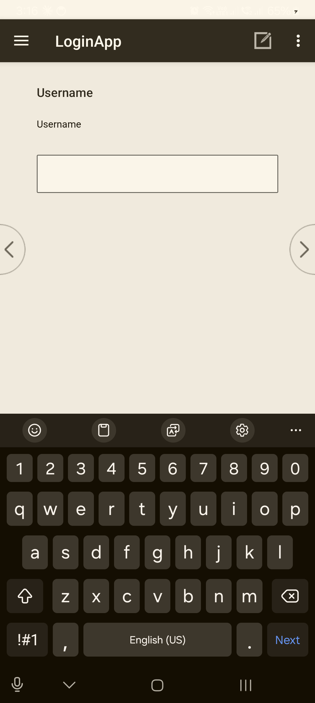
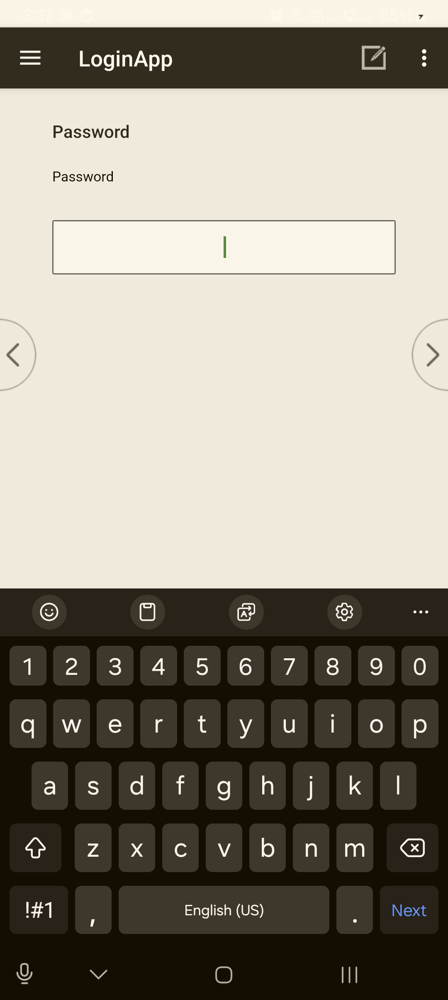
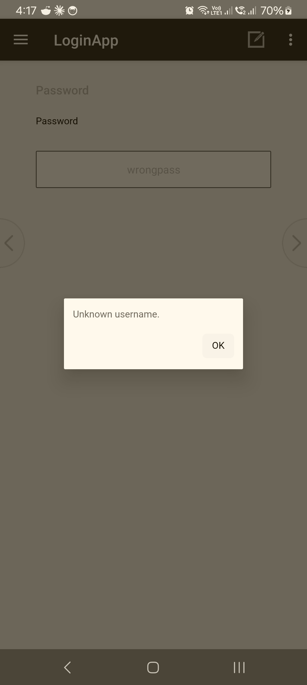
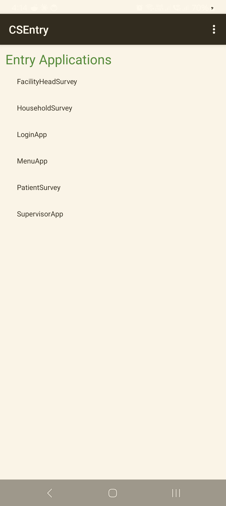

<!--
CAPI Manual — Section IV. Logging into CAPI  (PILOT)
Style: Myra "Digital PDF / task-based" — every procedure = Task→User→When→Steps→Expected→Common problem→What to do→Related.
Grounded in the deployed Supervisor & Enumerator hub (LoginApp). Screenshots captured on-device (LoginApp start/username/password, enumerator menu, app list, "Unknown username." error).
-->

# IV. Logging into CAPI

You reach the survey tools through one sign-in. Open **LoginApp**, enter your username and password, and a **menu for your role** opens — enumerators see the survey tools; supervisors see the supervisor features as well. You sign in **once** per session; you do not log in separately to each questionnaire.

> 🔑 **Before you start:** your username and password are issued by your coordinator. **Keep them private and never share a login** — every case you save is tagged to the account that created it.

**The sign-in flow at a glance:**

---

## 4.1 Opening the application

> **Task:** Open CAPI and reach the sign-in screen
> **User:** Enumerator · Supervisor
> **When:** At the start of each field day, or any time you need to sign in.

**Steps**

1. On the tablet, open **CSEntry**.
2. In the application list, tap **LoginApp**.
3. Tap the green **➕** to start.

**Expected result:** the **sign-in** screen opens and asks for your username.

> *CSEntry opens into **LoginApp** ("LoginApp – 0 Cases"). Tap the green **➕** (bottom-right) to begin signing in.*

**Common problem:** LoginApp is not in the list, or it looks out of date.
**What to do:** install or update it — see **§4.7** below and **§I·D / §1, Installing and updating CAPI**.

---

## 4.2 Entering your username and password

> **Task:** Sign in with your credentials
> **User:** Enumerator · Supervisor
> **When:** Right after opening LoginApp.

**Steps**

1. **Enter** your **username** (for example, `se-004`). Advance to the next field.
2. **Enter** your **password**. Advance.
3. Advance once more to submit.

**Expected result:** your **role menu** opens, with your **username and role across the top** — for example, `se-004 — Enumerator` or `fs-01 — Supervisor`.

> *Enter your **Username** (e.g. `se-004`), advance with the **›** arrow, then your **Password**, and advance again to sign in.*

> ⚠️ **Check the banner before you work.** Confirm the username and role at the top are **yours**. If they are not, log out (**§4.6**) and sign in again.

**Common problem:** the password won't go through.
**What to do:** re-type it carefully (passwords are case-sensitive). If it still fails, see **Login errors** below.

---

## 4.3 Your role menu (what opens after sign-in)

> **Task:** Get oriented on the menu for your role
> **User:** Enumerator · Supervisor
> **When:** Immediately after a successful sign-in.

The menu is **grouped by task** and lists only what your role is allowed to do:

- **Enumerator** (`se-004 — Enumerator`) — **ASSIGNMENT** (Receive Assigned Data) · **INTERVIEWS** (Conduct F1 – Facility Head / F3 – Patient / F4 – Household; Send My Interviews to Supervisor) · **REPORTS** (View EA on Map; View my report) · **SESSION** (Log out). The F2 Healthcare Worker survey is a separate web form, not launched here.
- **Supervisor** (`fs-01 — Supervisor`) — adds **ASSIGNMENTS** (Assign Enumeration Area), **COLLECT & RELAY**, and review/open functions. These are covered in **§XIV, Supervisor-only features**.

**To run an item:** tap it (it highlights), then tap the **✓** at the bottom of the menu. An instrument launches its questionnaire; when you finish or exit, you are returned to **this menu** (not signed out) — see **§IX, Starting a questionnaire**.

> *The **enumerator** role menu (headed `se-004 — Enumerator`). Groups: **ASSIGNMENT** (Receive Assigned Data) · **INTERVIEWS** (Conduct F1 / F3 / F4; Send My Interviews to Supervisor) · **REPORTS** (View EA on Map; View my report) · **SESSION** (Log out). Tap an item, then the **✓** to run it.*

**Common problem:** the menu shows the wrong tools, or far fewer/more than expected.
**What to do:** your account role may be set differently than your assignment — log out and sign in again; if it persists, contact your coordinator.

---

## 4.4 Login errors

> **Task:** Recognise and clear a failed sign-in
> **User:** Enumerator · Supervisor
> **When:** When the app rejects your sign-in.

CAPI shows a plain message for each cause. Match it to the table and act:

| Message on screen | What it means | What to do |
|---|---|---|
| **"Incorrect password."** | Username is known; password didn't match. | Re-type carefully (case-sensitive). If it persists, ask your coordinator to check your account. |
| **"Unknown username."** | The app doesn't have your account. | Your tablet's build may be out of date, or you're not in it yet. **Update LoginApp** (**§4.7**), then try again; if still missing, contact your coordinator. |
| **"No role found from login…"** | The menu was opened **without** signing in through LoginApp. | Close it and sign in **through LoginApp** — do not open the menu app on its own. |

*A sign-in error — here **"Unknown username."** Tap **OK**, re-check the username (case-sensitive), and if it's correct, update or re-add LoginApp (**§4.7**) or contact your coordinator.*

---

## 4.5 Forgotten or reset password

> **Task:** Recover access when you can't sign in
> **User:** Enumerator · Supervisor
> **When:** You've forgotten your password or it has stopped working.

**There is no self-service password reset on the tablet.** Credentials are issued and managed by your coordinator.

**What to do:** contact your **coordinator / CAPI support** (see the **Support Contacts** annex). They will confirm your username and re-issue a password. Do not borrow another person's login to keep working — it mis-tags the data.

---

## 4.6 Logging out / switching user

> **Task:** End your session or hand the tablet to another fieldworker
> **User:** Enumerator · Supervisor
> **When:** At the end of the field day, or before a different person uses the tablet.

**Steps**

1. From your role menu, **exit** back to the LoginApp sign-in screen.
2. To switch user, **sign in again** with the other person's credentials (**§4.2**).

**Expected result:** you're back at the sign-in screen; the next person's session starts clean under **their** account.

> ⚠️ **Always log out before handing over the tablet.** Cases created while signed in as you are tagged to you. Sharing a session mixes up who collected what.

**Common problem:** you're not sure whether anything is still unsaved.
**What to do:** finish or save the open interview first (**§XI·H, Saving progress**) before logging out.

---

## 4.7 Working offline · installing / updating LoginApp

> **Task:** Sign in without internet, and keep LoginApp current
> **User:** Enumerator · Supervisor
> **When:** In the field with no signal; or when a new build is released.

- **Signing in works offline.** Your login is checked **on the tablet**, so you can sign in and collect data with no internet. Internet is only needed to **Sync** (upload/download cases) — see **§XIII, Uploading & Syncing**.
- **Installing / updating:** in CSEntry, find **LoginApp** and tap **Install** — or **Update** if it shows *"New version available."* This installs both the sign-in and the menu.
- **If the app looks stale after an update** (old screens, or your username gives *"Unknown username."*), **remove LoginApp and add it again** from CSWeb, then sign in.

*The CSEntry **Entry Applications** list. To install or refresh a tool, use **Add Application → from CSWeb**; if a tool looks stale, **remove it and add it again** to pull the latest build.*

---

## Troubleshooting — Sign-in

| Symptom | Likely cause | Fix |
|---|---|---|
| "Incorrect password." | Wrong/case-mismatched password | Re-type carefully; if it persists, coordinator checks the account. |
| "Unknown username." | Build out of date, or account not added | Update LoginApp (**§4.7**); if still missing, contact coordinator. |
| "No role found from login…" | Opened the menu without LoginApp | Sign in **through LoginApp**, not the menu app alone. |
| Menu shows the wrong tools | Role set differently than expected | Log out, sign in again; persists → coordinator. |
| Can't sign in at all / forgot password | No self-service reset | Coordinator re-issues credentials (**§4.5**). |
| Wrong name/role on the banner | Someone else's session, or wrong login | Log out (**§4.6**) and sign in as yourself. |

---

**Related sections:** §I·E *Basic rules for device and data security* · §IX *Starting a questionnaire* · §XIII *Uploading & Syncing* · §XIV *Supervisor-only features* · Annex *CAPI Login Quick Guide* · Annex *CAPI Support Contact List*.
