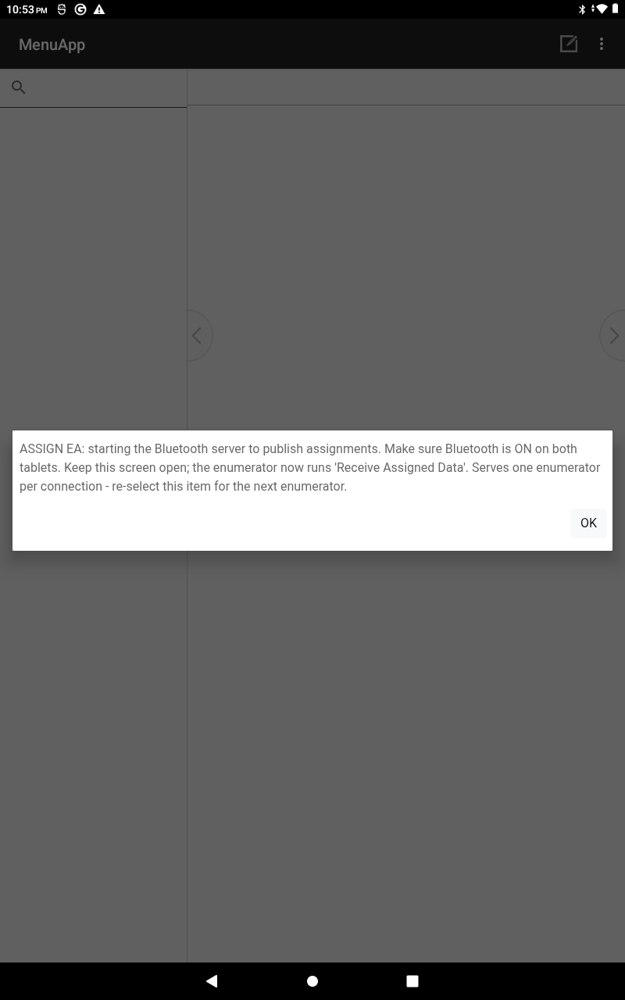

<!--
CAPI Manual — Section VI. Downloading Assignments
Honest to our model: (1) install/update tool from CSWeb, (2) assignments come from the supervisor — assignment sheet of case keys and/or Bluetooth transfer via the hub, (3) sync pulls server data. No generic server-push assignment grid.
Both distribution paths are documented; which one a given round uses is a field-protocol choice the supervisor announces (the system supports either). Screenshot 6.2 captured (Bluetooth receive).
-->

# VI. Getting Your Assignments

Before you can collect, two things must be on your tablet: the **survey tools** (installed from the server) and your **assignments** (which facilities/cases you are responsible for). In this system assignments come from your **supervisor** — on an **assignment sheet** of case keys and/or transferred to your tablet via the **hub** — not from a self-service "download" button.

---

## 6.1 Installing or updating the survey tools

> **Task:** Get the F1/F3/F4 tools onto the tablet
> **User:** Enumerator · Supervisor
> **When:** Before fieldwork, and whenever a new build is released.

**Steps**

1. In **CSEntry**, choose **Add Application**.
2. Select **from CSWeb** (`csweb.asiansocial.org`).
3. Find and **install** **LoginApp** and the survey tools you need.
4. If a tool is already installed, tap **Update** when it shows a new version.

**Expected result:** **LoginApp** and the tools appear in your CSEntry list and open.

> 💡 If a tool looks stale or won't update, **remove it and add it again** from CSWeb — that reliably pulls the latest (**§XIII·5**).

---

## 6.2 Receiving your case assignments

> **Task:** Know which facilities/cases are yours
> **User:** Enumerator
> **When:** At the start of fieldwork, and when reassigned.

Your supervisor gives you your assignments in one (or both) of these ways:

- **Assignment sheet** — a list of the **12-digit case keys** (with real PSGC codes) for your facilities/cases. You **enter the case key** when you start each case (**§IX·4**).
- **Hub transfer (Bluetooth)** — your supervisor can send your assignment list straight to your tablet **device-to-device** using the **Supervisor & Enumerator hub**, with no internet needed.

> ⚠️ **Use only the assignments your supervisor gives you.** Don't invent or guess case keys — a wrong PSGC prefix is rejected at the start of the case anyway (**§IX·4**).

*The hub transfer (supervisor side): the supervisor taps **Assign Enumeration Area** to start the Bluetooth host, then you run **Receive Assigned Data** from your menu to pull your assignment — no internet needed (**§XIV·1**).*

---

## 6.3 Confirming what you received

> **Task:** Check your assignments are complete before you go
> **User:** Enumerator
> **When:** Right after receiving them.

**Steps**

1. Count the assignments against your supervisor's list.
2. Confirm each has a **complete 12-digit case key** and a clear facility/site.
3. Raise anything **missing or unclear** with your supervisor **before** leaving for the field.

**Expected result:** every case you're expected to do has a key and a known location.

---

## 6.4 Pulling server data (sync)

> **Task:** Bring down anything the server holds for you
> **User:** Enumerator · Supervisor
> **When:** When you have a connection.

Running a **Sync** (**§XIII**) not only uploads your work — it also **brings down** any updates the server has (e.g. the latest build, or shared reference data). Sync once before fieldwork starts if you can.

---

## Troubleshooting — Assignments

| Symptom | Likely cause | Fix |
|---|---|---|
| A tool isn't installed | Not added from CSWeb yet | Add Application → from CSWeb (**§6.1**). |
| Assignments missing | Not yet distributed, or a transfer didn't complete | Ask your supervisor to re-send (sheet or hub transfer). |
| Unsure a case is yours | Assignment unclear | Confirm with your supervisor before collecting (**§6.3**). |
| Tool won't update | In-app update missed it | Remove + re-add from CSWeb (**§6.1**, **§XIII·5**). |

---

**Related sections:** §IV·7 *Installing / updating LoginApp* · §VII *Assignment Listing* · §IX *Starting a Questionnaire* · §XIII *Uploading & Syncing* · §XIV *Supervisor-Only Features*.
