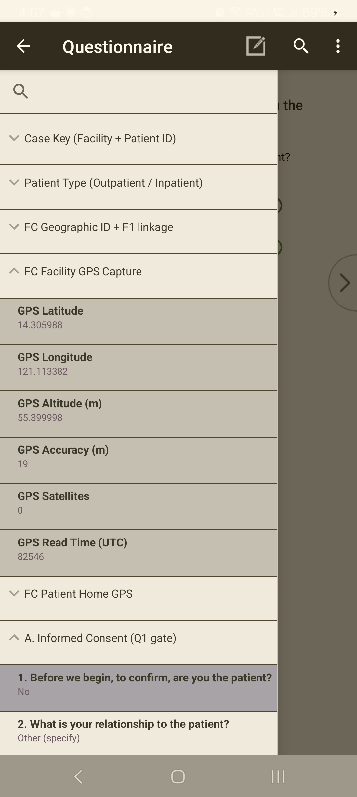

<!--
CAPI Manual — Section VIII. Mapping and Navigation
Honest to our system: on-device GPS auto-capture (enumerator) + CSWeb Map Report (supervisor/web). No in-app turn-by-turn navigation / radius / best-route — those generic CAPI features are not in this build; use the tablet's maps app for directions. Screenshots are placeholders.
-->

# VIII. Mapping and Location Capture

Location matters two ways in this survey: the tablet **captures GPS** at the interview (so each case has a verified location), and the team sees those locations on the **CSWeb Map Report** (a web view, for supervisors and the data manager). This build does **not** include in-app turn-by-turn navigation — for directions to a site, use the tablet's own maps app and your assignment details.

---

## 8.1 GPS capture during the interview

> **Task:** Capture the case location
> **User:** Enumerator
> **When:** The tool prompts for GPS, during the case (and at the verification step).

**Steps**

1. When the tool prompts for **GPS**, make sure **Location** is **on** (**§II·D**) and you're **outdoors / near a window** with a clear sky view.
2. Let it **capture** — wait for it to get a fix before advancing.

**Expected result:** coordinates are stored with the case and sync to the server.

> ⚠️ **Wait for a real fix.** If you advance too fast or Location is off, the case can save **0 satellites / no location**, which shows as "unreported" on the map. Give it a few seconds with a clear sky view.

*GPS is captured **automatically** when you reach the facility / patient-home location section — there is no button to press. The captured coordinates appear in the case tree. If **Accuracy** is poor or **Satellites** shows 0, step outdoors with **Location** on and the section re-reads.*

**Common problem:** GPS won't get a fix indoors.
**What to do:** step outside or to a window; turn Location on; wait. Note it in a comment if a fix is truly impossible.

---

## 8.2 Verifying you're at the right site

> **Task:** Confirm the location matches the assignment
> **User:** Enumerator
> **When:** On arrival and at the cover/verification screens.

- The **facility name and address auto-fill** from the case key (**§IX·5**) — confirm they match where you are.
- If the auto-filled site **doesn't match**, **stop** — the case key may be wrong (**§IX·4**); don't collect against the wrong key.

---

## 8.3 The CSWeb Map Report (supervisors / data manager)

> **Task:** See collected cases on a map
> **User:** Supervisor · Data manager (web)
> **When:** Monitoring fieldwork progress.

The **Map Report** on **CSWeb** plots synced cases by their captured GPS — useful for checking **coverage** and spotting sites with missing or odd locations. It is a **web** view (opened in a browser on CSWeb), not a tablet screen.

> 💡 A case only appears once it has **synced** *and* carries a valid GPS fix; "unreported" usually means **0 satellites** were captured (**§8.1**), not that the case is lost.

---

## 8.4 Getting to a site (directions)

> **Task:** Navigate to an assigned facility/household
> **User:** Enumerator
> **When:** Travelling to a site.

This build has **no in-app directions, radius search, or best-route** feature. To find a site:

- use your **assignment details** (facility name/address) and local knowledge / your supervisor's guidance;
- if needed, use the **tablet's own maps app** for directions, then return to CAPI to collect.

---

## Troubleshooting — Mapping / GPS

| Symptom | Likely cause | Fix |
|---|---|---|
| GPS won't fix | Indoors / Location off | Go outside or to a window; turn Location on; wait (**§8.1**). |
| Case shows "unreported" on the map | 0 satellites captured | Recapture with a clear sky view next time; note if impossible. |
| Auto-filled site is wrong | Wrong case key | Stop; verify the key (**§IX·4**) before collecting. |
| Looking for in-app directions | Not in this build | Use the tablet's maps app (**§8.4**). |

---

**Related sections:** §II·D *Date, Time, and Location Settings* · §IX *Starting a Questionnaire* · §XIII *Uploading & Syncing* · §XIV *Supervisor-Only Features (map-all)*.
