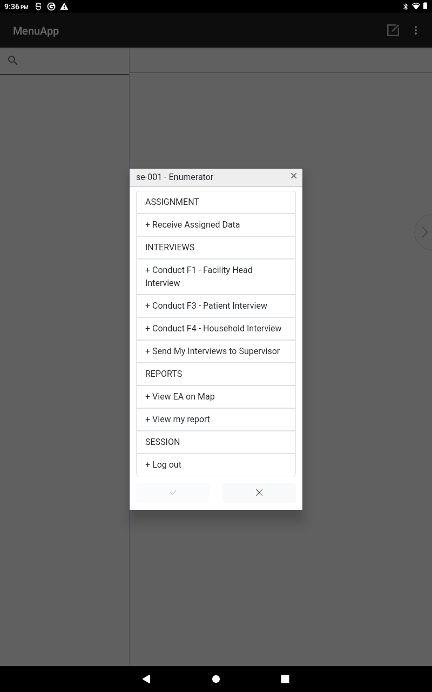
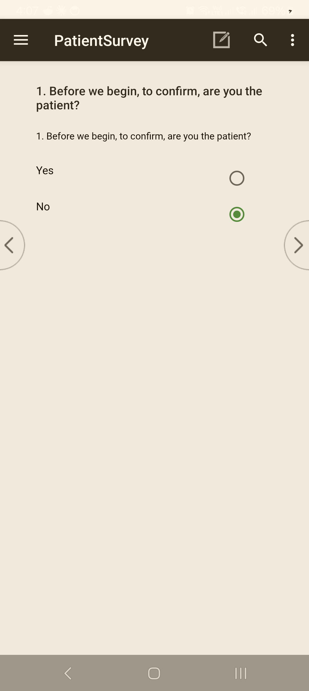
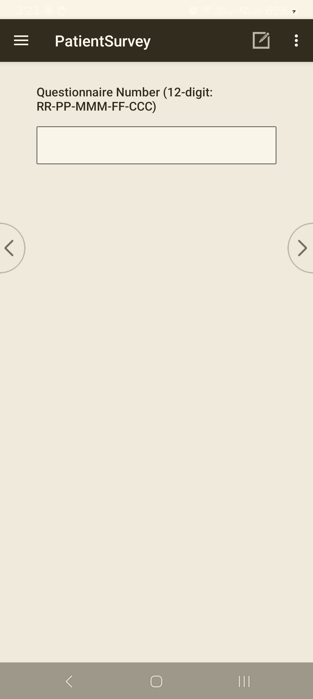

<!--
CAPI Manual — Section IX. Starting a Questionnaire
Style: task-based (Task→User→When→Steps→Expected→Common problem→What to do→Related). Grounded in CSEntry + the hub menu + the 12-digit case-key PSGC gate. Screenshots are placeholders.
-->

# IX. Starting a Questionnaire

After you sign in (**§IV**) your **role menu** lists the survey tools. Starting an interview is always the same shape: **pick the right tool → confirm the respondent is eligible → read and record consent → enter the case key → begin.** Getting the tool and the case key right at the start is what keeps each interview attached to the correct facility and respondent.

> ⚠️ **One respondent, one tool.** F1 is for the **facility head**, F3 for a **patient**, F4 for a **household** respondent. Confirm who is in front of you *before* you open a tool. If the wrong tool opens, exit and start the correct one.

---

## 9.1 Selecting the correct survey tool

> **Task:** Open the right questionnaire for this respondent
> **User:** Enumerator · Supervisor
> **When:** At the start of each interview.

**Steps**

1. On your **role menu**, identify the tool for this respondent:
   - **F1 — Facility Head**
   - **F3 — Patient**
   - **F4 — Household**
2. **Tap** the tool. (The **F2 Healthcare Worker** survey is a **separate web form**, not launched here — see your supervisor.)

**Expected result:** the tool opens to its case list.

> *Pick the tool under **INTERVIEWS**: Conduct F1 – Facility Head / F3 – Patient / F4 – Household.*

**Common problem:** the tool you need isn't on the menu.
**What to do:** your role may not include it — confirm with your supervisor; do not borrow another login.

---

## 9.2 Confirming respondent eligibility

> **Task:** Check the person qualifies for this tool before interviewing
> **User:** Enumerator
> **When:** Before recording consent.

Confirm against the rules in your **Enumerator's Manual** for the tool — for example, F1 is answered by the **facility head or their delegate**, F3 by a **sampled patient**, F4 by a **knowledgeable household member**. If the person is not eligible, do **not** start a case; follow the replacement/substitution rules in the field protocol.

**Common problem:** the intended respondent is unavailable.
**What to do:** record the visit outcome (**§XII, result codes**) rather than interviewing an ineligible person.

---

## 9.3 Reading and recording consent

> **Task:** Obtain and record informed consent
> **User:** Enumerator
> **When:** Immediately before the first question, every interview.

**Steps**

1. **Read the consent text on screen aloud, verbatim** — it mirrors the approved Informed Consent Form. Do not paraphrase.
2. Answer the respondent's questions; mention the **token** where applicable (F3/F4).
3. **Record the response** on the consent screen — **consent given** or **not given**.

**Expected result:**
- **Consent given →** the interview proceeds.
- **Consent not given / refused →** the tool routes you to the **closing result screen** to record the outcome (**§XII**); it does **not** ask the survey questions.

> ⚠️ **Never enter survey answers without a recorded consent.** Consent is the gate to the questionnaire.

*The opening consent / eligibility gate. Record the respondent's answer truthfully — **"No"** routes to the relationship and same-household questions before the interview proceeds.*

---

## 9.4 Entering the case key

> **Task:** Enter the 12-digit case key correctly
> **User:** Enumerator
> **When:** When the tool asks for the case identifier (case key), at the very start.

The **case key** is a **12-digit number** built from the location and case: **Region (2) · Province (2) · City/Municipality (3) · Facility (2) · Case (3)**. It must use **real PSGC codes** for the site.

**Steps**

1. **Enter** the 12-digit case key for this assignment, digit by digit.
2. Advance.

**Expected result:** the geographic prefix is accepted and you move to **Field Control / Geographic ID**.

> ⚠️ **The case key is validated against the official PSGC at the first field.** A made-up or test key (wrong region/province/city prefix) is **blocked at the start** with an error — you cannot proceed. Use the **real PSGC numbers** for your assigned site (your supervisor provides them).

> *The case-key prompt: **Questionnaire Number (12-digit: RR-PP-MMM-FF-CCC)** — Region · Province · Municipality · Facility · Case. Enter the real PSGC-coded key for your assignment.*

**Common problem:** "your key is rejected at the first field."
**What to do:** check each segment against your assignment sheet; a single wrong digit in the region/province/city prefix blocks the key. Re-enter the correct PSGC code.

---

## 9.5 Beginning the interview

> **Task:** Move from the cover/control block into the questions
> **User:** Enumerator
> **When:** After the case key is accepted.

**Steps**

1. Complete the **Field Control / Geographic ID** cover fields (date, visit, geographic identifiers). Where the facility is known, its **name and address auto-fill** from the case key.
2. Allow the tool to **capture GPS** where prompted (**§VIII**).
3. Proceed into **Section A** and the survey body.

**Expected result:** you're on the first survey question, with the case cover saved.

> 💡 **You can stop and resume.** If the interview is interrupted, your progress is saved and you can return to this case later (**§XI·H** and **§XII·F**).

---

## Troubleshooting — Starting a case

| Symptom | Likely cause | Fix |
|---|---|---|
| Case key rejected at field 1 | Wrong PSGC prefix (region/province/city) or a typo | Re-enter the correct PSGC codes from your assignment sheet. |
| Wrong tool opened | Tapped the wrong menu item | Exit and open the correct tool (**§9.1**). |
| Survey won't ask questions | Consent recorded as **not given** | Correct only if consent was actually given; otherwise record the visit outcome (**§XII**). |
| Facility name doesn't auto-fill | Case key facility segment wrong, or lookup not loaded | Verify the facility segment; if still blank, note it and inform your supervisor. |

---

**Related sections:** §IV *Logging into CAPI* · §VIII *Mapping & Navigation (GPS)* · §X *Navigating a Questionnaire* · §XII *Completing a Questionnaire* · Annex *Final Result Codes*.
