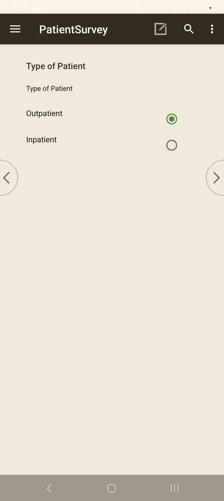
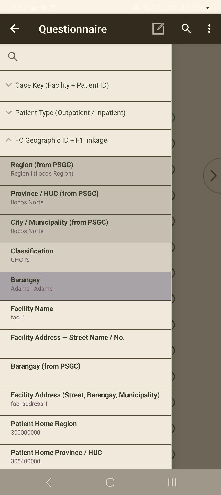
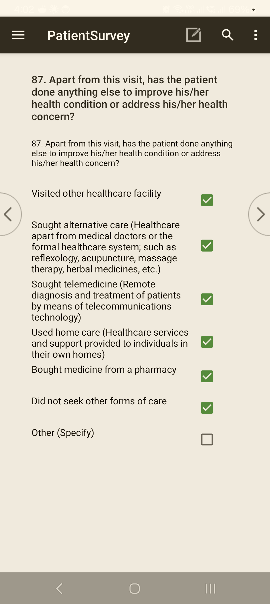
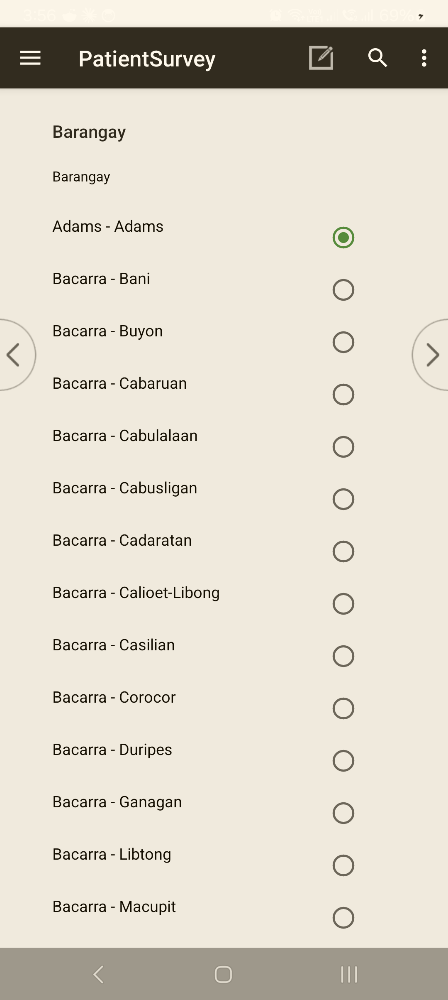

<!--
CAPI Manual — Section X. Navigating Through a Questionnaire
Grounded in CSEntry field-by-field entry, the section nav tree, CSPro question types + skip logic + validation. Screenshots are placeholders.
-->

# X. Navigating Through a Questionnaire

CAPI moves through the questionnaire **one field at a time**, in the order the survey requires. You answer the question on screen, then advance; the tool decides what comes next, applying skips and checks automatically. You do **not** decide which question follows — that keeps every interview consistent.

---

## 10.1 Moving between screens

> **Task:** Move forward and back through the questions
> **User:** Enumerator
> **When:** Throughout the interview.

**Steps**

1. **Answer** the question on screen.
2. **Advance** to the next question (tap the forward control / **Next**).
3. To revisit an earlier answer, use **back** to step to the previous field.

A **section navigation panel** on the left shows where you are (e.g. *Case Key · Field Control · Geographic ID · Facility GPS · A. … · B. …*). Use it to see your position; the tool still requires you to complete fields in order.

*A typical question screen. Tap an answer, then the forward **>** control (or the keyboard's **Next**) to continue; **<** goes back. The **☰** menu opens the section tree.*

*The **section tree** (open the **☰** menu) shows where you are and what's been answered, and lets you jump between sections.*

> 💡 **Text and number fields:** type the value, then use the **forward control** to advance — pressing Enter alone does not always move you on.

**Common problem:** you can't move forward.
**What to do:** the field is required or failed a check — see **§10.2** and **§XI·F**.

---

## 10.2 Required questions

> **Task:** Recognise a question you must answer
> **User:** Enumerator
> **When:** When the tool won't let you advance.

Most questions are **required** — the tool will not move on until a valid answer is entered. If you genuinely cannot get an answer, use the response the question provides for that case (e.g. **Don't know / Refused**, where offered) rather than leaving it blank — see **§XI·D**.

---

## 10.3 Types of questions

> **Task:** Answer each question type correctly
> **User:** Enumerator
> **When:** Throughout the interview.

| Type | Looks like | How to answer |
|---|---|---|
| **Single response** | radio buttons / a drop-down | **Select one** option. Long lists (e.g. location) use a **drop-down**. |
| **Multiple response** | **check boxes** | **Tick all that apply.** Some lists have an exclusive option (e.g. *None* / *Don't know*) that cannot be combined with others — the tool will warn you. |
| **Numeric** | a number pad | **Enter** the number; ranges are checked (**§XI·F**). |
| **Text** | a text box | **Type** the response; advance with the forward control. |
| **Date / time** | a date picker | **Enter** the date in the format shown. |
| **Roster** | a repeating grid | One **row per item/person**; complete each row. The tool adds/keeps rows based on earlier answers. |

*Multiple response (**tick all that apply**) — tap each box that applies. Some lists have an exclusive option (e.g. *"Did not seek other forms of care"*) that should be the only one ticked; the tool warns if you combine it with others.*

*A **select-from-list** (single response) question — scroll and tap the one correct option.*

> ⚠️ **Multiple-response = tick all.** Don't stop at the first applicable answer — read every option and tick each that applies.

---

## 10.4 Skip patterns and validation

> **Task:** Understand why questions appear or are blocked
> **User:** Enumerator
> **When:** When a question is skipped, or your entry is challenged.

- **Skip patterns are automatic.** Based on earlier answers, the tool shows only the questions that apply and **skips the rest** — this is correct, not an error. Do not try to force a skipped question.
- **Validation checks** run as you go:
  - a **hard check** stops you and asks you to **re-enter** (the value is out of range or impossible);
  - a **soft check** warns you but lets you **confirm** and continue if the unusual value is true.
  See **§XI·F–G** for handling each.

**Common problem:** a question you expected didn't appear.
**What to do:** it was correctly skipped by an earlier answer. If you believe an earlier answer was wrong, go **back** and correct it (**§10.1**); the skips will recompute.

---

## 10.5 Help, comments, and verification

> **Task:** Use the on-screen aids
> **User:** Enumerator
> **When:** As needed during a question.

- **Help / question instructions** — where a question has an instruction or definition, it is shown with the question; read it to the respondent where required.
- **Comments / field notes** — record anything that explains an answer or the interview conditions; these travel with the case.
- **Facility / address verification** — the facility name and address shown are **auto-filled from the case key**; confirm they match where you are. GPS is captured automatically (**§VIII**).

**Common problem:** the auto-filled facility doesn't match the site.
**What to do:** stop — the case key may be wrong (**§9.4**); verify before continuing.

---

## 10.6 Returning to the menu

> **Task:** Leave the questionnaire
> **User:** Enumerator
> **When:** When you finish, or need to stop.

Completing the case (**§XII**) returns you to the tool's case list and then your **role menu** — you stay **signed in**. To stop mid-interview, save first (**§XI·H**) before exiting.

---

## Troubleshooting — Navigation

| Symptom | Likely cause | Fix |
|---|---|---|
| Can't advance | Required field, or a hard check failed | Enter a valid answer / re-enter in range (**§XI·F**). |
| Expected question missing | Correctly skipped by an earlier answer | Go back and check the earlier answer if you think it's wrong. |
| Only one option selectable on a tick-all | Treating a multiple-response as single | It **is** tick-all — keep tapping each option that applies. |
| Text field won't advance on Enter | Enter doesn't always advance | Use the **forward control**. |

---

**Related sections:** §IX *Starting a Questionnaire* · §XI *Entering & Reviewing Data* · §VIII *Mapping & Navigation* · §XII *Completing a Questionnaire*.
