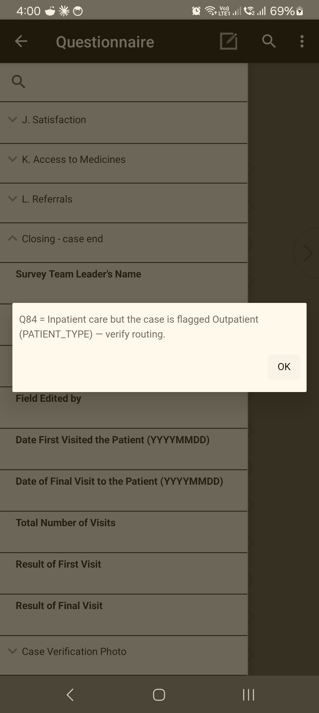

<!--
CAPI Manual — Section XI. Entering and Reviewing Data
Grounded in CSEntry: Other-specify gated text, DK/Refused via the question's own options, hard/soft checks, comments, partial save. Avoids asserting unfinalized missing-value sentinel codes. Screenshots are placeholders.
-->

# XI. Entering and Reviewing Data

The quality of the survey depends on what you type here. Enter exactly what the respondent says, use the options the question provides for "don't know" or "refused," and respond to the tool's checks rather than working around them. The tool catches many mistakes as you go — treat each message as a chance to fix the answer before it's saved.

---

## 11.1 Entering responses correctly

> **Task:** Capture each answer accurately
> **User:** Enumerator
> **When:** Every question.

- Record the respondent's **actual** answer — don't round, assume, or "tidy."
- For amounts, enter the **figure given** (the tool handles the formatting and totals).
- For coded lists, select the option that matches; use **Other, specify** only when nothing fits (**§11.3**).

> ⚠️ **Don't guess to get past a question.** A wrong value can trigger checks later and corrupt totals. If unsure, ask the respondent to clarify.

---

## 11.2 Editing a response during the interview

> **Task:** Correct an answer you've already entered
> **User:** Enumerator
> **When:** The respondent corrects themselves, or you mis-keyed.

**Steps**

1. Use **back** to return to the field (**§10.1**).
2. **Re-enter** the correct answer and advance.

**Expected result:** the answer updates; any skips that depend on it recompute automatically.

> 💡 Changing an earlier answer can **open or close** later questions. After a correction, page forward and check that the right questions now appear.

---

## 11.3 "Other, specify" responses

> **Task:** Record an answer not in the option list
> **User:** Enumerator
> **When:** The respondent's answer doesn't match any listed option.

**Steps**

1. Select **Other (specify)**.
2. A **text box opens** — **type** the answer in the respondent's words.

**Expected result:** the specify text is saved with the "Other" code.

> ⚠️ Choose **Other** only when no listed option fits. If a listed option matches, use it — "Other" answers are harder to analyse.

**Common problem:** the specify box doesn't open.
**What to do:** confirm **Other** is actually selected (not a neighbouring option); the box is gated on the Other code.

---

## 11.4 "Don't know," "Refused," and missing answers

> **Task:** Record a non-answer properly
> **User:** Enumerator
> **When:** The respondent can't or won't answer.

- Where a question **offers** **Don't know** or **Refused**, **select that option** — don't invent a number or leave it blank.
- For amount/numeric questions, **follow the on-screen instruction** for unknown values (some accept a specific entry; do not type a guess).
- Probe once, politely, before accepting *Don't know* — but never pressure the respondent.

> 💡 **Don't know / Refused** appear as ordinary selectable options on the questions where they apply (for example *"I don't know"* on several scale questions) — select them the same way as any other answer, like the question screens shown in **§X**. Never leave a question blank to mean "don't know"; pick the option the question provides.

---

## 11.5 Interviewer comments

> **Task:** Note anything that explains an answer
> **User:** Enumerator
> **When:** When context matters (an unusual answer, an interruption, a respondent remark).

Use the **comment / field-note** aid to record the context. Comments travel with the case and help the data manager interpret the response. Keep them brief and factual.

---

## 11.6 Responding to error messages (hard checks)

> **Task:** Clear a value the tool rejects
> **User:** Enumerator
> **When:** A message blocks you with **re-enter**.

A **hard check** means the value is out of range or impossible (e.g. an age of 200, or a total that can't be right). The tool **stops** and asks you to re-enter.

*A check message in the tool. This one is a **soft check** (a consistency warning) — read it, tap **OK**, and either correct the earlier answer or, if the unusual value is genuinely true, confirm and continue (**§11.7**). Hard checks instead make you **re-enter** before you can move on.*

**Steps**

1. **Read the message** — it states what's wrong.
2. **Tap OK** to dismiss it.
3. **Re-enter** a valid value (confirm the real answer with the respondent if needed).

> 💡 On a tablet, **tap the OK button** to clear an error box — don't just press Enter.

---

## 11.7 Responding to consistency checks (soft checks)

> **Task:** Confirm or correct an unusual-but-possible answer
> **User:** Enumerator
> **When:** A message **warns** but allows you to continue.

A **soft check** flags an answer that's unusual or inconsistent with another answer, but could be true (e.g. a very high amount, or a date that seems early). The tool lets you **confirm and continue** *or* go back and fix it.

**Steps**

1. Read the warning — it names the two answers in tension.
2. If the value is **correct**, **confirm** and continue (optionally add a comment, **§11.5**).
3. If it's **wrong**, go **back** and correct the relevant answer.

---

## 11.8 Saving progress

> **Task:** Keep your work safe and resume later
> **User:** Enumerator
> **When:** An interview is interrupted, or you must stop.

- The tool **saves your progress** so an interrupted interview is **not lost**. You can exit and **resume the same case** later (**§XII·F–G**).
- Save before handing over or switching the tablet off.

> ⚠️ **Don't delete a partly-done case to "start clean"** unless your supervisor tells you to — resume it instead, so the work isn't lost.

**Common problem:** on reopening, a case reports it "could not be found."
**What to do:** that usually means the case was already removed or synced away, not a data loss — see **§XII·G** and inform your supervisor.

---

## Troubleshooting — Data entry

| Symptom | Likely cause | Fix |
|---|---|---|
| Can't advance after a value | Hard check (out of range) | Read message, **OK**, re-enter a valid value (**§11.6**). |
| Warning but it lets you continue | Soft/consistency check | Confirm if true, or go back and fix (**§11.7**). |
| Specify box won't open | "Other" not actually selected | Select the **Other** code (**§11.3**). |
| Error box won't clear | Pressing Enter instead of OK | **Tap OK** on the box. |
| Don't-know value won't take | Typed a guess into an amount | Use the question's Don't know / Refused option, or the on-screen instruction (**§11.4**). |

---

**Related sections:** §X *Navigating a Questionnaire* · §XII *Completing a Questionnaire* · §XIII *Uploading & Syncing* · Annex *Common Error Messages and Solutions*.
