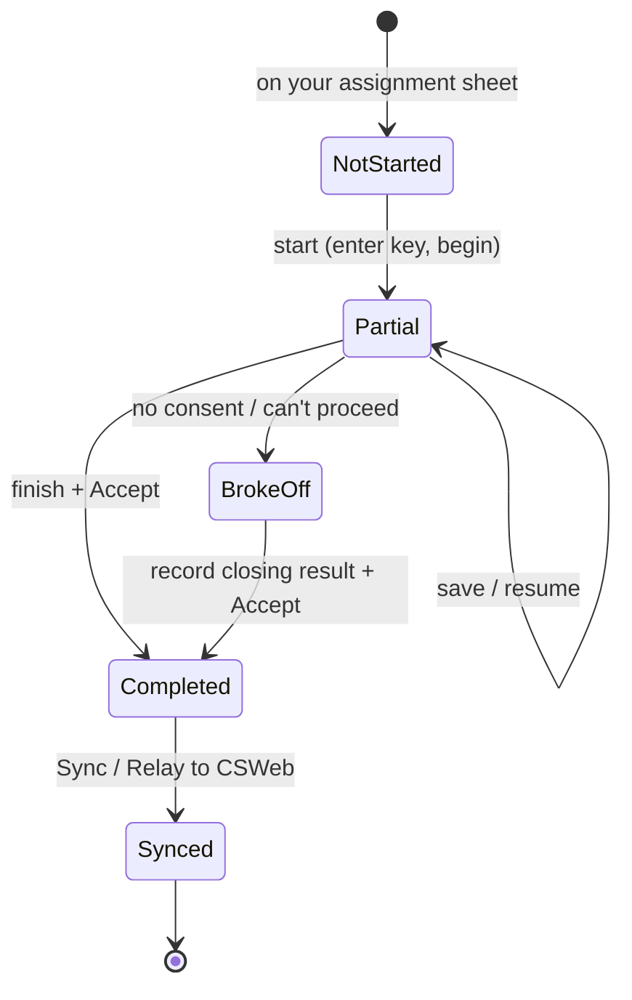
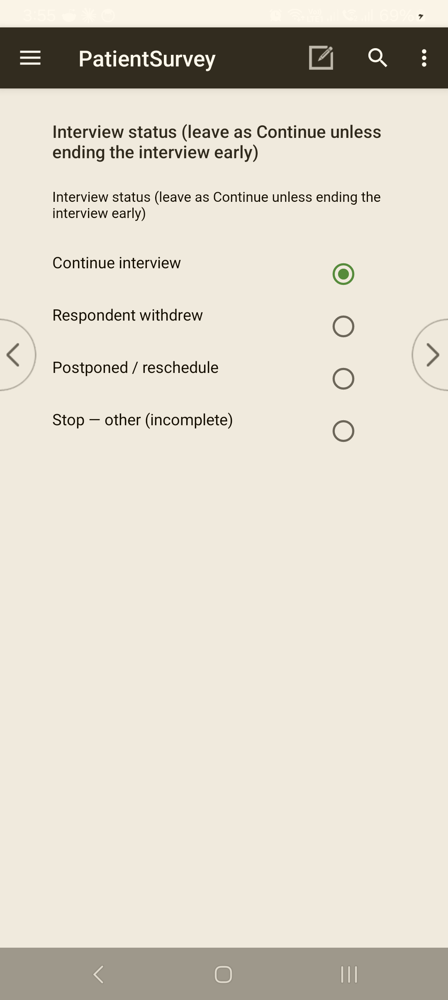

<!--
CAPI Manual — Section XII. Completing a Questionnaire
Grounded in: closing Result-of-Visit / disposition, verification photo, "Accept this case?", break-off, partial save / resume, "case could not be found" lifecycle. Screenshots are placeholders.
-->

# XII. Completing a Questionnaire

Finishing a case is more than answering the last question. You record **how the visit ended** (the result), capture any required **verification**, and then **accept** the case so it is stored and ready to sync. A case is only "done" once it has a result and has been accepted.

**The life of a case:**

---

## 12.1 Reviewing before completion

> **Task:** Check the interview before you close it
> **User:** Enumerator
> **When:** After the last survey question, before accepting.

**Steps**

1. Confirm you reached the **closing block** (the tool routes you there once the body is complete).
2. Resolve any **outstanding checks** (no unanswered required fields, no unconfirmed warnings).
3. Add a final **comment** if anything needs explaining (**§XI·5**).

> 💡 If you realise an earlier answer is wrong, go **back** and fix it now (**§11.2**) — it's easier than reopening the case later.

---

## 12.2 Recording the result of the visit

> **Task:** Record how the visit ended
> **User:** Enumerator
> **When:** At the closing screen, every case — completed or not.

Every case gets a **Result of Visit / final result code**, whether or not the interview happened. Choose the one that matches what occurred — for example **Completed**, **Refused**, **Respondent not available**, **Partially completed / broke off**. Your **Enumerator's Manual** and the **Final Result Codes** annex define each code.

**Expected result:** the result is stored with the case; for a non-interview outcome the tool **skips the survey questions** and takes you straight to closing.

*The closing **Interview status / Result of Visit** uses this radio control. Leave it on **Continue interview** during a normal interview; choose another option only to end early (this routes straight to the closing and skips the remaining questions). The full **Result of Visit** codes — which differ by tool — are in **Annex C**.*

---

## 12.3 Verification photo and closing items

> **Task:** Capture required end-of-interview items
> **User:** Enumerator
> **When:** At the closing block, where the tool prompts.

Where required, the tool prompts for a **verification photo** and any final closing fields. Take the photo as instructed; it is stored with the case and syncs to the server.

> 💡 For a **non-interview** outcome (e.g. refused, nobody home), the tool will **not** ask for the verification photo — closing is shorter.

---

## 12.4 Accepting and saving the completed case

> **Task:** Store the finished case
> **User:** Enumerator
> **When:** After the result and closing items.

**Steps**

1. At the end, the tool asks **"Accept this case?"**
2. **Accept** to save it.

**Expected result:** the case is saved to the tablet and listed as **complete**; you return to the case list / role menu.

> ⚠️ **Accepting saves; it does not upload.** The case is on the tablet until you **Sync** (**§XIII**).

---

## 12.5 Partial or interrupted interviews

> **Task:** Handle an interview that couldn't finish in one sitting
> **User:** Enumerator
> **When:** The interview is interrupted or must be continued later.

- Your progress is **saved** (**§XI·8**); the case stays in the list as **partial**.
- If the interview is broken off at the **start** (no consent / can't proceed), the tool routes you to record a **break-off result** and a short closing — you don't have to page through the whole questionnaire.

**Common problem:** you need to leave mid-interview.
**What to do:** make sure progress is saved, note the reason (comment), and resume the **same case** later (**§12.6**).

---

## 12.6 Reopening a case

> **Task:** Return to a saved case to continue or review
> **User:** Enumerator (Supervisor, where allowed)
> **When:** To finish a partial case, or correct one before sync.

**Steps**

1. In the tool's **case list**, find the case.
2. Open it to continue from where it was saved.

**Common problem:** opening a case reports **"the case could not be found."**
**What to do:** this is a **data-state** message — usually the case was already **deleted or synced away** from this device, not lost data. Don't repeatedly retry; check the case list, and if it's genuinely needed, ask your supervisor (a clean reinstall + a fresh case clears a stuck device state).

---

## 12.7 Submitting completed interviews

Completing a case **saves it locally**. Getting it to the server is a separate step — **Sync** (**§XIII**). Make a habit of syncing completed cases each day there is a connection.

---

## Troubleshooting — Completing a case

| Symptom | Likely cause | Fix |
|---|---|---|
| Can't reach the closing screen | An outstanding required field or check earlier | Page back, resolve it (**§XI·F–G**). |
| No verification-photo prompt | Non-interview result selected | Correct only if the interview actually happened; otherwise this is expected (**§12.3**). |
| "Accept this case?" not appearing | Interview not complete / still in body | Finish the remaining questions and closing items. |
| "Case could not be found" on reopen | Case already deleted/synced (lifecycle) | Not a bug; check the list, ask supervisor if needed (**§12.6**). |
| Completed case not on the server | Saved but not synced | Run **Sync** (**§XIII**). |

---

**Related sections:** §XI *Entering & Reviewing Data* · §XIII *Uploading & Syncing* · Annex *Final Result Codes* · §XV *Troubleshooting*.
