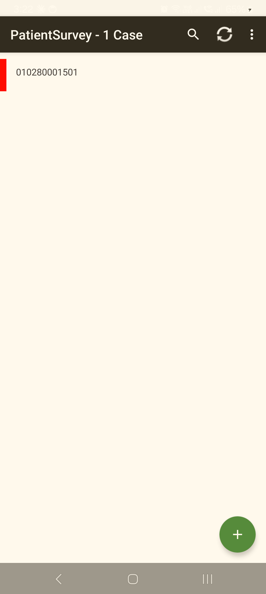
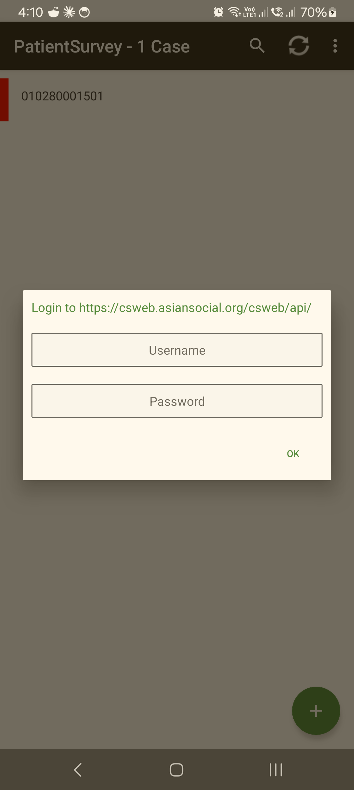
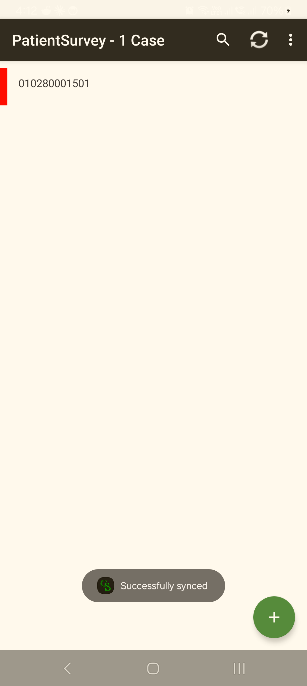

<!--
CAPI Manual — Section XIII. Uploading and Syncing Data
Grounded in: CSEntry Synchronize -> CSWeb (csweb.asiansocial.org), CSWeb sign-in, offline collection, manual/on-demand sync, sync-report lag, remove+re-add for stale builds. Screenshots are placeholders.
-->

# XIII. Uploading and Syncing Data

Collecting works **offline** — but the data only reaches the team when you **Sync**. Syncing **uploads** your completed and partial cases to the server and **downloads** any updates. Sync whenever you have a connection, and always at the end of the field day.

> 🔁 **Sync is on-demand.** Cases stay on your tablet until you run a sync — they do not upload by themselves. Build the habit: **finish the day → find signal → Sync.**

---

## 13.1 When to sync

> **Task:** Know when to upload
> **User:** Enumerator · Supervisor
> **When:** Throughout fieldwork.

Sync when you:

- **finish the field day** (always);
- **complete a batch** of cases and have a connection;
- are **asked by your supervisor**;
- need the **latest build or assignments** pulled down.

> ⚠️ Don't let cases pile up unsynced for days. The longer they sit only on the tablet, the bigger the loss if the device is damaged.

---

## 13.2 Running a sync (manual)

> **Task:** Upload your cases to the server
> **User:** Enumerator · Supervisor
> **When:** When you have internet.

**Steps**

1. Make sure the tablet has a **working internet connection** (**§II·C**).
2. In the survey tool, open **Synchronize**.
3. Confirm the server is **CSWeb** (`csweb.asiansocial.org`).
4. If prompted, **sign in with your CSWeb credentials** (issued by your coordinator — these may differ from your LoginApp sign-in).
5. Start the sync and **wait** for it to finish.

**Expected result:** a **success** confirmation; your completed cases are now on the server and any updates have come down. Cases **merge** by case key — syncing doesn't overwrite other enumerators' work.

*Open **Synchronize** from the survey tool's toolbar — the **⟳** icon, top-right of the case list.*

*If prompted, sign in with your **CSWeb** credentials (these may differ from your LoginApp sign-in), then tap **OK**.*

*The **"Successfully synced"** confirmation — your cases are now on the server (merged by case key). This message is your proof of upload; trust it even if the monitoring dashboard lags (**§13.3**).*

---

## 13.3 Checking and confirming the upload

> **Task:** Confirm your cases reached the server
> **User:** Enumerator · Supervisor
> **When:** After a sync.

- The **success message** at the end of sync is your immediate confirmation.
- Your supervisor / data manager can see synced cases in **CSWeb**.

> 💡 **The monitoring dashboards can lag.** A case may take a short while to appear in the **Sync Report / dashboard** even though it uploaded successfully — that's a reporting delay, **not** lost data. Trust the sync success message.

---

## 13.4 No internet in the field

> **Task:** Keep working without a connection
> **User:** Enumerator
> **When:** In areas with no signal.

- **Keep collecting** — everything is saved locally and works fully offline. Signing in (**§IV**) also works offline.
- **Sync later**, once you reach a connection (often back at the team base).

**Common problem:** you're far from signal for several cases.
**What to do:** that's fine — complete and accept each case, then sync as a batch when you have a connection.

---

## 13.5 Sync errors

> **Task:** Clear a failed sync
> **User:** Enumerator · Supervisor
> **When:** Sync stops or reports an error.

**Steps**

1. Check the **internet connection** (open a web page to confirm).
2. Re-check the **server address** (CSWeb) and your **CSWeb sign-in**.
3. **Try the sync again** once the connection is stable.
4. If it keeps failing, **report it** with the exact message (**§13.6**).

> 💡 **A new build not showing / "no update":** the in-app update can miss a server change. If sync or the app looks stale, **remove the app and add it again from CSWeb**, then sync — this reliably pulls the latest.

---

## 13.6 Reporting sync problems

> **Task:** Escalate a sync issue you can't clear
> **User:** Enumerator · Supervisor
> **When:** After retrying with a good connection.

Report to your **supervisor / CAPI support** (Support Contacts annex) with: the **tool** (F1/F3/F4), the **exact error message**, what you were doing, and how many cases are waiting. Keep the cases on the tablet — do **not** delete them — until the upload is confirmed.

---

## Troubleshooting — Sync

| Symptom | Likely cause | Fix |
|---|---|---|
| Sync fails to start | No/weak internet | Confirm connection (open a web page), retry (**§13.5**). |
| Asked to sign in and it's rejected | Wrong CSWeb credentials | Use your **CSWeb** sign-in (may differ from LoginApp); coordinator can verify. |
| Sync "succeeds" but cases not on dashboard | Reporting/dashboard lag | Normal delay — trust the success message (**§13.3**). |
| App/build looks stale, "no update" | In-app update missed a change | **Remove + re-add** the app from CSWeb, then sync (**§13.5**). |
| Unsure if cases uploaded | — | Re-run sync; merge-by-key means a repeat sync is safe. |

---

**Related sections:** §II·C *Internet Connectivity* · §IV·7 *Working offline* · §XII *Completing a Questionnaire* · §XIV *Supervisor-Only Features* · §XV *Troubleshooting*.
