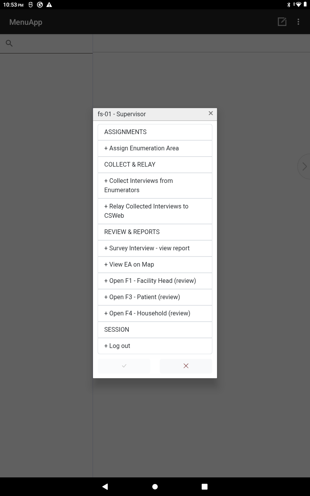
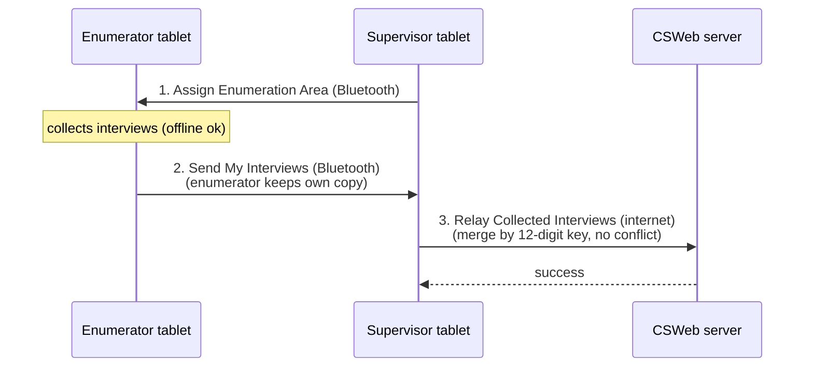
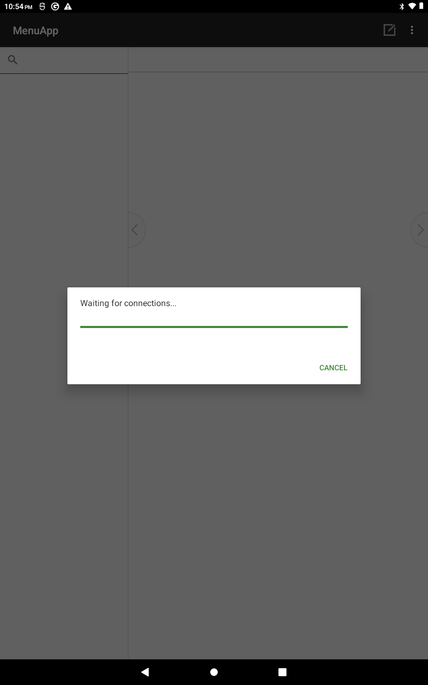

<!--
CAPI Manual — Section XIV. Supervisor-Only Features
Grounded in the deployed Supervisor & Enumerator hub: Assign Enumeration Area / Collect Interviews / Relay to CSWeb / Survey Interview view report / Open F1-F3-F4 review / View EA on Map — Bluetooth host-and-connect choreography, non-destructive, merge-by-key relay. Real menu labels used. Screenshots are placeholders.
-->

# XIV. Supervisor-Only Features

Signing in as a **supervisor** (e.g. `fs-01 — Supervisor`) opens a fuller menu. From it you **hand out enumeration areas**, **collect** finished interviews from your team over Bluetooth, **relay** them to the server, and **review coverage** — all from the one hub. The Bluetooth steps need **no internet**, which makes the supervisor the team's **offline safety net**.

> 🔁 **How work moves:** Supervisor **assigns** an EA → enumerator collects → supervisor **collects** the finished interviews → supervisor **relays** to CSWeb. Sending and collecting are **non-destructive** — the enumerator keeps their own copies; the server merges by case key, so nothing is overwritten.

> *The **supervisor** role menu (`fs-01 — Supervisor`): **ASSIGNMENTS** (Assign Enumeration Area) · **COLLECT & RELAY** (Collect Interviews from Enumerators; Relay Collected Interviews to CSWeb) · **REVIEW & REPORTS** (Survey Interview – view report; View EA on Map; Open F1/F3/F4 review) · **SESSION** (Log out).*

**The supervisor's data path:**

---

## 14.1 Assigning an enumeration area (EA)

> **Task:** Hand an enumerator their assignment over Bluetooth
> **User:** Supervisor
> **When:** At the start of fieldwork, or when reassigning.

**Steps**

1. Make sure **Bluetooth is on** for both tablets.
2. Supervisor: tap **Assign Enumeration Area** and **keep the screen open** (your tablet is now the Bluetooth host).
3. Enumerator: on their menu, tap **Receive Assigned Data** and **choose your tablet** when asked.
4. The enumerator sees their **EA, instrument, and target count**. Re-tap **Assign Enumeration Area** for the next enumerator.

**Expected result:** each enumerator has their EA and target on their tablet.

*Starting **Assign Enumeration Area** — the supervisor's tablet becomes the Bluetooth host. Tap **OK** and allow the tablet to be visible.*

*The host then shows **"Waiting for connections…"** — keep it open while each enumerator runs **Receive Assigned Data** to pull their assignment. It serves **one enumerator per connection**; re-select **Assign Enumeration Area** for the next one.*

**Common problem:** the enumerator's Bluetooth connect fails — message **"Couldn't connect over Bluetooth. Check: (1) Bluetooth is ON on BOTH tablets, and (2) the supervisor has started 'Assign Enumeration Area' — then retry."**
**What to do:** confirm **Bluetooth is on for both tablets**, and that you (the host) started **Assign Enumeration Area** *first*; then the enumerator retries.

---

## 14.2 Collecting finished interviews from the team

> **Task:** Gather completed interviews from each enumerator
> **User:** Supervisor
> **When:** End of day / when the team regroups.

**Steps**

1. Supervisor: tap **Collect Interviews from Enumerators** and keep the screen open (host).
2. Enumerator: tap **Send My Interviews to Supervisor** and choose your tablet. Their finished interviews **copy across**; **their own copies stay** on their tablet.
3. Re-tap **Collect Interviews from Enumerators** for the next enumerator.

**Expected result:** the team's interviews are gathered onto your tablet, ready to relay.

> 💡 Because collection is **non-destructive**, you can collect again later without harm.

---

## 14.3 Relaying collected interviews to CSWeb

> **Task:** Upload the collected interviews to the server
> **User:** Supervisor
> **When:** Whenever you have internet after collecting.

**Steps**

1. With a connection, tap **Relay Collected Interviews to CSWeb**.
2. Wait for it to finish.

**Expected result:** the collected F1/F3/F4 interviews are on the server. Each case carries its **12-digit key**, so the relay **never conflicts** — matching cases update in place.

> ⚠️ **The relay is the no-signal safety net.** Enumerators with a connection can sync directly (**§XIII**); the **Collect → Relay** path makes sure work from tablets that *can't* reach the server still gets in. Nothing should be stranded on a tablet at the end of a field day.

---

## 14.4 Reviewing coverage and cases

> **Task:** Check progress and spot-check quality
> **User:** Supervisor
> **When:** Daily, and before closing a site.

- **Survey Interview — view report** — a live **count of F1/F3/F4 interviews on this tablet**. For a supervisor that's what's been **collected into the hub**; for an enumerator it's their **own** interviews (and their EA target).
- **Open F1 / F3 / F4 (review)** — open a survey to **spot-check** an interview.
- **CSWeb** (web) gives the team-wide picture: the **Sync Report** (counts/coverage) and the **Map Report** (cases plotted by GPS) once interviews have relayed/synced.

> *"Survey Interview – view report" → live F1/F3/F4 counts for what's on the tablet, against the EA target.*

---

## 14.5 Maps for your area

> **Task:** See your assigned area
> **User:** Supervisor · Enumerator
> **When:** Planning/monitoring fieldwork.

- On the tablet, **View EA on Map** shows the assigned area and **works offline**.
- For the **whole team's** collected locations, use the **CSWeb Map Report** in a browser (**§VIII·3**). In-app turn-by-turn navigation / radius / best-route is **not** part of this build.

---

## 14.6 Returning cases, and closing a site

> **Task:** Handle corrections and end-of-site wrap-up
> **User:** Supervisor
> **When:** When a case needs fixing, or a site is finished.

- **Returning a case for correction:** this build has **no automated "send back"** — review the case (**§14.4**), then have the **enumerator reopen and correct it** on their own tablet (**§XII·6**) and re-send/sync.
- **Closing a site / batch:** there is no formal "close site" button. Finish a site by confirming the **coverage report** shows the expected counts, then running **Collect → Relay** (or direct sync) so everything is on the server.

> 💡 Confirm a site is truly done by checking the count in **Survey Interview — view report** (and CSWeb) against the **target** before you move the team on.

---

## Troubleshooting — Supervisor

| Symptom | Likely cause | Fix |
|---|---|---|
| "Couldn't connect over Bluetooth…" | Bluetooth off on a tablet, or host didn't start Assign/Collect first | Turn **Bluetooth on for both tablets**; host taps the item first; enumerator retries (**§14.1**). |
| Bluetooth won't connect | One side not hosting, or Bluetooth off | Confirm one tablet is the host and Bluetooth is on, on both. |
| Collected work not on server | Relay not run / no signal | Run **Relay Collected Interviews to CSWeb** with internet (**§14.3**). |
| Counts look low after relay | Reporting/dashboard lag | Normal delay on CSWeb; trust the relay/sync success (**§XIII·3**). |
| Need to fix an enumerator's case | No automated return-for-correction | Have the enumerator reopen + correct + re-send (**§14.6**). |

---

**Related sections:** §IV *Logging into CAPI* · §VI *Getting Your Assignments* · §VIII *Mapping & Navigation* · §XIII *Uploading & Syncing* · Annex *Supervisor CAPI Checklist*.
