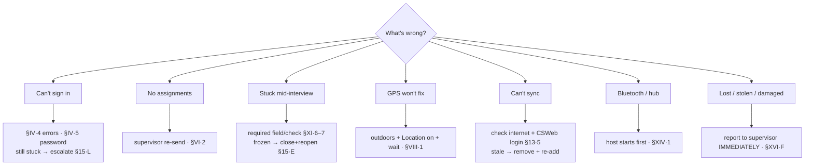

<!--
CAPI Manual — Section XV. Troubleshooting (consolidated)
Master symptom→cause→fix table pulling the per-section tables together, with escalation rules. Screenshots N/A.
-->

# XV. Troubleshooting

Most field problems fall into a handful of patterns. Find your symptom below, try the fix, and if it doesn't clear, **escalate** (**§15.L**). Each row links to the section with the full procedure.

**Start here:**

## A–K. Common problems and fixes

| # | Symptom | Likely cause | Fix |
|---|---|---|---|
| **A** | **Can't log in** — "Incorrect password." | Wrong/case-mismatched password | Re-type carefully; coordinator checks account (**§IV·4**). |
| **B** | **Forgotten password** | No self-service reset | Coordinator re-issues credentials (**§IV·5**). |
| | "Unknown username." | Build out of date / not added | Update or remove + re-add LoginApp (**§IV·7**); then coordinator (**§IV·4**). |
| | "No role found from login…" | Opened menu without LoginApp | Sign in **through LoginApp** (**§IV·4**). |
| **C** | **Missing assignments** | Not distributed / transfer incomplete | Supervisor re-sends (sheet or hub Bluetooth) (**§VI·2**). |
| **D** | **Duplicate-looking cases** | Same key started twice | Resume the existing case, don't make a second; ask supervisor (**§VII·3**). |
| **E** | **Frozen / unresponsive app** | App or device hung | Wait a moment; if still stuck, close and reopen the app — your saved work remains (**§XI·8**). If it persists, restart the tablet. |
| **F** | **Wrong date / time** | Clock not automatic | Set date/time to **automatic** (**§II·D**); interviews are timestamped. |
| **G** | **GPS won't fix / "unreported"** | Indoors / Location off / advanced too fast | Go outside, Location on, wait for a fix (**§VIII·1**). |
| **H** | **Sync failure** | No/weak internet, wrong CSWeb sign-in | Confirm connection, retry; remove + re-add if stale (**§XIII·5**). |
| **I** | **Incomplete upload** | Sync interrupted | Re-run sync (merge-by-key makes a repeat safe); keep cases on the tablet until confirmed (**§XIII**). |
| **J** | **Battery / charging** | Drained / no power at site | Start charged; carry a power bank; charge overnight (**§II·B**). |
| **K** | **Damaged or lost device** | — | Report to your supervisor **immediately** (**§15.L**, **§XVI·F**). |

## Hub / supervisor (Bluetooth) problems

| Symptom | Cause | Fix |
|---|---|---|
| "No supervisor host found" | Host didn't start Assign/Collect first | Host taps the item first, Bluetooth on; connecting side retries (**§XIV·1**). |
| Bluetooth won't connect | One side not hosting / Bluetooth off | One tablet hosts; Bluetooth on, both sides. |
| Collected work not on server | Relay not run | Supervisor runs **Relay to CSWeb** with internet (**§XIV·3**). |

## L. Escalation to CAPI / IT support

If a fix here doesn't clear the problem:

1. Note the **tool** (F1/F3/F4 / LoginApp), the **exact message**, what you were doing, and how many cases are affected.
2. **Keep affected cases on the tablet** — never delete them to "fix" a problem.
3. Contact your **supervisor / CAPI support** (**§XVII·H**). A screenshot of the message helps.

> ⚠️ **Lost or stolen tablet = report immediately**, before anything else, so access can be protected (**§XVI·F**).

---

**Related sections:** §IV *Logging in* · §XIII *Uploading & Syncing* · §XIV *Supervisor-Only Features* · §XVI *Data Security* · Annex *Troubleshooting Decision Tree*, *Support Contacts*.
