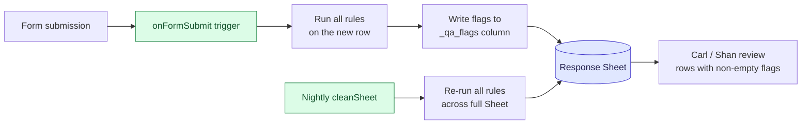
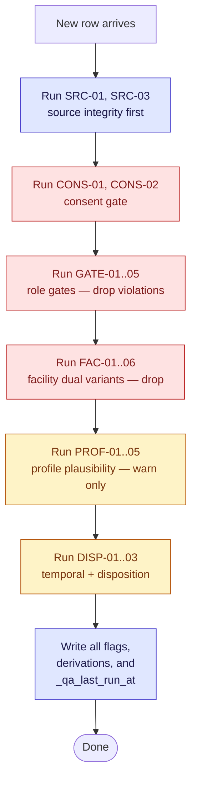

# F2 Cross-Field Consistency Rules — POST Processing

All checks below run on the **response Google Sheet**, not in the Form. Google Forms validates one field at a time; any rule that needs to see two or more fields lives here. Implementation target: Apps Script `onFormSubmit` trigger (runs once per submission) + a nightly `cleanSheet()` job that re-runs all checks across the full Sheet (for idempotency and for staff-encoded rows added after-the-fact).

## Architecture

## Flag schema

Each row in the response Sheet gets an auto-appended column `_qa_flags` containing a semicolon-separated list of rule IDs that fired. Empty = row is clean. Rules also populate a `_qa_disposition` column (see rule DISP-01).

---

## Rule inventory

### Group 1 — Profile plausibility

| ID | Rule | Severity | Source fields | Action |
|---|---|---|---|---|
| **PROF-01** | Tenure years ≤ (age − 15) | warn | Q9.years, Q4 | flag `PROF-01` if Q9.years > Q4 − 15 |
| **PROF-02** | Role vs specialty consistency — only physicians and dentists have a medical specialty | warn | Q5, Q6 | flag if Q5 ∉ {Physician/Doctor, Dentist} AND Q6 ≠ "No specialty" |
| **PROF-03** | Q11 hours/day full-time derivation | info | Q11 | derive `employment_class` = `full-time` if Q11 ≥ 8, `part-time` otherwise; write to `_derived_employment_class` column |
| **PROF-04** | Q10 days/week × Q11 hours/day sanity | warn | Q10, Q11 | flag if Q10 × Q11 > 80 (weekly hours implausible) |
| **PROF-05** | Q8 private/public mix only makes sense for public-facility respondents who also practice privately | warn | Q7, Q8, facility_type | flag if Q8 is filled AND (Q7 = No OR facility_type = Private facility) |

### Group 2 — Section gate integrity

| ID | Rule | Severity | Source fields | Action |
|---|---|---|---|---|
| **GATE-01** | Q55 audience filter — non-doctors/dentists should not have answered Q55 | clean | Q5, Q55 | if Q5 ∉ {Physician/Doctor, Dentist} AND Q55 is filled, **drop** Q55 value and flag `GATE-01-dropped` |
| **GATE-02** | Section G audience filter — non-doctors/dentists should not have answered Q56–Q80 | clean | Q5, Q56..Q80 | if Q5 ∉ {Physician/Doctor, Dentist} AND any Q56..Q80 is filled, **drop** those values and flag `GATE-02-dropped` |
| **GATE-03** | BUCAS gate — Q43–Q45 should only be filled if `facility_has_bucas=Yes` AND Q5 ∈ BUCKET-CD | clean | facility_has_bucas, Q5, Q43..Q45 | drop + flag `GATE-03-dropped` on violation |
| **GATE-04** | GAMOT gate — Q46–Q48 should only be filled if `facility_has_gamot=Yes` AND Q5 ∈ BUCKET-CD ∪ BUCKET-PHARM | clean | facility_has_gamot, Q5, Q46..Q48 | drop + flag `GATE-04-dropped` on violation |
| **GATE-05** | C/D role gate — Q27–Q42 should only be filled if Q5 ∈ BUCKET-CD | clean | Q5, Q27..Q42 | drop + flag `GATE-05-dropped` on violation |

### Group 3 — Facility-type dual variants

| ID | Rule | Severity | Source fields | Action |
|---|---|---|---|---|
| **FAC-01** | Q62 ZBB only for DOH-retained | clean | facility_type, Q62 | drop Q62 if facility_type ≠ DOH-retained, flag `FAC-01-dropped` |
| **FAC-02** | Q62.1 NBB only for public non-DOH-retained OR DOH-retained | clean | facility_type, Q62.1 | drop Q62.1 if facility_type ∉ {DOH-retained, Public non-DOH-retained}, flag `FAC-02-dropped` |
| **FAC-03** | Q67 ZBB scale only for DOH-retained | clean | facility_type, Q67 | drop + flag |
| **FAC-04** | Q67.1 NBB scale only for public non-DOH-retained OR DOH-retained | clean | facility_type, Q67.1 | drop + flag |
| **FAC-05** | Q78 ZBB only for DOH-retained | clean | facility_type, Q78 | drop + flag |
| **FAC-06** | Q78.1 NBB only for public non-DOH-retained OR DOH-retained | clean | facility_type, Q78.1 | drop + flag |
| **FAC-07** | DOH-retained respondents should have answered BOTH Q62 and Q62.1 (and Q67/Q67.1, Q78/Q78.1) | warn | facility_type, Q62/Q62.1/Q67/Q67.1/Q78/Q78.1 | flag missing duals on DOH-retained rows |

### Group 4 — Temporal + disposition

| ID | Rule | Severity | Source fields | Action |
|---|---|---|---|---|
| **DISP-01** | Compute `_qa_disposition` from timestamps + consent | info | submission_started_at, submission_completed_at, consent | `completed` (submitted + consent=Yes) · `declined` (consent=No) · `partial` (opened but not submitted within 3-day window) · `no_response` (link never opened, derived nightly from facility roster vs response Sheet) |
| **DISP-02** | Within-window submission check | warn | submission_started_at, submission_completed_at | flag if (completed − started) > 72h (exceeded 3-day window — shouldn't happen if Form closes on time but catches edge cases) |
| **DISP-03** | Rapid-submission check | warn | submission_started_at, submission_completed_at | flag if (completed − started) < 5 min (suspiciously fast — possible bot or copy-paste) |

### Group 5 — Response source integrity

| ID | Rule | Severity | Source fields | Action |
|---|---|---|---|---|
| **SRC-01** | `response_source=self` rows must have a respondent_email from Google sign-in | error | response_source, respondent_email | flag if source=self and email blank |
| **SRC-02** | `response_source=staff_encoded` rows must have a staff encoder identity in respondent_email | info | response_source, respondent_email | no action — informational |
| **SRC-03** | Duplicate response check — same facility_id + respondent_email should appear at most once | warn | facility_id, respondent_email | flag all duplicates for manual review |

### Group 6 — Consent audit

| ID | Rule | Severity | Source fields | Action |
|---|---|---|---|---|
| **CONS-01** | Consent=Yes is a required gate — if somehow missing, flag and drop all body answers | error | consent, Q1..Q114 | should never fire (Form requires consent); defensive check |
| **CONS-02** | Consent=No should have NO body answers | clean | consent, Q1..Q114 | drop any body answers on declined responses, flag `CONS-02-dropped` |

---

## Implementation notes

### Severity levels

- **error** — row is broken, needs manual fix before analysis
- **warn** — row is usable but suspicious, surface on review dashboard
- **clean** — auto-cleaned by dropping values, no manual action
- **info** — informational only, populates derived columns

### Sheet columns added by POST

| Column | Populated by | Meaning |
|---|---|---|
| `_qa_flags` | all rules | semicolon-separated rule IDs that fired |
| `_qa_disposition` | DISP-01 | completed · partial · declined · no_response |
| `_derived_employment_class` | PROF-03 | full-time · part-time |
| `_dropped_fields` | GATE-01..05, FAC-01..06, CONS-02 | comma-separated field names whose values were dropped |
| `_qa_last_run_at` | nightly cleaner | ISO timestamp |

### Review workflow

1. **Carl** runs a filter `_qa_flags IS NOT EMPTY` weekly; investigates each flagged row.
2. **Shan (QA)** runs the same filter during testing to verify no rules mis-fire on clean test data.
3. **ASPSI field coordinator** reviews `_qa_disposition=no_response` nightly to schedule reminders.

### Order of execution

Drop-style rules run first (clean the row), then plausibility checks (warn on remaining content), then temporal derivation. This ordering ensures a PROF warning isn't raised on data that was already dropped as a GATE violation.

---

## Open items

1. **FAC-07 DOH-retained duals** — confirm with ASPSI whether DOH-retained respondents should see BOTH Q62 and Q62.1 (the skip-logic doc assumes yes). If ASPSI says only one, flip FAC-07 from warn to drop-second.
2. **DISP-03 rapid-submission threshold** — 5 minutes is a guess. Shan's dry-run will give us a real baseline for what "too fast" means on 114 items.
3. **SRC-03 duplicate definition** — if a HCW can legitimately update their response (Google Forms allows edit-on-resubmit for signed-in users), then the "latest wins" logic needs to replace the flag-all-duplicates logic. Confirm with ASPSI.
