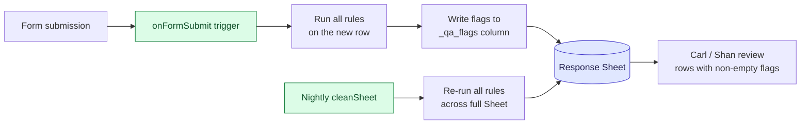
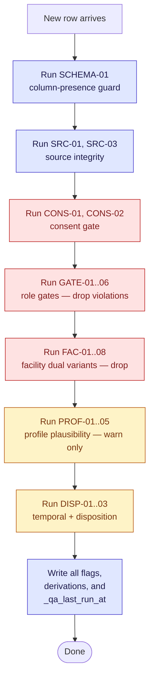

# F2 Cross-Field Consistency Rules — POST Processing

All checks below run on the **response Google Sheet**, not in the Form. Google Forms validates one field at a time; any rule that needs to see two or more fields lives here. Implementation target: Apps Script `onFormSubmit` trigger (runs once per submission) + a nightly `cleanSheet()` job that re-runs all checks across the full Sheet (for idempotency and for staff-encoded rows added after-the-fact).

Sourced from the **April 20, 2026 PDF** (124 actual items, numbered Q1–Q125 with Q108 as a PDF numbering gap). Supersedes the April 8 PDF (114 items) draft.

## Architecture

## Flag schema

Each row in the response Sheet gets an auto-appended column `_qa_flags` containing a semicolon-separated list of rule IDs that fired. Empty = row is clean. Rules also populate a `_qa_disposition` column (see rule DISP-01).

---

## Rule inventory

### Group 1 — Profile plausibility

| ID | Rule | Severity | Source fields | Action |
|---|---|---|---|---|
| **PROF-01** | Tenure years ≤ (age − 15) | warn | Q9.years, Q4 | flag `PROF-01` if Q9.years > Q4 − 15 |
| **PROF-02** | Role vs specialty consistency — only physicians and dentists have a medical specialty | warn | Q5, Q6 | flag if Q5 ∉ {Physician/Doctor, Dentist} AND Q6 ≠ "No specialty" |
| **PROF-03** | Q11 hours/day full-time derivation | info | Q11 | derive `employment_class` = `full-time` if Q11 ≥ 8, `part-time` otherwise; write to `_derived_employment_class` column |
| **PROF-04** | Q10 days/week × Q11 hours/day sanity | warn | Q10, Q11 | flag if Q10 × Q11 > 80 (weekly hours implausible) |
| **PROF-05** | Q8 private/public mix only makes sense for public-facility respondents who also practice privately | warn | Q7, Q8, facility_type | flag if Q8 is filled AND (Q7 = No OR facility_type = Private facility) |

### Group 2 — Section gate integrity

| ID | Rule | Severity | Source fields | Action |
|---|---|---|---|---|
| **GATE-01** | Q62 audience filter — non-doctors/dentists should not have answered Q62 (dissatisfaction reason, intended for physicians/dentists per Apr 20 spec) | clean | Q5, Q62 | if Q5 ∉ {Physician/Doctor, Dentist} AND Q62 is filled, **drop** Q62 value and flag `GATE-01-dropped`. Flag to ASPSI: confirm whether non-doctors dissatisfied with referrals should keep Q62. |
| **GATE-02** | Section G audience filter — non-doctors/dentists should not have answered Q63–Q90 | clean | Q5, Q63..Q90 | if Q5 ∉ {Physician/Doctor, Dentist} AND any Q63..Q90 is filled, **drop** those values and flag `GATE-02-dropped` |
| **GATE-03** | BUCAS gate — Q48–Q52 should only be filled if `facility_has_bucas=Yes` AND Q5 ∈ BUCKET-CD | clean | facility_has_bucas, Q5, Q48..Q52 | drop + flag `GATE-03-dropped` on violation |
| **GATE-04** | GAMOT gate — Q53–Q55 should only be filled if `facility_has_gamot=Yes` AND Q5 ∈ BUCKET-CD ∪ BUCKET-PHARM | clean | facility_has_gamot, Q5, Q53..Q55 | drop + flag `GATE-04-dropped` on violation |
| **GATE-05** | C/D role gate — Q31–Q47 should only be filled if Q5 ∈ BUCKET-CD | clean | Q5, Q31..Q47 | drop + flag `GATE-05-dropped` on violation |
| **GATE-06** | Q25 × Q26–Q30 integrity (Apr 20 new) — Q25 is a multi-select filter for which domains respondent expects to change; Q26–Q30 are grid rows asking direction per domain. Forms cannot gate grid rows on multi-select values. | warn | Q25, Q26..Q30 | for each of Q26–Q30, flag `GATE-06-Q2N` if corresponding Q25 domain option was **not** selected AND the Q2N row answer is a directional value (not "I don't know"). Suggests respondent expects change in a domain they didn't flag in Q25. Alternative: if Q25 option *was* selected AND Q2N = "I don't know", flag `GATE-06-Q2N-inconsistent` for review. |

### Group 3 — Facility-type dual variants (Apr 20: three ZBB/NBB triples)

Apr 20 expanded the ZBB-only branches to ZBB + NBB siblings. The visibility matrix is fixed by facility_type re-confirmation at three router points (SEC-G3, SEC-G-scales, SEC-G-Q87). Each rule below enforces the matrix on the response row.

| ID | Rule | Severity | Source fields | Action |
|---|---|---|---|---|
| **FAC-01** | Q69 ZBB implications only for DOH-retained | clean | facility_type, Q69 | drop Q69 if facility_type ≠ DOH-retained, flag `FAC-01-dropped` |
| **FAC-02** | Q70 NBB implications only for DOH-retained OR Public non-DOH-retained | clean | facility_type, Q70 | drop Q70 if facility_type ∉ {DOH-retained, Public non-DOH-retained}, flag `FAC-02-dropped` |
| **FAC-03** | Q75 ZBB fairness scale only for DOH-retained | clean | facility_type, Q75 | drop + flag |
| **FAC-04** | Q76 NBB fairness scale only for DOH-retained OR Public non-DOH-retained | clean | facility_type, Q76 | drop + flag |
| **FAC-05** | Q87 ZBB balance billing only for DOH-retained | clean | facility_type, Q87 | drop + flag |
| **FAC-06** | Q88 NBB balance billing only for DOH-retained OR Public non-DOH-retained | clean | facility_type, Q88 | drop + flag |
| **FAC-07** | DOH-retained respondents should have answered BOTH Q69 and Q70 (and Q75/Q76, Q87/Q88) — three dual-answer checks | warn | facility_type, Q69/Q70/Q75/Q76/Q87/Q88 | flag missing duals on DOH-retained rows. One flag per missing pair: `FAC-07-Q69Q70`, `FAC-07-Q75Q76`, `FAC-07-Q87Q88`. |
| **FAC-08** | Q89 situations only if Q87=Yes OR Q88=Yes | clean | Q87, Q88, Q89 | drop Q89 if neither Q87 nor Q88 is Yes, flag `FAC-08-dropped` |

### Group 4 — Temporal + disposition

| ID | Rule | Severity | Source fields | Action |
|---|---|---|---|---|
| **DISP-01** | Compute `_qa_disposition` from timestamps + consent | info | submission_started_at, submission_completed_at, consent | `completed` (submitted + consent=Yes) · `declined` (consent=No) · `partial` (opened but not submitted within 3-day window) · `no_response` (link never opened, derived nightly from facility roster vs response Sheet) |
| **DISP-02** | Within-window submission check | warn | submission_started_at, submission_completed_at | flag if (completed − started) > 72h (exceeded 3-day window — shouldn't happen if Form closes on time but catches edge cases) |
| **DISP-03** | Rapid-submission check | warn | submission_started_at, submission_completed_at | flag if (completed − started) < 7 min (suspiciously fast for a 124-item instrument — possible bot or copy-paste). Threshold raised from 5 min (Apr 08 draft) to reflect +10 items in Apr 20. Shan's dry-run will confirm the real baseline. |

### Group 5 — Response source integrity

| ID | Rule | Severity | Source fields | Action |
|---|---|---|---|---|
| **SRC-01** | `response_source=self` rows must have a respondent_email from Google sign-in | error | response_source, respondent_email | flag if source=self and email blank |
| **SRC-02** | `response_source=staff_encoded` rows must have a staff encoder identity in respondent_email | info | response_source, respondent_email | no action — informational |
| **SRC-03** | Duplicate response check — same facility_id + respondent_email should appear at most once | warn | facility_id, respondent_email | flag all duplicates for manual review |

### Group 6 — Consent audit

| ID | Rule | Severity | Source fields | Action |
|---|---|---|---|---|
| **CONS-01** | Consent=Yes is a required gate — if somehow missing, flag and drop all body answers | error | consent, Q1..Q125 (Q108 omitted) | should never fire (Form requires consent); defensive check |
| **CONS-02** | Consent=No should have NO body answers | clean | consent, Q1..Q125 (Q108 omitted) | drop any body answers on declined responses, flag `CONS-02-dropped` |

### Group 7 — Schema guard (Apr 20)

| ID | Rule | Severity | Source fields | Action |
|---|---|---|---|---|
| **SCHEMA-01** | Q108 column-presence guard | error | response Sheet header row | if a column named `Q108` or matching Apr 20 Q108 slot appears in the response Sheet, flag `SCHEMA-01` and halt cleaner. Q108 is a PDF numbering gap — no item exists at that slot. Presence of a Q108 column means the builder emitted a phantom field. |

---

## Implementation notes

### Severity levels

- **error** — row is broken, needs manual fix before analysis
- **warn** — row is usable but suspicious, surface on review dashboard
- **clean** — auto-cleaned by dropping values, no manual action
- **info** — informational only, populates derived columns

### Sheet columns added by POST

| Column | Populated by | Meaning |
|---|---|---|
| `_qa_flags` | all rules | semicolon-separated rule IDs that fired |
| `_qa_disposition` | DISP-01 | completed · partial · declined · no_response |
| `_derived_employment_class` | PROF-03 | full-time · part-time |
| `_dropped_fields` | GATE-01..06, FAC-01..08, CONS-02 | comma-separated field names whose values were dropped |
| `_qa_last_run_at` | nightly cleaner | ISO timestamp |

### Review workflow

1. **Carl** runs a filter `_qa_flags IS NOT EMPTY` weekly; investigates each flagged row.
2. **Shan (QA)** runs the same filter during testing to verify no rules mis-fire on clean test data.
3. **ASPSI field coordinator** reviews `_qa_disposition=no_response` nightly to schedule reminders.

### Order of execution

Schema guard runs first — if a phantom Q108 column is present, halt before any row-level work. Drop-style rules run next (clean the row), then plausibility checks (warn on remaining content), then temporal derivation. This ordering ensures a PROF warning isn't raised on data that was already dropped as a GATE violation.

---

## Apr 08 → Apr 20 rule delta (summary)

| Change | Apr 08 rule | Apr 20 rule | Reason |
|---|---|---|---|
| Renumber | GATE-01 Q55 → drop | GATE-01 Q62 → drop | Q62 is Apr 20 dissatisfaction-reason; was Q55 in Apr 08 |
| Renumber | GATE-02 Q56..Q80 → drop | GATE-02 Q63..Q90 → drop | Section G Apr 20 range is Q63–Q90 |
| Renumber | GATE-03 Q43..Q45 → drop | GATE-03 Q48..Q52 → drop | BUCAS range grew from 3 to 5 items (Q50, Q51 new) |
| Renumber | GATE-04 Q46..Q48 → drop | GATE-04 Q53..Q55 → drop | GAMOT shifted by +5 |
| Renumber | GATE-05 Q27..Q42 → drop | GATE-05 Q31..Q47 → drop | C+D range; +4 shift + Q47 new item |
| **Add** | — | **GATE-06** Q25 × Q26–Q30 integrity | Apr 20 introduces Q25 multi-select filter not present in Apr 08 |
| Renumber | FAC-01 Q62 ZBB | FAC-01 Q69 ZBB | Apr 20 Q69 is the ZBB implications item |
| Renumber | FAC-02 Q62.1 NBB | FAC-02 Q70 NBB | Apr 20 Q70 is a proper NBB sibling (NEW — Apr 08 called it Q62.1 as a split artifact) |
| Renumber | FAC-03 Q67 ZBB scale | FAC-03 Q75 ZBB scale | +8 shift |
| Renumber | FAC-04 Q67.1 NBB scale | FAC-04 Q76 NBB scale | Apr 20 Q76 is proper NBB sibling (NEW) |
| Renumber | FAC-05 Q78 ZBB | FAC-05 Q87 ZBB | +9 shift |
| Renumber | FAC-06 Q78.1 NBB | FAC-06 Q88 NBB | Apr 20 Q88 is proper NBB sibling (NEW) |
| Renumber | FAC-07 DOH-retained duals | FAC-07 DOH-retained triples (three dual-answer checks) | Same semantics, three pairs instead of three .1 variants |
| **Add** | — | **FAC-08** Q89 situations gate | Explicit check that Q89 only fills when Q87=Yes OR Q88=Yes |
| Raise threshold | DISP-03 < 5 min | DISP-03 < 7 min | +10 items (114 → 124) makes 5 min unrealistically fast |
| Renumber | CONS-01/02 Q1..Q114 | CONS-01/02 Q1..Q125 (Q108 omitted) | 124 actual items |
| **Add** | — | **SCHEMA-01** Q108 column guard | Apr 20 PDF has numbering gap at Q108 — builder must not emit that column |

---

## Open items

1. **FAC-07 DOH-retained triples** — confirm with ASPSI whether DOH-retained respondents should see BOTH ZBB and NBB variants for all three pairs (Q69/Q70, Q75/Q76, Q87/Q88). Apr 20 skip-logic assumes yes. If ASPSI says NBB only (or ZBB only), flip FAC-07 from warn to drop-second.
2. **GATE-01 Q62 audience** — confirm whether non-doctor dissatisfied respondents' Q62 answers should be kept (simpler form graph) or dropped (requires this rule to fire as `clean` not `warn`).
3. **GATE-06 Q25 × Q26–Q30 directionality** — confirm whether the rule should flag *both* directions (respondent changed what they didn't flag AND flagged what they said "I don't know" about) or only one. Current default: both, as separate flags.
4. **DISP-03 rapid-submission threshold** — 7 minutes is a guess. Shan's dry-run will give us a real baseline for what "too fast" means on a 124-item instrument.
5. **SRC-03 duplicate definition** — if a HCW can legitimately update their response (Google Forms allows edit-on-resubmit for signed-in users), then the "latest wins" logic needs to replace the flag-all-duplicates logic. Confirm with ASPSI.
6. **SCHEMA-01 Q108 enforcement** — confirm with ASPSI that Q108 is a pure numbering artifact and no future revision will slot an item in. If it may be filled in a later PDF rev, downgrade SCHEMA-01 from error to info.
