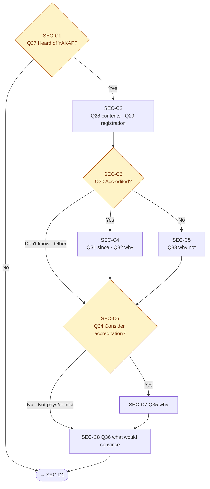
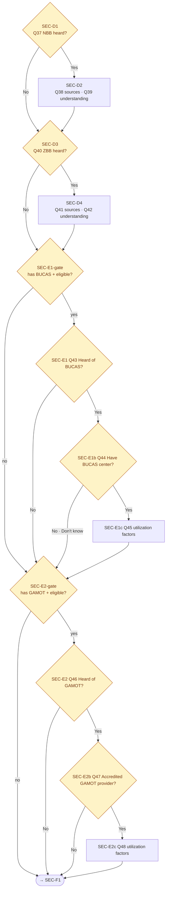
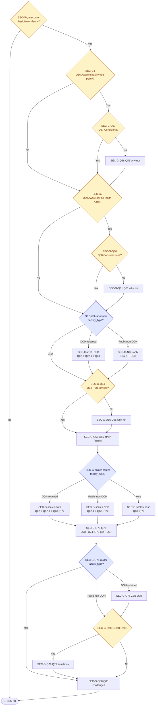
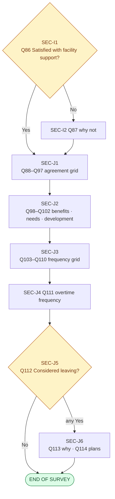

# F2 Skip Logic — Google Forms Section Graph

Translates the paper F2 skip logic (per-question `<proceed to QNN>` markers) into a Google Forms **section-based branching** graph. Google Forms supports exactly one routing mechanism: *"After section, go to section based on answer"* on a single-choice question at the end of a section. Any logic that does not fit that shape must either (a) be restructured by splitting questions across sections, (b) be pushed to **POST** processing on the response Sheet, or (c) be dropped with a note to ASPSI.

This document is the direct input to `E3-F2-GF-002` (spec→Form builder Apps Script) and `E3-F2-GF-003` (section skip wiring).

## Inputs

- **F2-Spec.md** — the 114-item verbatim body spec. All `SECTION` / `SPLIT` / `POST` flags below reference that file.
- **F2-0 Tooling & Access Model Decision Memo** — confirms facility master list will pre-fill `facility_type`, `facility_has_bucas`, `facility_has_gamot`, `facility_id`, and PSGC geography. This is load-bearing for the facility-type splits in Sections G/J.

## Google Forms routing primitives (reference)

| Primitive | Supported? | Notes |
|---|---|---|
| Go to section X after this section | ✅ | Unconditional |
| Go to section based on answer (single-choice Q) | ✅ | Answer-level mapping; each choice can point to a different section |
| Go to section based on multi-choice answer | ❌ | Forms does not route on checkbox answers — must be a single-choice question |
| Submit form (end early) | ✅ | One of the routing targets |
| Branch on pre-filled hidden field | ❌ | All routing drivers must be *visible* single-choice questions |
| Cross-field conditional validation | ❌ | Forms validates one field at a time — cross-field logic moves to POST |
| Required-if-other-answer | ❌ | Forms required is static; use section splitting to simulate "conditional required" |

**Implication:** every branching decision in the paper PDF must be reducible to a single-choice question answered *in the form*. Pre-filled values from the URL (facility type, BUCAS, GAMOT) must be re-asked as visible confirmation questions — the respondent just verifies what was auto-filled. Those confirmation questions are the branch drivers.

## Pre-filled fields that drive branching

| Field | Source | Visible? | Role |
|---|---|---|---|
| `facility_id` | URL param from master list | read-only display | audit only |
| `facility_type` | URL param → rendered as single-choice Q (pre-selected) | **visible** | drives ZBB/NBB splits, Q8 public/private branch |
| `facility_has_bucas` | URL param → single-choice Q (pre-selected) | **visible** | drives Section E1 entry |
| `facility_has_gamot` | URL param → single-choice Q (pre-selected) | **visible** | drives Section E2 entry |
| `response_source` | URL param | hidden (captured server-side) | not used for routing |

**`facility_type` choice values** (locked for routing stability):

- `DOH-retained hospital`
- `Public hospital (non-DOH-retained)`
- `Private facility`
- `RHU / Health center`
- `Other public facility`

The ZBB path activates only for `DOH-retained hospital`. The NBB path activates for `DOH-retained hospital` + `Public hospital (non-DOH-retained)`. (DOH-retained respondents see **both** ZBB and NBB variants per the PDF.)

---

## Section graph (visual)

> **Diagram format note.** These are Mermaid flowcharts — they render natively in Obsidian, GitHub, VS Code, and most modern Markdown viewers. They're version-controlled as text (diffable in git) and live in the same file as the routing table so they stay in sync. If you'd rather have a hand-drawn Excalidraw version for a whiteboard session, ask and I can export one from these via the Excalidraw MCP.
>
> The six diagrams below divide the graph into readable chunks. The **Overview** shows every section at block level; the five detail diagrams zoom into specific regions. A full textual fallback (ASCII tree) follows in the next subsection.

### Diagram 1 — Overview (all sections at block level)

```mermaid
flowchart TD
    S0[SEC-0<br/>Cover · Consent · Facility confirm] --> A[SEC-A1–A5<br/>Profile Q1–Q11]
    A --> B1{SEC-B1<br/>Q12 Heard of UHC?}
    B1 -->|Yes| B2[SEC-B2–B3<br/>UHC changes Q13–Q26]
    B1 -->|No| C0{SEC-C0<br/>Role-bucket router}
    B2 --> C0
    C0 -->|BUCKET-CD| C[SEC-C1–C8<br/>YAKAP Q27–Q36]
    C0 -->|BUCKET-PHARM| E2g{SEC-E2-gate}
    C0 -->|BUCKET-OTHER| F1[SEC-F1<br/>Referrals Q49–Q53]
    C --> D[SEC-D1–D4<br/>NBB/ZBB Q37–Q42]
    D --> E1g{SEC-E1-gate<br/>has BUCAS?}
    E1g -->|yes + eligible| E1[SEC-E1<br/>BUCAS Q43–Q45]
    E1g -->|no| E2g
    E1 --> E2g
    E2g -->|yes + eligible| E2[SEC-E2<br/>GAMOT Q46–Q48]
    E2g -->|no| F1
    E2 --> F1
    F1 --> F2{SEC-F2<br/>Q54 Satisfaction}
    F2 -->|Dissatisfied| F3[SEC-F3 Q55]
    F2 -->|Satisfied/Neutral| GR{SEC-G-gate-router}
    F3 --> GR
    GR -->|physician/dentist| G[Section G<br/>Q56–Q80]
    GR -->|else| H[SEC-H1<br/>Task sharing Q81–Q85]
    G --> H
    H --> I1{SEC-I1<br/>Q86 Satisfied?}
    I1 -->|Yes| J[SEC-J1–J4<br/>Job sat Q88–Q111]
    I1 -->|No| I2[SEC-I2 Q87] --> J
    J --> J5{SEC-J5<br/>Q112 Leaving?}
    J5 -->|any Yes| J6[SEC-J6<br/>Q113–Q114]
    J5 -->|No| SUB([SUBMIT])
    J6 --> SUB

    classDef gate fill:#fef3c7,stroke:#b45309,color:#78350f
    classDef terminal fill:#dcfce7,stroke:#15803d,color:#14532d
    class B1,C0,E1g,E2g,F2,GR,I1,J5 gate
    class SUB terminal
```



### Diagram 2 — Section A detail (Profile)


### Diagram 3 — Section C (YAKAP/Konsulta)



### Diagram 4 — Sections D + E (NBB/ZBB awareness, BUCAS, GAMOT)



### Diagram 5 — Section G (KAP on fees — facility-type splits, most complex)



> **Legend:** yellow diamonds = single-choice driver questions (respondent answers); blue diamonds = facility-type routers (driven by pre-filled `facility_type` re-confirmation). Each blue router is one extra visible "confirm facility type" question — the graph re-asks it at three points (SEC-G3, SEC-G-scales, SEC-G-Q78) because Forms has no cross-section memory.

### Diagram 6 — Sections I + J terminal



---

## Section graph (textual fallback — ASCII tree)

```
SEC-0  Cover + consent + facility confirmation
  │
  ▼
SEC-A1 Profile (Q1–Q4)
  │
  ▼
SEC-A2 Role (Q5) ──┬──► SEC-A3 Physician/Dentist specialty + private (Q6, Q7)
                   │       │
                   │       ├── Q7=Yes & public facility ──► SEC-A4 Practice mix (Q8)
                   │       └── else ────────────────────────► SEC-A5
                   │
                   └── non-doctor ────────────────────────► SEC-A5

SEC-A5 Tenure & hours (Q9–Q11)
  │
  ▼
SEC-B1 UHC awareness gate (Q12)
  │
  ├── Q12=No ──────────────────────────────────────────────► SEC-C0 (role gate)
  │
  ▼
SEC-B2 UHC change battery (Q13–Q21)
  │
  ▼
SEC-B3 UHC change grid (Q22–Q26)
  │
  ▼
SEC-C0 Role gate router
  │
  ├── eligible for C/D (admin/doctor/nurse/midwife/dentist/nutritionist) ──► SEC-C1
  ├── pharmacist / dispenser ─────────────────────────────────────────────► SEC-E2-gate
  └── other roles ────────────────────────────────────────────────────────► SEC-F1

SEC-C1 YAKAP awareness (Q27) ─── No ──► SEC-D1
  │ Yes
  ▼
SEC-C2 YAKAP content (Q28–Q29)
  │
  ▼
SEC-C3 Accredited? (Q30)
  │
  ├── Yes ──────────────────► SEC-C4 (Q31, Q32) ──► SEC-C6
  ├── No ───────────────────► SEC-C5 (Q33) ──────► SEC-C6
  └── Don't know / Other ──► SEC-C6

SEC-C6 Consideration (Q34)
  │
  ├── Yes ──► SEC-C7 (Q35) ──► SEC-C8 (Q36) ──► SEC-D1
  ├── No ───────────────────► SEC-C8 (Q36) ──► SEC-D1
  └── Not physician/dentist ► SEC-C8 (Q36) ──► SEC-D1

SEC-D1 NBB heard? (Q37) ─── No ──► SEC-D3
  │ Yes
  ▼
SEC-D2 NBB sources + understanding (Q38–Q39)
  │
  ▼
SEC-D3 ZBB heard? (Q40) ─── No ──► SEC-E1-gate
  │ Yes
  ▼
SEC-D4 ZBB sources + understanding (Q41–Q42)
  │
  ▼
SEC-E1-gate  (facility_has_bucas? + role?)
  │
  ├── has BUCAS + eligible role ──► SEC-E1 (Q43–Q45)
  ├── pharmacist (any facility) ──► SEC-E2-gate
  └── else ───────────────────────► SEC-F1

SEC-E1 BUCAS awareness (Q43) ──── No ──► SEC-E2-gate
  │ Yes
  ▼
SEC-E1b (Q44) ── No / Don't know ──► SEC-E2-gate
  │ Yes
  ▼
SEC-E1c (Q45) ──► SEC-E2-gate

SEC-E2-gate  (facility_has_gamot? + role?)
  │
  ├── has GAMOT + eligible role (incl. pharmacists) ──► SEC-E2
  └── else ────────────────────────────────────────────► SEC-F1

SEC-E2 GAMOT awareness (Q46) ─── No ──► SEC-F1
  │ Yes
  ▼
SEC-E2b (Q47) ─── No ──► SEC-F1
  │ Yes
  ▼
SEC-E2c (Q48) ──► SEC-F1

SEC-F1 Referrals outbound (Q49–Q53)
  │
  ▼
SEC-F2 Satisfaction (Q54)
  │
  ├── Satisfied/Very Sat./Neutral ──► SEC-G-gate-router
  └── Dissatisfied/Very Dissat. ────► SEC-F3 (Q55) ──► SEC-G-gate-router

SEC-G-gate-router  (role?)
  │
  ├── physician/dentist ──► SEC-G1
  └── else ────────────────► SEC-H1

SEC-G1 Facility fee policy (Q56) ── No ──► SEC-G2 (Q59 direct)
  │ Yes
  ▼
SEC-G-Q57 (Q57) ── Yes ──► SEC-G2 (Q59 direct)
  │ No
  ▼
SEC-G-Q58 (Q58) ──► SEC-G2

SEC-G2 PhilHealth rules (Q59)
  │
  ├── Yes ──► SEC-G-Q60 (Q60)
  │           │
  │           ├── Yes ──► SEC-G3-fac-router
  │           └── No ───► SEC-G-Q61 (Q61) ──► SEC-G3-fac-router
  │
  └── No ───► SEC-G3-fac-router

SEC-G3-fac-router  (facility_type?)
  │
  ├── DOH-retained hospital ─────────────► SEC-G-ZBB+NBB (Q62 + Q62.1 + Q63)
  ├── Public hospital (non-DOH-ret.) ────► SEC-G-NBB-only (Q62.1 + Q63)
  └── Private / RHU / Other ─────────────► SEC-G-Q64

SEC-G-ZBB+NBB / SEC-G-NBB-only ──► SEC-G-Q64

SEC-G-Q64 RVU familiarity (Q64)
  │
  ├── Yes ──► SEC-G-Q66
  └── No ───► SEC-G-Q65 (Q65) ──► SEC-G-Q66

SEC-G-Q66 Other factors (Q66)
  │
  ▼
SEC-G-scales-router (facility_type?)
  │
  ├── DOH-retained ───────► SEC-G-scales-both (Q67 + Q67.1 + Q68–Q72)
  ├── Public non-DOH-ret. ► SEC-G-scales-NBB  (Q67.1 + Q68–Q72)
  └── Private / RHU / Other ► SEC-G-scales-base (Q68–Q72)

SEC-G-scales-* ──► SEC-G-Q73-Q77 (Q73, Q74–Q76 grid, Q77)
  │
  ▼
SEC-G-Q78-router  (facility_type?)
  │
  ├── DOH-retained ───────► SEC-G-Q78 (ZBB version)
  │                           │
  │                           ├── Yes ──► SEC-G-Q78.1 (NBB version)
  │                           │             │
  │                           │             ├── Yes ──► SEC-G-Q79 ──► SEC-G-Q80
  │                           │             └── No ───────────────► SEC-G-Q80
  │                           └── No ───► SEC-G-Q78.1
  │                                         ├── Yes ──► SEC-G-Q79 ──► SEC-G-Q80
  │                                         └── No ───────────────► SEC-G-Q80
  │
  ├── Public non-DOH-ret. ─► SEC-G-Q78.1 (NBB version only)
  │                           ├── Yes ──► SEC-G-Q79 ──► SEC-G-Q80
  │                           └── No ───────────────► SEC-G-Q80
  │
  └── other ──────────────► SEC-G-Q80  (skip Q78–Q79 entirely)

SEC-G-Q80 Challenges (Q80)
  │
  ▼
SEC-H1 Task sharing (Q81–Q85)
  │
  ▼
SEC-I1 Facility support (Q86)
  │
  ├── Yes ──► SEC-J1
  └── No ───► SEC-I2 (Q87) ──► SEC-J1

SEC-J1 Grid #1 agreement (Q88–Q97)
  │
  ▼
SEC-J2 Open items (Q98–Q102)
  │
  ▼
SEC-J3 Grid #2 frequency (Q103–Q110)
  │
  ▼
SEC-J4 Overtime freq (Q111)
  │
  ▼
SEC-J5 Leaving? (Q112)
  │
  ├── any Yes ──► SEC-J6 (Q113, Q114) ──► SUBMIT
  └── No ─────────────────────────────► SUBMIT
```

---

## Section routing table (normalised)

Every row below becomes one Apps Script `setGoToSectionBasedOnAnswer()` call in `E3-F2-GF-003`.

| Driver Section | Driver Q | Answer | Target Section |
|---|---|---|---|
| SEC-A2 | Q5 | Administrator · Physician/Doctor · Nurse · Midwife · Dentist · Nutrition action officer/coordinator | SEC-A3 |
| SEC-A2 | Q5 | Pharmacist/Dispenser · Physician assistant · Nursing assistant · Laboratory technician · Medical/radiologic technologist · Health promotion officer · Physical Therapist · Dentist aide · Barangay Health Worker · Other | SEC-A5 |
| SEC-A3 | Q7 | Yes (+ facility_type ∈ {Public, DOH-retained, RHU, Other public}) | SEC-A4 |
| SEC-A3 | Q7 | Yes (+ facility_type = Private) · No | SEC-A5 |
| SEC-B1 | Q12 | Yes | SEC-B2 |
| SEC-B1 | Q12 | No | SEC-C0 |
| SEC-C0 | facility_type × role router (see below) | — | SEC-C1 / SEC-E2-gate / SEC-F1 |
| SEC-C1 | Q27 | Yes | SEC-C2 |
| SEC-C1 | Q27 | No | SEC-D1 |
| SEC-C3 | Q30 | Yes | SEC-C4 |
| SEC-C3 | Q30 | No | SEC-C5 |
| SEC-C3 | Q30 | I don't know… · Other | SEC-C6 |
| SEC-C4 | Q32 | any | SEC-C6 |
| SEC-C5 | Q33 | any | SEC-C6 |
| SEC-C6 | Q34 | Yes | SEC-C7 |
| SEC-C6 | Q34 | No · Not physician/dentist | SEC-C8 |
| SEC-C7 | — | — (unconditional) | SEC-C8 |
| SEC-C8 | — | — (unconditional) | SEC-D1 |
| SEC-D1 | Q37 | Yes | SEC-D2 |
| SEC-D1 | Q37 | No | SEC-D3 |
| SEC-D3 | Q40 | Yes | SEC-D4 |
| SEC-D3 | Q40 | No | SEC-E1-gate |
| SEC-E1-gate | `facility_has_bucas` confirm Q | Yes + eligible role | SEC-E1 |
| SEC-E1-gate | `facility_has_bucas` confirm Q | No / pharmacist / other | SEC-E2-gate |
| SEC-E1 | Q43 | Yes | SEC-E1b |
| SEC-E1 | Q43 | No | SEC-E2-gate |
| SEC-E1b | Q44 | Yes | SEC-E1c |
| SEC-E1b | Q44 | No · I don't know | SEC-E2-gate |
| SEC-E1c | — | — | SEC-E2-gate |
| SEC-E2-gate | `facility_has_gamot` confirm Q | Yes + eligible role (incl. pharmacist) | SEC-E2 |
| SEC-E2-gate | `facility_has_gamot` confirm Q | No / other | SEC-F1 |
| SEC-E2 | Q46 | Yes | SEC-E2b |
| SEC-E2 | Q46 | No | SEC-F1 |
| SEC-E2b | Q47 | Yes | SEC-E2c |
| SEC-E2b | Q47 | No | SEC-F1 |
| SEC-E2c | — | — | SEC-F1 |
| SEC-F2 | Q54 | Dissatisfied · Very Dissatisfied | SEC-F3 |
| SEC-F2 | Q54 | Very Satisfied · Satisfied · Neither | SEC-G-gate-router |
| SEC-F3 | Q55 | any | SEC-G-gate-router |
| SEC-G-gate-router | (Q5 from earlier — re-ask hidden driver; see "Role re-confirmation" below) | physician · dentist | SEC-G1 |
| SEC-G-gate-router | role driver | else | SEC-H1 |
| SEC-G1 | Q56 | Yes | SEC-G-Q57 |
| SEC-G1 | Q56 | No | SEC-G2 |
| SEC-G-Q57 | Q57 | Yes | SEC-G2 |
| SEC-G-Q57 | Q57 | No | SEC-G-Q58 |
| SEC-G-Q58 | — | — | SEC-G2 |
| SEC-G2 | Q59 | Yes | SEC-G-Q60 |
| SEC-G2 | Q59 | No | SEC-G3-fac-router |
| SEC-G-Q60 | Q60 | Yes | SEC-G3-fac-router |
| SEC-G-Q60 | Q60 | No | SEC-G-Q61 |
| SEC-G-Q61 | — | — | SEC-G3-fac-router |
| SEC-G3-fac-router | facility_type confirm Q | DOH-retained | SEC-G-ZBB+NBB |
| SEC-G3-fac-router | facility_type confirm Q | Public non-DOH-retained | SEC-G-NBB-only |
| SEC-G3-fac-router | facility_type confirm Q | else | SEC-G-Q64 |
| SEC-G-ZBB+NBB / SEC-G-NBB-only | — | — | SEC-G-Q64 |
| SEC-G-Q64 | Q64 | Yes | SEC-G-Q66 |
| SEC-G-Q64 | Q64 | No | SEC-G-Q65 |
| SEC-G-Q65 | — | — | SEC-G-Q66 |
| SEC-G-Q66 | — | — | SEC-G-scales-router |
| SEC-G-scales-router | facility_type confirm Q | DOH-retained | SEC-G-scales-both |
| SEC-G-scales-router | facility_type confirm Q | Public non-DOH-retained | SEC-G-scales-NBB |
| SEC-G-scales-router | facility_type confirm Q | else | SEC-G-scales-base |
| SEC-G-scales-* | — | — | SEC-G-Q73-Q77 |
| SEC-G-Q73-Q77 | — | — | SEC-G-Q78-router |
| SEC-G-Q78-router | facility_type confirm Q | DOH-retained | SEC-G-Q78 |
| SEC-G-Q78-router | facility_type confirm Q | Public non-DOH-retained | SEC-G-Q78.1 |
| SEC-G-Q78-router | facility_type confirm Q | else | SEC-G-Q80 |
| SEC-G-Q78 | Q78 | any | SEC-G-Q78.1 |
| SEC-G-Q78.1 | Q78.1 | Yes | SEC-G-Q79 |
| SEC-G-Q78.1 | Q78.1 | No | SEC-G-Q80 |
| SEC-G-Q79 | — | — | SEC-G-Q80 |
| SEC-G-Q80 | — | — | SEC-H1 |
| SEC-I1 | Q86 | Yes | SEC-J1 |
| SEC-I1 | Q86 | No | SEC-I2 |
| SEC-I2 | — | — | SEC-J1 |
| SEC-J5 | Q112 | any Yes | SEC-J6 |
| SEC-J5 | Q112 | No | SUBMIT |
| SEC-J6 | — | — | SUBMIT |

**Unconditional sections:** those marked "—" at the Answer column run to their single target after completion; no branching driver is needed.

---

## Role re-confirmation driver (SEC-C0, SEC-G-gate-router)

Google Forms cannot branch on a value answered in an earlier section (no cross-section memory for routing). Two clean options:

**Option A — Repeat Q5 as a hidden-style driver (chosen).** At each role-gated junction (SEC-C0, SEC-G-gate-router), insert a single-choice question *"Confirm your role: [auto-filled from Q5]"* whose choices are the same as Q5. Apps Script can't actually pre-fill this from the respondent's earlier answer, so:

> **Design decision:** Collapse the Q5 choice set into **three routing buckets** and ask the bucket question once per gate. The bucket question reads: *"Based on the role you selected, which group best describes you?"* with the exact bucket the respondent should pick printed in the help text.

Buckets (fewer buckets = shorter routing table):

| Bucket | Q5 roles included | Sections entered |
|---|---|---|
| **BUCKET-CD** | Administrator, Physician/Doctor, Nurse, Midwife, Dentist, Nutrition action officer/coordinator | C, D, E1 (if BUCAS), E2 (if GAMOT) |
| **BUCKET-PHARM** | Pharmacist/Dispenser | E2 only (if GAMOT) |
| **BUCKET-OTHER** | Physician assistant, Nursing assistant, Laboratory technician, Medical/radiologic technologist, Health promotion officer, Physical Therapist, Dentist aide, Barangay Health Worker, Other | F directly |

For SEC-G-gate-router, a separate bucket asks **physician/dentist vs else** (this is a strict subset of BUCKET-CD).

**Option B — Route directly from Q5 itself.** Since Q5 is in SEC-A2 and the *first* routing decision that depends on role (SEC-C0) is reached only after SEC-B1/SEC-B2/SEC-B3, this won't work: Google Forms routes only at the section boundary *immediately* following the driver question. We can't "remember" Q5's answer across multiple sections.

**Chosen: Option A with buckets.** Repeating the bucket question is a small UX cost (~5 seconds × 2 junctions) but avoids the combinatorial explosion of per-role targets at each branch. If ASPSI objects, the alternative is to put the role driver question *in every section that branches on role* — 4 extra Q5 asks instead of 2.

---

## Logic that does NOT survive translation → POST processing

Moved to post-processing on the response Sheet (Apps Script `onFormSubmit` trigger):

| Check | Why it can't live in the form | Implementation |
|---|---|---|
| Q11 full-time/part-time derivation from hours | Forms has no computed fields | Add derived column `employment_class` in responses Sheet |
| Tenure (Q9 years + Q10 days/week) vs age (Q4) plausibility | Cross-field validation | Flag rows where tenure > age − 15 |
| Q5 role vs Q6 specialty consistency (non-doctors shouldn't have a medical specialty) | Cross-field validation | Flag rows where role ∉ {Physician, Dentist} and specialty ≠ "No specialty" |
| Q54 satisfaction × role routing to Q55 | Too many combinations for section graph | Already handled by sending *all* Dissatisfied respondents to SEC-F3 regardless of role; Q55 is asked of all dissatisfied respondents, and the role-gated "only doctor/dentists get Q55" filter is applied in POST — non-doctors' Q55 answers are dropped. **Alternative:** ask Q55 but label the question as optional. Confirm with ASPSI. |
| Q11 "hours per day" bounds (DOLE note) | Forms can enforce numeric range but can't show DOLE guidance conditionally | Help text only |
| Cover-block derived fields (`response_source`, submission timestamp) | — | Auto-captured via Apps Script pre-fill + Form metadata |

---

## Logic that is DROPPED with a flag to ASPSI

| Dropped item | Reason | Flag |
|---|---|---|
| Q111 *"Skip if you have answered 'Never' in Q103"* | Q103 is inside a grid-single question (SEC-J3). Google Forms cannot route based on a single row of a grid question — only on standalone single-choice questions. | **Flag for ASPSI:** either (a) accept that all respondents see Q111 (with help text saying "leave blank if you never work overtime") or (b) lift Q103 out of the grid and ask it as a standalone single-choice question immediately before SEC-J4. Recommend (b). |
| Q32 *"all four answers proceed to Q37"* (PDF says Q34 in original) | Likely PDF error — four different jump targets for four choices that point to the same downstream question is redundant. | **Flag for ASPSI:** confirm the intended target is SEC-C6 (Q34 "Would you consider accreditation?"). Current graph assumes this. |
| Q44 *"Do you have a BUCAS Center?"* vs `facility_has_bucas` pre-fill | Redundant — the pre-filled field answers this. | **Flag for ASPSI:** consider removing Q44 entirely. Kept in the graph for now as a self-admin sanity check. |

---

## Multi-select branching workarounds

Google Forms cannot route on checkbox (multi-select) answers. The F2 questionnaire has no multi-select branches in the paper skip logic — every `<proceed to QNN>` marker is attached to a single-choice question. **No workarounds needed.** Confirmed by grepping F2-Spec.md for `multi` rows with a `skip` column: zero matches.

---

## Open items for ASPSI

1. **Facility type confirmation question** — we're re-asking facility type as a visible single-choice driver question even though it's pre-filled from the master list. Confirm this is acceptable UX (respondent sees their facility type and clicks "Confirm").
2. **Role bucket question** — we're asking a "confirm role group" question twice (SEC-C0 and SEC-G-gate-router) to drive branching. Confirm acceptable, or accept 4 Q5 re-asks (one per section that branches on role) as an alternative.
3. **Q111 lift** — recommend lifting Q103 out of the frequency grid so Q111 skip-if-Never can work.
4. **Q55 audience** — confirm non-doctor dissatisfied respondents should also answer Q55 (simpler form graph) or skip it (requires POST-drop of their Q55 answers).
5. **Q44 removal** — redundant with `facility_has_bucas` pre-fill. Remove?
6. **Q32 PDF anomaly** — confirm target is SEC-C6.

---

## Next steps (Epic 2 F2 track)

- **E2-F2-015** — validation rule inventory adapted for self-admin. Input to `E3-F2-GF-002` (question-level validators).
- **E2-F2-016** — cross-field consistency rules. Most already triaged to POST here; E2-F2-016 formalises the Sheet-side checks.
- **E2-F2-017** — Shan QA review of this + F2-Spec.md.
- **E2-F2-018** — sign-off → Epic 3 Google Forms build.
