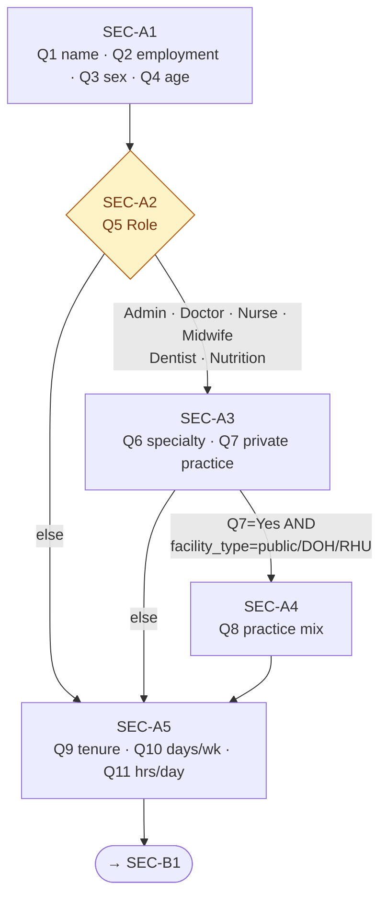
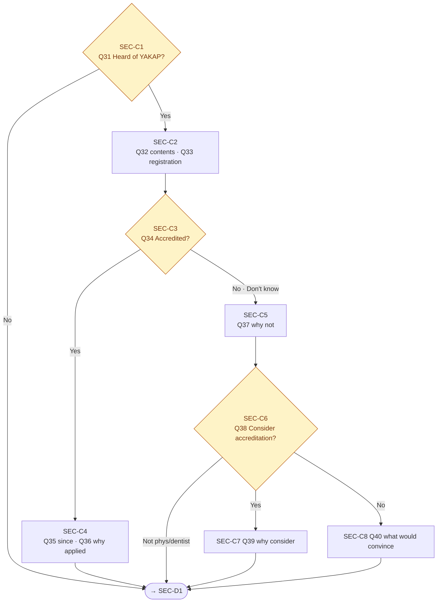
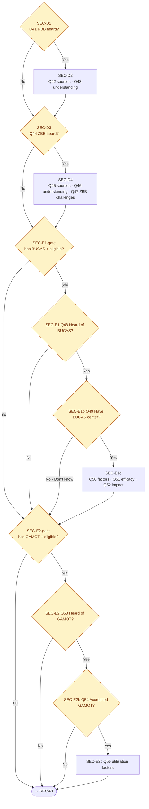
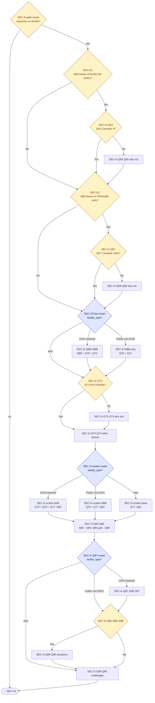
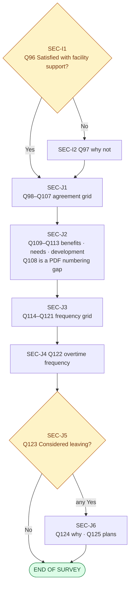

# F2 Skip Logic — Google Forms Section Graph

Translates the paper F2 skip logic (per-question `<proceed to QNN>` markers) into a Google Forms **section-based branching** graph. Google Forms supports exactly one routing mechanism: *"After section, go to section based on answer"* on a single-choice question at the end of a section. Any logic that does not fit that shape must either (a) be restructured by splitting questions across sections, (b) be pushed to **POST** processing on the response Sheet, or (c) be dropped with a note to ASPSI.

This document is the direct input to `E3-F2-GF-002` (spec→Form builder Apps Script) and `E3-F2-GF-003` (section skip wiring). Sourced from the **April 20, 2026 PDF** submitted as Project Deliverable 1.

## Inputs

- **F2-Spec.md** (Apr 20 rev) — the 124-item verbatim body spec (numbered Q1–Q125; Q108 is a PDF numbering gap). All `SECTION` / `SPLIT` / `POST` flags below reference that file.
- **F2-Apr20-Delta-Audit.md** — Apr 08 → Apr 20 renumbering map and new-item log.
- **F2-0 Tooling & Access Model Decision Memo** — confirms facility master list will pre-fill `facility_type`, `facility_has_bucas`, `facility_has_gamot`, `facility_id`, and PSGC geography. This is load-bearing for the facility-type splits in Sections G/J.

## Google Forms routing primitives (reference)

| Primitive | Supported? | Notes |
|---|---|---|
| Go to section X after this section | ✅ | Unconditional |
| Go to section based on answer (single-choice Q) | ✅ | Answer-level mapping; each choice can point to a different section |
| Go to section based on multi-choice answer | ❌ | Forms does not route on checkbox answers — must be a single-choice question |
| Submit form (end early) | ✅ | One of the routing targets |
| Branch on pre-filled hidden field | ❌ | All routing drivers must be *visible* single-choice questions |
| Cross-field conditional validation | ❌ | Forms validates one field at a time — cross-field logic moves to POST |
| Required-if-other-answer | ❌ | Forms required is static; use section splitting to simulate "conditional required" |

**Implication:** every branching decision in the paper PDF must be reducible to a single-choice question answered *in the form*. Pre-filled values from the URL (facility type, BUCAS, GAMOT) must be re-asked as visible confirmation questions — the respondent just verifies what was auto-filled. Those confirmation questions are the branch drivers.

## Pre-filled fields that drive branching

| Field | Source | Visible? | Role |
|---|---|---|---|
| `facility_id` | URL param from master list | read-only display | audit only |
| `facility_type` | URL param → rendered as single-choice Q (pre-selected) | **visible** | drives ZBB/NBB splits, Q8 public/private branch |
| `facility_has_bucas` | URL param → single-choice Q (pre-selected) | **visible** | drives Section E1 entry |
| `facility_has_gamot` | URL param → single-choice Q (pre-selected) | **visible** | drives Section E2 entry |
| `response_source` | URL param | hidden (captured server-side) | not used for routing |

**`facility_type` choice values** (locked for routing stability):

- `DOH-retained hospital`
- `Public hospital (non-DOH-retained)`
- `Private facility`
- `RHU / Health center`
- `Other public facility`

The ZBB path activates only for `DOH-retained hospital`. The NBB path activates for `DOH-retained hospital` + `Public hospital (non-DOH-retained)`. DOH-retained respondents see **both** ZBB and NBB variants per the Apr 20 PDF.

---

## Section graph (visual)

> **Diagram format note.** These are Mermaid flowcharts — they render natively in Obsidian, GitHub, VS Code, and most modern Markdown viewers. The six diagrams below divide the graph into readable chunks. The **Overview** shows every section at block level; the five detail diagrams zoom into specific regions. A full textual fallback (ASCII tree) follows in the next subsection.

### Diagram 1 — Overview (all sections at block level)


### Diagram 2 — Section A detail (Profile)



### Diagram 3 — Section C (YAKAP/Konsulta)



> **Apr 20 skip-logic improvement:** Apr 08 routed Q32 ("why applied") to Q34 ("consider accreditation") — illogical for already-accredited facilities. Apr 20 fixes this by routing Q36 **all answers → Q41** (skip Section C tail entirely for already-accredited respondents). The open item #3 in the Apr 08 spec is now resolved.

### Diagram 4 — Sections D + E (NBB/ZBB awareness, BUCAS, GAMOT)



> **Apr 20 additions in D + E1:**
> - **Q47** (ZBB challenges multi-select) — new in Section D; appended to the ZBB branch only
> - **Q50** (BUCAS utilization factors), **Q51** (BUCAS efficacy opinion) — new in Section E1; both gated on Q49 = Yes

### Diagram 5 — Section G (KAP on fees — facility-type splits, most complex)



> **Legend:** yellow diamonds = single-choice driver questions (respondent answers); blue diamonds = facility-type routers (driven by pre-filled `facility_type` re-confirmation). Each blue router is one extra visible "confirm facility type" question — the graph re-asks it at three points (SEC-G3, SEC-G-scales, SEC-G-Q87) because Forms has no cross-section memory.
>
> **Apr 20 NBB-sibling expansion:** each facility-type-gated section now handles **two** variants (ZBB + NBB) where Apr 08 had only one (ZBB). DOH-retained respondents see both; Public non-DOH see NBB only. New items: Q70 (NBB implications), Q76 (NBB fairness scale), Q88 (NBB balance billing).

### Diagram 6 — Sections I + J terminal



---

## Section graph (textual fallback — ASCII tree)

```
SEC-0  Cover + consent + facility confirmation
  │
  ▼
SEC-A1 Profile (Q1–Q4)
  │
  ▼
SEC-A2 Role (Q5) ──┬──► SEC-A3 Physician/Dentist specialty + private (Q6, Q7)
                   │       │
                   │       ├── Q7=Yes & public facility ──► SEC-A4 Practice mix (Q8)
                   │       └── else ────────────────────────► SEC-A5
                   │
                   └── non-doctor ────────────────────────► SEC-A5

SEC-A5 Tenure & hours (Q9–Q11)
  │
  ▼
SEC-B1 UHC awareness gate (Q12)
  │
  ├── Q12=No ──────────────────────────────────────────────► SEC-C0 (role gate)
  │
  ▼
SEC-B2 UHC change battery (Q13–Q24)   [Apr 20: 10 items incl. 4 new implementation items Q21–Q24]
  │
  ▼
SEC-B3 UHC expect-change battery (Q25 overview → Q26–Q30 per-domain conditionals)
  │
  ▼
SEC-C0 Role gate router
  │
  ├── eligible for C/D (admin/doctor/nurse/midwife/dentist/nutritionist) ──► SEC-C1
  ├── pharmacist / dispenser ─────────────────────────────────────────────► SEC-E2-gate
  └── other roles ────────────────────────────────────────────────────────► SEC-F1

SEC-C1 YAKAP awareness (Q31) ─── No ──► SEC-D1
  │ Yes
  ▼
SEC-C2 YAKAP content (Q32–Q33)
  │
  ▼
SEC-C3 Accredited? (Q34)
  │
  ├── Yes ──────────────────► SEC-C4 (Q35, Q36) ──► SEC-D1  [Apr 20: Q36 all-answers → Q41 skips C-tail]
  ├── No ───────────────────► SEC-C5 (Q37) ──────► SEC-C6
  └── Don't know / Other ──► SEC-C5 (Q37) ──────► SEC-C6

SEC-C6 Consideration (Q38)
  │
  ├── Yes ──► SEC-C7 (Q39) ──► SEC-D1     [Q38=Yes → Q39 then skip to Q41]
  ├── No ───────────────────► SEC-C8 (Q40) ──► SEC-D1
  └── Not physician/dentist ► SEC-D1     [direct jump to Q41]

SEC-D1 NBB heard? (Q41) ─── No ──► SEC-D3
  │ Yes
  ▼
SEC-D2 NBB sources + understanding (Q42–Q43)
  │
  ▼
SEC-D3 ZBB heard? (Q44) ─── No ──► SEC-E1-gate
  │ Yes
  ▼
SEC-D4 ZBB sources + understanding + challenges (Q45, Q46, Q47)   [Q47 NEW in Apr 20]
  │
  ▼
SEC-E1-gate  (facility_has_bucas? + role?)
  │
  ├── has BUCAS + eligible role ──► SEC-E1 (Q48)
  ├── pharmacist (any facility) ──► SEC-E2-gate
  └── else ───────────────────────► SEC-F1

SEC-E1 BUCAS awareness (Q48) ──── No ──► SEC-E2-gate
  │ Yes
  ▼
SEC-E1b (Q49) ── No / Don't know ──► SEC-E2-gate
  │ Yes
  ▼
SEC-E1c (Q50 factors · Q51 efficacy · Q52 impact)   [Q50, Q51 NEW in Apr 20]
  │
  ▼
SEC-E2-gate  (facility_has_gamot? + role?)
  │
  ├── has GAMOT + eligible role (incl. pharmacists) ──► SEC-E2
  └── else ────────────────────────────────────────────► SEC-F1

SEC-E2 GAMOT awareness (Q53) ─── No ──► SEC-F1
  │ Yes
  ▼
SEC-E2b (Q54) ─── No ──► SEC-F1
  │ Yes
  ▼
SEC-E2c (Q55) ──► SEC-F1

SEC-F1 Referrals outbound (Q56–Q60)
  │
  ▼
SEC-F2 Satisfaction (Q61)
  │
  ├── Satisfied/Very Sat./Neutral ──► SEC-G-gate-router
  └── Dissatisfied/Very Dissat. ────► SEC-F3 (Q62) ──► SEC-G-gate-router

SEC-G-gate-router  (role?)
  │
  ├── physician/dentist ──► SEC-G1
  └── else ────────────────► SEC-H1

SEC-G1 Facility fee policy (Q63) ── No ──► SEC-G2 (Q66 direct)
  │ Yes
  ▼
SEC-G-Q64 (Q64) ── Yes ──► SEC-G2 (Q66 direct)
  │ No
  ▼
SEC-G-Q65 (Q65) ──► SEC-G2

SEC-G2 PhilHealth rules (Q66)
  │
  ├── Yes ──► SEC-G-Q67 (Q67)
  │           │
  │           ├── Yes ──► SEC-G3-fac-router
  │           └── No ───► SEC-G-Q68 (Q68) ──► SEC-G3-fac-router
  │
  └── No ───► SEC-G3-fac-router

SEC-G3-fac-router  (facility_type?)
  │
  ├── DOH-retained hospital ─────────────► SEC-G-ZBB+NBB (Q69 + Q70 + Q71)
  ├── Public hospital (non-DOH-ret.) ────► SEC-G-NBB-only (Q70 + Q71)
  └── Private / RHU / Other ─────────────► SEC-G-Q72

SEC-G-ZBB+NBB / SEC-G-NBB-only ──► SEC-G-Q72

SEC-G-Q72 RVU familiarity (Q72)
  │
  ├── Yes ──► SEC-G-Q74
  └── No ───► SEC-G-Q73 (Q73) ──► SEC-G-Q74

SEC-G-Q74 Other factors (Q74)
  │
  ▼
SEC-G-scales-router (facility_type?)
  │
  ├── DOH-retained ───────► SEC-G-scales-both (Q75 + Q76 + Q77–Q81)
  ├── Public non-DOH-ret. ► SEC-G-scales-NBB  (Q76 + Q77–Q81)
  └── Private / RHU / Other ► SEC-G-scales-base (Q77–Q81)

SEC-G-scales-* ──► SEC-G-Q82-Q86 (Q82, Q83–Q85 grid, Q86)
  │
  ▼
SEC-G-Q87-router  (facility_type?)
  │
  ├── DOH-retained ───────► SEC-G-Q87 (ZBB version)
  │                           │
  │                           ├── Yes ──► SEC-G-Q88 (NBB version)
  │                           │             │
  │                           │             ├── Yes ──► SEC-G-Q89 ──► SEC-G-Q90
  │                           │             └── No ───────────────► SEC-G-Q90
  │                           └── No ───► SEC-G-Q88
  │                                         ├── Yes ──► SEC-G-Q89 ──► SEC-G-Q90
  │                                         └── No ───────────────► SEC-G-Q90
  │
  ├── Public non-DOH-ret. ─► SEC-G-Q88 (NBB version only)
  │                           ├── Yes ──► SEC-G-Q89 ──► SEC-G-Q90
  │                           └── No ───────────────► SEC-G-Q90
  │
  └── other ──────────────► SEC-G-Q90  (skip Q87–Q89 entirely)

SEC-G-Q90 Challenges (Q90)
  │
  ▼
SEC-H1 Task sharing (Q91–Q95)
  │
  ▼
SEC-I1 Facility support (Q96)
  │
  ├── Yes ──► SEC-J1
  └── No ───► SEC-I2 (Q97) ──► SEC-J1

SEC-J1 Grid #1 agreement (Q98–Q107)
  │
  ▼
SEC-J2 Open items (Q109–Q113)    [Q108 is a PDF numbering gap — no item]
  │
  ▼
SEC-J3 Grid #2 frequency (Q114–Q121)
  │
  ▼
SEC-J4 Overtime freq (Q122)      [Skip if Q114 = Never — see "Logic dropped" below]
  │
  ▼
SEC-J5 Leaving? (Q123)
  │
  ├── any Yes ──► SEC-J6 (Q124, Q125) ──► SUBMIT
  └── No ─────────────────────────────► SUBMIT
```

---

## Section routing table (normalised)

Every row below becomes one Apps Script `setGoToSectionBasedOnAnswer()` call in `E3-F2-GF-003`.

| Driver Section | Driver Q | Answer | Target Section |
|---|---|---|---|
| SEC-A2 | Q5 | Administrator · Physician/Doctor · Nurse · Midwife · Dentist · Nutrition action officer/coordinator | SEC-A3 |
| SEC-A2 | Q5 | Pharmacist/Dispenser · Physician assistant · Nursing assistant · Laboratory technician · Medical/radiologic technologist · Health promotion officer · Physical Therapist · Dentist aide · Barangay Health Worker · Other | SEC-A5 |
| SEC-A3 | Q7 | Yes (+ facility_type ∈ {Public, DOH-retained, RHU, Other public}) | SEC-A4 |
| SEC-A3 | Q7 | Yes (+ facility_type = Private) · No | SEC-A5 |
| SEC-B1 | Q12 | Yes | SEC-B2 |
| SEC-B1 | Q12 | No | SEC-C0 |
| SEC-C0 | role-bucket confirm Q | BUCKET-CD | SEC-C1 |
| SEC-C0 | role-bucket confirm Q | BUCKET-PHARM | SEC-E2-gate |
| SEC-C0 | role-bucket confirm Q | BUCKET-OTHER | SEC-F1 |
| SEC-C1 | Q31 | Yes | SEC-C2 |
| SEC-C1 | Q31 | No | SEC-D1 |
| SEC-C3 | Q34 | Yes | SEC-C4 |
| SEC-C3 | Q34 | No · I don't know… · Other | SEC-C5 |
| SEC-C4 | Q36 | any | SEC-D1 (Apr 20: all-answers → Q41 skips C-tail) |
| SEC-C5 | Q37 | any | SEC-C6 |
| SEC-C6 | Q38 | Yes | SEC-C7 |
| SEC-C6 | Q38 | No | SEC-C8 |
| SEC-C6 | Q38 | Not physician/dentist | SEC-D1 |
| SEC-C7 | — | — (Q39 "Not phys/dentist" answer option → SEC-D1; else unconditional) | SEC-D1 |
| SEC-C8 | — | — (unconditional) | SEC-D1 |
| SEC-D1 | Q41 | Yes | SEC-D2 |
| SEC-D1 | Q41 | No | SEC-D3 |
| SEC-D3 | Q44 | Yes | SEC-D4 |
| SEC-D3 | Q44 | No | SEC-E1-gate |
| SEC-D4 | — | — (Q45, Q46, Q47 unconditional within D4) | SEC-E1-gate |
| SEC-E1-gate | `facility_has_bucas` confirm Q | Yes + eligible role | SEC-E1 |
| SEC-E1-gate | `facility_has_bucas` confirm Q | No / pharmacist / other | SEC-E2-gate |
| SEC-E1 | Q48 | Yes | SEC-E1b |
| SEC-E1 | Q48 | No | SEC-E2-gate |
| SEC-E1b | Q49 | Yes | SEC-E1c |
| SEC-E1b | Q49 | No · I don't know | SEC-E2-gate |
| SEC-E1c | — | — (Q50, Q51, Q52 unconditional within E1c) | SEC-E2-gate |
| SEC-E2-gate | `facility_has_gamot` confirm Q | Yes + eligible role (incl. pharmacist) | SEC-E2 |
| SEC-E2-gate | `facility_has_gamot` confirm Q | No / other | SEC-F1 |
| SEC-E2 | Q53 | Yes | SEC-E2b |
| SEC-E2 | Q53 | No | SEC-F1 |
| SEC-E2b | Q54 | Yes | SEC-E2c |
| SEC-E2b | Q54 | No | SEC-F1 |
| SEC-E2c | — | — | SEC-F1 |
| SEC-F2 | Q61 | Dissatisfied · Very Dissatisfied | SEC-F3 |
| SEC-F2 | Q61 | Very Satisfied · Satisfied · Neither | SEC-G-gate-router |
| SEC-F3 | Q62 | any | SEC-G-gate-router |
| SEC-G-gate-router | role-dentist-doctor confirm Q | physician · dentist | SEC-G1 |
| SEC-G-gate-router | role-dentist-doctor confirm Q | else | SEC-H1 |
| SEC-G1 | Q63 | Yes | SEC-G-Q64 |
| SEC-G1 | Q63 | No | SEC-G2 |
| SEC-G-Q64 | Q64 | Yes | SEC-G2 |
| SEC-G-Q64 | Q64 | No | SEC-G-Q65 |
| SEC-G-Q65 | — | — | SEC-G2 |
| SEC-G2 | Q66 | Yes | SEC-G-Q67 |
| SEC-G2 | Q66 | No | SEC-G3-fac-router |
| SEC-G-Q67 | Q67 | Yes | SEC-G3-fac-router |
| SEC-G-Q67 | Q67 | No | SEC-G-Q68 |
| SEC-G-Q68 | — | — | SEC-G3-fac-router |
| SEC-G3-fac-router | facility_type confirm Q | DOH-retained | SEC-G-ZBB+NBB |
| SEC-G3-fac-router | facility_type confirm Q | Public non-DOH-retained | SEC-G-NBB-only |
| SEC-G3-fac-router | facility_type confirm Q | else | SEC-G-Q72 |
| SEC-G-ZBB+NBB / SEC-G-NBB-only | — | — | SEC-G-Q72 |
| SEC-G-Q72 | Q72 | Yes | SEC-G-Q74 |
| SEC-G-Q72 | Q72 | No | SEC-G-Q73 |
| SEC-G-Q73 | — | — | SEC-G-Q74 |
| SEC-G-Q74 | — | — | SEC-G-scales-router |
| SEC-G-scales-router | facility_type confirm Q | DOH-retained | SEC-G-scales-both |
| SEC-G-scales-router | facility_type confirm Q | Public non-DOH-retained | SEC-G-scales-NBB |
| SEC-G-scales-router | facility_type confirm Q | else | SEC-G-scales-base |
| SEC-G-scales-* | — | — | SEC-G-Q82-Q86 |
| SEC-G-Q82-Q86 | — | — | SEC-G-Q87-router |
| SEC-G-Q87-router | facility_type confirm Q | DOH-retained | SEC-G-Q87 |
| SEC-G-Q87-router | facility_type confirm Q | Public non-DOH-retained | SEC-G-Q88 |
| SEC-G-Q87-router | facility_type confirm Q | else | SEC-G-Q90 |
| SEC-G-Q87 | Q87 | any | SEC-G-Q88 |
| SEC-G-Q88 | Q88 | Yes | SEC-G-Q89 |
| SEC-G-Q88 | Q88 | No | SEC-G-Q90 |
| SEC-G-Q89 | — | — | SEC-G-Q90 |
| SEC-G-Q90 | — | — | SEC-H1 |
| SEC-I1 | Q96 | Yes | SEC-J1 |
| SEC-I1 | Q96 | No | SEC-I2 |
| SEC-I2 | — | — | SEC-J1 |
| SEC-J5 | Q123 | any Yes | SEC-J6 |
| SEC-J5 | Q123 | No | SUBMIT |
| SEC-J6 | — | — | SUBMIT |

**Unconditional sections:** those marked "—" at the Answer column run to their single target after completion; no branching driver is needed.

---

## Role re-confirmation driver (SEC-C0, SEC-G-gate-router)

Google Forms cannot branch on a value answered in an earlier section (no cross-section memory for routing). Two clean options:

**Option A — Repeat Q5 as a hidden-style driver (chosen).** At each role-gated junction (SEC-C0, SEC-G-gate-router), insert a single-choice question *"Confirm your role: [auto-filled from Q5]"* whose choices are the same as Q5. Apps Script can't actually pre-fill this from the respondent's earlier answer, so:

> **Design decision:** Collapse the Q5 choice set into **three routing buckets** and ask the bucket question once per gate. The bucket question reads: *"Based on the role you selected, which group best describes you?"* with the exact bucket the respondent should pick printed in the help text.

Buckets (fewer buckets = shorter routing table):

| Bucket | Q5 roles included | Sections entered |
|---|---|---|
| **BUCKET-CD** | Administrator, Physician/Doctor, Nurse, Midwife, Dentist, Nutrition action officer/coordinator | C, D, E1 (if BUCAS), E2 (if GAMOT) |
| **BUCKET-PHARM** | Pharmacist/Dispenser | E2 only (if GAMOT) |
| **BUCKET-OTHER** | Physician assistant, Nursing assistant, Laboratory technician, Medical/radiologic technologist, Health promotion officer, Physical Therapist, Dentist aide, Barangay Health Worker, Other | F directly |

For SEC-G-gate-router, a separate bucket asks **physician/dentist vs else** (this is a strict subset of BUCKET-CD).

**Option B — Route directly from Q5 itself.** Since Q5 is in SEC-A2 and the *first* routing decision that depends on role (SEC-C0) is reached only after SEC-B1/SEC-B2/SEC-B3, this won't work: Google Forms routes only at the section boundary *immediately* following the driver question. We can't "remember" Q5's answer across multiple sections.

**Chosen: Option A with buckets.** Repeating the bucket question is a small UX cost (~5 seconds × 2 junctions) but avoids the combinatorial explosion of per-role targets at each branch. If ASPSI objects, the alternative is to put the role driver question *in every section that branches on role* — 4 extra Q5 asks instead of 2.

---

## Q25 → Q26–Q30 conditional-display handling (Apr 20 new concern)

Apr 20's Q25 is a multi-select "which of the following do you expect to change" — Q26–Q30 are gated on which options the respondent picked. Forms cannot gate a question on a specific multi-select value, so:

**Option A (recommended default):** always show Q26–Q30 to every respondent who passed Q12=Yes. Add help text: *"If this topic is not something you expect to change, select 'I don't know'."* This keeps the form flat and avoids the explosion of section-per-option splitting.

**Option B (high-fidelity):** split into 5 sub-sections each gated on a radio-button "filter" question. Adds ~5 extra sections and ~30 seconds of respondent time. Only use if ASPSI insists on strict conditional display.

Current design: **Option A**. Flag to ASPSI.

---

## Logic that does NOT survive translation → POST processing

Moved to post-processing on the response Sheet (Apps Script `onFormSubmit` trigger):

| Check | Why it can't live in the form | Implementation |
|---|---|---|
| Q11 full-time/part-time derivation from hours | Forms has no computed fields | Add derived column `employment_class` in responses Sheet |
| Tenure (Q9 years + Q10 days/week) vs age (Q4) plausibility | Cross-field validation | Flag rows where tenure > age − 15 |
| Q5 role vs Q6 specialty consistency (non-doctors shouldn't have a medical specialty) | Cross-field validation | Flag rows where role ∉ {Physician, Dentist} and specialty ≠ "No specialty" |
| Q25 vs Q26–Q30 integrity | Multi-select → per-option gate not supported in Forms | If Q25 includes "Salary" but Q26 answer is blank/"I don't know", flag for review. Same for Q27–Q30. |
| Q61 satisfaction × role routing to Q62 | Too many combinations for section graph | Already handled by sending *all* Dissatisfied respondents to SEC-F3 regardless of role; Q62 is asked of all dissatisfied respondents, and the role-gated "only doctor/dentists get Q62" filter is applied in POST — non-doctors' Q62 answers are dropped. **Alternative:** ask Q62 but label the question as optional. Confirm with ASPSI. |
| Q11 "hours per day" bounds (DOLE note) | Forms can enforce numeric range but can't show DOLE guidance conditionally | Help text only |
| Cover-block derived fields (`response_source`, submission timestamp) | — | Auto-captured via Apps Script pre-fill + Form metadata |

---

## Logic that is DROPPED with a flag to ASPSI

| Dropped item | Reason | Flag |
|---|---|---|
| Q122 *"Skip if you have answered 'Never' in Q114"* | Q114 is inside a grid-single question (SEC-J3). Google Forms cannot route based on a single row of a grid question — only on standalone single-choice questions. | **Flag for ASPSI:** either (a) accept that all respondents see Q122 (with help text saying "leave blank if you never work overtime") or (b) lift Q114 out of the grid and ask it as a standalone single-choice question immediately before SEC-J4. Recommend (b). |
| Q49 *"Do you have a BUCAS Center?"* vs `facility_has_bucas` pre-fill | Redundant — the pre-filled field answers this. | **Flag for ASPSI:** consider removing Q49 entirely. Kept in the graph for now as a self-admin sanity check. |

> **Note (Apr 08 → Apr 20 skip-logic fix):** Apr 08's open-item flag that "Q32 all-answers → Q34 makes no sense for accredited respondents" is **resolved** in Apr 20 — Q36 all-answers → Q41 correctly skips Section C tail for already-accredited facilities.

---

## Multi-select branching workarounds

Google Forms cannot route on checkbox (multi-select) answers. Apr 20 F2 introduces **one** multi-select-gated behavior: Q25 → Q26–Q30 conditional display. Handled per "Q25 → Q26–Q30" section above (Option A: always show, validate in POST). Every `<proceed to QNN>` marker in the paper PDF itself is attached to a single-choice question — no paper-level multi-select branches.

---

## Open items for ASPSI

1. **Facility type confirmation question** — we're re-asking facility type as a visible single-choice driver question even though it's pre-filled from the master list. Confirm this is acceptable UX (respondent sees their facility type and clicks "Confirm").
2. **Role bucket question** — we're asking a "confirm role group" question twice (SEC-C0 and SEC-G-gate-router) to drive branching. Confirm acceptable, or accept 4 Q5 re-asks (one per section that branches on role) as an alternative.
3. **Q25 → Q26–Q30 display gating** — recommend Option A (always show, validate in POST); confirm acceptable, or ASPSI insists on Option B (section-per-option split, +5 sections).
4. **Q114 lift** — recommend lifting Q114 out of the frequency grid so Q122 skip-if-Never can work.
5. **Q62 audience** — confirm non-doctor dissatisfied respondents should also answer Q62 (simpler form graph) or skip it (requires POST-drop of their Q62 answers).
6. **Q49 removal** — redundant with `facility_has_bucas` pre-fill. Remove?
7. **Q108 PDF numbering gap** — confirm this is an editorial artifact (item removed without reflowing numbers) and that no `Q108` item is expected to exist.
8. **Annex G #23 burnout block** — Apr 20 retained Q116–Q121 (burnout battery). Decision gate for Dr. Claro pre-build still open.

---

## Next steps (Epic 2 F2 track)

- **E2-F2-015** — validation rule inventory adapted for self-admin (Apr 20 rev). Input to `E3-F2-GF-002` (question-level validators).
- **E2-F2-016** — cross-field consistency rules (Apr 20 rev). Most already triaged to POST here; E2-F2-016 formalises the Sheet-side checks.
- **E2-F2-017** — Shan QA review of this + F2-Spec.md (Apr 20 rev).
- **E2-F2-018** — sign-off → Epic 3 Google Forms build.
