# F2 Healthcare Worker Survey — Structured Spec

Verbatim extraction of questionnaire body (Sections A–J) for the F2 PWA build.
Labels preserved exactly as in the **Aug 17, 2026** instrument set (docx
`F2-Healthcare Worker Survey Questionnaire_UHC Year 2_Aug18.docx`), transcribed
from `deliverables/CSPro/instruments-aug17-extract/normalized/F2-paper.csv`
(the row-level paper extraction — 137 rows, 124 numbered items + 13 sub-items,
verified exact) and cross-referenced against the companion structural map
`F2-inventory.md`. **Printed question numbers kept as item codes** (`Q1`, `Q2`,
…, `Q124`).

> **Renumber note.** The Aug 17 instrument numbers items **Q1 through Q124
> continuously** — the Apr 20 PDF's `Q108` numbering gap (Q107→Q109) is gone.
> Every carried item's `pdf_q` is its Aug-17 printed number; `legacy_q` holds
> the item's id in the CURRENT (Apr-20) build, per Decision 6 (data keys
> follow the new ids). Full old→new crosswalk, including reworded and
> brand-new rows, is in
> `deliverables/CSPro/instruments-aug17-extract/maps/F2-renames.csv`.

## Legend

| Field | Meaning |
|---|---|
| `pdf_q` | Printed sequential question number in the Aug 17 instrument (primary item code) |
| `legacy_q` | Item id in the current (Apr-20) PWA build, for traceability; `—` = brand-new in Aug 17 |
| `type` | PWA type: `short-text`, `long-text`, `number`, `date`, `partial-date`, `single`, `multi`, `grid-single`, `section-break` |
| `required` | Y / N / conditional |
| `gate` | Who/what condition must hold for this question to apply (role / facility / branch from prior Q) |
| `skip` | Destination on specified answers (verbatim from the paper's `<proceed to Qnn>` notation) |
| `gf_risk` | Legacy risk-tagging column, kept for continuity with the Apr-20 spec's SECTION/SPLIT/OK vocabulary (documents the skip-logic surface Task 3.2 wires up) |

## Section overview (visual)

```mermaid
flowchart LR
    Cover[Cover<br/>consent + facility confirm] --> A[A. Profile<br/>Q1–Q11]
    A --> B[B. UHC Awareness<br/>Q12–Q30<br/>two-step attribution battery]
    B --> C[C. YAKAP/Konsulta<br/>Q31–Q40<br/>role-gated]
    C --> D[D. NBB/ZBB Awareness<br/>Q41–Q47<br/>role-gated]
    D --> E1[E1. BUCAS<br/>Q48–Q52<br/>role + facility-gated]
    E1 --> E2[E2. GAMOT<br/>Q53–Q55<br/>role + facility-gated]
    E2 --> F[F. Referrals & Satisfaction<br/>Q56–Q62]
    F --> G[G. KAP on Fees<br/>Q63–Q90<br/>physician/dentist only<br/>facility-type splits]
    G --> H[H. Task Sharing<br/>Q91–Q95]
    H --> I[I. Facility Support<br/>Q96–Q97]
    I --> J[J. Job Satisfaction<br/>Q98–Q124<br/>two matrix grids + terminal branch]
    J --> End([END OF SURVEY])

    classDef gated fill:#fef3c7,stroke:#b45309,color:#78350f
    classDef split fill:#e0e7ff,stroke:#4338ca,color:#1e1b4b
    classDef terminal fill:#dcfce7,stroke:#15803d,color:#14532d
    class C,D,E1,E2 gated
    class G split
    class End terminal
```

> **Legend.** Yellow = role-gated (branching on Q5 role bucket). Blue =
> facility-type-split (variants for DOH-retained vs public non-DOH-retained
> vs other). See `src/lib/skip-logic.ts` for the implemented section graph
> driving these gates (Section B's Q13–Q24 gates below are new-in-Aug-17 and
> are **not yet wired** in `skip-logic.ts` — see Concerns in the Task 3.1
> report; wiring them is Task 3.2's job).

## Cover block

Captured by the PWA's cover block, not part of the body spec below:

- Facility ID (pre-filled per unique link)
- Questionnaire Number `qn` — 12 digits = 9-digit PSGC facility code + 3-digit
  HCW sequence. Assigned at admin HCW enrollment, bound into the device
  token's claims, learned by the PWA at `/verify-token`, and recorded on
  every response row. Blank for legacy/slug-facility enrollments.
- Region / Province / City-Municipality / Barangay (pre-filled)
- GPS lat/long (absorbed into facility master list; not asked)
- `response_source` (auto-set: `self`, `staff_encoded`, `paper_mirror`)
- SJREB informed consent — implemented as a per-case `ConsentScreen` (R6
  #808), shown after enrollment and after every "Start new survey", before
  Section A. The Aug-17 content update (PhP 1,000 raffle mention — already
  present; corrected SJREB/ASPSI ethics contact details) lives in
  `src/i18n/locales/en.ts` under the `consent.*` keys (Task 3.1, 2026-08-19)
  — the raffle mention was already current; the SJREB email/phone and ASPSI
  email in `contactsBody` were stale and are now synced to the Aug-17
  printed contact table.

The Aug 17 doc still prints an interviewer-style cover block (consent-read-
aloud, FIELD CONTROL block, enumerator sign-offs, HEALTH FACILITY AND
GEOGRAPHIC IDENTIFICATION block). Per `feedback_f2_admin_model_self_admin_first`,
the field-work model is **self-admin-first** — the cover block is rewritten
for self-admin and retains the SJREB consent's substance (not a read-aloud
transcript). The printed FIELD CONTROL result-code block (Completed /
Postponed / Refused / Incomplete + validation/edit sign-off) has no PWA
equivalent — registered `class=capi-adaptation` in
`aug17-approved-divergences.md` (F2 is self-administered; disposition state
is derived server-side).

---

## Section A — Healthcare Worker Profile

> *Preamble (verbatim):* "The following questions ask about your profile. Please put your answer/s in the space provided or check the box of your answer."

| pdf_q | legacy_q | type | required | label (verbatim) | choices / notes | gate | skip | gf_risk |
|---|---|---|---|---|---|---|---|---|
| Q1 | Q1 | short-text ×3 | Y | What is your name? | Last Name / First Name / Middle Initial [optional] | — | — | OK — identity-capture risk on a self-admin raffle survey; unchanged from Apr-20 |
| Q2 | Q2 | single + specify | Y | What type of employment do you have at this health facility? | Regular · Casual · Seasonal · Probationary · Project-based · Fixed-term · Other (specify); help: "Definitions —\n1. Regular Employment: Employees perform tasks necessary or desirable to the employer's main business, usually after a probationary period. They enjoy full security of tenure.\n2. Probationary Employment: A trial period (maximum of 6 months) to determine if the employee meets the standards for regularization.\n3. Casual Employment: Work is not essential to the main business and is usually for a short period. If a casual employee works for at least one year, they may become regular.\n4. Project-based (Project Employment): Employment is fixed for a specific project or undertaking, with the end date determined by the completion of that project.\n5. Seasonal Employment: Work is only performed during specific, recurring times of the year, such as holidays or harvest seasons.\n6. Fixed-Term Employment: The contract specifies a set duration for the employment, agreed upon by both parties.\n7. Other (Job Order): worker is classified as a contractual worker or contract of service personnel, hired for a short-term, specific piece of work." | — | — | OK — 7-item definition block unchanged; content verified against `F2-paper.csv` row for Q2's note block (same 7 definitions, same facts) |
| Q3 | Q3 | single | Y | What is your sex at birth? | Male · Female | — | — | OK |
| Q4 | Q4 | number | Y | How old are you as of your last birthday (in years)? | integer, min 18, max 99 | — | — | OK |
| Q5 | Q5 | single + specify | Y | What is your role at this health facility? | Administrator · Midwife · Dentist · Physician/Doctor · Laboratory technician · Dentist aide · Physician assistant · Medical/ radiologic technologist · Barangay Health Worker · Nurse · Health promotion officer · Other (specify) · Nursing assistant · Nutrition action officer/coordinator/Nutritionist-Dietician · Pharmacist/Dispenser/Assistant Pharmacist · Physical Therapist | — | — | **SECTION** — Q5 drives gating for Sections C, D, E1, E2, G (`SECTION_CDE_ROLES`/`SECTION_E_ROLES`/`SECTION_G_ROLES` in `skip-logic.ts`). Task 3.2 (R12, 2026-08-19): reworded to the Aug-17 paper's verbatim wording AND print order (`F2-extract.md` lines 205–222, the 3-column checkbox grid, row-major) — was the Apr-20 build's wording/order, kept through Task 3.1 pending this task. `skip-logic.ts`'s role sets (`SECTION_CDE_ROLES`/`SECTION_E_ROLES`/`ROLES_WITH_SPECIALTY`) and `draft.ts`'s `RENAMED_VALUES` migration table are re-keyed to match — role *membership* is unchanged, only the Nutrition and Pharmacist strings' wording changed. Build now matches the paper exactly; no divergence to register |
| Q6 | Q6 | single + specify | N | What is your specialty, if any? | No specialty · Nuclear Medicine · Physical and Rehabilitation Medicine · Anesthesia · Obstetrics and Gynecology · Psychiatry · Dermatology · Occupational Medicine · Public health · Emergency Medicine · Ophthalmology · Radiology · Family Medicine · Orthopedics · Research · General Surgery · Otorhinolaryngology (ENT) · Others (specify) · Internal Medicine · Pathology · Neurology · Pediatrics | — | — | OK — same 22-option set as Apr-20; option order follows `F2-paper.csv`'s print order (a different physical document than the Apr-20 PDF) |
| Q7 | Q7 | single | Y | Do you practice at any private facility/ clinic? | Yes · No | only for respondents from public facilities | No → Q9 | OK |
| Q8 | Q8 | single | conditional | How do you divide your time between public and private practice? | I spend all of my time in private practice · I spend over half, but not all of my time in private practice · I spend my time equally in private and public practice · I spend over half, but not all of my time in public practice · I spend all of my time in public practice · I don't know | only for respondents from public facilities | — | **SECTION** — gated by facility type (public) AND Q7=Yes |
| Q9 | Q9 | number ×2 | Y | In your current position, how many (months/years) have you worked at this health facility? | Year(s) [min 0, max 99] / Month(s) [min 0, max 11] | — | — | OK |
| Q10 | Q10 | number | Y | How many days in a week do you work at this health facility? | integer 1–7; input label: "Number of days" | — | — | OK |
| Q11 | Q11 | number | Y | On average, how many hours do you work per day? | integer 1–24; input label: "Number of hours"; help: "According to DOLE, typically full-time is 8 hours per day, part-time is less than that." | — | — | OK |

---

## Section B — Universal Health Care (UHC) Awareness

> *Preamble (verbatim):* "The following questions ask about your awareness of UHC and the changes which may have occurred due to its implementation. Please check the box/es of your answer."

**gf_risk — CHANGE FROM APR 20 (Aug-17 rewrite):** the Apr-20 build's Q13/15/17/18/19/20/21/22/23/24 asked one compound single-choice question ("Has X been implemented since the UHC Act was passed in 2019 **and was it a result of the UHC Act**?") answered from an 8-option "UHC-impl set". The Aug-17 paper splits every one of those ten items into a plain Yes/No stem plus a separate `NN.1` attribution sub-item (new rows, 6-option "UHC-attribution set" — narrower than the old 8-option set). `pdf_q` is unchanged for the ten Yes/No stems (same numbers, reworded text); the eleven `.1` sub-items (including the new second sub-item `24.2`) are brand-new rows with no legacy id. See `maps/F2-renames.csv` for the full crosswalk.

| pdf_q | legacy_q | type | required | label (verbatim) | choices / notes | gate | skip | gf_risk |
|---|---|---|---|---|---|---|---|---|
| Q12 | Q12 | single | Y | Have you heard about Universal Health Care (UHC) prior to this survey? | Yes · No | — | No → Q31 | **SECTION** — skip spans Section B |
| Q13 | Q13 | single | Y | Has there been an increase in equipment in this facility? | Yes · No | Q12 = Yes | No → Q15 (skips Q13.1) | OK — reworded; was a compound single+specify question through Apr-20 |
| Q13.1 | — | single + specify | conditional | If yes, was it a result of the UHC Act enacted in 2019? | *[UHC-attribution set]* | only if Q13 = Yes | — | **NEW in Aug 17** — `shouldShow` predicate not yet wired (flagged for Task 3.2) |
| Q14 | Q14 | long-text | conditional | What are these pieces of equipment? | (Specify the equipment) | only if Q13 = Yes | — | OK |
| Q15 | Q15 | single | Y | Has there been an increase in supplies in this facility? | Yes · No | Q12 = Yes | No → Q17 (skips Q15.1) | OK — reworded |
| Q15.1 | — | single + specify | conditional | If yes, was it a result of the UHC Act enacted in 2019? | *[UHC-attribution set]* | only if Q15 = Yes | — | **NEW in Aug 17** — not yet wired |
| Q16 | Q16 | long-text | conditional | What are these supplies? | (Specify the supplies) | only if Q15 = Yes | — | OK |
| Q17 | Q17 | single | Y | Have electronic medical records been used in this facility? | Yes · No | Q12 = Yes | No → Q18 (skips Q17.1) | OK — reworded |
| Q17.1 | — | single + specify | conditional | If yes, was it a result of the UHC Act enacted in 2019? | *[UHC-attribution set]* | only if Q17 = Yes | — | **NEW in Aug 17** — not yet wired |
| Q18 | Q18 | single | Y | Have there been changes in the referral system in this facility? | Yes · No | Q12 = Yes | No → Q19 (skips Q18.1) | OK — reworded |
| Q18.1 | — | single + specify | conditional | If yes, was it a result of the UHC Act enacted in 2019? | *[UHC-attribution set]* | only if Q18 = Yes | — | **NEW in Aug 17** — not yet wired |
| Q19 | Q19 | single | Y | Have there been changes in the facility staffing? | Yes · No | Q12 = Yes | No → Q20 (skips Q19.1) | OK — reworded |
| Q19.1 | — | single + specify | conditional | If yes, was it a result of the UHC Act enacted in 2019? | *[UHC-attribution set]* | only if Q19 = Yes | — | **NEW in Aug 17** — not yet wired |
| Q20 | Q20 | single | Y | Has there been an improvement in the clinical practice guidelines of this facility? | Yes · No | Q12 = Yes | No → Q21 (skips Q20.1) | OK — reworded |
| Q20.1 | — | single + specify | conditional | If yes, was it a result of the UHC Act enacted in 2019? | *[UHC-attribution set]* | only if Q20 = Yes | — | **NEW in Aug 17** — not yet wired |
| Q21 | Q21 | single | Y | Does this facility implement DOH licensing standards? | Yes · No | Q12 = Yes | No → Q22 (skips Q21.1) | OK — reworded |
| Q21.1 | — | single + specify | conditional | If yes, was it a result of the UHC Act enacted in 2019? | *[UHC-attribution set]* | only if Q21 = Yes | — | **NEW in Aug 17** — not yet wired |
| Q22 | Q22 | single | Y | Does this facility implement PhilHealth accreditation requirements? | Yes · No | Q12 = Yes | No → Q23 (skips Q22.1) | OK — reworded |
| Q22.1 | — | single + specify | conditional | If yes, was it a result of the UHC Act enacted in 2019? | *[UHC-attribution set]* | only if Q22 = Yes | — | **NEW in Aug 17** — not yet wired |
| Q23 | Q23 | single | Y | Does this facility implement service delivery protocols? | Yes · No | Q12 = Yes | No → Q24 (skips Q23.1) | OK — reworded |
| Q23.1 | — | single + specify | conditional | If yes, was it a result of the UHC Act enacted in 2019? | *[UHC-attribution set]* | only if Q23 = Yes | — | **NEW in Aug 17** — not yet wired |
| Q24 | Q24 | single | Y | Does this facility implement primary care quality measures? | Yes · No | Q12 = Yes | No → Q25 (skips Q24.1/Q24.2) | OK — reworded |
| Q24.1 | — | single + specify | conditional | If yes, was it a result of the UHC Act enacted in 2019? | *[UHC-attribution set]* | only if Q24 = Yes | — | **NEW in Aug 17** — not yet wired |
| Q24.2 | — | multi + specify | conditional | If yes, what are the primary care quality measures are you implementing? | Client satisfaction survey · Dashboards · Other (specify) | only if Q24 = Yes | — | **NEW in Aug 17** — Q24's second sub-item (unique to Q24; no other B-battery item has a `.2`); not yet wired |
| Q25 | Q25 | multi + specify | Y | Which of the following do you expect to change in your personal work as a health worker under UHC? | Salary · Standards to follow · I don't know · Number of patients · Preventative health care · Other (specify) · Working hours · Patients seek healthcare in different ways | Q12 = Yes | — | **SECTION** — Q25 selections drive Q26–Q30 conditionals |
| Q26 | Q26 | single | conditional | How do you expect the following to change: Salary? | Higher · Lower · I don't know | only if Q25 includes "Salary" | — | OK |
| Q27 | Q27 | single | conditional | How do you expect the following to change: Number of patients? | Higher · Lower · I don't know | only if Q25 includes "Number of patients" | — | OK |
| Q28 | Q28 | single | conditional | How do you expect the following to change: Working hours? | Longer · Shorter · I don't know | only if Q25 includes "Working hours" | — | OK |
| Q29 | Q29 | single | conditional | How do you expect the following to change: Standards to follow? | More stringent · Less stringent · I don't know | only if Q25 includes "Standards to follow" | — | OK |
| Q30 | Q30 | single | conditional | How do you expect the following to change: Preventive healthcare? | More · Less · I don't know | only if Q25 includes "Preventive healthcare" | — | OK — paper's own gate string says "Preventive" while the Q25 option it refers to reads "Preventative" (`F2-inventory.md` anomaly #7); preserved verbatim on both sides, unchanged from Apr-20 |

**UHC-attribution set** (verbatim, used for Q13.1, Q15.1, Q17.1, Q18.1, Q19.1, Q20.1, Q21.1, Q22.1, Q23.1, Q24.1):
- Implemented as a direct result of the UHC Act
- Pre-existing prior to UHC but subsequently enhanced or expanded due to UHC Act
- Newly implemented or improved independent of UHC Act
- Not yet implemented but planned within the next 1-2 years
- Other (specify)
- I don't know

> **Superseded set.** The Apr-20 build's 8-option "UHC-impl set" (Yes-direct-result / Yes-preexisting-improved / Yes-recent-not-UHC / Yes-other / No-planned / No-noplans / No-other / IDK) is retired — Aug-17 splits the compound question apart, so no item references the 8-option set anymore.

---

## Section C — YAKAP/Konsulta Package

> *Gate (verbatim):* "Section C to be answered by administrators, doctors, nurses, midwives, dentists, nutritionists-dieticians only. For pharmacists/dispenser and assistant pharmacist, proceed to Section E2. Otherwise, proceed to Section F – Question 56"
>
> *Preamble:* "The following questions ask about your awareness YAKAP/Konsulta package of Philhealth. Please check the box/es of your answer."

**gf_risk — SECTION:** entire section gated on Q5 role via `SECTION_CDE_ROLES`. Unchanged from Apr-20 — same Q31–Q40 range, same content.

| pdf_q | legacy_q | type | required | label (verbatim) | choices / notes | skip | gf_risk |
|---|---|---|---|---|---|---|---|
| Q31 | Q31 | single | Y | Have you heard of the PhilHealth YAKAP/Konsulta package? | Yes · No | No → Q41 | **SECTION** — skip crosses into Section D |
| Q32 | Q32 | multi | Y | Which of the following are included in the YAKAP/Konsulta package? | Pap smear · Chest X-ray · I don't know · Mammogram · Low-dose Chest CT scan · Lipid profile · Dental services · Thyroid function test · All of the above | — | OK — "All of the above" stays standalone/exclusive per R6 #812 |
| Q33 | Q33 | single | Y | Which of the following statements is true with regard to registering patients to YAKAP/Konsulta? | It is possible to register individual patients to YAKAP/Konsulta · It is possible to register whole families to YAKAP/Konsulta · It is possible to register both individual patients and their family members together to YAKAP/Konsulta · None of the above are true · I don't know | — | OK |
| Q34 | Q34 | single + specify | Y | Are you part of a health facility that is an accredited PhilHealth YAKAP/ Konsulta provider? | Yes · No · I don't know what PhilHealth YAKAP/Konsulta package accreditation is · Other (specify) | No → Q37 · "I don't know…" → Q41 | **SPLIT** — the two non-Yes answers route to different destinations (per `F2-inventory.md` §7, No→Q37 but "I don't know…"→Q41, exiting Section C entirely; the current build routes both to Q37 — flagged for Task 3.2's routing pass, not changed here) |
| Q35 | Q35 | partial-date | conditional | Since when? | Year / Month / Day; help: "Year is required. Leave month or day blank if you don't recall them." | only if Q34 = Yes | OK — stored as one ISO-8601 variable-precision value (`YYYY` \| `YYYY-MM` \| `YYYY-MM-DD`); unchanged from Apr-20 (R3 #306) |
| Q36 | Q36 | single + specify | conditional | Why is your facility applying to become an accredited YAKAP/Konsulta provider? | Predictable revenue due to capitation · YAKAP is more comprehensive · High volume of patients · Other (specify) | all answers → Q41 | only if Q34 = Yes; all answers jump to Q41 (skips Section C tail) |
| Q37 | Q37 | multi + specify | conditional | Why is your facility not accredited? | No time · Ongoing application · Other (specify) | — | only if Q34 = No or Q34 = "I don't know…" |
| Q38 | Q38 | single | Y | Under UHC, there is a thrust towards primary health care. Part of this is the implementation of the YAKAP/Konsulta or primary care package. Would your facility consider becoming accredited as a YAKAP/Konsulta or primary care provider? | Yes · No · Not a physician/dentist | Yes → Q39 then skip to Q41 · No → Q40 · Not a physician/dentist → Q41 | **SECTION** — 3-way branch |
| Q39 | Q39 | single + specify | conditional | Why would your facility consider it? | Predictable revenue due to capitation · YAKAP is more comprehensive · High volume of patients · Other (specify) | — | only if Q38 = Yes |
| Q40 | Q40 | long-text | conditional | What might convince your facility to become a primary care provider? | — | — | only if Q38 = No |

---

## Section D — Awareness on No Balance Billing (NBB) and Zero Balance Billing (ZBB)

> *Gate (verbatim):* "Section D to be answered by administrators, doctors, nurses, midwives, dentists, nutritionists-dieticians only. For pharmacists/dispenser and assistant pharmacist, proceed to Section E2 – Question 53. Otherwise, proceed to Section F – Question 56"
>
> *Preamble:* "The following questions ask about No Balance Billing (NBB) and Zero Balance Billing (ZBB). Please check the box/es of your answer."

**gf_risk — SECTION:** same role gate as Section C. Unchanged from Apr-20 — same Q41–Q47 range, same content.

| pdf_q | legacy_q | type | required | label (verbatim) | choices / notes | skip | gf_risk |
|---|---|---|---|---|---|---|---|
| Q41 | Q41 | single | Y | Have you heard about the No Balance Billing (NBB)? | Yes · No | No → Q44 | **SECTION** |
| Q42 | Q42 | multi + specify | conditional | What are your sources of information about NBB? | News · Health center/facility · Legislation · LGU/Barangay · Social Media · I don't know · Friends/Family · Other (specify) | — | only if Q41 = Yes |
| Q43 | Q43 | multi + specify | conditional | What is your understanding about the No Balance Billing (NBB)? | Patient does not pay any hospital bill · Patients should not be charged extra fees · PhilHealth will cover cost of treatment · Applies only to PhilHealth members and any public hospital · Medicine and service are already included · Applies only to PhilHealth members and any public and private hospital · No cash payment required upon discharge · I don't know · Applies only to PhilHealth members and DOH-run hospitals · Other (Specify) · Bills are settled between the hospital and PhilHealth | — | only if Q41 = Yes |
| Q44 | Q44 | single | Y | Have you heard about the Zero Balance Billing (ZBB)? | Yes · No | No → Q48 | **SECTION** |
| Q45 | Q45 | multi + specify | conditional | What are your sources of information about ZBB? | *[same choice set as Q42]* | — | only if Q44 = Yes |
| Q46 | Q46 | multi + specify | conditional | What is your understanding about the Zero Balance Billing (ZBB)? | *[same choice set as Q43]* | — | only if Q44 = Yes |
| Q47 | Q47 | multi + specify | conditional | What challenges do you commonly encounter for patients covered by ZBB? | Lack/Insufficient medicines/supplies · Limited diagnostic services · High patient volume/workload · Documentation/compliance issues · ICT/system limitations · Patient-related concerns · Other (specify) · None | — | only if Q44 = Yes; the Aug-17 paper doesn't print "None" (`F2-paper.csv` row for Q47 has 7 options, no None) — kept per R3 #310 (Myra 2026-05-21), a UAT-validated build addition that predates and is independent of either paper revision; "None" auto-clears the others via `EXCLUSIVE_VALUES` |

---

## Section E — Awareness on Expanded Health Programs (BUCAS and GAMOT)

> *Preamble:* "The following questions ask about awareness of BUCAS center and GAMOT package. Please check the box/es of your answer."

### E1 — Awareness of and perceptions on BUCAS

> *Gate (verbatim):* "Questions 48 to 52 are to be answered only by administrators, doctors, nurses, midwives, dentists, nutritionists-dieticians in facilities with BUCAS centers. For pharmacists/dispensers and assistant pharmacists, proceed to Section E2 - Question 53. Otherwise, proceed to Section F – Question 56"

**gf_risk — SECTION:** dual gate (role + facility has BUCAS), implemented as item-level gates within one `Section E` — see `aug17-approved-divergences.md` (`class=capi-adaptation`). Unchanged from Apr-20 — same Q48–Q52 range, same content.

| pdf_q | legacy_q | type | required | label (verbatim) | choices / notes | skip | gf_risk |
|---|---|---|---|---|---|---|---|
| Q48 | Q48 | single | Y | Have you heard about the Bagong Urgent Care and Ambulatory Service (BUCAS) center? | Yes · No | No → Q53 | **SECTION** |
| Q49 | Q49 | single | conditional | Do you have a BUCAS Center? | Yes · No · I don't know | No → Q53 · I don't know → Q53 | **SECTION**; only if Q48 = Yes |
| Q50 | Q50 | multi + specify | conditional | In your assessment, what are the main factors affecting the utilization of BUCAS in your facility? | Patient awareness · Facility location and accessibility · Referral patterns · PhilHealth coverage and reimbursement · Availability of staff/services · Other (specify) | — | only if Q49 = Yes; cardinality-default (register: `aug17-approved-divergences.md`) — no printed select-all/select-one directive, kept `multi` (current build's type) |
| Q51 | Q51 | single | conditional | Do you feel BUCAS improves patient management efficiently? | Yes · No | — | only if Q49 = Yes |
| Q52 | Q52 | multi + specify | conditional | In your opinion, BUCAS Centers have: | Improved access to care · Improved quality of care · Reduced patient congestion · No significant impact · Other (specify) | — | only if Q49 = Yes |

### E2 — Awareness of GAMOT Package

> *Gate (verbatim):* "Questions 53 to 55 are to be answered only by administrators, doctors, nurses, midwives, dentists, pharmacists/dispenser, and assistant pharmacists in facilities with GAMOT pharmacy. Otherwise, proceed to Question 56"

**gf_risk — SECTION:** role + `facility_has_gamot` gate. Unchanged from Apr-20 — same Q53–Q55 range, same content.

| pdf_q | legacy_q | type | required | label (verbatim) | choices / notes | skip | gf_risk |
|---|---|---|---|---|---|---|---|
| Q53 | Q53 | single | Y | Have you heard about the Guaranteed and Accessible Medications for Outpatient Treatment (GAMOT) package? | Yes · No | No → Q56 | **SECTION** |
| Q54 | Q54 | single | conditional | Is your facility an accredited GAMOT provider? | Yes · No | No → Q56 | **SECTION**; only if Q53 = Yes |
| Q55 | Q55 | multi + specify | conditional | In your assessment, what are the main factors affecting the utilization of the GAMOT package in your facility? | Availability of GAMOT medicines · Pharmacy capacity · Patient awareness of the program · PhilHealth eligibility and reimbursement processes · Prescribing practices of physicians · Other (specify) | — | only if Q54 = Yes |

---

## Section F — Outbound & Inbound Referrals and Satisfaction

> *Preamble:* "The following questions will ask about your outbound and inbound referrals as well as your satisfaction with the referral system. Please check the box/es of your answer."

Unchanged from Apr-20 — same Q56–Q62 range, same content.

| pdf_q | legacy_q | type | required | label (verbatim) | choices / notes | skip | gf_risk |
|---|---|---|---|---|---|---|---|
| Q56 | Q56 | multi + specify | Y | What is/are the most common way/s you send referrals to higher level facilities? | Physical referral slip · I don't know · E-referral · Not Applicable · Referring facility calls receiving facility · Other (specify) | — | OK — NA/IDK both exclusive on this multi (R6 #815) |
| Q57 | Q57 | single + specify | Y | What type of referral form do you use to send to higher level facilities? | DOH standard referral form · No standard referral form · Facility's standard referral form · I don't know · Province's standard referral form · Not Applicable · City / LGU standard referral form · Other (specify) | — | OK |
| Q58 | Q58 | single | Y | Do you have a network of specialist providers to refer patients to, if needed? | Yes · I've never heard of it · No · I don't know | — | OK |
| Q59 | Q59 | single | Y | Considering all patients who come to this facility for the past 6 months, what proportion of patients coming to this facility are referred from another facility compared to walk-ins? | Almost all patients are referred, very few walk-in/self-referred · Majority of patients are referred, some walk-in/self-referred · The proportion of referrals is about equal to walk-ins · Majority of patients walk-in/self-referred, some are referred · Almost all patients walk-in/self-referred, very few are referred · I am unsure about the typical ratio of referrals to walk-ins · I don't know · Not Applicable | — | OK — "walk- in" line-wrap artifact in the raw extraction normalized to "walk-in" |
| Q60 | Q60 | multi + specify | Y | Of those referred, what is/are the most common way/s you receive referrals from lower-level facilities? | Physical referral slip · I don't know · E-referral · Not Applicable · Referring facility calls receiving facility · Other (specify) | — | OK — both exclusive; `F2-paper.csv`'s own Q60 row is extraction-corrupted (empty choices, wrong section tag), so the choice list is carried from the Apr-20 build (verified against the paper via `F2-inventory.md` §6 "same choice set" pairing with Q56) and reordered to match Q56's now-corrected CSV order |
| Q61 | Q61 | single | Y | How would you rate your satisfaction with your current referral system? | Very Satisfied: Minor improvements needed, patients are always referred appropriately · Satisfied: Some improvements needed, patients are generally referred appropriately · Neither Satisfied nor Dissatisfied: Improvements needed, but generally functional · Dissatisfied: Moderate improvements needed, a number of patients are referred to the wrong specialists or do not receive appropriate follow-up care · Very Dissatisfied: Major improvements needed, many patients are referred to the wrong specialists or do not receive appropriate follow-up care · Not applicable | Satisfied / Very Sat. / Neutral / Not applicable: doctor or dentist → Q63, else → Q91 (R6 #823) · Dissatisfied / Very Dissat.: doctor or dentist → Q62 then Q63, else → Q62 then Q91 | **SPLIT** — destination depends on (answer × role) |
| Q62 | Q62 | multi + specify | conditional | Why are you not satisfied with the current referral system? | Facilities are overcrowded or operating beyond capacity and do not accept the health care provider's patient referrals · The referral process is slow · There is poor coordination between our facility and referred facilities (e.g. We do not get information back from the facility about the patients we referred to them.) · Other (specify) | all → Q63 if doctor/dentist, else → Q91 | **SPLIT** — role-dependent destination; only if Q61 = Dissatisfied or Very Dissatisfied |

---

## Section G — Knowledge, Attitude, And Practices (KAP) on Professional Setting, Charging, And Reimbursement

> *Scope (verbatim):* "A doctor's professional fee is a, negotiable, and personalized fee that takes into account both the difficulty of the case and the patient's capacity to pay, while adhering to ethical standards. **To be asked from physicians, and dentists.**"
>
> *Preamble:* "This section contains questions about your knowledge, attitudes, and practices on professional setting, charging, and reimbursements. Please put your answer in the space provided or check the box/es of your answer."

**gf_risk — SECTION:** entire section gated on Q5 ∈ {Physician/Doctor, Dentist} via `SECTION_G_ROLES`. Unchanged from Apr-20 — same Q63–Q90 range (+ Q71a/Q71b), same content.

| pdf_q | legacy_q | type | required | label (verbatim) | choices / notes | gate | skip | gf_risk |
|---|---|---|---|---|---|---|---|---|
| Q63 | Q63 | single | Y | Are you aware of the facility-level professional fee policies in setting your professional fees? | Yes · No | doctor/dentist | No → Q66 | **SECTION** |
| Q64 | Q64 | single | conditional | If yes, do you consider them in setting your professional fees? | Yes · No | Q63 = Yes | Yes → Q66 | **SECTION** |
| Q65 | Q65 | long-text | conditional | If no, why not? | — | Q64 = No | — | OK |
| Q66 | Q66 | single | Y | Are you aware of the PhilHealth coverage rules in setting your professional fees? | Yes · No | doctor/dentist | Yes → Q67 · No → Q69 | **SECTION** |
| Q67 | Q67 | single | conditional | Do you consider these in setting professional fees? | Yes · No | Q66 = Yes | Yes → Q69 | **SECTION** |
| Q68 | Q68 | long-text | conditional | If no, why not? | — | Q67 = No | — | OK |
| Q69 | Q69 | single | conditional | Do you know the implications of the ZBB policy for professional fee charging? | Yes · No | only for respondents from DOH-retained hospitals | No → Q72 | **SPLIT** — facility-type gate (DOH-retained) |
| Q70 | Q70 | single | conditional | Do you know the implications of the NBB policy for professional fee charging? | Yes · No | only for respondents from public hospitals, including those from DOH-retained hospitals | No → Q72 | **SPLIT** — NBB sibling to Q69 ZBB |
| Q71a | Q71a | long-text | conditional | If yes, what are the implications? | —; help: "For those who answered 'Yes' in Q69 (ZBB)" | Q69 = Yes | — | OK — split per R6 #817 |
| Q71b | Q71b | long-text | conditional | If yes, what are the implications? | —; help: "For those who answered 'Yes' in Q70 (NBB)" | Q70 = Yes | — | OK — split per R6 #817 |
| Q72 | Q72 | single | Y | Are you familiar with the Relative Value Unit (RVU)-based pricing? | Yes · No | doctor/dentist | Yes → Q74 | **SECTION** |
| Q73 | Q73 | long-text | conditional | If no, why not? | — | Q72 = No | — | OK |
| Q74 | Q74 | long-text | Y | Aside from above policies, what other factors do you consider in setting your professional fee? | — | doctor/dentist | — | OK |
| Q75 | Q75 | single (1–5) | conditional | On a scale of 1-5 with 5 as highest, how fair is your professional fee reimbursement compared to colleagues in other specialties with similar years of training who practice in facilities which are not ZBB accredited? | 1 · 2 · 3 · 4 · 5 | only for respondents from DOH-retained hospitals | — | **SPLIT** — facility-type gate |
| Q76 | Q76 | single (1–5) | conditional | On a scale of 1-5 with 5 as highest, how fair is your professional fee reimbursement compared to colleagues in other specialties with similar years of training who practice in facilities which are not NBB accredited? | 1 · 2 · 3 · 4 · 5 | only for respondents from public hospitals, including those from DOH-retained hospitals | — | **SPLIT** — NBB sibling to Q75 ZBB |
| Q77 | Q77 | single (1–5) | Y | On a scale of 1-5 with 5 as highest, how adequate is your professional fee given your specialization and expertise? | 1 · 2 · 3 · 4 · 5 | doctor/dentist | — | OK |
| Q78 | Q78 | single (1–5) | Y | On a scale of 1-5 with 5 as highest, do you agree that the current reimbursement rates accurately reflect the complexity and cognitive effort required for your most frequent procedures? | 1 · 2 · 3 · 4 · 5 | doctor/dentist | — | OK |
| Q79 | Q79 | single (1–5) | Y | On a scale of 1-5 with 5 as highest, does your professional fee compensate for the medico-legal risks associated with your specific field? | 1 · 2 · 3 · 4 · 5 | doctor/dentist | — | OK |
| Q80 | Q80 | single (1–5) | Y | On a scale of 1-5 with 5 as highest, do reimbursement rates influence your practice's pricing strategy? | 1 · 2 · 3 · 4 · 5 | doctor/dentist | — | OK |
| Q81 | Q81 | single (1–5) | Y | On a scale of 1-5 with 5 as highest, how acceptable is the professional fee regulation or standardization under UHC? | 1 · 2 · 3 · 4 · 5 | doctor/dentist | — | OK |
| Q82 | Q82 | long-text | Y | What is your opinion on the policy of charging different professional fees based on the patient's ability to pay? | — | doctor/dentist | — | OK |
| Q83 | Q83 | grid-single | Y | How often do you charge your patients? | Never · Rarely · Sometimes · Often · Always | doctor/dentist | — | OK — grid row |
| Q84 | Q84 | grid-single | Y | How often do you waive your professional fee? | Never · Rarely · Sometimes · Often · Always | doctor/dentist | — | OK — grid row (same grid as Q83) |
| Q85 | Q85 | grid-single | Y | How often do you give discounts/adjustments on your professional fee? | Never · Rarely · Sometimes · Often · Always | doctor/dentist | — | OK — grid row |
| Q86 | Q86 | long-text | Y | What coping strategies have you adapted when reimbursement is perceived as insufficient? | — | doctor/dentist | — | OK |
| Q87 | Q87 | single | conditional | Have you experienced professional fee balance billing despite the insurance/ZBB? | Yes · No | only for respondents from DOH-retained hospitals | — | **SPLIT** — R6 #821: paper's "No → Q90" skip deliberately removed; any answer proceeds to Q88 (NBB) |
| Q88 | Q88 | single | conditional | Have you experienced professional fee balance billing despite the insurance/NBB? | Yes · No | only for respondents from public hospitals, including those from DOH-retained hospitals | No → Q90 | **SPLIT** — NBB sibling to Q87 ZBB |
| Q89 | Q89 | long-text | conditional | If yes, what are those situations? | — | Q87 = Yes or Q88 = Yes | — | OK |
| Q90 | Q90 | long-text | Y | What challenges do you face in maintaining fair and sustainable professional fees? | — | doctor/dentist | — | OK |

---

## Section H — Task Sharing

> *Preamble:* "We understand that in a health facility, it's often necessary to perform tasks outside of your job description to ensure that high quality patient care is maintained. These questions ask about instances when this happens in your day-to-day work. All information here will be kept confidential and anonymous. Please check the box of your answer."

Unchanged from Apr-20 — same Q91–Q95 range, same content.

| pdf_q | legacy_q | type | required | label (verbatim) | choices / notes | gf_risk |
|---|---|---|---|---|---|---|
| Q91 | Q91 | single | Y | In your day-to-day work, how often do you have to perform tasks that should be performed by a different role? | Everyday · More than once a week, but not everyday · Around once a week · Less than once a week, but at least once a month · Very rarely (can think of a few times only) · This has never happened to me | OK |
| Q92 | Q92 | single + specify | Y | When this happens, which of the following best applies to you? | I typically have to take on tasks that should be performed by only staff / more junior health care providers to me · I typically have to take on tasks that should be performed only by staff / more senior health care providers to me · I have to take on tasks that should be performed by staff that are not health workers (e.g., cleaners, drivers, IT) · Other (specify) | OK |
| Q93 | Q93 | multi + specify | Y | What are the most common tasks you do in your daily work that you could delegate to a more junior staff or different staff member? | Patient assessments · Clinical tasks (e.g. taking vital signs, drawing blood, hanging medicines) · Patient self-care support (e.g., cleaning patients, assisting with toilet) · Explaining treatment plans to patients and relatives · Administrative tasks (e.g. writing notes, requesting tests, encoding) · Other (specify) | OK — cardinality-default (register: `aug17-approved-divergences.md`); no printed select-all directive, kept `multi` |
| Q94 | Q94 | single + specify | Y | Which best explains why you take on these tasks? | We are short staffed, so I have to · I am capable of the task, I just haven't completed official certification yet · I think that someone of my role should be responsible for these tasks · Other (specify) | OK |
| Q95 | Q95 | single | Y | Do you agree or disagree with this statement: I think it's okay that health workers share tasks across roles even if they are beyond their job description. | Agree but for medical tasks only · Agree for both medical and clerical tasks · Agree but for clerical tasks only · Disagree for both medical and clerical tasks | OK |

---

## Section I — Facility Support

> *Preamble:* "These questions ask about your satisfaction with the support you receive from your facility. Please place your answer in the space provided or check the box of your answer."

Unchanged from Apr-20 — same Q96–Q97 range, same content.

| pdf_q | legacy_q | type | required | label (verbatim) | choices / notes | skip | gf_risk |
|---|---|---|---|---|---|---|---|
| Q96 | Q96 | single | Y | Are you satisfied with the support you receive from your facility to implement UHC reforms? | Yes · No | Yes → Q98 | **SECTION** |
| Q97 | Q97 | multi + specify | conditional | Why not? | Insufficient support given · Support is not targeted · Hard to coordinate · Other (specify) | — | OK — cardinality-default (register: `aug17-approved-divergences.md`); no printed select-all directive, kept `multi` |

---

## Section J — Job Satisfaction

> *Preamble (verbatim):* "The final section focuses on your satisfaction about your compensation, working environment, and professional development. Please check the box of your answer."

Section J is where the Aug-17 renumber actually bites: `Q98`–`Q107` (Grid #1) are
unchanged, but every item from the old `Q109` onward shifts down by one now
that the `Q108` gap is retired — `legacy_q` carries each item's Apr-20 id.

**Grid #1 — Agreement** (Strongly Agree · Agree · Neither Agree nor Disagree · Disagree · Strongly Disagree):

> *Preamble (verbatim):* "Please think about your experience in this post for the past 6 months, and respond if you agree or disagree with the following statements:"

| pdf_q | legacy_q | type | required | label (verbatim) | gf_risk |
|---|---|---|---|---|---|
| Q98 | Q98 | grid-single | Y | I am compensated fairly. | OK |
| Q99 | Q99 | grid-single | Y | All of my salary payments have arrived on time. | OK |
| Q100 | Q100 | grid-single | Y | All of my salary payments have arrived in the correct amount. | OK |
| Q101 | Q101 | grid-single | Y | The working environment is a fully supportive one. | OK |
| Q102 | Q102 | grid-single | Y | I am treated fairly at the workplace. | OK |
| Q103 | Q103 | grid-single | Y | My colleagues treat me with respect. | OK |
| Q104 | Q104 | grid-single | Y | My department/unit/practice provides a supportive environment for everyone regardless of background, beliefs, or identity. | OK |
| Q105 | Q105 | grid-single | Y | I have access to the resources I need to do my job well. | OK |
| Q106 | Q106 | grid-single | Y | In this post, I am given opportunities to develop my leadership skills relevant for my stage of training. | OK |
| Q107 | Q107 | grid-single | Y | I am satisfied with the professional development opportunities I have in my job. | OK |

**Open/closed items between grids:**

| pdf_q | legacy_q | type | required | label (verbatim) | choices / notes | gf_risk |
|---|---|---|---|---|---|---|
| Q108 | Q109 | long-text | Y | In addition to your salary, what other benefits as an accredited healthcare provider do you receive? | — | OK — renumbered only (Q108 gap retired) |
| Q109 | Q110 | multi + specify | Y | What additional resources do you need to perform well in this job? | Professional development opportunities · Better compensation policies · Better equipment / facilities · Other (specify) · None | OK — renumbered only; cardinality-default (register), kept `multi`; the Aug-17 paper doesn't print "None" (`F2-paper.csv` has 4 options) — kept per R3 #311 (Myra 2026-05-21), same rationale as Q47 |
| Q110 | Q111 | multi + specify | Y | What opportunities to develop leadership skill/s would be useful to you? | Seminars, conferences, workshops · Supervisory trainings · More training related to my job post · Other (specify) | OK — renumbered only; cardinality-default (register), kept `multi` |
| Q111 | Q112 | multi | Y | Which of the following professional development opportunity/ies is/are currently provided to you by your facility? Check all that apply | Clinical audits · Surgical audits · Quality assurance meetings · Seminars, conferences, workshops · Support for independent professional development: scholarships · Support for independent professional development: research grants · None | OK — renumbered only |
| Q112 | Q113 | multi + specify | Y | Which of the following professional development opportunity/ies would be most useful to you? | Clinical audits · Surgical audits · Quality assurance meetings · Seminars, conferences, workshops · Support for independent professional development: scholarships · Support for independent professional development: research grants · Other (specify) | OK — renumbered only; cardinality-default (register), kept `multi` |

**Grid #2 — Frequency** (Always · Often · Sometimes · Seldom · Never):

> *Preamble (verbatim):* "Please think about your experience in this post for the past 6 months, and respond if you agree or disagree with the following statements:" *(paper's own copy-paste mismatch — the column scale is frequency, not agreement; preserved verbatim, `F2-inventory.md` anomaly #9)*

| pdf_q | legacy_q | type | required | label (verbatim) | gf_risk |
|---|---|---|---|---|---|
| Q113 | Q114 | grid-single | Y | In the past month, I have worked beyond my scheduled hours. | OK — renumbered only |
| Q114 | Q115 | grid-single | Y | I have been compensated for working overtime. | OK — renumbered only |
| Q115 | Q116 | grid-single | Y | My work is emotionally exhausting. | OK — renumbered only |
| Q116 | Q117 | grid-single | Y | My work frustrates me. | OK — renumbered only |
| Q117 | Q118 | grid-single | Y | I feel worn out at the end of a working day. | OK — renumbered only |
| Q118 | Q119 | grid-single | Y | I feel exhausted every morning at the thought of another day at work. | OK — renumbered only |
| Q119 | Q120 | grid-single | Y | I feel that every working hour is tiring for me. | OK — renumbered only |
| Q120 | Q121 | grid-single | Y | I have enough energy for family and friends during leisure time. | OK — renumbered only |

**Closing items:**

| pdf_q | legacy_q | type | required | label (verbatim) | choices / notes | skip | gf_risk |
|---|---|---|---|---|---|---|---|
| Q121 | Q122 | single | conditional | I have worked overtime for: | Once or twice in the past month · Once or twice a week · Three or four days every week · Almost everyday · Everyday | skipped if Q113 = Never | OK — renumbered only. Paper prints "\<Skip if you have answered 'Never' in Q114\>" — Q114 is now "compensated for working overtime"; the semantically correct gate (mechanically carried from the Apr-20 build's own Q114="worked beyond scheduled hours", -1 shifted) is Q113. Paper's own cross-reference is off-by-one after its Year-2 renumber (`F2-inventory.md` anomaly #8); flagged for ASPSI confirmation, not silently repointed to the literal "Q114" |
| Q122 | Q123 | single | Y | Have you considered leaving this facility? | Yes, I've thought about it and have definite plans to leave · Yes, I've thought about it and am actively exploring other opportunities, but no firm plans yet · Yes, I've thought about it, but I'm not actively exploring nor have I made any firm plans yet · No, I haven't thought about it | No → end of survey | **SECTION** — terminal branch; renumbered only |
| Q123 | Q124 | multi + specify | conditional | Why are you planning on leaving this facility? | Poor compensation · Moving to another part of the country · Lack of opportunities · Moving to another country · Burnt out · Other (specify) | only if Q122 = any Yes | OK — renumbered only; cardinality-default (register), kept `multi` |
| Q124 | Q125 | multi + specify | conditional | What are you planning to do after leaving this facility? | Transfer to a new facility with the same role · Change training/specialization within healthcare · Change profession · Take an extended leave from work · Take a position as a health worker in another country · Retire · Other (specify) | only if Q122 = any Yes | OK — renumbered only; cardinality-default (register), kept `multi` |

> **END OF SURVEY**

## Section K — Questionnaire Feedback

> *Preamble (verbatim):* "Thank you for completing the survey! Before you submit, please answer a few short questions about the questionnaire itself. Your feedback will help us improve it."

> **App-only section (pretest).** Added per UAT #1003 (Shan, 2026-07-28); not in the paper instrument, so there are no legacy ids — unaffected by the Aug-17 renumber. All five items are required per #1004. FB5 is a textbox (not a 3-option single) exactly as the ticket specifies.

| pdf_q | legacy_q | type | required | label (verbatim) | choices / notes | gf_risk |
|---|---|---|---|---|---|---|
| FB1 | — | single | Y | Was the questionnaire comprehensive? | Yes · No | OK |
| FB2 | — | single | Y | Did we adequately cover the topic? | Yes · No | OK |
| FB3 | — | long-text | Y | Are there any questions you expected that we would ask and that we didn't? | — | OK |
| FB4 | — | long-text | Y | Are there any questions you feel may be too sensitive or that may affect the response rate that we should consider deleting? | — | OK |
| FB5 | — | long-text | Y | Was the questionnaire too long, too short, or about right? | — | OK |

---

## Skip-logic surface — consolidated (for Task 3.2)

The Aug-17 renumber is content-neutral for Sections A, C, D, E, F, G, H, I, K —
same ids, same choices, same gates as the current build. It is **not**
content-neutral for:

- **Section B (Q13–Q24.2).** Ten items reworded from a compound
  single-choice question into a plain Yes/No + a new `.1` attribution
  sub-item (plus Q24's unique `.2`). None of the eleven new sub-item ids have
  a `shouldShow` predicate in `src/lib/skip-logic.ts` yet — they render as
  always-visible (schema-optional via the `gate` column, but not runtime-
  hidden). Task 3.2 needs to add: `Q13.1`/`Q15.1`/`Q17.1`/`Q18.1`/`Q19.1`/
  `Q20.1`/`Q21.1`/`Q22.1`/`Q23.1`/`Q24.1` gated on their respective parent
  `=Yes`, and `Q24.2` gated on `Q24=Yes`.
- **Section J (Q108–Q124).** Pure id shift, mechanically re-keyed in
  `skip-logic.ts`'s `J` predicate block as part of this task (Q122→Q121,
  Q124→Q123, Q125→Q124; dependency refs Q114→Q113, Q123→Q122) — see the
  Task 3.1 report for the exact diff.
- **Q34 (Section C).** `F2-inventory.md` reads the paper's "I don't know…"
  branch as exiting straight to Q41 (skipping Q37), while the current build
  routes it through Q37 like "No". Not changed here (routing decision, not
  content) — flagged for Task 3.2.

## Open items flagged for ASPSI / Dr. Claro review

1. **Q1 (name)** — identity-capture risk for a self-admin survey with raffle incentive; carried unresolved from Apr-20.
2. **Q25/Q30 spelling mismatch** — Q25's option reads "Preventative health care"; Q30's own gate string reads "Preventive healthcare" (`F2-inventory.md` anomaly #7). Preserved verbatim on both sides; carried from Apr-20.
3. **Q121 gate mis-reference** — paper prints "\<Skip if you have answered 'Never' in Q114\>" but Q114 (Aug-17 numbering) is "I have been compensated for working overtime"; the semantically intended item is Q113 ("worked beyond my scheduled hours") — see the Q121 row above. New with the Aug-17 renumber (the paper's own cross-reference didn't get updated when Section J was renumbered).
4. **Q34 "I don't know…" destination** — `F2-inventory.md` reads this as routing to Q41 (exiting Section C), differing from the current build's Q37 routing for that answer. Confirm intended destination.
5. **Q36 stem/context mismatch** — Q36 is reached only from Q34 = Yes (already accredited), yet the stem reads "Why is your facility **applying to become** an accredited YAKAP/Konsulta provider?" (`F2-inventory.md` anomaly #11). Carried from Apr-20, unresolved.
6. **Section J burnout block (Q113–Q120, formerly Q114–Q121)** — retained per Apr-20 decision gate; still open per Dr. Claro sign-off status.
7. **8 ambiguous-cardinality lists** (Q50, Q93, Q97, Q109, Q110, Q112, Q123, Q124) — no printed select-all/select-one directive; kept as `multi` (current build behavior), registered in `aug17-approved-divergences.md`. Confirm intended cardinality with ASPSI.
8. **Certificate of Consent respondent-type list has no healthcare-worker option** in the paper's shared consent template (`F2-inventory.md` §9 anomaly #10) — not reproduced in the PWA's self-admin consent screen, which is F2-specific and doesn't need the multi-instrument checkbox row.

---

## Next steps

- **Task 3.1 ✅ (this file rev, Aug 17)** — structured spec rewritten against the Aug-17 instrument: full Q1–Q124 renumber, Section-B attribution-battery split + Q24.2, consent contact-detail sync, emit-items.ts gap retirement.
- **Task 3.2** — routing + validation rewrite: wire the eleven new Section-B `shouldShow` predicates, resolve the Q34 "I don't know…" destination question, review the Q121 gate mis-reference with ASPSI.
- **Task 3.3** — translations re-key + audit (English text changed for the ten Section-B items + eleven new sub-items; existing dialect translations for those English strings won't match and will render in English until re-translated).
- **Task 3.4** — consumers re-key (any UI/report code keying off old Section-J ids), Tier-1/2 evidence, a11y, statuses.
- **Task 3.5** — e2e, version bump, deploy.
