# F2 Healthcare Worker Survey — Structured Spec

Verbatim extraction of questionnaire body (Sections A–J) for Google Forms build. Labels preserved exactly as in the **April 20, 2026** PDF submitted as Project Deliverable 1. **Printed question numbers kept as item codes** (`Q1`, `Q2`, …, `Q125`).

> **Item count fidelity note.** The Apr 20 PDF numbers items **Q1 through Q125**, but **Q108 is omitted** (numbering gap after Q107, Grid #1 continues at Q109). Total actual items = **124**. We preserve the PDF numbering verbatim — there is no `Q108` row — so `pdf_q` references are 1:1 with the source document.

See [[F2-Apr20-Delta-Audit]] for the full Apr 08 → Apr 20 change log and renumbering map.

## Legend

| Field      | Meaning                                                                                                                                                                                                          |
| ---------- | ---------------------------------------------------------------------------------------------------------------------------------------------------------------------------------------------------------------- |
| `pdf_q`    | Printed sequential question number in the April 20 PDF (primary item code)                                                                                                                                       |
| `legacy_q` | Apr 08 PDF question number (for traceability; `—` = new in Apr 20)                                                                                                                                               |
| `type`     | Google Forms type: `short-text`, `long-text`, `number`, `date`, `single`, `multi`, `grid-single`, `grid-multi`, `section-break`                                                                                  |
| `required` | Y / N / conditional                                                                                                                                                                                              |
| `gate`     | Who answers this question (role / facility / branch from prior Q)                                                                                                                                                |
| `skip`     | Destination on specified answers (verbatim from PDF)                                                                                                                                                             |
| `gf_risk`  | Google Forms translation risk: **OK** / **SECTION** (needs its own section for branching) / **SPLIT** (question must be split across sections) / **POST** (logic moves to post-processing on the response Sheet) |

## Section overview (visual)

```mermaid
flowchart LR
    Cover[Cover<br/>consent + facility confirm] --> A[A. Profile<br/>Q1–Q11]
    A --> B[B. UHC Awareness<br/>Q12–Q30<br/>expect-change battery]
    B --> C[C. YAKAP/Konsulta<br/>Q31–Q40<br/>role-gated]
    C --> D[D. NBB/ZBB Awareness<br/>Q41–Q47<br/>role-gated]
    D --> E1[E1. BUCAS<br/>Q48–Q52<br/>role + facility-gated]
    E1 --> E2[E2. GAMOT<br/>Q53–Q55<br/>role + facility-gated]
    E2 --> F[F. Referrals & Satisfaction<br/>Q56–Q62]
    F --> G[G. KAP on Fees<br/>Q63–Q90<br/>physician/dentist only<br/>facility-type splits]
    G --> H[H. Task Sharing<br/>Q91–Q95]
    H --> I[I. Facility Support<br/>Q96–Q97]
    I --> J[J. Job Satisfaction<br/>Q98–Q125<br/>two matrix grids + terminal branch]
    J --> End([END OF SURVEY])

    classDef gated fill:#fef3c7,stroke:#b45309,color:#78350f
    classDef split fill:#e0e7ff,stroke:#4338ca,color:#1e1b4b
    classDef terminal fill:#dcfce7,stroke:#15803d,color:#14532d
    class C,D,E1,E2 gated
    class G split
    class End terminal
```

> **Legend.** Yellow = role-gated (branching on Q5 role bucket). Blue = facility-type-split (variants for DOH-retained vs public non-DOH-retained vs other). See `F2-Skip-Logic.md` for the full section graph driving these gates.

## Cover block

Captured by the rewritten cover block (see `F2-Cover-Block-Rewrite-Draft.md`). Not part of the body spec below:

- Facility ID (pre-filled per unique link)
- Region / Province / City-Municipality / Barangay (pre-filled)
- GPS lat/long (absorbed into facility master list; not asked)
- `response_source` (auto-set: `self`, `staff_encoded`, `paper_mirror`)
- SJREB informed consent (click-through gate)

The Apr 20 PDF still uses interviewer-style cover blocks (consent-read-aloud, field-control table, enumerator signoffs). Per `feedback_f2_admin_model_self_admin_first.md`, the field-work model is **self-admin-first** — the cover block is rewritten for self-admin and retains the SJREB consent verbatim.

---

## Section A — Healthcare Worker Profile

> _Preamble (verbatim):_ "The following questions ask about your profile. Please put your answer/s in the space provided or check the box of your answer."

| pdf_q | legacy_q | type             | required    | label (verbatim)                                                                           | choices / notes                                                                                                                                                                                                                                                                                                                                                                                          | gate                                        | skip    | gf_risk                                                                                             |
| ----- | -------- | ---------------- | ----------- | ------------------------------------------------------------------------------------------ | -------------------------------------------------------------------------------------------------------------------------------------------------------------------------------------------------------------------------------------------------------------------------------------------------------------------------------------------------------------------------------------------------------- | ------------------------------------------- | ------- | --------------------------------------------------------------------------------------------------- |
| Q1    | Q1       | short-text ×3    | Y           | What is your name?                                                                         | Last Name / First Name / Middle Initial [optional]                                                                                                                                                                                                                                                                                                                                                       | —                                           | —       | OK (consider removing — identity risk; see cover-block draft)                                       |
| Q2    | Q2       | single + specify | Y           | What type of employment do you have at this health facility?                               | Regular · Casual · Seasonal · Probationary · Project · Fixed-term · Other (specify)                                                                                                                                                                                                                                                                                                                      | —                                           | —       | OK (definitions go in help text — 7-item note block in PDF)                                         |
| Q3    | Q3       | single           | Y           | What is your sex at birth?                                                                 | Male · Female                                                                                                                                                                                                                                                                                                                                                                                            | —                                           | —       | OK                                                                                                  |
| Q4    | Q4       | number           | Y           | How old are you as of your last birthday (in years)?                                       | integer, min 18, max 99                                                                                                                                                                                                                                                                                                                                                                                  | —                                           | —       | OK                                                                                                  |
| Q5    | Q5       | single + specify | Y           | What is your role at this health facility?                                                 | Administrator · Physician/Doctor · Physician assistant · Nurse · Nursing assistant · Pharmacist/Dispenser · Midwife · Laboratory technician · Medical/ radiologic technologist · Health promotion officer · Nutrition action officer/ coordinator · Physical Therapist · Dentist · Dentist aide · Barangay Health Worker · Other (specify)                                                               | —                                           | —       | **SECTION** — Q5 drives gating for Sections C, D, E1, E2, G. Must branch to role-specific sections. |
| Q6    | Q6       | single + specify | N           | What is your specialty, if any?                                                            | No specialty · Anesthesia · Dermatology · Emergency Medicine · Family Medicine · General Surgery · Internal Medicine · Neurology · Nuclear Medicine · Obstetrics and Gynecology · Occupational Medicine · Ophthalmology · Orthopedics · Otorhinolaryngology (ENT) · Pathology · Pediatrics · Physical and Rehabilitation Medicine · Psychiatry · Public health · Radiology · Research · Others (specify) | —                                           | —       | OK                                                                                                  |
| Q7    | Q7       | single           | Y           | Do you practice at any private facility/ clinic?                                           | Yes · No                                                                                                                                                                                                                                                                                                                                                                                                 | only for respondents from public facilities | No → Q9 | OK                                                                                                  |
| Q8    | Q8       | single           | conditional | How do you divide your time between public and private practice?                           | I spend all of my time in private practice · I spend over half, but not all of my time in private practice · I spend my time equally in private and public practice · I spend over half, but not all of my time in public practice · I spend all of my time in public practice · I don't know                                                                                                            | only for respondents from public facilities | —       | **SECTION** — gated by facility type (public) AND Q7=Yes                                            |
| Q9    | Q9       | number ×2        | Y           | In your current position, how many (months/years) have you worked at this health facility? | Year(s) [min 0, max 99] / Month(s) [min 0, max 11, optional]                                                                                                                                                                                                                                                                                                                                             | —                                           | —       | OK                                                                                                  |
| Q10   | Q10      | number           | Y           | How many days in a week do you work at this health facility?                               | integer 1–7                                                                                                                                                                                                                                                                                                                                                                                              | —                                           | —       | OK                                                                                                  |
| Q11   | Q11      | number           | Y           | On average, how many hours do you work per day?                                            | integer 1–24; help: "According to DOLE, typically full-time is 8 hours per day, part-time is less than that."                                                                                                                                                                                                                                                                                            | —                                           | —       | OK                                                                                                  |

---

## Section B — Universal Health Care (UHC) Awareness

> _Preamble (verbatim):_ "The following questions ask about your awareness of UHC and the changes which may have occurred due to its implementation. Please check the box/es of your answer."

**gf_risk — CHANGE FROM APR 08:** Apr 20 adds two Section B items on licensing/accreditation (Q21 DOH licensing + Q22 PhilHealth accreditation) and splits the single Apr 08 Q26 "expect to change" matrix into Q25 overview (multi) + Q26–Q30 per-domain conditionals. See [[F2-Apr20-Delta-Audit]] §Section B.

| pdf_q | legacy_q | type             | required    | label (verbatim)                                                                                                                                        | choices / notes                                                                                                                                                            | gate                                         | skip     | gf_risk                                                        |
| ----- | -------- | ---------------- | ----------- | ------------------------------------------------------------------------------------------------------------------------------------------------------- | -------------------------------------------------------------------------------------------------------------------------------------------------------------------------- | -------------------------------------------- | -------- | -------------------------------------------------------------- |
| Q12   | Q12      | single           | Y           | Have you heard about Universal Health Care (UHC) prior to this survey?                                                                                  | Yes · No                                                                                                                                                                   | —                                            | No → Q31 | **SECTION** — skip spans Section B                             |
| Q13   | Q13      | single + specify | Y           | Has the increase in equipment been implemented since the UHC Act was passed in 2019 and was it a result of the UHC Act?                                 | _[standard 8-option UHC-implementation set — see "UHC-impl set" below]_                                                                                                    | Q12 = Yes                                    | —        | OK                                                             |
| Q14   | Q14      | long-text        | conditional | What are these pieces of equipment?                                                                                                                     | (Specify the equipment)                                                                                                                                                    | Q13 = any Yes                                | —        | OK                                                             |
| Q15   | Q15      | single + specify | Y           | Has the increase in supplies been implemented since the UHC Act was passed in 2019 and was it a result of the UHC Act?                                  | _[UHC-impl set]_                                                                                                                                                           | Q12 = Yes                                    | —        | OK                                                             |
| Q16   | Q16      | long-text        | conditional | What are these supplies?                                                                                                                                | (Specify the supplies)                                                                                                                                                     | Q15 = any Yes                                | —        | OK                                                             |
| Q17   | Q17      | single + specify | Y           | Has the use of electronic medical records at the facility been implemented since the UHC Act was passed in 2019 and was it a result of the UHC Act?     | _[UHC-impl set]_                                                                                                                                                           | Q12 = Yes                                    | —        | OK                                                             |
| Q18   | Q18      | single + specify | Y           | Have the changes to the referral system (inbound or outbound) been implemented since the UHC Act was passed in 2019 and was it a result of the UHC Act? | _[UHC-impl set]_                                                                                                                                                           | Q12 = Yes                                    | —        | OK                                                             |
| Q19   | Q19      | single + specify | Y           | Have the changes in staffing been implemented since the UHC Act was passed in 2019 and was it a result of the UHC Act?                                  | _[UHC-impl set]_                                                                                                                                                           | Q12 = Yes                                    | —        | OK                                                             |
| Q20   | Q20      | single + specify | Y           | Have the improved clinical practice guidelines been implemented since the UHC Act was passed in 2019 and was it a result of the UHC Act?                | _[UHC-impl set]_                                                                                                                                                           | Q12 = Yes                                    | —        | OK                                                             |
| Q21   | —        | single + specify | Y           | Have the DOH licensing standards been implemented since the UHC Act was passed in 2019 and was it a result of the UHC Act?                              | _[UHC-impl set]_                                                                                                                                                           | Q12 = Yes                                    | —        | OK (**NEW in Apr 20** — Annex G licensing/accreditation track) |
| Q22   | —        | single + specify | Y           | Have the PhilHealth accreditation requirements been implemented since the UHC Act was passed in 2019 and was it a result of the UHC Act?                | _[UHC-impl set]_                                                                                                                                                           | Q12 = Yes                                    | —        | OK (**NEW in Apr 20**)                                         |
| Q23   | —        | single + specify | Y           | Have the service delivery protocols been implemented since the UHC Act was passed in 2019 and was it a result of the UHC Act?                           | _[UHC-impl set]_                                                                                                                                                           | Q12 = Yes                                    | —        | OK (**NEW in Apr 20**)                                         |
| Q24   | —        | single + specify | Y           | Have the primary care quality measures been implemented since the UHC Act was passed in 2019 and was it a result of the UHC Act?                        | _[UHC-impl set]_                                                                                                                                                           | Q12 = Yes                                    | —        | OK (**NEW in Apr 20**)                                         |
| Q25   | Q21      | multi + specify  | Y           | Which of the following do you expect to change in your personal work as a health worker under UHC?                                                      | Salary · Number of patients · Working hours · Standards to follow · Preventative health care · Patients seek healthcare in different ways · I don't know · Other (specify) | Q12 = Yes                                    | —        | **SECTION** — Q25 selections drive Q26–Q30 conditionals        |
| Q26   | Q22      | single           | conditional | How do you expect the following to change: Salary?                                                                                                      | Higher · Lower · I don't know                                                                                                                                              | only if Q25 includes "Salary"                | —        | OK (conditional display gated by Q25)                          |
| Q27   | Q23      | single           | conditional | How do you expect the following to change: Number of patients?                                                                                          | Higher · Lower · I don't know                                                                                                                                              | only if Q25 includes "Number of patients"    | —        | OK                                                             |
| Q28   | Q24      | single           | conditional | How do you expect the following to change: Working hours?                                                                                               | Longer · Shorter · I don't know                                                                                                                                            | only if Q25 includes "Working hours"         | —        | OK                                                             |
| Q29   | Q25      | single           | conditional | How do you expect the following to change: Standards to follow?                                                                                         | More stringent · Less stringent · I don't know                                                                                                                             | only if Q25 includes "Standards to follow"   | —        | OK                                                             |
| Q30   | Q26      | single           | conditional | How do you expect the following to change: Preventive healthcare?                                                                                       | More · Less · I don't know                                                                                                                                                 | only if Q25 includes "Preventive healthcare" | —        | OK                                                             |

**UHC-impl set** (verbatim, used for Q13, Q15, Q17, Q18, Q19, Q20, Q21, Q22, Q23, Q24):

- Yes, this was implemented as a direct result of the UHC Act
- Yes, this was pre-existing, but it has significantly improved due to the UHC Act
- Yes, this has been implemented or improved recently, but not due to the UHC Act
- Yes, specify other reason ****\_\_****
- No, this has not been implemented yet, but we plan to in the next 1-2 years
- No, and we have no plans to do this in the next 1-2 years
- No, specify other reason ****\_\_****
- I don't know

> **PDF anomaly (Q15):** first option text reads "Yes, this was implemented as a direct result of the UHC**?**" (question mark appears to be a typo for "Act"). The form should use the corrected label; flag to ASPSI for confirmation.

---

## Section C — YAKAP/Konsulta Package

> _Gate (verbatim):_ "Section C to be answered by administrators, doctors, nurses, midwives, dentists, nutritionists-dieticians only. For pharmacists/dispenser and assistant pharmacist, proceed to Section E2. Otherwise, proceed to Section F – Question 56"
>
> _Preamble:_ "The following questions ask about your awareness YAKAP/Konsulta package of Philhealth. Please check the box/es of your answer."

**gf_risk — SECTION:** entire section gated on Q5 role. Google Forms branching: after Section B, branch on Q5 → Section C (eligible roles) · Section E2 (pharmacists) · Section F (others).

| pdf_q | legacy_q | type             | required    | label (verbatim)                                                                                                                                                                                                                           | choices / notes                                                                                                                                                                                                                                                                      | skip                                                                  | gf_risk                                                            |
| ----- | -------- | ---------------- | ----------- | ------------------------------------------------------------------------------------------------------------------------------------------------------------------------------------------------------------------------------------------ | ------------------------------------------------------------------------------------------------------------------------------------------------------------------------------------------------------------------------------------------------------------------------------------ | --------------------------------------------------------------------- | ------------------------------------------------------------------ |
| Q31   | Q27      | single           | Y           | Have you heard of the PhilHealth YAKAP/Konsulta package?                                                                                                                                                                                   | Yes · No                                                                                                                                                                                                                                                                             | No → Q41                                                              | **SECTION** — skip crosses into Section D                          |
| Q32   | Q28      | multi            | Y           | Which of the following are included in the YAKAP/Konsulta package?                                                                                                                                                                         | Pap smear · Mammogram · Lipid profile · Thyroid function test · Chest X-ray · Low-dose Chest CT scan · Dental services · All of the above · I don't know                                                                                                                             | —                                                                     | OK                                                                 |
| Q33   | Q29      | single           | Y           | Which of the following statements is true with regard to registering patients to YAKAP/Konsulta?                                                                                                                                           | It is possible to register individual patients to YAKAP/Konsulta · It is possible to register whole families to YAKAP/Konsulta · It is possible to register both individual patients and their family members together to YAKAP/Konsulta · None of the above are true · I don't know | —                                                                     | OK                                                                 |
| Q34   | Q30      | single + specify | Y           | Are you part of a health facility that is an accredited PhilHealth YAKAP/ Konsulta provider?                                                                                                                                               | Yes · No · I don't know what PhilHealth YAKAP/Konsulta package accreditation is · Other (specify)                                                                                                                                                                                    | No → Q37 · "I don't know…" → Q37                                      | **SPLIT** — two non-Yes answers route to Q37                       |
| Q35   | Q31      | date             | conditional | Since when?                                                                                                                                                                                                                                | Month / Day / Year                                                                                                                                                                                                                                                                   | —                                                                     | only if Q34 = Yes (PDF does not tag [Q35]; numbering is preserved) |
| Q36   | Q32      | single + specify | conditional | Why is your facility applying to become an accredited YAKAP/Konsulta provider?                                                                                                                                                             | Predictable revenue due to capitation · YAKAP is more comprehensive · High volume of patients · Other (specify)                                                                                                                                                                      | all answers → Q41                                                     | only if Q34 = Yes; all answers jump to Q41 (skips Section C tail)  |
| Q37   | Q33      | multi + specify  | conditional | Why is your facility not accredited?                                                                                                                                                                                                       | No time · Ongoing application · Other (specify)                                                                                                                                                                                                                                      | —                                                                     | only if Q34 = No or Q34 = "I don't know…"                          |
| Q38   | Q34      | single           | Y           | Under UHC, there is a thrust towards primary health care. Part of this is the implementation of the YAKAP/Konsulta or primary care package. Would your facility consider becoming accredited as a YAKAP/Konsulta or primary care provider? | Yes · No · Not a physician/dentist                                                                                                                                                                                                                                                   | Yes → Q39 then skip to Q41 · No → Q40 · Not a physician/dentist → Q41 | **SECTION** — 3-way branch                                         |
| Q39   | Q35      | multi + specify  | conditional | Why would your facility consider it?                                                                                                                                                                                                       | Predictable revenue due to capitation · YAKAP is more comprehensive · High volume of patients · Other (specify) · Not a physician/dentist                                                                                                                                            | "Not a physician/dentist" → Q41                                       | only if Q38 = Yes                                                  |
| Q40   | Q36      | long-text        | conditional | What might convince your facility to become a primary care provider?                                                                                                                                                                       | —                                                                                                                                                                                                                                                                                    | —                                                                     | only if Q38 = No                                                   |

---

## Section D — Awareness on No Balance Billing (NBB) and Zero Balance Billing (ZBB)

> _Gate (verbatim):_ "Section D to be answered by administrators, doctors, nurses, midwives, dentists, nutritionists-dieticians only. For pharmacists/dispenser and assistant pharmacist, proceed to Section E2 – Question 53. Otherwise, proceed to Section F – Question 56"
>
> _Preamble:_ "The following questions ask about No Balance Billing (NBB) and Zero Balance Billing (ZBB). Please check the box/es of your answer."

**gf_risk — SECTION:** same role gate as Section C. Apr 20 section-label change: "Awareness on No Balance Billing (NBB) and Zero Balance Billing (ZBB)" (was "NBB and ZBB Awareness" in Apr 08).

| pdf_q | legacy_q | type            | required    | label (verbatim)                                                       | choices / notes                                                                                                                                                                                                                                                                                                                                                                                                                                                                                              | skip     | gf_risk                                                                   |
| ----- | -------- | --------------- | ----------- | ---------------------------------------------------------------------- | ------------------------------------------------------------------------------------------------------------------------------------------------------------------------------------------------------------------------------------------------------------------------------------------------------------------------------------------------------------------------------------------------------------------------------------------------------------------------------------------------------------ | -------- | ------------------------------------------------------------------------- |
| Q41   | Q37      | single          | Y           | Have you heard about the No Balance Billing (NBB)?                     | Yes · No                                                                                                                                                                                                                                                                                                                                                                                                                                                                                                     | No → Q44 | **SECTION**                                                               |
| Q42   | Q38      | multi + specify | conditional | What are your sources of information about NBB?                        | News · Legislation · Social Media · Friends/Family · Health center/facility · LGU/Barangay · I don't know · Other (specify)                                                                                                                                                                                                                                                                                                                                                                                  | —        | only if Q41 = Yes                                                         |
| Q43   | Q39      | multi + specify | conditional | What is your understanding about the No Balance Billing (NBB)?         | Patient does not pay any hospital bill · PhilHealth will cover cost of treatment · Medicine and service are already included · No cash payment required upon discharge · Applies only to PhilHealth members and DOH-run hospitals · Bills are settled between the hospital and PhilHealth · Patients should not be charged extra fees · Applies only to PhilHealth members and any public hospital · Applies only to PhilHealth members and any public and private hospital · I don't know · Other (Specify) | —        | only if Q41 = Yes                                                         |
| Q44   | Q40      | single          | Y           | Have you heard about the Zero Balance Billing (ZBB)?                   | Yes · No                                                                                                                                                                                                                                                                                                                                                                                                                                                                                                     | No → Q48 | **SECTION**                                                               |
| Q45   | Q41      | multi + specify | conditional | What are your sources of information about ZBB?                        | _[same choice set as Q42]_                                                                                                                                                                                                                                                                                                                                                                                                                                                                                   | —        | only if Q44 = Yes                                                         |
| Q46   | Q42      | multi + specify | conditional | What is your understanding about the Zero Balance Billing (ZBB)?       | _[same choice set as Q43]_                                                                                                                                                                                                                                                                                                                                                                                                                                                                                   | —        | only if Q44 = Yes                                                         |
| Q47   | —        | multi + specify | conditional | What challenges do you commonly encounter for patients covered by ZBB? | Lack/Insufficient medicines/supplies · Limited diagnostic services · High patient volume/workload · Documentation/compliance issues · ICT/system limitations · Patient-related concerns · Other (specify)                                                                                                                                                                                                                                                                                                    | —        | **NEW in Apr 20** (Annex G #7 — ZBB explicit coverage); only if Q44 = Yes |

---

## Section E — Awareness on Expanded Health Programs (BUCAS and GAMOT)

> Apr 20 section-label change: "Awareness on Expanded Health Programs (BUCAS and GAMOT)" (was "Expanded Health Programs" in Apr 08).
>
> _Preamble:_ "The following questions ask about awareness of BUCAS center and GAMOT package. Please check the box/es of your answer."

### E1 — Awareness of and perceptions on BUCAS

> _Gate (verbatim):_ "Questions 48 to 52 are to be answered only by administrators, doctors, nurses, midwives, dentists, nutritionists-dieticians in facilities with BUCAS centers. For pharmacists/dispensers and assistant pharmacists, proceed to Section E2 - Question 53. Otherwise, proceed to Section F – Question 56"

**gf_risk — SECTION:** dual gate (role + facility has BUCAS). `facility_has_bucas` should be pre-filled from facility master list. Apr 20 expands E1 from 3 → 5 items (new Q50 utilization factors, new Q51 efficacy opinion).

| pdf_q | legacy_q | type            | required    | label (verbatim)                                                                                   | choices / notes                                                                                                                                                        | skip                          | gf_risk                                                                                |
| ----- | -------- | --------------- | ----------- | -------------------------------------------------------------------------------------------------- | ---------------------------------------------------------------------------------------------------------------------------------------------------------------------- | ----------------------------- | -------------------------------------------------------------------------------------- |
| Q48   | Q43      | single          | Y           | Have you heard about the Bagong Urgent Care and Ambulatory Service (BUCAS) center?                 | Yes · No                                                                                                                                                               | No → Q53                      | **SECTION**                                                                            |
| Q49   | Q44      | single          | conditional | Do you have a BUCAS Center?                                                                        | Yes · No · I don't know                                                                                                                                                | No → Q53 · I don't know → Q53 | **SECTION** (redundant with facility_has_bucas — consider removing); only if Q48 = Yes |
| Q50   | —        | multi + specify | conditional | In your assessment, what are the main factors affecting the utilization of BUCAS in your facility? | Patient awareness · Referral patterns · Availability of staff/services · Facility location and accessibility · PhilHealth coverage and reimbursement · Other (specify) | —                             | **NEW in Apr 20**; only if Q49 = Yes                                                   |
| Q51   | —        | single          | conditional | Do you feel BUCAS improves patient management efficiently?                                         | Yes · No                                                                                                                                                               | —                             | **NEW in Apr 20**; only if Q49 = Yes                                                   |
| Q52   | Q45      | multi + specify | conditional | In your opinion, BUCAS Centers have:                                                               | Improved access to care · Improved quality of care · Reduced patient congestion · No significant impact · Other (specify)                                              | —                             | only if Q49 = Yes (reformatted from Apr 08 Q45)                                        |

### E2 — Awareness of GAMOT Package

> _Gate (verbatim):_ "Questions 53 to 55 are to be answered only by administrators, doctors, nurses, midwives, dentists, pharmacists/dispenser, and assistant pharmacists in facilities with GAMOT pharmacy. Otherwise, proceed to Question 56"

**gf_risk — SECTION:** role + `facility_has_gamot` gate.

| pdf_q | legacy_q | type            | required    | label (verbatim)                                                                                               | choices / notes                                                                                                                                                                                     | skip     | gf_risk                        |
| ----- | -------- | --------------- | ----------- | -------------------------------------------------------------------------------------------------------------- | --------------------------------------------------------------------------------------------------------------------------------------------------------------------------------------------------- | -------- | ------------------------------ |
| Q53   | Q46      | single          | Y           | Have you heard about the Guaranteed and Accessible Medications for Outpatient Treatment (GAMOT) package?       | Yes · No                                                                                                                                                                                            | No → Q56 | **SECTION**                    |
| Q54   | Q47      | single          | conditional | Is your facility an accredited GAMOT provider?                                                                 | Yes · No                                                                                                                                                                                            | No → Q56 | **SECTION**; only if Q53 = Yes |
| Q55   | Q48      | multi + specify | conditional | In your assessment, what are the main factors affecting the utilization of the GAMOT package in your facility? | Availability of GAMOT medicines · Patient awareness of the program · Prescribing practices of physicians · Pharmacy capacity · PhilHealth eligibility and reimbursement processes · Other (specify) | —        | only if Q54 = Yes              |

---

## Section F — Outbound & Inbound Referrals and Satisfaction

> _Preamble:_ "The following questions will ask about your outbound and inbound referrals as well as your satisfaction with the referral system. Please check the box/es of your answer."

| pdf_q | legacy_q | type             | required    | label (verbatim)                                                                                                                                                                       | choices / notes                                                                                                                                                                                                                                                                                                                                                                                                                                                                                                                                                       | skip                                                                                                                                                      | gf_risk                                                                                 |
| ----- | -------- | ---------------- | ----------- | -------------------------------------------------------------------------------------------------------------------------------------------------------------------------------------- | --------------------------------------------------------------------------------------------------------------------------------------------------------------------------------------------------------------------------------------------------------------------------------------------------------------------------------------------------------------------------------------------------------------------------------------------------------------------------------------------------------------------------------------------------------------------- | --------------------------------------------------------------------------------------------------------------------------------------------------------- | --------------------------------------------------------------------------------------- |
| Q56   | Q49      | multi + specify  | Y           | What is/are the most common way/s you send referrals to higher level facilities?                                                                                                       | Physical referral slip · E-referral · Referring facility calls receiving facility · Other (specify)                                                                                                                                                                                                                                                                                                                                                                                                                                                                   | —                                                                                                                                                         | OK                                                                                      |
| Q57   | Q50      | single + specify | Y           | What type of referral form do you use to send to higher level facilities?                                                                                                              | DOH standard referral form · Facility's standard referral form · Province's standard referral form · City / LGU standard referral form · No standard referral form · Other (specify)                                                                                                                                                                                                                                                                                                                                                                                  | —                                                                                                                                                         | OK                                                                                      |
| Q58   | Q51      | single           | Y           | Do you have a network of specialist providers to refer patients to, if needed?                                                                                                         | Yes · No · I've never heard of it · I don't know                                                                                                                                                                                                                                                                                                                                                                                                                                                                                                                      | —                                                                                                                                                         | OK                                                                                      |
| Q59   | Q52      | single           | Y           | Considering all patients who come to this facility for the past 6 months, what proportion of patients coming to this facility are referred from another facility compared to walk-ins? | Almost all patients are referred, very few walk-in/self-referred · Majority of patients are referred, some walk-in/self-referred · The proportion of referrals is about equal to walk-ins · Majority of patients walk-in/self-referred, some are referred · Almost all patients walk-in/self-referred, very few are referred · I am unsure about the typical ratio of referrals to walk-ins                                                                                                                                                                           | —                                                                                                                                                         | OK                                                                                      |
| Q60   | Q53      | multi + specify  | Y           | Of those referred, what is/are the most common way/s you receive referrals from lower-level facilities?                                                                                | Physical referral slip · E-referral · Referring facility calls receiving facility · Other (specify)                                                                                                                                                                                                                                                                                                                                                                                                                                                                   | —                                                                                                                                                         | OK                                                                                      |
| Q61   | Q54      | single           | Y           | How would you rate your satisfaction with your current referral system?                                                                                                                | Very Satisfied: Minor improvements needed, patients are always referred appropriately · Satisfied: Some improvements needed, patients are generally referred appropriately · Neither Satisfied nor Dissatisfied: Improvements needed, but generally functional · Dissatisfied: Moderate improvements needed, a number of patients are referred to the wrong specialists or do not receive appropriate follow-up care · Very Dissatisfied: Major improvements needed, many patients are referred to the wrong specialists or do not receive appropriate follow-up care | Satisfied / Very Sat. / Neutral: doctor or dentist → Q63, else → Q91 · Dissatisfied / Very Dissat.: doctor or dentist → Q62 then Q63, else → Q62 then Q91 | **SPLIT** — destination depends on (answer × role)                                      |
| Q62   | Q55      | multi + specify  | conditional | Why are you not satisfied with the current referral system?                                                                                                                            | Facilities are overcrowded or operating beyond capacity and do not accept the health care provider's patient referrals · The referral process is slow · There is poor coordination between our facility and referred facilities (e.g. We do not get information back from the facility about the patients we referred to them.) · Other (specify)                                                                                                                                                                                                                     | all → Q63 if doctor/dentist, else → Q91                                                                                                                   | **SPLIT** — role-dependent destination; only if Q61 = Dissatisfied or Very Dissatisfied |

---

## Section G — Knowledge, Attitude, And Practices (KAP) on Professional Setting, Charging, And Reimbursement

> _Scope (verbatim):_ "A doctor's professional fee is a, negotiable, and personalized fee that takes into account both the difficulty of the case and the patient's capacity to pay, while adhering to ethical standards. **To be asked from physicians, and dentists.**"
>
> _Preamble:_ "This section contains questions about your knowledge, attitudes, and practices on professional setting, charging, and reimbursements. Please put your answer in the space provided or check the box/es of your answer."

**gf_risk — SECTION:** entire section gated on Q5 ∈ {Physician/Doctor, Dentist}. Non-doctor/dentist respondents jump from Section F to Section H (Q91).

**Apr 20 vs Apr 08 (+3 net):** Apr 20 splits the Apr 08 single-variant ZBB items into ZBB+NBB pairs — Q70 (NBB implications), Q76 (NBB fee fairness), Q88 (NBB balance billing) are new siblings to Q69, Q75, Q87 respectively.

| pdf_q | legacy_q | type         | required    | label (verbatim)                                                                                                                                                                                                         | choices / notes                               | gate                                                                                    | skip                 | gf_risk                                                |
| ----- | -------- | ------------ | ----------- | ------------------------------------------------------------------------------------------------------------------------------------------------------------------------------------------------------------------------ | --------------------------------------------- | --------------------------------------------------------------------------------------- | -------------------- | ------------------------------------------------------ |
| Q63   | Q56      | single       | Y           | Are you aware of the facility-level professional fee policies in setting your professional fees?                                                                                                                         | Yes · No                                      | doctor/dentist                                                                          | No → Q66             | **SECTION**                                            |
| Q64   | Q57      | single       | conditional | If yes, do you consider them in setting your professional fees?                                                                                                                                                          | Yes · No                                      | Q63 = Yes                                                                               | Yes → Q66            | **SECTION**                                            |
| Q65   | Q58      | long-text    | conditional | If no, why not?                                                                                                                                                                                                          | —                                             | Q64 = No                                                                                | —                    | OK (PDF does not tag [Q65]; numbering preserved)       |
| Q66   | Q59      | single       | Y           | Are you aware of the PhilHealth coverage rules in setting your professional fees?                                                                                                                                        | Yes · No                                      | doctor/dentist                                                                          | Yes → Q67 · No → Q69 | **SECTION**                                            |
| Q67   | Q60      | single       | conditional | Do you consider these in setting professional fees?                                                                                                                                                                      | Yes · No                                      | Q66 = Yes                                                                               | Yes → Q69            | **SECTION**                                            |
| Q68   | Q61      | long-text    | conditional | If no, why not?                                                                                                                                                                                                          | —                                             | Q67 = No                                                                                | —                    | OK (PDF does not tag [Q68]; numbering preserved)       |
| Q69   | Q62      | single       | conditional | Do you know the implications of the ZBB policy for professional fee charging?                                                                                                                                            | Yes · No                                      | only for respondents from DOH-retained hospitals                                        | No → Q72             | **SPLIT** — facility-type gate (DOH-retained)          |
| Q70   | —        | single       | conditional | Do you know the implications of the NBB policy for professional fee charging?                                                                                                                                            | Yes · No                                      | only for respondents from public hospitals, including those from DOH-retained hospitals | No → Q72             | **SPLIT** — **NEW in Apr 20** (NBB sibling to Q69 ZBB) |
| Q71   | Q63      | long-text    | conditional | If yes, what are the implications?                                                                                                                                                                                       | sub-prompts: 71a for Q69=Yes, 71b for Q70=Yes | —                                                                                       | —                    | OK — fold into one long-text on self-admin             |
| Q72   | Q64      | single       | Y           | Are you familiar with the Relative Value Unit (RVU)-based pricing?                                                                                                                                                       | Yes · No                                      | doctor/dentist                                                                          | Yes → Q74            | **SECTION**                                            |
| Q73   | Q65      | long-text    | conditional | If no, why not?                                                                                                                                                                                                          | —                                             | Q72 = No                                                                                | —                    | OK (PDF does not tag [Q73]; numbering preserved)       |
| Q74   | Q66      | long-text    | Y           | Aside from above policies, what other factors do you consider in setting your professional fee?                                                                                                                          | —                                             | doctor/dentist                                                                          | —                    | OK                                                     |
| Q75   | Q67      | single (1–5) | conditional | On a scale of 1-5 with 5 as highest, how fair is your professional fee reimbursement compared to colleagues in other specialties with similar years of training who practice in facilities which are not ZBB accredited? | 1 · 2 · 3 · 4 · 5                             | only for respondents from DOH-retained hospitals                                        | —                    | **SPLIT** — facility-type gate                         |
| Q76   | —        | single (1–5) | conditional | On a scale of 1-5 with 5 as highest, how fair is your professional fee reimbursement compared to colleagues in other specialties with similar years of training who practice in facilities which are not NBB accredited? | 1 · 2 · 3 · 4 · 5                             | only for respondents from public hospitals, including those from DOH-retained hospitals | —                    | **SPLIT** — **NEW in Apr 20** (NBB sibling to Q75 ZBB) |
| Q77   | Q68      | single (1–5) | Y           | On a scale of 1-5 with 5 as highest, how adequate is your professional fee given your specialization and expertise?                                                                                                      | 1 · 2 · 3 · 4 · 5                             | doctor/dentist                                                                          | —                    | OK                                                     |
| Q78   | Q69      | single (1–5) | Y           | On a scale of 1-5 with 5 as highest, do you agree that the current reimbursement rates accurately reflect the complexity and cognitive effort required for your most frequent procedures?                                | 1 · 2 · 3 · 4 · 5                             | doctor/dentist                                                                          | —                    | OK                                                     |
| Q79   | Q70      | single (1–5) | Y           | On a scale of 1-5 with 5 as highest, does your professional fee compensate for the medico-legal risks associated with your specific field?                                                                               | 1 · 2 · 3 · 4 · 5                             | doctor/dentist                                                                          | —                    | OK                                                     |
| Q80   | Q71      | single (1–5) | Y           | On a scale of 1-5 with 5 as highest, do reimbursement rates influence your practice's pricing strategy?                                                                                                                  | 1 · 2 · 3 · 4 · 5                             | doctor/dentist                                                                          | —                    | OK                                                     |
| Q81   | Q72      | single (1–5) | Y           | On a scale of 1-5 with 5 as highest, how acceptable is the professional fee regulation or standardization under UHC?                                                                                                     | 1 · 2 · 3 · 4 · 5                             | doctor/dentist                                                                          | —                    | OK                                                     |
| Q82   | Q73      | long-text    | Y           | What is your opinion on the policy of charging different professional fees based on the patient's ability to pay?                                                                                                        | —                                             | doctor/dentist                                                                          | —                    | OK                                                     |
| Q83   | Q74      | grid-single  | Y           | How often do you charge your patients?                                                                                                                                                                                   | Never · Rarely · Sometimes · Often · Always   | doctor/dentist                                                                          | —                    | OK — grid row                                          |
| Q84   | Q75      | grid-single  | Y           | How often do you waive your professional fee?                                                                                                                                                                            | Never · Rarely · Sometimes · Often · Always   | doctor/dentist                                                                          | —                    | OK — grid row (same grid as Q83)                       |
| Q85   | Q76      | grid-single  | Y           | How often do you give discounts/adjustments on your professional fee?                                                                                                                                                    | Never · Rarely · Sometimes · Often · Always   | doctor/dentist                                                                          | —                    | OK — grid row                                          |
| Q86   | Q77      | long-text    | Y           | What coping strategies have you adapted when reimbursement is perceived as insufficient?                                                                                                                                 | —                                             | doctor/dentist                                                                          | —                    | OK                                                     |
| Q87   | Q78      | single       | conditional | Have you experienced professional fee balance billing despite the insurance/ZBB?                                                                                                                                         | Yes · No                                      | only for respondents from DOH-retained hospitals                                        | No → Q90             | **SPLIT**                                              |
| Q88   | —        | single       | conditional | Have you experienced professional fee balance billing despite the insurance/NBB?                                                                                                                                         | Yes · No                                      | only for respondents from public hospitals, including those from DOH-retained hospitals | No → Q90             | **SPLIT** — **NEW in Apr 20** (NBB sibling to Q87 ZBB) |
| Q89   | Q79      | long-text    | conditional | If yes, what are those situations?                                                                                                                                                                                       | —                                             | Q87 = Yes or Q88 = Yes                                                                  | —                    | OK                                                     |
| Q90   | Q80      | long-text    | Y           | What challenges do you face in maintaining fair and sustainable professional fees?                                                                                                                                       | —                                             | doctor/dentist                                                                          | —                    | OK                                                     |

---

## Section H — Task Sharing

> _Preamble:_ "We understand that in a health facility, it's often necessary to perform tasks outside of your job description to ensure that high quality patient care is maintained. These questions ask about instances when this happens in your day-to-day work. All information here will be kept confidential and anonymous. Please check the box of your answer."

| pdf_q | legacy_q | type             | required | label (verbatim)                                                                                                                                            | choices / notes                                                                                                                                                                                                                                                                                                                                                                 | gf_risk |
| ----- | -------- | ---------------- | -------- | ----------------------------------------------------------------------------------------------------------------------------------------------------------- | ------------------------------------------------------------------------------------------------------------------------------------------------------------------------------------------------------------------------------------------------------------------------------------------------------------------------------------------------------------------------------- | ------- |
| Q91   | Q81      | single           | Y        | In your day-to-day work, how often do you have to perform tasks that should be performed by a different role?                                               | Everyday · More than once a week, but not everyday · Around once a week · Less than once a week, but at least once a month · Very rarely (can think of a few times only) · This has never happened to me                                                                                                                                                                        | OK      |
| Q92   | Q82      | single + specify | Y        | When this happens, which of the following best applies to you?                                                                                              | I typically have to take on tasks that should be performed by only staff / more junior health care providers to me · I typically have to take on tasks that should be performed only by staff / more senior health care providers to me · I have to take on tasks that should be performed by staff that are not health workers (e.g., cleaners, drivers, IT) · Other (specify) | OK      |
| Q93   | Q83      | multi + specify  | Y        | What are the most common tasks you do in your daily work that you could delegate to a more junior staff or different staff member?                          | Patient assessments · Clinical tasks (e.g. taking vital signs, drawing blood, hanging medicines) · Patient self-care support (e.g., cleaning patients, assisting with toilet) · Explaining treatment plans to patients and relatives · Administrative tasks (e.g. writing notes, requesting tests, encoding) · Other (specify)                                                  | OK      |
| Q94   | Q84      | single + specify | Y        | Which best explains why you take on these tasks?                                                                                                            | We are short staffed, so I have to · I am capable of the task, I just haven't completed official certification yet · I think that someone of my role should be responsible for these tasks · Other (specify)                                                                                                                                                                    | OK      |
| Q95   | Q85      | single           | Y        | Do you agree or disagree with this statement: I think it's okay that health workers share tasks across roles even if they are beyond their job description. | Agree but for medical tasks only · Agree but for clerical tasks only · Agree for both medical and clerical tasks · Disagree for both medical and clerical tasks                                                                                                                                                                                                                 | OK      |

---

## Section I — Facility Support

> _Preamble:_ "These questions ask about your satisfaction with the support you receive from your facility. Please place your answer in the space provided or check the box of your answer."

| pdf_q | legacy_q | type            | required    | label (verbatim)                                                                            | choices / notes                                                                             | skip      | gf_risk                                          |
| ----- | -------- | --------------- | ----------- | ------------------------------------------------------------------------------------------- | ------------------------------------------------------------------------------------------- | --------- | ------------------------------------------------ |
| Q96   | Q86      | single          | Y           | Are you satisfied with the support you receive from your facility to implement UHC reforms? | Yes · No                                                                                    | Yes → Q98 | **SECTION**                                      |
| Q97   | Q87      | multi + specify | conditional | Why not?                                                                                    | Insufficient support given · Hard to coordinate · Support is not targeted · Other (specify) | —         | OK (PDF does not tag [Q97]; numbering preserved) |

---

## Section J — Job Satisfaction

> _Preamble (verbatim):_ "The final section focuses on your satisfaction about your compensation, working environment, and professional development. Please check the box of your answer."

> **Numbering note.** Apr 20 PDF jumps from Q107 to Q109 (no Q108). We preserve this gap — there is no row for `Q108`.

**Grid #1 — Agreement** (Strongly Agree · Agree · Neither Agree nor Disagree · Disagree · Strongly Disagree):

> _Preamble (verbatim):_ "Please think about your experience in this post for the past 6 months, and respond if you agree or disagree with the following statements:"

| pdf_q | legacy_q | type        | required | label (verbatim)                                                                                                           | gf_risk |
| ----- | -------- | ----------- | -------- | -------------------------------------------------------------------------------------------------------------------------- | ------- |
| Q98   | Q88      | grid-single | Y        | I am compensated fairly.                                                                                                   | OK      |
| Q99   | Q89      | grid-single | Y        | All of my salary payments have arrived on time.                                                                            | OK      |
| Q100  | Q90      | grid-single | Y        | All of my salary payments have arrived in the correct amount.                                                              | OK      |
| Q101  | Q91      | grid-single | Y        | The working environment is a fully supportive one.                                                                         | OK      |
| Q102  | Q92      | grid-single | Y        | I am treated fairly at the workplace.                                                                                      | OK      |
| Q103  | Q93      | grid-single | Y        | My colleagues treat me with respect.                                                                                       | OK      |
| Q104  | Q94      | grid-single | Y        | My department/unit/practice provides a supportive environment for everyone regardless of background, beliefs, or identity. | OK      |
| Q105  | Q95      | grid-single | Y        | I have access to the resources I need to do my job well.                                                                   | OK      |
| Q106  | Q96      | grid-single | Y        | In this post, I am given opportunities to develop my leadership skills relevant for my stage of training.                  | OK      |
| Q107  | Q97      | grid-single | Y        | I am satisfied with the professional development opportunities I have in my job.                                           | OK      |

**Open/closed items between grids:**

| pdf_q | legacy_q | type            | required | label (verbatim)                                                                                                                        | choices / notes                                                                                                                                                                                                                                          | gf_risk |
| ----- | -------- | --------------- | -------- | --------------------------------------------------------------------------------------------------------------------------------------- | -------------------------------------------------------------------------------------------------------------------------------------------------------------------------------------------------------------------------------------------------------- | ------- |
| Q109  | Q98      | long-text       | Y        | In addition to your salary, what other benefits as an accredited healthcare provider do you receive?                                    | —                                                                                                                                                                                                                                                        | OK      |
| Q110  | Q99      | multi + specify | Y        | What additional resources do you need to perform well in this job?                                                                      | Professional development opportunities · Better compensation policies · Better equipment / facilities · Other (specify)                                                                                                                                  | OK      |
| Q111  | Q100     | multi + specify | Y        | What opportunities to develop leadership skill/s would be useful to you?                                                                | Seminars, conferences, workshops · Supervisory trainings · More training related to my job post · Other (specify)                                                                                                                                        | OK      |
| Q112  | Q101     | multi           | Y        | Which of the following professional development opportunity/ies is/are currently provided to you by your facility? Check all that apply | Clinical audits · Surgical audits · Quality assurance meetings · Seminars, conferences, workshops · Support for independent professional development: scholarships · Support for independent professional development: research grants · None            | OK      |
| Q113  | Q102     | multi + specify | Y        | Which of the following professional development opportunity/ies would be most useful to you?                                            | Clinical audits · Surgical audits · Quality assurance meetings · Seminars, conferences, workshops · Support for independent professional development: scholarships · Support for independent professional development: research grants · Other (specify) | OK      |

**Grid #2 — Frequency** (Always · Often · Sometimes · Seldom · Never):

> _Preamble (verbatim):_ "Please think about your experience in this post for the past 6 months, and respond if you agree or disagree with the following statements:"

| pdf_q | legacy_q | type        | required | label (verbatim)                                                      | gf_risk |
| ----- | -------- | ----------- | -------- | --------------------------------------------------------------------- | ------- |
| Q114  | Q103     | grid-single | Y        | In the past month, I have worked beyond my scheduled hours.           | OK      |
| Q115  | Q104     | grid-single | Y        | I have been compensated for working overtime.                         | OK      |
| Q116  | Q105     | grid-single | Y        | My work is emotionally exhausting.                                    | OK      |
| Q117  | Q106     | grid-single | Y        | My work frustrates me.                                                | OK      |
| Q118  | Q107     | grid-single | Y        | I feel worn out at the end of a working day.                          | OK      |
| Q119  | Q108     | grid-single | Y        | I feel exhausted every morning at the thought of another day at work. | OK      |
| Q120  | Q109     | grid-single | Y        | I feel that every working hour is tiring for me.                      | OK      |
| Q121  | Q110     | grid-single | Y        | I have enough energy for family and friends during leisure time.      | OK      |

**Closing items:**

| pdf_q | legacy_q | type            | required    | label (verbatim)                                         | choices / notes                                                                                                                                                                                                                                                                                | skip                    | gf_risk                       |
| ----- | -------- | --------------- | ----------- | -------------------------------------------------------- | ---------------------------------------------------------------------------------------------------------------------------------------------------------------------------------------------------------------------------------------------------------------------------------------------- | ----------------------- | ----------------------------- |
| Q122  | Q111     | single          | conditional | I have worked overtime for:                              | Once or twice in the past month · Once or twice a week · Three or four days every week · Almost everyday · Everyday                                                                                                                                                                            | skipped if Q114 = Never | OK (skip logic gates display) |
| Q123  | Q112     | single          | Y           | Have you considered leaving this facility?               | Yes, I've thought about it and have definite plans to leave · Yes, I've thought about it and am actively exploring other opportunities, but no firm plans yet · Yes, I've thought about it, but I'm not actively exploring nor have I made any firm plans yet · No, I haven't thought about it | No → end of survey      | **SECTION** — terminal branch |
| Q124  | Q113     | multi + specify | conditional | Why are you planning on leaving this facility?           | Poor compensation · Lack of opportunities · Burnt out · Moving to another part of the country · Moving to another country · Other (specify)                                                                                                                                                    | only if Q123 = any Yes  | OK                            |
| Q125  | Q114     | multi + specify | conditional | What are you planning to do after leaving this facility? | Transfer to a new facility with the same role · Change training/specialization within healthcare · Change profession · Take an extended leave from work · Take a position as a health worker in another country · Retire · Other (specify)                                                     | only if Q123 = any Yes  | OK                            |

> **END OF SURVEY**

---

## Google Forms translation risks — consolidated

The full body has **124 items** numbered `Q1`–`Q125` (Q108 is a numbering gap in the PDF). Most are OK for a direct Forms translation. The list below flags every item that needs special handling during the Apps Script build (E3-F2-GF-002..003):

### SECTION — needs dedicated section for branching (~21 items)

Q5 (role driver), Q12 (UHC awareness skip to Q31), Q25 (drives Q26–Q30 conditionals), Q31 (YAKAP skip), Q34 (multi-branch → Q37), Q36 (all-answer jump to Q41), Q38 (3-way branch), Q41, Q44, Q48, Q49, Q53, Q54, Q63, Q64, Q66, Q67, Q72, Q96, Q123 (terminal)

### SPLIT — question duplicated or cross-answer destination (12 items)

Q8 (facility-type + Q7 gate), Q34 (two non-Yes answers both route to Q37), Q61 (answer × role), Q62 (role-dependent destination), Q69 / Q70 (facility-type duplicated ZBB/NBB), Q75 / Q76 (facility-type duplicated ZBB/NBB), Q87 / Q88 (facility-type duplicated ZBB/NBB)

### Role / facility-type gates driving section entry

- **Q5 role** → determines Sections C, D, E1, E2, G entry
- **Facility type** (DOH-retained vs public vs other) → determines Q8, Q69/Q70, Q75/Q76, Q87/Q88 variants
- **Facility has BUCAS** → gates Section E1
- **Facility has GAMOT pharmacy** → gates Section E2

**Resolution strategy for Forms build:**

1. Pre-fill `role_from_sign_in` NOT available → Q5 must be asked, then branch via section "Go to section based on answer".
2. Pre-fill `facility_type`, `facility_has_bucas`, `facility_has_gamot` from facility master list (see F2-0 tooling memo decision #4). Inject them into the URL as prefilled fields; treat as read-only.
3. For facility-type duplicated questions (Q69/Q70, Q75/Q76, Q87/Q88): create **two separate sections** — "ZBB path" (DOH-retained) and "NBB path" (public non-DOH-retained). DOH-retained respondents are routed to a combined section that asks both the ZBB and NBB variants.
4. For Q61 / Q62 (answer × role cross-product): create a router section driven by (Q61 answer × Q5 role). Alternative: defer the Q62 gate to **POST** processing on the response Sheet.
5. For Q25 → Q26–Q30 conditional display: GF cannot gate a question on a specific multi-select value. Either (a) always show Q26–Q30 and treat non-applicable as "I don't know", or (b) split into 5 separate 1-question sections each gated on a radio-button "filter" question. Option (a) is simpler and is the recommended default unless ASPSI objects.

### POST — moves to post-processing on the response Sheet

- Q11 "full-time vs part-time" derivation from hours
- Cross-field consistency: tenure (Q9 years + Q10 days/week) vs. age (Q4)
- Q25 vs Q26–Q30 integrity check (if respondent selected "Salary" in Q25 but did not answer Q26, flag for review)
- Any multi-field check Forms cannot enforce inline

---

## Open items flagged for ASPSI / Dr. Claro review

1. **Q1 (name)** — identity-capture risk for a self-admin survey with raffle incentive. Consider removing or making optional with clear statement that names are used only for raffle draw.
2. **Q2 help text on employment types** — 7-item definition block needs shortening for Forms section help (max ~500 char renders cleanly on mobile).
3. **Q15 PDF typo** — first option reads "direct result of the UHC**?**" (likely typo for "UHC Act"). Use corrected label; confirm.
4. **Q36 skip logic** — all four "Why apply" answers jump to Q41 (Section D start), which is consistent with "only ask why-you-applied from already-accredited facilities" but skips Q37 "Why not accredited" and the whole Q38 consideration block. Confirm intended.
5. **Q69/Q70 vs Q75/Q76 vs Q87/Q88 triplication** — three facility-type duplicated pairs in Section G. For self-admin, we must route via `facility_type`. Confirm facility_type values ASPSI will provide.
6. **Q71 "71a / 71b" conditional prompts** — consider collapsing into a single long-text and letting the respondent answer whichever policy (ZBB or NBB) they know about.
7. **Q82, Q86, Q90** — three open-ended "opinion / coping / challenges" questions in Section G. Consider flagging as optional to reduce drop-off.
8. **Section J burnout block (Q114–Q122)** — Annex G #23 recommended removing the burnout battery; Apr 20 retained it. Decision gate for Dr. Claro still open — do not delete from spec until formal signoff.
9. **Q108 numbering gap** — confirm whether this is an editorial typo (an item was removed but numbering not reflowed) or intentional placeholder. If intentional, document rationale. Current spec preserves the gap as-is.

---

## Next steps

- **E2-F2-013 ✅ (this file rev Apr 20)** — structured spec for body Sections A–J against Apr 20 PDF
- **E2-F2-014** — skip logic restructured into GF section-based branching (the SECTION/SPLIT tables above feed this) → `F2-Skip-Logic.md` Apr 20 rev
- **E2-F2-015** — validation rule inventory adapted for self-admin (125-numbering, 124-actual) → `F2-Validation.md` Apr 20 rev
- **E2-F2-016 ✅ (Apr 20 rev)** — cross-field consistency rules (most move to POST) → `F2-Cross-Field.md` Apr 20 rev; DISP-03 threshold raised 5 min → 7 min for the 124-item instrument; new SCHEMA-01 guard against phantom Q108 column; FAC-01..06 renumbered onto Q69/Q70, Q75/Q76, Q87/Q88 sibling pairs
- **E2-F2-017** — Shan QA review of this spec
- **E2-F2-018** — sign-off → enters Epic 3 Google Forms build
