# F2 Healthcare Worker Survey — Structured Spec

Verbatim extraction of questionnaire body (Sections A–J) for Google Forms build. Labels preserved exactly as in the April 8, 2026 PDF. **Original question numbers kept as item codes** (`Q1`, `Q2`, …, `Q114`). Where the PDF prefixes an item with a legacy `QNN` code (e.g., `Q16 12.`), both numbers are recorded: `pdf_q` = the printed sequential number used in this spec; `legacy_q` = the earlier code retained in the PDF margin.

## Legend

| Field      | Meaning                                                                                                                                                                                                          |
| ---------- | ---------------------------------------------------------------------------------------------------------------------------------------------------------------------------------------------------------------- |
| `pdf_q`    | Printed sequential question number in the April 8 PDF (used as primary item code)                                                                                                                                |
| `legacy_q` | Earlier code from prior F2 draft (margin annotation, retained for traceability)                                                                                                                                  |
| `type`     | Google Forms type: `short-text`, `long-text`, `number`, `date`, `single`, `multi`, `grid-single`, `grid-multi`, `section-break`                                                                                  |
| `required` | Y / N / conditional                                                                                                                                                                                              |
| `gate`     | Who answers this question (role / facility / branch from prior Q)                                                                                                                                                |
| `skip`     | Destination on specified answers (verbatim from PDF)                                                                                                                                                             |
| `gf_risk`  | Google Forms translation risk: **OK** / **SECTION** (needs its own section for branching) / **SPLIT** (question must be split across sections) / **POST** (logic moves to post-processing on the response Sheet) |

## Section overview (visual)

```mermaid
flowchart LR
    Cover[Cover<br/>consent + facility confirm] --> A[A. Profile<br/>Q1–Q11]
    A --> B[B. UHC Awareness<br/>Q12–Q26]
    B --> C[C. YAKAP/Konsulta<br/>Q27–Q36<br/>role-gated]
    C --> D[D. NBB/ZBB Awareness<br/>Q37–Q42<br/>role-gated]
    D --> E1[E1. BUCAS<br/>Q43–Q45<br/>role + facility-gated]
    E1 --> E2[E2. GAMOT<br/>Q46–Q48<br/>role + facility-gated]
    E2 --> F[F. Referrals & Satisfaction<br/>Q49–Q55]
    F --> G[G. KAP on Fees<br/>Q56–Q80<br/>physician/dentist only<br/>facility-type splits]
    G --> H[H. Task Sharing<br/>Q81–Q85]
    H --> I[I. Facility Support<br/>Q86–Q87]
    I --> J[J. Job Satisfaction<br/>Q88–Q114<br/>two matrix grids + terminal branch]
    J --> End([END OF SURVEY])

    classDef gated fill:#fef3c7,stroke:#b45309,color:#78350f
    classDef split fill:#e0e7ff,stroke:#4338ca,color:#1e1b4b
    classDef terminal fill:#dcfce7,stroke:#15803d,color:#14532d
    class C,D,E1,E2 gated
    class G split
    class End terminal
```

> **Legend.** Yellow = role-gated (branching on Q5 role bucket). Blue = facility-type-split (variants for DOH-retained vs public non-DOH-retained vs other). See `F2-Skip-Logic.md` for the full section graph driving these gates.

## Cover block

Captured by the rewritten cover block (see `F2-Cover-Block-Rewrite-Draft.md`). Not part of the body spec below:

- Facility ID (pre-filled per unique link)
- Region / Province / City-Municipality / Barangay (pre-filled)
- GPS lat/long (absorbed into facility master list; not asked)
- `response_source` (auto-set: `self`, `staff_encoded`, `paper_mirror`)
- SJREB informed consent (click-through gate)

---

## Section A — Healthcare Worker Profile

> _Preamble (verbatim):_ "The following questions ask about your profile. Please put your answer/s in the space provided or check the box of your answer."

| pdf_q | legacy_q | type             | required    | label (verbatim)                                                                           | choices / notes                                                                                                                                                                                                                                                                                                                                                                                          | gate                                        | skip    | gf_risk                                                                                             |
| ----- | -------- | ---------------- | ----------- | ------------------------------------------------------------------------------------------ | -------------------------------------------------------------------------------------------------------------------------------------------------------------------------------------------------------------------------------------------------------------------------------------------------------------------------------------------------------------------------------------------------------- | ------------------------------------------- | ------- | --------------------------------------------------------------------------------------------------- |
| Q1    | Q1       | short-text ×3    | Y           | What is your name?                                                                         | Last Name / First Name / Middle Initial                                                                                                                                                                                                                                                                                                                                                                  | —                                           | —       | OK (consider removing — identity risk; see cover-block draft)                                       |
| Q2    | Q2       | single + specify | Y           | What type of employment do you have at this health facility?                               | Regular · Casual · Seasonal · Probationary · Project · Fixed-term · Other, specify                                                                                                                                                                                                                                                                                                                       | —                                           | —       | OK (definitions go in help text)                                                                    |
| Q3    | Q3       | single           | Y           | What is your sex at birth?                                                                 | Male · Female                                                                                                                                                                                                                                                                                                                                                                                            | —                                           | —       | OK                                                                                                  |
| Q4    | Q4       | number           | Y           | How old are you as of your last birthday (in years)?                                       | integer, min 18                                                                                                                                                                                                                                                                                                                                                                                          | —                                           | —       | OK                                                                                                  |
| Q5    | Q9       | single + specify | Y           | What is your role at this health facility?                                                 | Administrator · Physician/Doctor · Physician assistant · Nurse · Nursing assistant · Pharmacist/Dispenser · Midwife · Laboratory technician · Medical/radiologic technologist · Health promotion officer · Nutrition action officer/coordinator · Physical Therapist · Dentist · Dentist aide · Barangay Health Worker · Other (specify)                                                                 | —                                           | —       | **SECTION** — Q5 drives gating for Sections C, D, E1, E2, G. Must branch to role-specific sections. |
| Q6    | Q10      | single + specify | N           | What is your specialty, if any?                                                            | No specialty · Anesthesia · Dermatology · Emergency Medicine · Family Medicine · General Surgery · Internal Medicine · Neurology · Nuclear Medicine · Obstetrics and Gynecology · Occupational Medicine · Ophthalmology · Orthopedics · Otorhinolaryngology (ENT) · Pathology · Pediatrics · Physical and Rehabilitation Medicine · Psychiatry · Public health · Radiology · Research · Others (specify) | —                                           | —       | OK                                                                                                  |
| Q7    | Q11      | single           | Y           | Do you practice at any private facility/clinic?                                            | Yes · No                                                                                                                                                                                                                                                                                                                                                                                                 | —                                           | No → Q9 | OK                                                                                                  |
| Q8    | Q12      | single           | conditional | How do you divide your time between public and private practice?                           | All time in private · Over half but not all in private · Equally · Over half but not all in public · All time in public · I don't know                                                                                                                                                                                                                                                                   | only for respondents from public facilities | —       | **SECTION** — gated by facility type (public) AND Q7=Yes                                            |
| Q9    | Q13      | number ×2        | Y           | In your current position, how many (months/years) have you worked at this health facility? | Year(s) / Month(s)                                                                                                                                                                                                                                                                                                                                                                                       | —                                           | —       | OK                                                                                                  |
| Q10   | Q14      | number           | Y           | How many days in a week do you work at this health facility?                               | integer 1–7                                                                                                                                                                                                                                                                                                                                                                                              | —                                           | —       | OK                                                                                                  |
| Q11   | Q15      | number           | Y           | On average, how many hours do you work per day?                                            | integer 1–24; help: "According to DOLE, typically full-time is 8 hours per day, part-time is less than that."                                                                                                                                                                                                                                                                                            | —                                           | —       | OK                                                                                                  |

---

## Section B — Universal Health Care (UHC) Awareness

> _Preamble (verbatim):_ "The following questions ask about your awareness of UHC and the changes which may have occurred due to its implementation. Please check the box/es of your answer."

| pdf_q | legacy_q | type             | required    | label (verbatim)                                                                                                                                        | choices / notes                                                                                                                                                                                                                                                                                                | gate                  | skip     | gf_risk                                           |
| ----- | -------- | ---------------- | ----------- | ------------------------------------------------------------------------------------------------------------------------------------------------------- | -------------------------------------------------------------------------------------------------------------------------------------------------------------------------------------------------------------------------------------------------------------------------------------------------------------- | --------------------- | -------- | ------------------------------------------------- |
| Q12   | Q16      | single           | Y           | Have you heard about Universal Health Care (UHC) prior to this survey?                                                                                  | Yes · No                                                                                                                                                                                                                                                                                                       | —                     | No → Q27 | **SECTION** — skip spans ~14 questions            |
| Q13   | Q22      | single + specify | Y           | Has the increase in equipment been implemented since the UHC Act was passed in 2019 and was it a result of the UHC Act?                                 | Yes, direct result of UHC Act · Yes, pre-existing but significantly improved due to UHC Act · Yes, recently implemented/improved but not due to UHC Act · Yes, specify other reason · No, not yet but planned in next 1–2 years · No, and no plans in next 1–2 years · No, specify other reason · I don't know | —                     | —        | OK (single-select w/ "other, specify")            |
| Q14   | —        | long-text        | conditional | What are these pieces of equipment? (Specify the equipment)                                                                                             | —                                                                                                                                                                                                                                                                                                              | only if Q13 = any Yes | —        | OK                                                |
| Q15   | —        | single + specify | Y           | Has the increase in supplies been implemented since the UHC Act was passed in 2019 and was it a result of the UHC Act?                                  | _(same choice set as Q13)_                                                                                                                                                                                                                                                                                     | —                     | —        | OK                                                |
| Q16   | —        | long-text        | conditional | What are these supplies? (Specify the supplies)                                                                                                         | —                                                                                                                                                                                                                                                                                                              | only if Q15 = any Yes | —        | OK                                                |
| Q17   | Q23      | single + specify | Y           | Has the use of electronic medical records at the facility been implemented since the UHC Act was passed in 2019 and was it a result of the UHC Act?     | _(same choice set as Q13)_                                                                                                                                                                                                                                                                                     | —                     | —        | OK                                                |
| Q18   | Q24      | single + specify | Y           | Have the changes to the referral system (inbound or outbound) been implemented since the UHC Act was passed in 2019 and was it a result of the UHC Act? | _(same choice set as Q13)_                                                                                                                                                                                                                                                                                     | —                     | —        | OK                                                |
| Q19   | Q26      | single + specify | Y           | Have the changes in staffing been implemented since the UHC Act was passed in 2019 and was it a result of the UHC Act?                                  | _(same choice set as Q13)_                                                                                                                                                                                                                                                                                     | —                     | —        | OK                                                |
| Q20   | Q27      | single + specify | Y           | Have the improved standards / quality guidelines been implemented since the UHC Act was passed in 2019 and was it a result of the UHC Act?              | _(same choice set as Q13)_                                                                                                                                                                                                                                                                                     | —                     | —        | OK                                                |
| Q21   | Q28      | multi + specify  | Y           | Which of the following do you expect to change in your personal work as a health worker under UHC?                                                      | Salary · Number of patients · Working hours · Standards to follow · Preventative health care · Patients seek healthcare in different ways · I don't know · Other (specify)                                                                                                                                     | —                     | —        | OK                                                |
| Q22   | —        | single           | Y           | How do you expect Salary to change?                                                                                                                     | Higher · Lower · I don't know                                                                                                                                                                                                                                                                                  | —                     | —        | OK (can be grouped in a single grid with Q22–Q26) |
| Q23   | —        | single           | Y           | How do you expect Number of patients to change?                                                                                                         | Higher · Lower · I don't know                                                                                                                                                                                                                                                                                  | —                     | —        | OK                                                |
| Q24   | —        | single           | Y           | How do you expect Working hours to change?                                                                                                              | Longer · Shorter · I don't know                                                                                                                                                                                                                                                                                | —                     | —        | OK                                                |
| Q25   | —        | single           | Y           | How do you expect Standards to follow to change?                                                                                                        | More stringent · Less stringent · I don't know                                                                                                                                                                                                                                                                 | —                     | —        | OK                                                |
| Q26   | —        | single           | Y           | How do you expect Preventive healthcare to change?                                                                                                      | More · Less · I don't know                                                                                                                                                                                                                                                                                     | —                     | —        | OK                                                |

---

## Section C — YAKAP/Konsulta Package

> _Gate (verbatim):_ "Section C to be answered by administrators, doctors, nurses, midwives, dentists, nutritionists-dieticians only. For pharmacists/dispenser and assistant pharmacist, proceed to Section E2. Otherwise, proceed to Section F – Question 49."
>
> _Preamble:_ "The following questions ask about your awareness YAKAP/Konsulta package of Philhealth. Please check the box/es of your answer."

**gf_risk — SECTION:** Entire section gated on Q5 role. Google Forms branching: after Section B, branch on Q5 → Section C (eligible roles) · Section E2 (pharmacists) · Section F (others).

| pdf_q | legacy_q | type             | required    | label (verbatim)                                                                                                                                                                                                                 | choices / notes                                                                                                                                                                                                                | skip                                                                                                   | gf_risk                                                                             |
| ----- | -------- | ---------------- | ----------- | -------------------------------------------------------------------------------------------------------------------------------------------------------------------------------------------------------------------------------- | ------------------------------------------------------------------------------------------------------------------------------------------------------------------------------------------------------------------------------ | ------------------------------------------------------------------------------------------------------ | ----------------------------------------------------------------------------------- | ------------------------------------- |
| Q27   | Q33      | single           | Y           | Have you heard of the PhilHealth YAKAP/Konsulta package?                                                                                                                                                                         | Yes · No                                                                                                                                                                                                                       | No → Q37                                                                                               | **SECTION** — skip crosses into Section D                                           |
| Q28   | Q34      | multi            | Y           | Which of the following are included in the YAKAP/Konsulta package?                                                                                                                                                               | Pap smear · Mammogram · Lipid profile · Thyroid function test · Chest X-ray · Low-dose Chest CT scan · Dental services · All of the above · I don't know                                                                       | —                                                                                                      | OK                                                                                  |
| Q29   | Q35      | single           | Y           | Which of the following statements is true with regard to registering patients to YAKAP/Konsulta?                                                                                                                                 | It is possible to register individual patients · It is possible to register whole families · It is possible to register both individual patients and their family members together · None of the above are true · I don't know | —                                                                                                      | OK                                                                                  |
| Q30   | Q36      | single + specify | Y           | Are you part of a health facility that is an accredited PhilHealth YAKAP/Konsulta provider?                                                                                                                                      | Yes · No · I don't know what PhilHealth YAKAP/Konsulta package accreditation is · Other (specify)                                                                                                                              | No → Q33 (i.e., pdf Q33 = "Why are you not accredited?") · "I don't know…" → Q34 (pdf Q34 = Q32 below) | **SPLIT** — two different non-Yes branches, each to a different downstream question |
| Q31   | —        | date             | conditional | Since when?                                                                                                                                                                                                                      | Month / Day / Year                                                                                                                                                                                                             | only if Q30 = Yes                                                                                      | —                                                                                   | OK                                    |
| Q32   | Q41      | single + specify | conditional | Why did you apply to become an accredited YAKAP/Konsulta provider?                                                                                                                                                               | Predictable revenue due to capitation · YAKAP is more comprehensive · High volume of patients · Other (specify)                                                                                                                | all answers → Q37 (pdf Q34 below)                                                                      | only if Q30 = Yes                                                                   | **SECTION** — all answers jump to Q34 |
| Q33   | —        | multi + specify  | conditional | Why are you not accredited?                                                                                                                                                                                                      | No time · Ongoing application · Other (specify)                                                                                                                                                                                | —                                                                                                      | only if Q30 = No                                                                    | OK                                    |
| Q34   | Q39      | single           | Y           | Under UHC, there is a thrust towards primary health care. Part of this is the implementation of the YAKAP/Konsulta or primary care package. Would you consider becoming accredited as a YAKAP/Konsulta or primary care provider? | Yes · No · Not a physician/dentist                                                                                                                                                                                             | No → Q36                                                                                               | **SECTION**                                                                         |
| Q35   | Q40      | multi + specify  | conditional | Why would you consider it?                                                                                                                                                                                                       | Predictable revenue due to capitation · YAKAP is more comprehensive · High volume of patients · Other, specify · Not a physician/dentist                                                                                       | —                                                                                                      | only if Q34 = Yes                                                                   | OK                                    |
| Q36   | Q42      | long-text        | Y           | What might convince you to become a primary care provider?                                                                                                                                                                       | —                                                                                                                                                                                                                              | —                                                                                                      | OK                                                                                  |

---

## Section D — Awareness on No Balance Billing (NBB) and Zero Balance Billing (ZBB)

> _Gate (verbatim):_ "Section D to be answered by administrators, doctors, nurses, midwives, dentists, nutritionists-dieticians only. For pharmacists/dispenser and assistant pharmacist, proceed to Section E2 – Question 46. Otherwise, proceed to Section F – Question 49."

**gf_risk — SECTION:** same role gate as Section C.

| pdf_q | legacy_q | type            | required    | label (verbatim)                                                 | choices / notes                                                                                                                                                                                                                                                                                                                                                                                                                                                                                              | skip     | gf_risk     |
| ----- | -------- | --------------- | ----------- | ---------------------------------------------------------------- | ------------------------------------------------------------------------------------------------------------------------------------------------------------------------------------------------------------------------------------------------------------------------------------------------------------------------------------------------------------------------------------------------------------------------------------------------------------------------------------------------------------ | -------- | ----------- |
| Q37   | —        | single          | Y           | Have you heard about the No Balance Billing (NBB)?               | Yes · No                                                                                                                                                                                                                                                                                                                                                                                                                                                                                                     | No → Q40 | **SECTION** |
| Q38   | —        | multi + specify | conditional | What are your sources of information about NBB?                  | News · Legislation · Social Media · Friends/Family · Health center/facility · LGU/Barangay · I don't know · Other (specify)                                                                                                                                                                                                                                                                                                                                                                                  | —        | OK          |
| Q39   | —        | multi + specify | conditional | What is your understanding about the No Balance Billing (NBB)?   | Patient does not pay any hospital bill · PhilHealth will cover cost of treatment · Medicine and service are already included · No cash payment required upon discharge · Applies only to PhilHealth members and DOH-run hospitals · Bills are settled between the hospital and PhilHealth · Patients should not be charged extra fees · Applies only to PhilHealth members and any public hospital · Applies only to PhilHealth members and any public and private hospital · I don't know · Other (Specify) | —        | OK          |
| Q40   | —        | single          | Y           | Have you heard about the Zero Balance Billing (ZBB)?             | Yes · No                                                                                                                                                                                                                                                                                                                                                                                                                                                                                                     | No → Q43 | **SECTION** |
| Q41   | —        | multi + specify | conditional | What are your sources of information about ZBB?                  | _(same choice set as Q38)_                                                                                                                                                                                                                                                                                                                                                                                                                                                                                   | —        | OK          |
| Q42   | —        | multi + specify | conditional | What is your understanding about the Zero Balance Billing (ZBB)? | _(same choice set as Q39)_                                                                                                                                                                                                                                                                                                                                                                                                                                                                                   | —        | OK          |

---

## Section E1 — Awareness of BUCAS

> _Gate (verbatim):_ "Questions 43 to 45 are to be answered only by administrators, doctors, nurses, midwives, dentists, nutritionists-dieticians in facilities with BUCAS centers. For pharmacists/dispenser and assistant pharmacists, proceed to Section E2 – Question 46. Otherwise, proceed to Section F – Question 49."

**gf_risk — SECTION:** dual gate (role + facility has BUCAS). `facility_has_bucas` should be pre-filled from facility master list.

| pdf_q | legacy_q | type            | required    | label (verbatim)                                                                                   | choices / notes                                                                                                                                                        | skip                          | gf_risk                                                             |
| ----- | -------- | --------------- | ----------- | -------------------------------------------------------------------------------------------------- | ---------------------------------------------------------------------------------------------------------------------------------------------------------------------- | ----------------------------- | ------------------------------------------------------------------- |
| Q43   | Q43      | single          | Y           | Have you heard about the Bagong Urgent Care and Ambulatory Service (BUCAS) center?                 | Yes · No                                                                                                                                                               | No → Q46                      | **SECTION**                                                         |
| Q44   | Q44      | single          | Y           | Do you have a BUCAS Center?                                                                        | Yes · No · I don't know                                                                                                                                                | No → Q46 · I don't know → Q46 | **SECTION** (redundant with facility_has_bucas — consider removing) |
| Q45   | Q45      | multi + specify | conditional | In your assessment, what are the main factors affecting the utilization of BUCAS in your facility? | Patient awareness · Referral patterns · Availability of staff/services · Facility location and accessibility · PhilHealth coverage and reimbursement · Other (specify) | —                             | OK                                                                  |

---

## Section E2 — Awareness of GAMOT Package

> _Gate (verbatim):_ "Questions 46 to 48 are to be answered only by administrators, doctors, nurses, midwives, dentists, pharmacists/dispenser, and assistant pharmacists in facilities with GAMOT pharmacy. Otherwise, proceed to Question 49."

**gf_risk — SECTION:** role + `facility_has_gamot` gate.

| pdf_q | legacy_q | type            | required    | label (verbatim)                                                                                               | choices / notes                                                                                                                                                                                     | skip     | gf_risk     |
| ----- | -------- | --------------- | ----------- | -------------------------------------------------------------------------------------------------------------- | --------------------------------------------------------------------------------------------------------------------------------------------------------------------------------------------------- | -------- | ----------- |
| Q46   | Q46      | single          | Y           | Have you heard about the Guaranteed and Accessible Medications for Outpatient Treatment (GAMOT) package?       | Yes · No                                                                                                                                                                                            | No → Q49 | **SECTION** |
| Q47   | Q47      | single          | Y           | Is your facility an accredited GAMOT provider?                                                                 | Yes · No                                                                                                                                                                                            | No → Q49 | **SECTION** |
| Q48   | Q48      | multi + specify | conditional | In your assessment, what are the main factors affecting the utilization of the GAMOT package in your facility? | Availability of GAMOT medicines · Patient awareness of the program · Prescribing practices of physicians · Pharmacy capacity · PhilHealth eligibility and reimbursement processes · Other (specify) | —        | OK          |

---

## Section F — Outbound & Inbound Referrals and Satisfaction

> _Preamble:_ "The following questions will ask about your outbound and inbound referrals as well as your satisfaction with the referral system. Please check the box/es of your answer."

| pdf_q | legacy_q | type             | required    | label (verbatim)                                                                                                                                                                       | choices / notes                                                                                                                                                                                                                                                     | skip                                                                                                                        | gf_risk                                                                     |
| ----- | -------- | ---------------- | ----------- | -------------------------------------------------------------------------------------------------------------------------------------------------------------------------------------- | ------------------------------------------------------------------------------------------------------------------------------------------------------------------------------------------------------------------------------------------------------------------- | --------------------------------------------------------------------------------------------------------------------------- | --------------------------------------------------------------------------- |
| Q49   | Q49      | multi + specify  | Y           | What is/are the most common way/s you send referrals to higher level facilities?                                                                                                       | Physical referral slip · E-referral · Referring facility calls receiving facility · Other (specify)                                                                                                                                                                 | —                                                                                                                           | OK                                                                          |
| Q50   | Q50      | single + specify | Y           | What type of referral form do you use to send to higher level facilities?                                                                                                              | DOH standard referral form · Facility's standard referral form · Province's standard referral form · City/LGU standard referral form · No standard referral form · Other (specify)                                                                                  | —                                                                                                                           | OK                                                                          |
| Q51   | Q51      | single           | Y           | Do you have a network of specialist providers to refer patients to, if needed?                                                                                                         | Yes · No · I've never heard of it · I don't know                                                                                                                                                                                                                    | —                                                                                                                           | OK                                                                          |
| Q52   | Q52      | single           | Y           | Considering all patients who come to this facility for the past 6 months, what proportion of patients coming to this facility are referred from another facility compared to walk-ins? | Almost all referred, very few walk-in · Majority referred, some walk-in · About equal · Majority walk-in, some referred · Almost all walk-in, very few referred · I am unsure about the typical ratio                                                               | —                                                                                                                           | OK                                                                          |
| Q53   | Q53      | multi + specify  | Y           | Of those referred, what is/are the most common way/s you receive referrals from lower-level facilities?                                                                                | Physical referral slip · E-referral · Referring facility calls receiving facility · Other (specify)                                                                                                                                                                 | —                                                                                                                           | OK                                                                          |
| Q54   | Q54      | single           | Y           | How would you rate your satisfaction with your current referral system?                                                                                                                | Very Satisfied: Minor improvements needed… · Satisfied: Some improvements needed… · Neither Satisfied nor Dissatisfied: Improvements needed, but generally functional · Dissatisfied: Moderate improvements needed… · Very Dissatisfied: Major improvements needed… | Satisfied/Very Sat./Neutral: doctor/dentist → Q56, else → Q81 · Dissatisfied/Very Dissat.: doctor/dentist → Q55, else → Q81 | **SPLIT** — skip depends on (answer × role). Requires Q5-branched sections. |
| Q55   | Q55      | multi + specify  | conditional | Why are you not satisfied with the current referral system?                                                                                                                            | Facilities are overcrowded… · The referral process is slow · Poor coordination between our facility and referred facilities… · Other (specify)                                                                                                                      | all → Q56 if doctor/dentist, else → Q81                                                                                     | **SPLIT** — role-dependent destination                                      |

---

## Section G — Knowledge, Attitude, and Practices (KAP) on Professional Setting, Charging, and Reimbursement

> _Scope (verbatim):_ "A doctor's professional fee is a, negotiable, and personalized fee that takes into account both the difficulty of the case and the patient's capacity to pay, while adhering to ethical standards. **To be asked from physicians and dentists.**"

**gf_risk — SECTION:** entire section gated on Q5 ∈ {Physician/Doctor, Dentist}. Non-doctor/dentist respondents jump from Section F to Section H (Q81).

| pdf_q | legacy_q | type         | required    | label (verbatim)                                                                                                                                                                                                         | choices / notes                                     | gate                                                                                    | skip                 | gf_risk                                       |
| ----- | -------- | ------------ | ----------- | ------------------------------------------------------------------------------------------------------------------------------------------------------------------------------------------------------------------------ | --------------------------------------------------- | --------------------------------------------------------------------------------------- | -------------------- | --------------------------------------------- |
| Q56   | —        | single       | Y           | Are you aware of the facility-level professional fee policies in setting your professional fees?                                                                                                                         | Yes · No                                            | doctor/dentist                                                                          | No → Q59             | **SECTION**                                   |
| Q57   | —        | single       | conditional | If yes, do you consider them in setting your professional fees?                                                                                                                                                          | Yes · No                                            | Q56 = Yes                                                                               | Yes → Q59            | **SECTION**                                   |
| Q58   | —        | long-text    | conditional | If no, why not?                                                                                                                                                                                                          | —                                                   | Q57 = No                                                                                | —                    | OK                                            |
| Q59   | —        | single       | Y           | Are you aware of the PhilHealth coverage rules in setting your professional fees?                                                                                                                                        | Yes · No                                            | doctor/dentist                                                                          | Yes → Q60 · No → Q62 | **SECTION**                                   |
| Q60   | —        | single       | conditional | Do you consider these in setting professional fees?                                                                                                                                                                      | Yes · No                                            | Q59 = Yes                                                                               | Yes → Q62            | **SECTION**                                   |
| Q61   | —        | long-text    | conditional | If no, why not?                                                                                                                                                                                                          | —                                                   | Q60 = No                                                                                | —                    | OK                                            |
| Q62   | —        | single       | conditional | Do you know the implications of the ZBB policy for professional fee charging?                                                                                                                                            | Yes · No                                            | DOH-retained hospital only                                                              | No → Q64             | **SPLIT** — facility-type gate (DOH-retained) |
| Q62.1 | —        | single       | conditional | Do you know the implications of the NBB policy for professional fee charging?                                                                                                                                            | Yes · No                                            | public hospital (incl. DOH-retained)                                                    | No → Q64             | **SPLIT** — facility-type gate                |
| Q63   | —        | long-text    | conditional | If yes, what are the implications?                                                                                                                                                                                       | two sub-prompts: 63a for Q62=Yes, 63b for Q62.1=Yes | —                                                                                       | —                    | OK — fold into one long-text                  |
| Q64   | —        | single       | Y           | Are you familiar with the Relative Value Unit (RVU)-based pricing?                                                                                                                                                       | Yes · No                                            | doctor/dentist                                                                          | Yes → Q66            | **SECTION**                                   |
| Q65   | —        | long-text    | conditional | If no, why not?                                                                                                                                                                                                          | —                                                   | Q64 = No                                                                                | —                    | OK                                            |
| Q66   | —        | long-text    | Y           | Aside from above policies, what other factors do you consider in setting your professional fee?                                                                                                                          | —                                                   | doctor/dentist                                                                          | —                    | OK                                            |
| Q67   | —        | single (1–5) | conditional | On a scale of 1-5 with 5 as highest, how fair is your professional fee reimbursement compared to colleagues in other specialties with similar years of training who practice in facilities which are not ZBB accredited? | 1 · 2 · 3 · 4 · 5                                   | only for respondents from DOH-retained hospitals                                        | —                    | **SPLIT** — facility-type gate                |
| Q67.1 | —        | single (1–5) | conditional | On a scale of 1-5 with 5 as highest, how fair is your professional fee reimbursement compared to colleagues in other specialties with similar years of training who practice in facilities which are not NBB accredited? | 1 · 2 · 3 · 4 · 5                                   | only for respondents from public hospitals, including those from DOH-retained hospitals | —                    | **SPLIT**                                     |
| Q68   | —        | single (1–5) | Y           | On a scale of 1-5 with 5 as highest, how adequate is your professional fee given your specialization and expertise?                                                                                                      | 1 · 2 · 3 · 4 · 5                                   | doctor/dentist                                                                          | —                    | OK                                            |
| Q69   | —        | single (1–5) | Y           | On a scale of 1-5 with 5 as highest, do you agree that the current reimbursement rates accurately reflect the complexity and cognitive effort required for your most frequent procedures?                                | 1 · 2 · 3 · 4 · 5                                   | doctor/dentist                                                                          | —                    | OK                                            |
| Q70   | —        | single (1–5) | Y           | On a scale of 1-5 with 5 as highest, does your professional fee compensate for the medico-legal risks associated with your specific field?                                                                               | 1 · 2 · 3 · 4 · 5                                   | doctor/dentist                                                                          | —                    | OK                                            |
| Q71   | —        | single (1–5) | Y           | On a scale of 1-5 with 5 as highest, do reimbursement rates influence your practice's pricing strategy?                                                                                                                  | 1 · 2 · 3 · 4 · 5                                   | doctor/dentist                                                                          | —                    | OK                                            |
| Q72   | —        | single (1–5) | Y           | On a scale of 1-5 with 5 as highest, how acceptable is the professional fee regulation or standardization under UHC?                                                                                                     | 1 · 2 · 3 · 4 · 5                                   | doctor/dentist                                                                          | —                    | OK                                            |
| Q73   | —        | long-text    | Y           | What is your opinion on the policy of charging different professional fees based on the patient's ability to pay?                                                                                                        | —                                                   | doctor/dentist                                                                          | —                    | OK                                            |
| Q74   | —        | grid-single  | Y           | How often do you charge your patients?                                                                                                                                                                                   | Never · Rarely · Sometimes · Often · Always         | doctor/dentist                                                                          | —                    | OK — grid row                                 |
| Q75   | —        | grid-single  | Y           | How often do you waive your professional fee?                                                                                                                                                                            | Never · Rarely · Sometimes · Often · Always         | doctor/dentist                                                                          | —                    | OK — grid row (same grid as Q74)              |
| Q76   | —        | grid-single  | Y           | How often do you give discounts/adjustments on your professional fee?                                                                                                                                                    | Never · Rarely · Sometimes · Often · Always         | doctor/dentist                                                                          | —                    | OK — grid row                                 |
| Q77   | —        | long-text    | Y           | What coping strategies have you adapted when reimbursement is perceived as insufficient?                                                                                                                                 | —                                                   | doctor/dentist                                                                          | —                    | OK                                            |
| Q78   | —        | single       | conditional | Have you experienced professional fee balance billing despite the insurance/ZBB?                                                                                                                                         | Yes · No                                            | DOH-retained hospital only                                                              | No → Q80             | **SPLIT**                                     |
| Q78.1 | —        | single       | conditional | Have you experienced professional fee balance billing despite the insurance/NBB?                                                                                                                                         | Yes · No                                            | public hospital (incl. DOH-retained)                                                    | No → Q80             | **SPLIT**                                     |
| Q79   | —        | long-text    | conditional | If yes, what are those situations?                                                                                                                                                                                       | —                                                   | Q78 = Yes or Q78.1 = Yes                                                                | —                    | OK                                            |
| Q80   | —        | long-text    | Y           | What challenges do you face in maintaining fair and sustainable professional fees?                                                                                                                                       | —                                                   | doctor/dentist                                                                          | —                    | OK                                            |

---

## Section H — Task Sharing

> _Preamble:_ "We understand that in a health facility, it's often necessary to perform tasks outside of your job description to ensure that high quality patient care is maintained. These questions ask about instances when this happens in your day-to-day work. All information here will be kept confidential and anonymous. Please check the box of your answer."

| pdf_q | legacy_q | type             | required | label (verbatim)                                                                                                                                            | choices / notes                                                                                                                                                                                                                                                                                                                                                                 | gf_risk |
| ----- | -------- | ---------------- | -------- | ----------------------------------------------------------------------------------------------------------------------------------------------------------- | ------------------------------------------------------------------------------------------------------------------------------------------------------------------------------------------------------------------------------------------------------------------------------------------------------------------------------------------------------------------------------- | ------- |
| Q81   | Q56      | single           | Y        | How often in your day-to-day work do you have to perform tasks that should be performed by a different role?                                                | Everyday · More than once a week, but not everyday · Around once a week · Less than once a week, but at least once a month · Very rarely (can think of a few times only) · This has never happened to me                                                                                                                                                                        | OK      |
| Q82   | Q57      | single + specify | Y        | When this happens, which of the following best applies to you?                                                                                              | I typically have to take on tasks that should be performed by only staff / more junior health care providers to me · I typically have to take on tasks that should be performed only by staff / more senior health care providers to me · I have to take on tasks that should be performed by staff that are not health workers (e.g., cleaners, drivers, IT) · Other (specify) | OK      |
| Q83   | Q58      | multi + specify  | Y        | What are the most common tasks you do in your daily work that you could delegate to a more junior staff or different staff member?                          | Patient assessments · Clinical tasks (e.g. taking vital signs, drawing blood, hanging medicines) · Patient self-care support (e.g., cleaning patients, assisting with toilet) · Explaining treatment plans to patients and relatives · Administrative tasks (e.g. writing notes, requesting tests, encoding) · Other (specify)                                                  | OK      |
| Q84   | Q59      | single + specify | Y        | Which best explains why you take on these tasks?                                                                                                            | We are short staffed, so I have to · I am capable of the task, I just haven't completed official certification yet · I think that someone of my role should be responsible for these tasks · Other (specify)                                                                                                                                                                    | OK      |
| Q85   | Q60      | single           | Y        | Do you agree or disagree with this statement: I think it's okay that health workers share tasks across roles even if they are beyond their job description. | Agree but for medical tasks only · Agree but for clerical tasks only · Agree for both medical and clerical tasks · Disagree for both medical and clerical tasks                                                                                                                                                                                                                 | OK      |

---

## Section I — Facility Support

> _Preamble:_ "These questions ask about your satisfaction with the support you receive from your facility. Please place your answer in the space provided or check the box of your answer."

| pdf_q | legacy_q | type            | required    | label (verbatim)                                                                            | choices / notes                                                                             | skip      | gf_risk     |
| ----- | -------- | --------------- | ----------- | ------------------------------------------------------------------------------------------- | ------------------------------------------------------------------------------------------- | --------- | ----------- |
| Q86   | Q61      | single          | Y           | Are you satisfied with the support you receive from your facility to implement UHC reforms? | Yes · No                                                                                    | Yes → Q88 | **SECTION** |
| Q87   | Q62      | multi + specify | conditional | Why not?                                                                                    | Insufficient support given · Hard to coordinate · Support is not targeted · Other (specify) | —         | OK          |

---

## Section J — Job Satisfaction

> _Preamble (verbatim):_ "The final section focuses your satisfaction about your compensation, working environment, and professional development. Please check the box of your answer. Please think about your experience in this post for the past 6 months, and respond if you agree or disagree with the following statements:"

**Grid #1 — Agreement (Strongly Agree · Agree · Neither Agree nor Disagree · Disagree · Strongly Disagree):**

| pdf_q | type        | required | label (verbatim)                                                                                                           | gf_risk |
| ----- | ----------- | -------- | -------------------------------------------------------------------------------------------------------------------------- | ------- |
| Q88   | grid-single | Y        | I am compensated fairly.                                                                                                   | OK      |
| Q89   | grid-single | Y        | All of my salary payments have arrived on time.                                                                            | OK      |
| Q90   | grid-single | Y        | All of my salary payments have arrived in the correct amount.                                                              | OK      |
| Q91   | grid-single | Y        | The working environment is a fully supportive one.                                                                         | OK      |
| Q92   | grid-single | Y        | I am treated fairly at the workplace.                                                                                      | OK      |
| Q93   | grid-single | Y        | My colleagues treat me with respect.                                                                                       | OK      |
| Q94   | grid-single | Y        | My department/unit/practice provides a supportive environment for everyone regardless of background, beliefs, or identity. | OK      |
| Q95   | grid-single | Y        | I have access to the resources I need to do my job well.                                                                   | OK      |
| Q96   | grid-single | Y        | In this post, I am given opportunities to develop my leadership skills relevant for my stage of training.                  | OK      |
| Q97   | grid-single | Y        | I am satisfied with the professional development opportunities I have in my job.                                           | OK      |

**Open/closed items between grids:**

| pdf_q | legacy_q | type            | required | label (verbatim)                                                                                                                        | choices / notes                                                                                                                                                                                                                                          | skip | gf_risk |
| ----- | -------- | --------------- | -------- | --------------------------------------------------------------------------------------------------------------------------------------- | -------------------------------------------------------------------------------------------------------------------------------------------------------------------------------------------------------------------------------------------------------- | ---- | ------- |
| Q98   | Q62      | long-text       | Y        | In addition to your salary, what other benefits as an accredited healthcare provider do you receive?                                    | —                                                                                                                                                                                                                                                        | —    | OK      |
| Q99   | Q65      | multi + specify | Y        | What additional resources do you need to perform well in this job?                                                                      | Professional development opportunities · Better compensation policies · Better equipment/facilities · Other (specify)                                                                                                                                    | —    | OK      |
| Q100  | Q66      | multi + specify | Y        | What opportunities to develop leadership skill/s would be useful to you?                                                                | Seminars, conferences, workshops · Supervisory trainings · More training related to my job post · Other (specify)                                                                                                                                        | —    | OK      |
| Q101  | Q67      | multi           | Y        | Which of the following professional development opportunity/ies is/are currently provided to you by your facility? Check all that apply | Clinical audits · Surgical audits · Quality assurance meetings · Seminars, conferences, workshops · Support for independent professional development: scholarships · Support for independent professional development: research grants · None            | —    | OK      |
| Q102  | Q68      | multi + specify | Y        | Which of the following professional development opportunity/ies would be most useful to you?                                            | Clinical audits · Surgical audits · Quality assurance meetings · Seminars, conferences, workshops · Support for independent professional development: scholarships · Support for independent professional development: research grants · Other (specify) | —    | OK      |

**Grid #2 — Frequency (Always · Often · Sometimes · Seldom · Never):**

> _Preamble (verbatim):_ "Please think about your experience in this post for the past 6 months, and respond if you agree or disagree with the following statements:"

| pdf_q | type        | required | label (verbatim)                                                      | gf_risk |
| ----- | ----------- | -------- | --------------------------------------------------------------------- | ------- |
| Q103  | grid-single | Y        | In the past month, I have worked beyond my scheduled hours.           | OK      |
| Q104  | grid-single | Y        | I have been compensated for working overtime.                         | OK      |
| Q105  | grid-single | Y        | My work is emotionally exhausting.                                    | OK      |
| Q106  | grid-single | Y        | My work frustrates me.                                                | OK      |
| Q107  | grid-single | Y        | I feel worn out at the end of a working day.                          | OK      |
| Q108  | grid-single | Y        | I feel exhausted every morning at the thought of another day at work. | OK      |
| Q109  | grid-single | Y        | I feel that every working hour is tiring for me.                      | OK      |
| Q110  | grid-single | Y        | I have enough energy for family and friends during leisure time.      | OK      |

**Closing items:**

| pdf_q | legacy_q | type            | required    | label (verbatim)                                         | choices / notes                                                                                                                                                                                                                                                                                | skip                      | gf_risk                       |
| ----- | -------- | --------------- | ----------- | -------------------------------------------------------- | ---------------------------------------------------------------------------------------------------------------------------------------------------------------------------------------------------------------------------------------------------------------------------------------------- | ------------------------- | ----------------------------- |
| Q111  | Q69      | single          | conditional | I have worked overtime for:                              | Once or twice in the past month · Once or twice a week · Three or four days every week · Almost everyday · Everyday                                                                                                                                                                            | — skipped if Q103 = Never | OK (skip logic gates display) |
| Q112  | Q70      | single          | Y           | Have you considered leaving this facility?               | Yes, I've thought about it and have definite plans to leave · Yes, I've thought about it and am actively exploring other opportunities, but no firm plans yet · Yes, I've thought about it, but I'm not actively exploring nor have I made any firm plans yet · No, I haven't thought about it | No → end of survey        | **SECTION** — terminal branch |
| Q113  | Q71      | multi + specify | conditional | Why are you planning on leaving this facility?           | Poor compensation · Lack of opportunities · Burnt out · Moving to another part of the country · Moving to another country · Other (specify)                                                                                                                                                    | only if Q112 = any Yes    | OK                            |
| Q114  | Q72      | multi + specify | conditional | What are you planning to do after leaving this facility? | Transfer to a new facility with the same role · Change training/specialization within healthcare · Change profession · Take an extended leave from work · Take a position as a health worker in another country · Retire · Other (specify)                                                     | only if Q112 = any Yes    | OK                            |

> **END OF SURVEY**

---

## Google Forms translation risks — consolidated

The full body has **114 items**. Most are OK for a direct Forms translation. The list below flags every item that needs special handling during the Apps Script build (E3-F2-GF-002..003):

### SECTION — needs dedicated section for branching (18 items)

Q5 (role driver), Q12 (UHC awareness skip to Q27), Q27 (YAKAP skip), Q30 (multi-branch), Q32 (all-answer jump), Q34, Q37, Q40, Q43, Q44, Q46, Q47, Q56, Q57, Q59, Q60, Q64, Q86, Q112

### SPLIT — question duplicated or cross-answer destination (9 items)

Q8 (facility-type + Q7 gate), Q54 (answer × role), Q55 (role-dependent destination), Q62/Q62.1 (facility-type duplicated), Q67/Q67.1 (facility-type duplicated), Q78/Q78.1 (facility-type duplicated)

### Role / facility-type gates driving section entry

- **Q5 role** → determines Sections C, D, E1, E2, G entry
- **Facility type** (DOH-retained vs public vs other) → determines Q8, Q62/Q62.1, Q67/Q67.1, Q78/Q78.1 variants
- **Facility has BUCAS** → gates Section E1
- **Facility has GAMOT pharmacy** → gates Section E2

**Resolution strategy for Forms build:**

1. Pre-fill `role_from_sign_in` NOT available → Q5 must be asked, then branch via section "Go to section based on answer".
2. Pre-fill `facility_type`, `facility_has_bucas`, `facility_has_gamot` from facility master list (see F2-0 tooling memo decision #4). Inject them into the URL as prefilled fields; treat as read-only.
3. For facility-type duplicated questions (Q62/Q62.1, Q67/Q67.1, Q78/Q78.1): create **two separate sections** — "ZBB path" (DOH-retained) and "NBB path" (public non-DOH-retained). DOH-retained respondents are routed to a combined section that asks both the ZBB and NBB variants.
4. For Q54 (answer × role cross-product): create a post-Q54 router section that asks Q5 role one more time (hidden to the respondent, driven by section branching) and routes accordingly. Alternative: defer the Q55 gate to **POST** processing on the response Sheet.

### POST — moves to post-processing on the response Sheet

- Q11 "full-time vs part-time" derivation from hours
- Cross-field consistency: tenure (Q9 years + Q10 days/week) vs. age (Q4)
- Any multi-field check Forms cannot enforce inline

---

## Open items flagged for ASPSI / Dr. Claro review

1. **Q1 (name)** — identity-capture risk for a self-admin survey with raffle incentive. Consider removing or making optional with clear statement that names are used only for raffle draw.
2. **Q2 help text on employment types** — long definition block needs shortening for Forms section help (max ~500 char renders cleanly on mobile).
3. **Q32 skip logic** — all four "Why apply" answers jump to Q34 (pdf Q34 = "Would you consider it?"), which is nonsensical for respondents who are _already_ accredited. Flagged as a likely PDF error — confirm with Dr. Claro.
4. **Q62 vs Q62.1 duplication** — in the interviewer version, the enumerator picks which variant to ask. For self-admin, we must route via facility_type. Confirm facility_type values ASPSI will provide.
5. **Q63 "63a / 63b" conditional prompts** — consider collapsing into a single long-text and letting the respondent answer whichever policy they know.
6. **Q73, Q77, Q80** — three open-ended "challenge / opinion / coping" questions at the end of Section G. Consider flagging as optional to reduce drop-off.

---

## Next steps (Sprint 001 / 002 boundary)

- **E2-F2-013 ✅ (this file)** — structured spec for body Sections A–J
- **E2-F2-014** — skip logic restructured into GF section-based branching (the SECTION/SPLIT tables above feed this)
- **E2-F2-015** — validation rule inventory adapted for self-admin
- **E2-F2-016** — cross-field consistency rules (most move to POST)
- **E2-F2-017** — Shan QA review of this spec
- **E2-F2-018** — sign-off → enters Epic 3 Google Forms build
