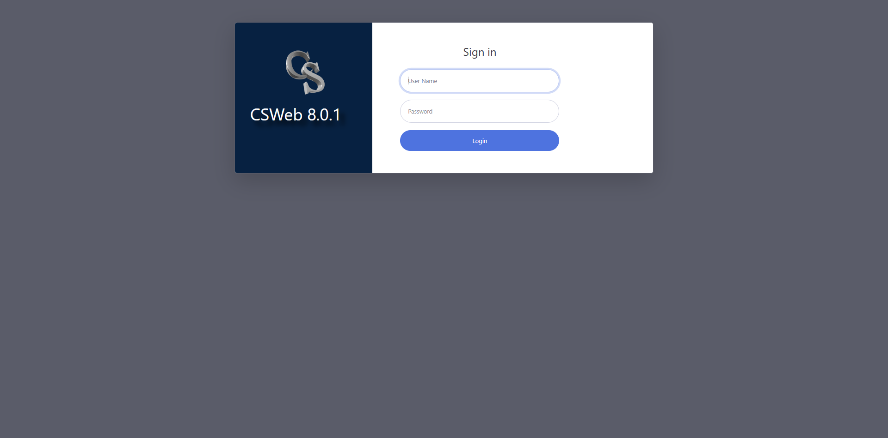

# CSWeb Server · Guide

**System:** DOH UHC Survey Year 2 — CAPI · **Component:** CSWeb data server
**Address:** `https://csweb.asiansocial.org/csweb/` · **Version:** CSWeb 8.0.1
**Prepared by:** Carl Patrick L. Reyes (Data Programmer / CAPI developer), ASPSI for DOH
**Purpose:** demonstrate the working server side of the CAPI system (for PSA review).

> CSWeb is the central web server that receives synced cases from the tablets, lets the data team monitor incoming data, manages users, and deploys instrument updates to the field devices.

---

## 1. Accessing the server

CSWeb is live at **`https://csweb.asiansocial.org/csweb/`**. It opens to a sign-in page (CSWeb 8.0.1).

*The CSWeb 8.0.1 sign-in. Administrators manage the console; field-sync accounts are used by CSEntry to upload cases.*

Two kinds of accounts:
- **Administrator** — full console: dashboard, deployed applications, sync report, user management, deployment.
- **Field Sync** — used by the CSEntry app on the tablet to upload/download cases.

---

## 2. What the server does

| Function | Description |
|---|---|
| **Receive synced cases** | Each completed interview uploads from the tablet to CSWeb. |
| **Sync Report / dashboard** | The data team sees cases arriving in near-real-time, with per-instrument (F1/F3/F4) and per-stream (outpatient/inpatient) counts. |
| **Map** | Cases with a real GPS fix appear as pins on a map. |
| **Case view** | An individual case can be opened to review the captured answers. |
| **User management** | Administrators create the per-enumerator field-sync accounts (so every case is attributable). |
| **Application deployment** | New builds of F1/F3/F4 are published to CSWeb; tablets download the update. |

The three CAPI instruments (FacilityHeadSurvey, PatientSurvey, HouseholdSurvey) are deployed on this server and downloadable by the field devices.

---

## 3. Authenticated views

> **To be added once the CSWeb administrator login is provided:** the deployed-applications list, the **Sync Report with the real synced cases**, the GPS map, and an individual case view. The server already holds real cases synced from the field tests, which will be shown here as the server-side proof that the end-to-end pipeline works.

---

*Part of the DOH UHC Survey Year 2 CAPI system documentation. Companion: the web version at `csweb.asiansocial.org/docs`, and the F1, F3, F4, and F2 guides.*
