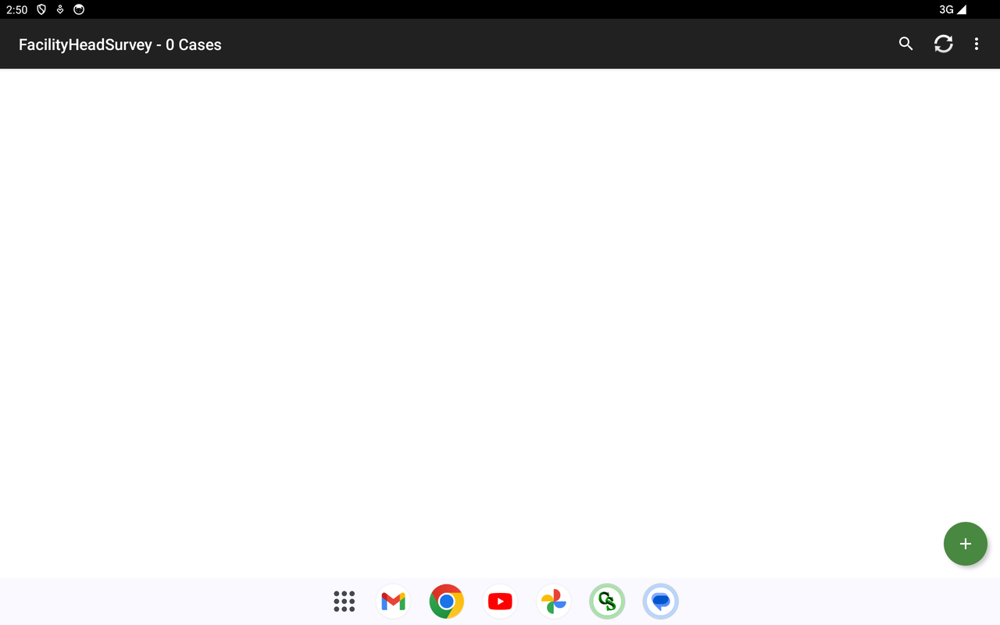
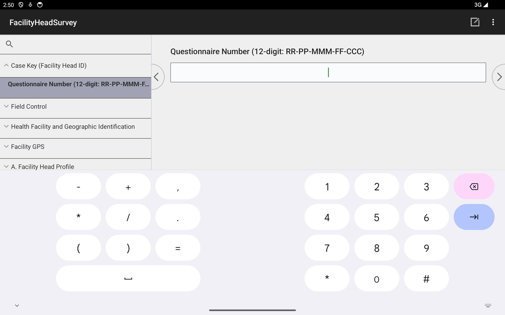

# F1 — Facility Head Survey · Install &amp; Use Guide

**System:** DOH UHC Survey Year 2 — CAPI · **Instrument:** F1 Facility Head Survey
**Platform:** CSPro **CSEntry** (Android tablet/phone) → **CSWeb** server
**Prepared by:** Carl Patrick L. Reyes (Data Programmer / CAPI developer), ASPSI for DOH
**Purpose:** demonstrate a working application and how it is installed and used in the survey (for PSA review).

> The Facility Head Survey is the interview with the **head of a sampled health facility** — facility identification, geographic linkage, GPS, and the facility-head questionnaire. It runs offline on a tablet and syncs to the CSWeb server.

---

## 1. Installing the app

The instrument runs inside **CSEntry**, the U.S. Census Bureau's free CSPro data-collection app.

1. **Install CSEntry** — Google Play → search **CSEntry** (*U.S. Census Bureau*, free) → install.
2. **Add the Facility Head Survey from the server** — CSEntry menu (**⋮**) → **Add Application** → from a CSWeb server. Server address exactly:
   `https://csweb.asiansocial.org/csweb/api`
   Log in with the assigned field-user account, choose **FacilityHeadSurvey**, and download it.
3. It now appears under **Entry Applications**.

*CSEntry with the instruments installed; the ⋮ menu offers Add Application / Update Installed Applications / Settings.*

> To update later: **⋮ → Update Installed Applications**, or remove and re-add the app.

---

## 2. Using it in the survey

### 2.1 Case list

Tapping **FacilityHeadSurvey** opens the case list, with a green **+** to start a new facility interview.

### 2.2 Starting an interview — structure

A new interview opens at the **12-digit Questionnaire Number**. The left panel is the **combined-view navigation tree**: Case Key (Facility Head ID), Field Control, Health Facility &amp; Geographic Identification, Facility GPS, and the questionnaire sections (A. Facility Head Profile, …).

---

## 3. Key features (built and working)

| Feature | What it does |
|---|---|
| **Combined-view screens** | Related questions grouped on one screen for faster entry. |
| **Geographic auto-fill** | Region / Province / City names fill in from the Questionnaire Number (PSGC-validated). |
| **GPS auto-capture** | Facility coordinates fetched automatically. |
| **Verification photo** | Captured at the end, only when the visit took place. |
| **Validation** | Age, tenure, and final-visit ≥ first-visit-date checks; "Other (specify)" gating; exclusive-option warnings. |
| **Offline-first + sync** | Works with no signal; syncs to CSWeb when connected. |

---

## 4. Syncing to the server

From the case list, tap **Synchronize** (circular-arrows icon) and log in; completed cases upload to **CSWeb** (`csweb.asiansocial.org`) for the data team to monitor (see the CSWeb guide).

---

---

## Complete question list

The full, section-by-section list of **every question this instrument asks** — generated directly from the CSPro data dictionary, so it matches the deployed app exactly — is in **[F1-Full-Question-List.md](F1-Full-Question-List.md)**. It is also browsable as collapsible per-section blocks in the web version (`csweb.asiansocial.org/docs`).

*Part of the DOH UHC Survey Year 2 CAPI system documentation. Companion: the web version at `csweb.asiansocial.org/docs`, and the F3, F4, CSWeb, and F2 guides.*
