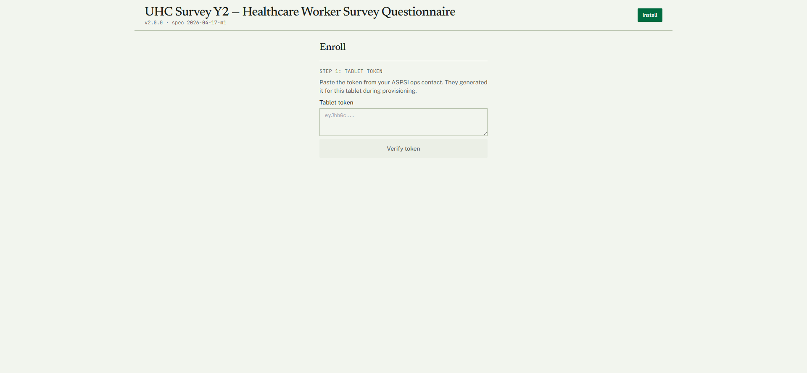
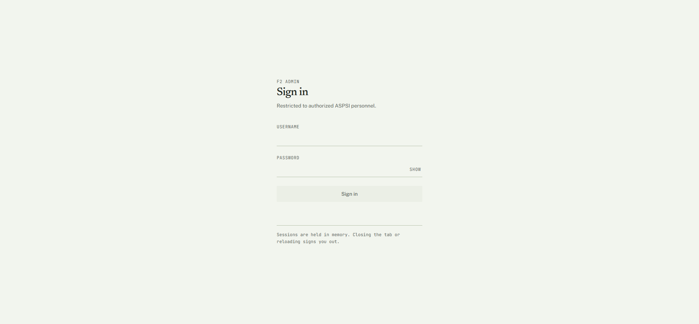
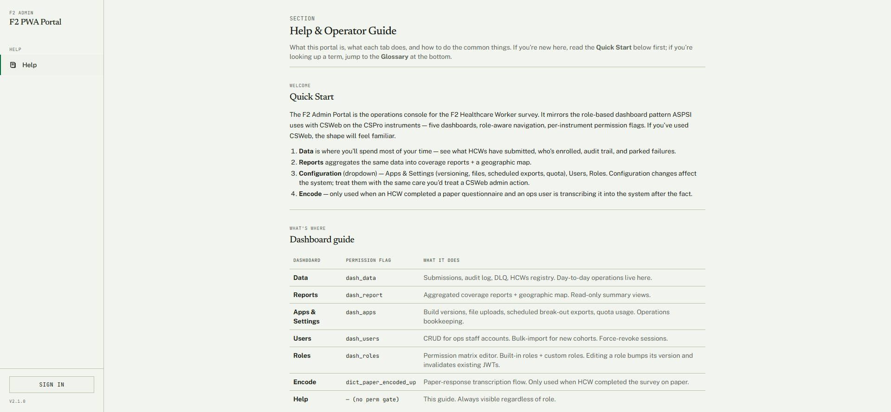

# F2 — Healthcare Worker Survey (PWA) + Admin Portal · Install &amp; Use Guide

**System:** DOH UHC Survey Year 2 — CAPI · **Instrument:** F2 Healthcare Worker (HCW) Survey
**Platform:** **Progressive Web App (PWA)** — installable web app on any modern browser (tablet/phone/laptop) → **Cloudflare Pages + Apps Script** backend
**Prepared by:** Carl Patrick L. Reyes (Data Programmer / CAPI developer), ASPSI for DOH
**Purpose:** demonstrate a working application and how it is installed and used in the survey (for PSA review).

> The Healthcare Worker Survey is completed by health-facility staff. Unlike F1/F3/F4 (which run inside native CSEntry), **F2 is a Progressive Web App** — it installs straight from the browser, runs offline, and submits to a cloud backend. It has a companion **Admin Portal** where the ASPSI data team monitors responses, manages users, and encodes paper questionnaires.

---

## 1. The two parts of F2

| Part | Address | Who uses it |
|---|---|---|
| **HCW Survey (PWA)** | `https://f2-pwa.pages.dev` | Healthcare workers / enumerators on the tablet |
| **Admin Portal** | `https://f2-pwa.pages.dev/admin/login` | ASPSI data team (administrators) |
| **Operator help (no login)** | `https://f2-pwa.pages.dev/admin/help` | Reference for the portal |

---

## 2. Installing the survey app (PWA)

There is **no app store** — the PWA installs directly from the browser.

1. **Open** `https://f2-pwa.pages.dev` in the tablet's browser (Chrome/Edge).
2. The app opens to **UHC Survey Y2 — Healthcare Worker Survey Questionnaire** (v2.0.0).
3. Tap **Install** (top-right) to add it to the device home screen. It now launches like a native app and works offline.

*The Healthcare Worker Survey landing/enrolment screen — title, version, the Install button, and Step 1 of enrolment (Tablet token).*

### 2.1 Enrolling the tablet

Before collecting data, the tablet is **enrolled** with a one-time token:

1. The ASPSI ops contact generates a **tablet token** for that device during provisioning.
2. On the **Enroll** screen, paste the token into **Step 1: Tablet token** and tap **Verify token**.
3. Once verified, the device is registered and the survey is ready to use offline.

> The token model means every submission is attributable to a provisioned device — the F2 equivalent of CSEntry's per-enumerator field-sync account.

---

## 3. Using it in the survey

After enrolment, the healthcare worker answers the questionnaire in the browser app. The PWA:

- **works offline** — answers are stored on the device and submitted when a connection is available;
- **validates** required answers and ranges before submission;
- **captures GPS** (with consent) for the facility location;
- **submits** completed responses to the cloud backend, where they appear in the Admin Portal.

---

## 4. The Admin Portal

The data team signs in at `https://f2-pwa.pages.dev/admin/login`.

*F2 Admin sign-in — restricted to authorized ASPSI personnel; sessions are held in memory (closing the tab signs out).*

The portal's **operator guide** (the no-login help page) documents the full console:

*The Admin Portal operator guide — the dashboard sections available to administrators.*

| Console section | What it does |
|---|---|
| **Data** | Browse submitted responses; filter by date / facility / role; per-response detail; audit log; dead-letter queue (failed submissions). |
| **Reports** | Aggregated coverage reports; a **GPS map** of submissions on PH bounds. |
| **Users** | Create and manage operator/administrator accounts. |
| **Roles** | Per-role permission management. |
| **Encode** | Encode paper-completed questionnaires into the system (paper-encoded path), kept separate from the live PWA submit path and attributed to the encoder. |
| **Apps &amp; Settings** | Backend configuration and Apps Script quota monitoring. |

> **Authenticated dashboards** (live response tables, the GPS map, user/role management) sit behind the ASPSI admin login and are shown on request — they require an administrator account.

---

## 5. Key features (built and working)

| Feature | What it does |
|---|---|
| **Installable PWA** | No app store; installs from the browser, runs offline, updates automatically. |
| **Token enrolment** | One-time tablet token provisions and attributes each device. |
| **Offline-first** | Answers stored on-device; submitted when connected. |
| **Validation + GPS** | Required-answer/range checks; GPS capture with consent. |
| **Admin Portal** | Response monitoring, coverage + map reports, user/role management, paper-encode path, audit log + DLQ. |

---

## 6. Status

F2 has been in **production since v2.0.0 (2026-05-04)** and has run multiple UAT rounds (HCW Survey + Admin Portal). It is a separate stack from the F1/F3/F4 CSEntry/CSWeb pipeline.

---

## Complete question list

The full, section-by-section list of **every question this instrument asks** — generated directly from the app's question data, so it matches the deployed app exactly — is in **[F2-Full-Question-List.md](F2-Full-Question-List.md)**. It is also browsable as collapsible per-section blocks in the web version (`csweb.asiansocial.org/docs`).

*Part of the DOH UHC Survey Year 2 CAPI system documentation. Companion: the web version at `csweb.asiansocial.org/docs`, and the F1, F3, F4, and CSWeb guides.*
