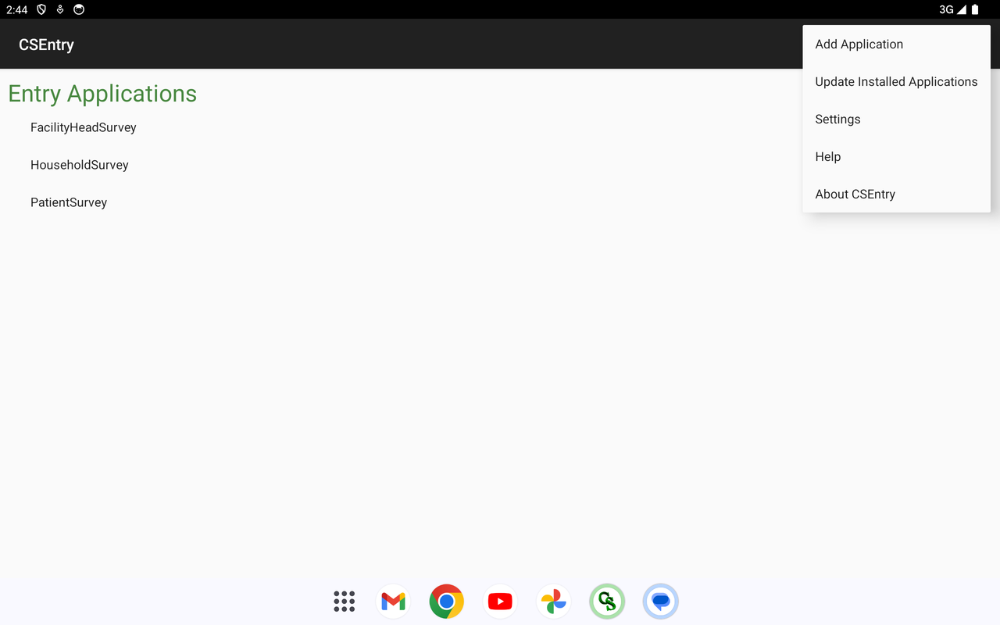
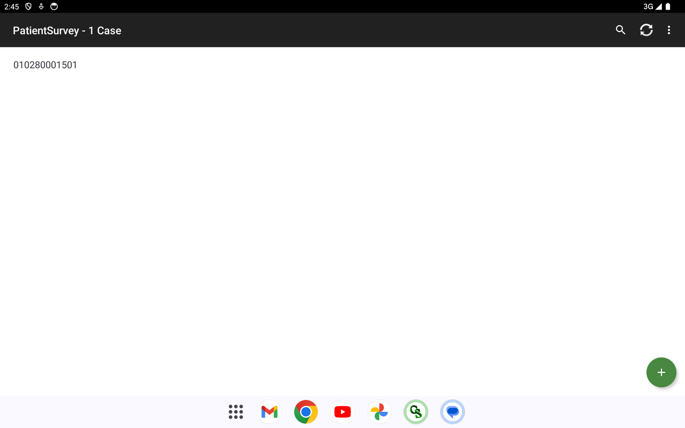
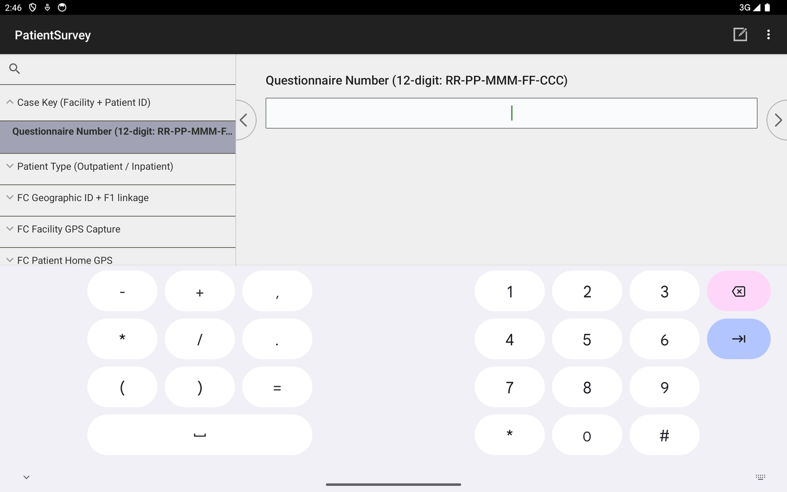
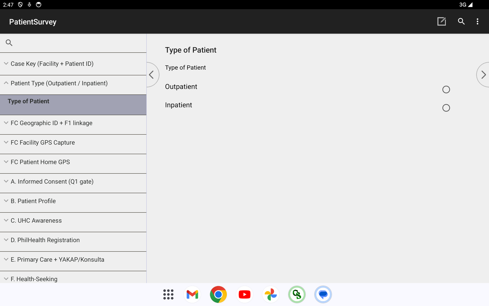
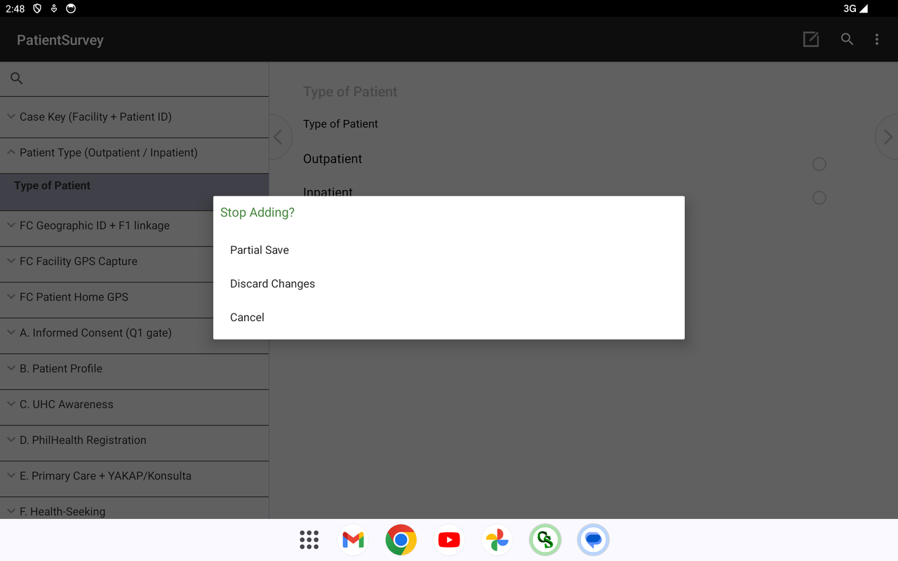
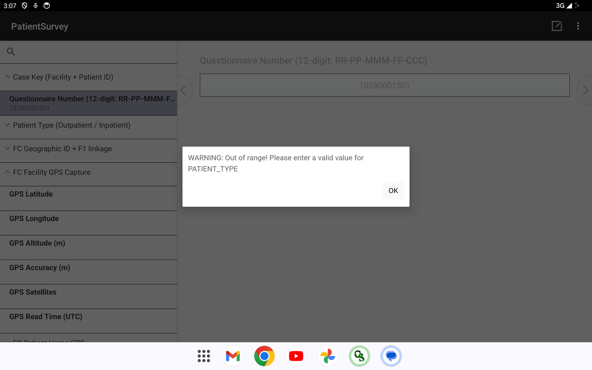

# F3 — Patient Survey · Install &amp; Use Guide

**System:** DOH UHC Survey Year 2 — CAPI · **Instrument:** F3 Patient Survey
**Platform:** CSPro **CSEntry** (Android tablet/phone) → **CSWeb** server
**Prepared by:** Carl Patrick L. Reyes (Data Programmer / CAPI developer), ASPSI for DOH
**Purpose:** demonstrate a working application and how it is installed and used in the survey (for PSA review).

> The Patient Survey is the patient exit interview — covering UHC awareness, PhilHealth, primary-care utilisation, health-seeking behaviour, out-of-pocket costs, access to medicines, referrals, and satisfaction. It runs offline on a tablet and syncs to the CSWeb server.

---

## 1. Installing the app

The instrument runs inside **CSEntry**, the U.S. Census Bureau's free CSPro data-collection app.

1. **Install CSEntry** — on the tablet, open **Google Play**, search **CSEntry** (publisher *U.S. Census Bureau*, free), and install it.
2. **Add the Patient Survey from the server** — open CSEntry's menu (**⋮**) → **Add Application** → from a CSWeb server. Enter the server address exactly:
   `https://csweb.asiansocial.org/csweb/api`
   Log in with the assigned field-user account, then choose **PatientSurvey** and download it.
3. The instrument now appears under **Entry Applications**.

*CSEntry with the three instruments installed; the ⋮ menu offers Add Application / Update Installed Applications / Settings.*

> To update to a newer build later: **⋮ → Update Installed Applications**, or remove and re-add the app.

---

## 2. Using it in the survey

### 2.1 Case list

Tapping **PatientSurvey** opens the case list — completed and in-progress interviews, with a green **+** to start a new one. The top bar has search, sync, and menu.

### 2.2 Starting an interview — Questionnaire Number

A new interview opens at the **12-digit Questionnaire Number** (Region–Province–City/Municipality–Facility–Case). The left panel is the **combined-view navigation tree**, which groups the questionnaire so the enumerator moves through fewer screens.

### 2.3 Patient type &amp; the full questionnaire

After the case key, the interview records **Type of Patient (Outpatient / Inpatient)**. The navigation tree shows the **complete instrument structure** — Informed Consent → Patient Profile → UHC Awareness → PhilHealth Registration → Primary Care + YAKAP/Konsulta → Health-Seeking, and the remaining sections (Outpatient/Inpatient care, Financial Risk Protection, Access to Medicines, Referrals, Satisfaction).

### 2.4 Saving &amp; interruptions

A real interview can be interrupted. Pressing Back offers **Partial Save** (resume later from where you left off), **Discard Changes**, or **Cancel** — so no work is lost in the field.

### 2.5 Validation &amp; GPS capture

The app enforces **data quality** — required answers must be entered before moving on (below, it blocks until Patient Type is set) — and records **GPS** automatically: Latitude, Longitude, Altitude, Accuracy, Satellites, and Read Time.

---

## 3. Key features (built and working)

| Feature | What it does |
|---|---|
| **Combined-view screens** | Related questions grouped on one screen (≈5–6× fewer taps than one-question-per-screen). |
| **Skip logic &amp; validation** | The app routes automatically (e.g. Outpatient → Section G, Inpatient → Section H) and validates answers (ranges, required fields, consistency). |
| **GPS auto-capture** | Facility and patient-home coordinates are fetched automatically. |
| **Verification photo** | Captured at the end, only when the visit actually took place. |
| **"Other (specify)" gating** | The specify box appears only when "Other" is selected. |
| **Multi-language** | Question text available in Filipino and regional languages. |
| **Offline-first + sync** | Works with no signal; syncs completed cases to CSWeb when connected. |

---

## 4. Syncing to the server

From the case list, the enumerator taps **Synchronize** (the circular-arrows icon) and logs in; completed cases upload to **CSWeb** (`csweb.asiansocial.org`), where the data team sees them in the Sync Report (see the CSWeb guide). CSEntry is offline-first — a connection is needed only to download the instrument and to sync.

---

---

## Complete question list

The full, section-by-section list of **every question this instrument asks** — generated directly from the CSPro data dictionary, so it matches the deployed app exactly — is in **[F3-Full-Question-List.md](F3-Full-Question-List.md)**. It is also browsable as collapsible per-section blocks in the web version (`csweb.asiansocial.org/docs`).

*Part of the DOH UHC Survey Year 2 CAPI system documentation. Companion: the web version at `csweb.asiansocial.org/docs`, and the F1, F4, CSWeb, and F2 guides.*
