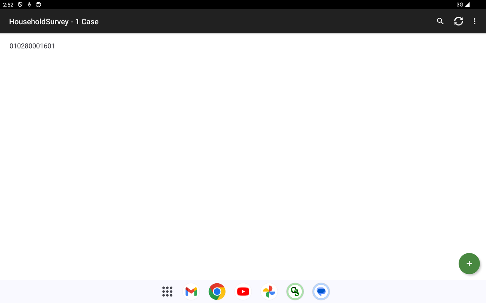

# F4 — Household Survey · Install &amp; Use Guide

**System:** DOH UHC Survey Year 2 — CAPI · **Instrument:** F4 Household Survey
**Platform:** CSPro **CSEntry** (Android tablet/phone) → **CSWeb** server
**Prepared by:** Carl Patrick L. Reyes (Data Programmer / CAPI developer), ASPSI for DOH
**Purpose:** demonstrate a working application and how it is installed and used in the survey (for PSA review).

> The Household Survey is the household-level interview on UHC awareness and access. It runs offline on a tablet and syncs to the CSWeb server.

---

## 1. Installing the app

1. **Install CSEntry** — Google Play → search **CSEntry** (*U.S. Census Bureau*, free) → install.
2. **Add the Household Survey from the server** — CSEntry menu (**⋮**) → **Add Application** → from a CSWeb server. Server address exactly:
   `https://csweb.asiansocial.org/csweb/api`
   Log in with the assigned field-user account, choose **HouseholdSurvey**, and download it.
3. It now appears under **Entry Applications**.

*CSEntry with the instruments installed; the ⋮ menu offers Add Application / Update Installed Applications / Settings.*

> To update later: **⋮ → Update Installed Applications**, or remove and re-add the app.

---

## 2. Using it in the survey

### 2.1 Case list

Tapping **HouseholdSurvey** opens the case list, with a green **+** to start a new household interview.

The interview is entered the same way as the other instruments: a 12-digit Questionnaire Number opens the case, then the combined-view navigation tree leads through the household questionnaire (household roster and UHC awareness/access sections), with automatic skip logic and validation.

---

## 3. Key features (built and working)

| Feature | What it does |
|---|---|
| **Combined-view screens** | Related questions grouped on one screen for faster entry. |
| **Household roster** | Repeating household-member capture. |
| **Skip logic &amp; validation** | Automatic routing; range/consistency checks; "Other (specify)" gating. |
| **GPS auto-capture** | Household location fetched automatically. |
| **Offline-first + sync** | Works with no signal; syncs to CSWeb when connected. |

---

## 4. Syncing to the server

From the case list, tap **Synchronize** (circular-arrows icon) and log in; completed cases upload to **CSWeb** (`csweb.asiansocial.org`) for the data team to monitor (see the CSWeb guide).

---

---

## Complete question list

The full, section-by-section list of **every question this instrument asks** — generated directly from the CSPro data dictionary, so it matches the deployed app exactly — is in **[F4-Full-Question-List.md](F4-Full-Question-List.md)**. It is also browsable as collapsible per-section blocks in the web version (`csweb.asiansocial.org/docs`).

*Part of the DOH UHC Survey Year 2 CAPI system documentation. Companion: the web version at `csweb.asiansocial.org/docs`, and the F1, F3, CSWeb, and F2 guides.*
